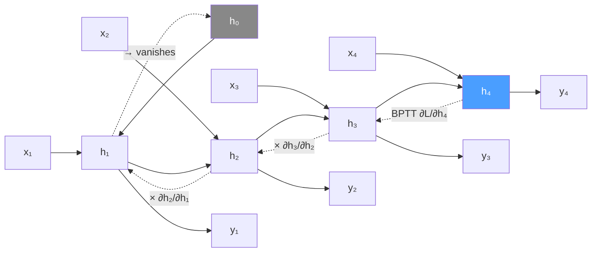

# 📡 RNN Fundamentals

> [!abstract] TL;DR
> RNNs process sequences by maintaining a hidden state that summarizes past inputs. Weights are shared across time steps. Backpropagation Through Time (BPTT) trains them, but gradients vanish exponentially over long sequences — the core limitation that motivated LSTMs. ELMo extended RNNs to produce contextual word embeddings that significantly outperformed static embeddings before BERT arrived.

## Intuition — analogy FIRST

Think of an RNN like reading a sentence word by word while writing notes on a sticky note. At each word you update your sticky note based on what you just read AND what was already on it. The sticky note is the hidden state. The problem: the sticky note is small and fixed-size. By the time you reach word 50, the notes from word 1 have been overwritten many times — the network forgets early information. This is vanishing gradient in action.

## How It Works

**Core equations:**
- Hidden state: hₜ = tanh(Wₕhₜ₋₁ + Wₓxₜ + b)
- Output: yₜ = Wᵧhₜ
- Weights Wₕ, Wₓ, Wᵧ are **shared** across all time steps T

**Backpropagation Through Time (BPTT):**
- Unroll the RNN for T steps — creates a very deep computation graph
- Backprop through the entire unrolled graph
- Gradient at step 0: ∂L/∂h₀ = ∏(t=T to 1) ∂hₜ/∂hₜ₋₁
- Each ∂hₜ/∂hₜ₋₁ ≈ Wₕ · diag(1 - hₜ²) (Jacobian of tanh)
- Vanishing: if spectral radius of Wₕ < 1 → product → 0 exponentially
- Exploding: if spectral radius > 1 → product → ∞; fixed with gradient clipping



## Key Concepts / Details

**Sequence configurations:**
| Mode | Example |
|------|---------|
| One-to-many | Image captioning (one image → sequence of words) |
| Many-to-one | Sentiment classification (sequence → one label) |
| Many-to-many (sync) | POS tagging (word → tag at each step) |
| Many-to-many (async) | Machine translation (encoder–decoder) |

**Bidirectional RNN:**
- Run one RNN left-to-right (forward), one right-to-left (backward)
- Concatenate forward and backward hidden states: h̃ₜ = [h→ₜ; h←ₜ]
- Doubles hidden dimension; requires full sequence (not usable for generation)
- Used extensively in ELMo and BERT-era encoders

**Multi-layer (stacked) RNN:**
- Output of layer l becomes input to layer l+1 at each time step
- Adds representational depth; typically 2–4 layers for NLP tasks

**Truncated BPTT:**
- Full BPTT through T=1000 steps is impractical (memory, instability)
- Process sequence in chunks of k steps; backprop only k steps back
- Maintains hidden state across chunks but cuts gradient flow between chunks

**Gradient clipping:**
- If ‖g‖ > threshold, rescale: g ← g × threshold / ‖g‖
- Heuristic threshold 1.0–5.0; standard practice for all RNN training

**Character-level RNN (Karpathy 2015):**
- Input: one-hot character vectors; output: next character distribution
- Hidden state learns implicit grammar, style, and structure
- Demonstrated that RNNs learn surprisingly structured representations

**ELMo (Peters et al. 2018 — Embeddings from Language Models):**
- Architecture: 2-layer bidirectional LSTM language model (forward + backward)
- Pre-trained on 1B word benchmark corpus
- For each token, produces embeddings from each layer (input embedding + 2 LSTM layers)
- Task representation: weighted sum of all layer embeddings — weights are task-learned
  - ELMo(token) = γ · ∑sⱼ · hⱼ (sⱼ = softmax-normalized scalar weights)
- Key insight: different layers capture different phenomena — lower layers → syntax, higher layers → semantics
- Improved SQuAD F1 by +4.7, SNLI by +1.2, SST-5 by +3.9 over Word2Vec/GloVe baselines
- Directly motivated BERT's approach (replace LSTM with Transformer)

## Real-World Notes

- PyTorch `nn.RNN` packs sequences via `pack_padded_sequence` to handle variable lengths efficiently — forgetting this causes incorrect gradients on padding tokens.
- In practice, vanilla RNNs are almost never used for sequences > 20 tokens. LSTM/GRU are the minimum bar.
- Bidirectional RNNs are incompatible with autoregressive generation (you cannot look at future tokens when generating). They are encoding-only.
- ELMo embeddings improved virtually every NLP benchmark in 2018 — use as a reference point when comparing pre-trained representation methods.

**PyTorch character-level LM sketch:**
```python
import torch
import torch.nn as nn

class CharRNN(nn.Module):
    def __init__(self, vocab_size, hidden_size, num_layers=2):
        super().__init__()
        self.embed = nn.Embedding(vocab_size, hidden_size)
        self.rnn = nn.RNN(hidden_size, hidden_size, num_layers,
                          batch_first=True, dropout=0.3)
        self.fc = nn.Linear(hidden_size, vocab_size)

    def forward(self, x, h=None):
        # x: (batch, seq_len) token indices
        emb = self.embed(x)                    # (batch, seq_len, hidden)
        out, h_n = self.rnn(emb, h)            # out: (batch, seq_len, hidden)
        logits = self.fc(out)                  # (batch, seq_len, vocab_size)
        return logits, h_n

# Training loop fragment
model = CharRNN(vocab_size=65, hidden_size=512)
optimizer = torch.optim.Adam(model.parameters(), lr=1e-3)
criterion = nn.CrossEntropyLoss()

for batch_x, batch_y in dataloader:          # batch_y is batch_x shifted by 1
    logits, _ = model(batch_x)
    loss = criterion(logits.view(-1, 65), batch_y.view(-1))
    # Gradient clipping — essential for RNNs
    torch.nn.utils.clip_grad_norm_(model.parameters(), max_norm=5.0)
    optimizer.zero_grad(); loss.backward(); optimizer.step()
```

**Architecture comparison:**

| Model | Parameters (hidden=256) | Handles long deps? | Parallelizable? |
|-------|-------------------------|--------------------|-----------------|
| Vanilla RNN | ~130K | No (>20 steps) | No |
| LSTM | ~530K | Yes (gated) | No |
| GRU | ~400K | Yes (gated) | No |
| Transformer | varies | Yes (attention) | Yes |

## Common Pitfalls

- **Forgetting gradient clipping:** exploding gradients cause NaN losses within a few hundred steps; always clip.
- **Not resetting hidden state between sequences:** batches from different documents contaminate each other; reset h₀ = zeros at the start of each independent sequence.
- **Using bidirectional RNN for generation:** forward generation requires left-to-right processing; bidirectional requires seeing future tokens — logically invalid for autoregressive generation.
- **Truncated BPTT chunk size too small:** gradients only flow within a chunk; if your dependencies are longer than the chunk size, the model cannot learn them.
- **Confusing ELMo layer weighting:** ELMo's task-specific scalar weights sⱼ are learned during fine-tuning — they are not fixed coefficients.

## Related Concepts

- [[LSTM_GRU]] — gating mechanisms that solve the vanishing gradient problem
- [[Seq2Seq_Encoder_Decoder]] — applying RNNs to sequence-to-sequence tasks
- [[_MOC_Sequence_Models]] — section overview
- Section 01: Word Embeddings — ELMo as contextual successor to Word2Vec/GloVe

## Review Questions

1. Write out the RNN hidden state update equation and explain what each term contributes.
2. Why does multiplying T Jacobians lead to vanishing gradients? What property of Wₕ determines whether gradients vanish or explode?
3. What is the difference between synchronous and asynchronous many-to-many RNNs? Give an NLP example of each.
4. Why are ELMo's embeddings called "contextual" while Word2Vec embeddings are "static"? What architectural property enables this?
5. What does truncated BPTT trade off, and when is this trade-off acceptable?

## Sources

- Rumelhart, Hinton & Williams (1986). *Learning Representations by Back-propagating Errors*. Nature.
- Werbos (1990). *Backpropagation Through Time: What It Does and How to Do It*. Proceedings of the IEEE.
- Karpathy, A. (2015). *The Unreasonable Effectiveness of Recurrent Neural Networks*. Blog post.
- Peters et al. (2018). *Deep Contextualized Word Representations*. NAACL. https://arxiv.org/abs/1802.05365
- Pascanu et al. (2013). *On the Difficulty of Training Recurrent Neural Networks*. ICML.

#nlp #sequence-models #beginner
