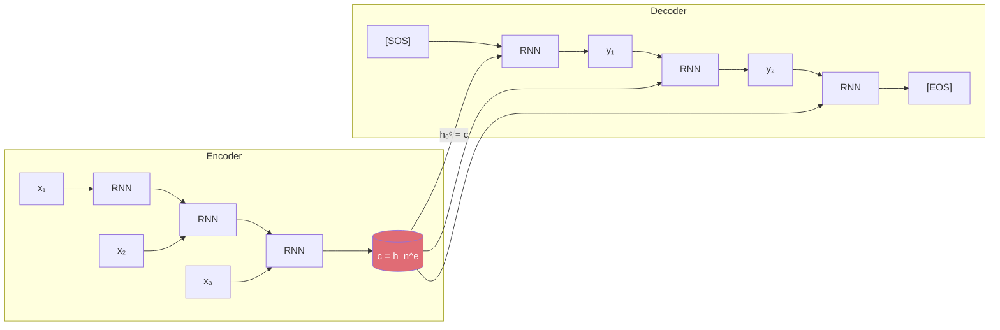

# 🔄 Seq2Seq Encoder-Decoder

> [!abstract] TL;DR
> Seq2seq (Sutskever et al. 2014) maps a variable-length input sequence to a variable-length output sequence by compressing the source into a fixed-length context vector via an encoder RNN, then generating the target word-by-word with a decoder RNN. The fixed-length bottleneck degrades badly on long sentences — attention (see [[Attention_Mechanism_Seq]]) is the direct solution. Teacher forcing accelerates training but creates an exposure bias problem at inference time.

## Intuition — analogy FIRST

Imagine translating a paragraph from French to English by reading the entire paragraph once, writing a single-sentence summary on a notecard, then translating purely from that notecard. For short paragraphs, the notecard captures everything. For a 50-sentence document, critical information is inevitably lost — your translation degrades. The seq2seq context vector is that notecard. Attention lets you re-read the original source while translating each word, bypassing the notecard entirely.

## How It Works

**Encoder:**
- Process source tokens x₁, ..., xₙ with an RNN (typically bidirectional LSTM)
- hₜᵉ = RNN(xₜ, hₜ₋₁ᵉ) for t = 1 to n
- Context vector: c = h_n^e (final encoder hidden state)

**Decoder:**
- Initialized with c: h₀ᵈ = c
- Autoregressively generates target tokens y₁, ..., yₘ
- hₜᵈ = RNN(yₜ₋₁, hₜ₋₁ᵈ, c) — condition on context at every step
- Output distribution: P(yₜ | y<t, x) = softmax(Wₒhₜᵈ)
- Stop when decoder generates [EOS] token

**Teacher forcing (training):**
- Feed ground truth token yₜ₋₁ as decoder input at step t, regardless of model's prediction
- Dramatically accelerates convergence — model always gets the correct input
- Cost: exposure bias (see Common Pitfalls)



## Key Concepts / Details

**The bottleneck problem:**
- A single fixed-dimensional vector c must encode an entire variable-length source sequence
- Information capacity of c is bounded by hidden_size (e.g., 512 floats)
- For a 30-word sentence, c compresses ~30 × 512 source states into 512 values
- Empirical result (Cho et al. 2014): BLEU drops sharply for source sentences > 20 words
- Solution: attention mechanism — see [[Attention_Mechanism_Seq]]

**Exposure bias:**
- Training: decoder input = ground truth yₜ₋₁ (teacher forcing)
- Inference: decoder input = model's own prediction ŷₜ₋₁
- Model never trained to recover from its own errors → error accumulation at inference
- Small prediction errors compound across decoding steps

**Scheduled sampling (Bengio et al. 2015):**
- Curriculum learning approach: gradually replace ground truth inputs with model predictions during training
- Start training: 100% teacher forcing
- End training: p% model predictions, (1-p)% teacher forcing
- Bridges the train/inference distribution gap
- Complexity: training becomes non-differentiable at discrete sampling step; common workaround: straight-through estimator or Gumbel-softmax

**Bidirectional encoder:**
- Encode source with BiLSTM: h̃ₜ = [h→ₜ; h←ₜ] for each position
- Context vector: concatenate final forward and backward states
- Captures context from both directions for each source token
- Standard in all production seq2seq systems

**Copy mechanism (Pointer Networks, Vinyals et al. 2015):**
- Allows decoder to copy tokens from the source verbatim
- Useful for: named entities in MT, summarization (copy key phrases), code generation
- Mixture: P(yₜ) = pgen · Pvocab(yₜ) + (1-pgen) · ∑αᵢ δ(xᵢ = yₜ)
- pgen ∈ (0,1) is learned; controls generate vs. copy trade-off

**Coverage mechanism:**
- Tracks cumulative attention to prevent decoder from repeatedly attending to same source tokens
- Coverage vector: φₜ = ∑ᵢ₌₁ᵗ αᵢ (accumulated attention weights)
- Coverage penalty: penalize if φₜ[j] deviates from 1 (over- or under-coverage)
- Reduces repetition in abstractive summarization

**Applications:**
| Task | Source | Target |
|------|--------|--------|
| Machine Translation | French sentence | English sentence |
| Abstractive Summarization | Document | Summary |
| Code Generation | Natural language spec | Code |
| Dialogue | User utterance | System response |
| Data-to-Text | Structured table | Natural language |

## Real-World Notes

- The original Sutskever et al. 2014 paper reversed the source sentence before encoding — a practical trick that reduced the average distance between corresponding source and target tokens, improving gradient flow.
- Teacher forcing ratio scheduling is often overlooked; using pure teacher forcing throughout can make the model brittle at test time for long generations.
- For production MT, the encoder is almost always bidirectional and the decoder unidirectional (generation requires left-to-right ordering).
- Modern seq2seq systems (e.g., T5, BART) use Transformer encoder-decoder rather than RNN, but the conceptual architecture — encode source, decode target autoregressively — is identical.

**PyTorch seq2seq sketch:**
```python
import torch
import torch.nn as nn
import random

class Encoder(nn.Module):
    def __init__(self, vocab_size, embed_dim, hidden_dim):
        super().__init__()
        self.embed = nn.Embedding(vocab_size, embed_dim, padding_idx=0)
        self.lstm = nn.LSTM(embed_dim, hidden_dim, batch_first=True,
                            bidirectional=True)
        self.fc = nn.Linear(hidden_dim * 2, hidden_dim)  # compress BiLSTM

    def forward(self, src):
        emb = self.embed(src)                       # (B, T, E)
        _, (h_n, c_n) = self.lstm(emb)             # h_n: (2, B, H)
        # Concatenate forward and backward last hidden
        h = torch.cat([h_n[0], h_n[1]], dim=-1)    # (B, 2H)
        context = torch.tanh(self.fc(h))            # (B, H)
        return context

class Decoder(nn.Module):
    def __init__(self, vocab_size, embed_dim, hidden_dim):
        super().__init__()
        self.embed = nn.Embedding(vocab_size, embed_dim)
        self.lstm = nn.LSTMCell(embed_dim + hidden_dim, hidden_dim)
        self.fc = nn.Linear(hidden_dim, vocab_size)

    def forward(self, y_prev, h_prev, c_prev, context):
        emb = self.embed(y_prev)                    # (B, E)
        lstm_input = torch.cat([emb, context], -1)  # (B, E+H)
        h, c = self.lstm(lstm_input, (h_prev, c_prev))
        return self.fc(h), h, c                     # logits, new h, new c

def seq2seq_train_step(encoder, decoder, src, tgt,
                       teacher_forcing_ratio=0.5):
    context = encoder(src)                          # (B, H)
    h = context; c = torch.zeros_like(h)
    y_in = tgt[:, 0]                                # [SOS] token
    outputs = []
    for t in range(1, tgt.size(1)):
        logits, h, c = decoder(y_in, h, c, context)
        outputs.append(logits)
        # Teacher forcing decision
        use_teacher = random.random() < teacher_forcing_ratio
        y_in = tgt[:, t] if use_teacher else logits.argmax(-1)
    return torch.stack(outputs, dim=1)              # (B, T-1, vocab)
```

**Challenges and solutions:**

| Challenge | Cause | Solution |
|-----------|-------|----------|
| Bottleneck on long sequences | Fixed-size context vector | Attention mechanism |
| Exposure bias | Teacher forcing only | Scheduled sampling |
| Repetition in output | Decoder ignores already-decoded content | Coverage mechanism |
| Out-of-vocabulary entities | Closed vocabulary | Copy/pointer mechanism |
| Short output preference | Unnormalized log-prob score | Length normalization in beam search |

## Common Pitfalls

- **Context vector as sole decoder input:** many implementations only use c to initialize h₀ᵈ but don't re-inject it at each decoder step. The original paper injects c at every step; omitting this weakens the conditioning.
- **Not reversing source (for simple baselines):** the source-reversal trick from Sutskever et al. is cheap and improves gradient flow — worth including in any vanilla seq2seq baseline.
- **Teacher forcing ratio = 1.0 throughout training:** produces models that fail badly on inference when their own errors propagate; ramp down teacher forcing ratio in later training epochs.
- **Ignoring [EOS] during loss computation:** compute loss only over real tokens, not padding. Use `ignore_index=pad_token_id` in `nn.CrossEntropyLoss`.
- **Decoder initialization mismatch:** if encoder is bidirectional, its final hidden state has dimension 2H, but the decoder expects H. Always project the context vector to the decoder's hidden dimension.

## Related Concepts

- [[LSTM_GRU]] — the RNN building block used inside encoder and decoder
- [[Attention_Mechanism_Seq]] — direct solution to the context vector bottleneck
- [[Beam_Search_Decoding]] — decoding strategy for generating sequences from the decoder
- [[_MOC_Sequence_Models]] — section overview

## Review Questions

1. Why does a bidirectional encoder improve seq2seq performance, and why can't the decoder also be bidirectional?
2. Explain the exposure bias problem. Why does teacher forcing cause it, and what does scheduled sampling do to address it?
3. What specific failure mode does the coverage mechanism fix, and in which NLP task is it most important?
4. How does the copy/pointer mechanism decide when to generate a new word versus copy from the source?
5. Modern systems like T5 and BART use Transformer encoder-decoder. What is architecturally the same as vanilla seq2seq, and what is different?

## Sources

- Sutskever, I., Vinyals, O. & Le, Q. V. (2014). *Sequence to Sequence Learning with Neural Networks*. NeurIPS. https://arxiv.org/abs/1409.3215
- Cho, K. et al. (2014). *On the Properties of Neural Machine Translation: Encoder-Decoder Approaches*. EMNLP.
- Bengio, S. et al. (2015). *Scheduled Sampling for Sequence Prediction with Recurrent Neural Networks*. NeurIPS.
- Vinyals, O. et al. (2015). *Pointer Networks*. NeurIPS. https://arxiv.org/abs/1506.03134
- See, A. et al. (2017). *Get To The Point: Summarization with Pointer-Generator Networks*. ACL. (Coverage + copy mechanism.)

#nlp #sequence-models #intermediate
