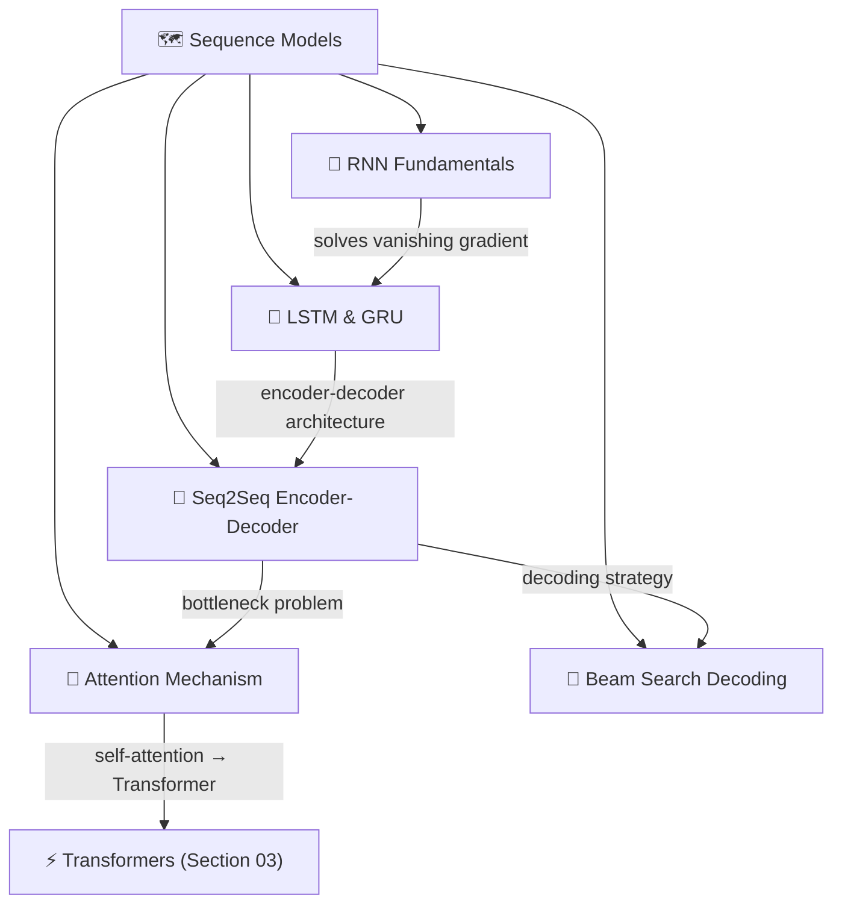
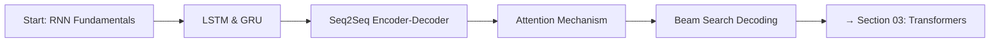

# 🗺️ Sequence Models — Map of Content

> [!abstract] TL;DR
> Before Transformers dominated, recurrent neural networks were the standard for sequential NLP tasks. Vanilla RNNs suffer from vanishing gradients over long sequences; LSTMs and GRUs solve this with gating mechanisms. Seq2Seq encoder-decoder with attention enabled machine translation at scale and introduced the attention mechanism that became the Transformer's core. This section covers the full RNN family, the seq2seq paradigm, and the additive/multiplicative attention mechanisms that directly preceded the Transformer.

## Section Overview

This section covers the pre-Transformer era of sequence modeling. Understanding these architectures is essential for two reasons: (1) they still appear in production systems with strict latency budgets, and (2) Transformers are best understood as a solution to the specific failures of RNNs — you need to know the disease to appreciate the cure.

## Concept Map

## Notes in This Section

| Note | Topic | Difficulty |
|------|-------|------------|
| [[RNN_Fundamentals]] | Vanilla RNN, BPTT, vanishing gradients, ELMo | Beginner |
| [[LSTM_GRU]] | Gating mechanisms, cell state highway, GRU simplification | Intermediate |
| [[Seq2Seq_Encoder_Decoder]] | Encoder-decoder, teacher forcing, bottleneck problem | Intermediate |
| [[Attention_Mechanism_Seq]] | Bahdanau & Luong attention, alignment, soft vs hard | Intermediate |
| [[Beam_Search_Decoding]] | Beam search, sampling strategies, length normalization | Intermediate |

## Learning Path

**Recommended order:** Follow the table top-to-bottom. Each note builds on the previous — attention is only meaningful after understanding why the seq2seq bottleneck is a problem.

## Key Themes

**1. The Gradient Problem**
Vanilla RNNs cannot learn long-range dependencies because gradients vanish (or explode) through many time steps. This is not a training trick issue — it is architectural. LSTM/GRU solve it by providing a direct gradient highway.

**2. The Bottleneck Problem**
Seq2seq with a single fixed-length context vector compresses an entire variable-length source sentence into one vector. Performance degrades sharply for long inputs. Attention solves this by letting the decoder query all encoder states dynamically.

**3. Sequential Computation as the Core Limitation**
RNNs process tokens one at a time — each step depends on the previous hidden state. This prevents parallelization during training. The Transformer eliminates this dependency entirely via self-attention.

## Connections to Other Sections

- **Section 01 (Word Embeddings):** ELMo, covered in [[RNN_Fundamentals]], is a contextual embedding built on bi-LSTM and directly motivated Word2Vec's limitations.
- **Section 03 (Transformers):** The Transformer's multi-head attention is a parallelized, scaled-dot-product generalization of the attention mechanism developed in [[Attention_Mechanism_Seq]].
- **Section 06 (Text Generation):** Beam search, nucleus sampling, and temperature scaling from [[Beam_Search_Decoding]] are the standard decoding strategies for all generative models including GPT.

## Historical Timeline

| Year | Paper | Contribution |
|------|-------|--------------|
| 1986 | Rumelhart et al. | Backpropagation, enables RNN training |
| 1997 | Hochreiter & Schmidhuber | LSTM — gates solve vanishing gradient |
| 2014 | Cho et al. | GRU — simplified LSTM |
| 2014 | Sutskever et al. | Seq2Seq encoder-decoder for MT |
| 2015 | Bahdanau et al. | Additive attention for seq2seq |
| 2015 | Luong et al. | Multiplicative attention variants |
| 2018 | Peters et al. | ELMo — contextual embeddings from bi-LSTM |
| 2017 | Vaswani et al. | Transformer — replaces RNN with self-attention |

## Review Questions

1. Why does the vanishing gradient problem specifically affect RNNs on long sequences but not fully-connected networks on fixed-size inputs?
2. What is the architectural difference between LSTM and GRU, and when would you choose one over the other?
3. Explain the seq2seq bottleneck problem and why attention is the correct solution rather than simply using a larger hidden state.
4. What is the difference between Bahdanau and Luong attention? When does the distinction matter?
5. Why does beam search with larger beam size not always produce better outputs?

## Sources

- Hochreiter & Schmidhuber (1997). *Long Short-Term Memory*. Neural Computation.
- Cho et al. (2014). *Learning Phrase Representations using RNN Encoder-Decoder for Statistical Machine Translation*. EMNLP.
- Sutskever et al. (2014). *Sequence to Sequence Learning with Neural Networks*. NeurIPS.
- Bahdanau et al. (2015). *Neural Machine Translation by Jointly Learning to Align and Translate*. ICLR.
- Luong et al. (2015). *Effective Approaches to Attention-based Neural Machine Translation*. EMNLP.
- Peters et al. (2018). *Deep Contextualized Word Representations (ELMo)*. NAACL.

#MOC #nlp #sequence-models
