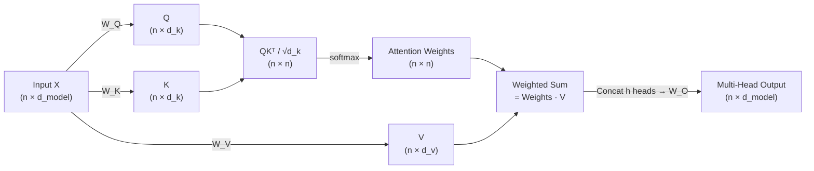

# ⚙️ Attention Mechanism

> [!abstract] TL;DR
> Attention lets every token directly query every other token. Scaled dot-product attention computes Attention(Q,K,V) = softmax(QKᵀ/√d_k)V. Multi-head attention runs h parallel attention heads, each learning different relationship types, then concatenates and projects the results. The O(n²) complexity is the main scaling bottleneck, addressed by FlashAttention and sparse variants.

## Intuition — Analogy FIRST

Think of a **library search system**:
- Your **query** (Q) is the search term — what you're looking for.
- Every book has a **key** (K) on its spine — a summary of its content.
- Each book also has **value** (V) — the actual content inside.

You compare your query against all keys (dot product), softmax those scores into weights (which books are most relevant?), then take a weighted sum of all values (blend the relevant content). That's attention in one sentence.

**Multi-head attention** runs multiple librarians in parallel, each with a different specialty (syntax, semantics, coreference), then pools their findings.

## How It Works



## Key Concepts / Details

### Scaled Dot-Product Attention

$$\text{Attention}(Q, K, V) = \text{softmax}\!\left(\frac{QK^\top}{\sqrt{d_k}}\right)V$$

- **Why the scale 1/√d_k?** Dot products grow with dimension: E[q·k] ≈ d_k when vectors are unit-normal. Large dot products → extreme softmax → near-zero gradients in all but the winner. Dividing by √d_k keeps variance ≈ 1.
- **Projections**: Q = XW_Q, K = XW_K, V = XW_V where W shapes are (d_model × d_k).
- **Attention weight** aᵢⱼ = softmax(qᵢ·kⱼ/√d_k): how much token i should attend to token j.
- **Output** for position i = Σⱼ aᵢⱼ · vⱼ: weighted combination of all value vectors.

### Multi-Head Attention

$$\text{MHA}(Q,K,V) = \text{Concat}(\text{head}_1, \ldots, \text{head}_h)\,W^O$$

where head_i = Attention(QW_i^Q, KW_i^K, VW_i^V).

- h heads with d_k = d_model / h (total params unchanged).
- Different heads empirically learn: syntactic dependencies, coreference, relative position, etc.
- W^O projects concatenated heads back to d_model.

### Attention Types

| Type | Q source | K,V source | Mask | Used in |
|---|---|---|---|---|
| Self-attention | same sequence | same sequence | none (or causal) | BERT encoder, GPT decoder |
| Cross-attention | decoder | encoder output | none | T5 decoder, seq2seq |
| Causal self-attention | same sequence | same sequence | lower-triangular | GPT, autoregressive LMs |

**Causal masking**: before softmax, add −∞ to all positions j > i. After softmax those entries become 0 — token i cannot see future tokens.

### Complexity

| Metric | Standard Attention | FlashAttention | Sparse Attention |
|---|---|---|---|
| Time | O(n²·d) | O(n²·d) exact | O(n·√n·d) |
| Memory | O(n²) | O(n) (tiling) | O(n·√n) |
| Speed (practical) | baseline | 2–4× faster | varies |
| Exactness | exact | exact | approximate |

**Standard attention bottleneck**: the n×n attention matrix must be materialised in HBM (GPU high-bandwidth memory). For n=16k, d=64: 16k² × 4B = 4GB per head.

**FlashAttention** (Dao et al. 2022): splits Q,K,V into tiles that fit in SRAM; computes attention block-by-block without ever writing the full n×n matrix to HBM. Exact same result, 2–4× wall-clock speedup, O(n) memory.

**Sparse attention variants**:
- **Longformer**: sliding window (local) + global tokens (e.g. [CLS]).
- **BigBird**: local + global + random.
- **Sparse Transformer**: fixed strided patterns.

### Code

```python
import torch
import torch.nn as nn
import torch.nn.functional as F

# ── Manual scaled dot-product attention ──────────────────────────────────────
def scaled_dot_product_attention(Q, K, V, mask=None):
    """
    Q, K: (batch, heads, seq, d_k)
    V:    (batch, heads, seq, d_v)
    """
    d_k = Q.size(-1)
    scores = torch.matmul(Q, K.transpose(-2, -1)) / (d_k ** 0.5)  # (B, H, n, n)
    if mask is not None:
        scores = scores.masked_fill(mask == 0, float('-inf'))
    weights = F.softmax(scores, dim=-1)                            # (B, H, n, n)
    return torch.matmul(weights, V), weights                       # (B, H, n, d_v)

# ── Causal mask for GPT-style decoder ────────────────────────────────────────
seq_len = 5
causal_mask = torch.tril(torch.ones(seq_len, seq_len))  # lower triangular
# shape: (5, 5); 0s in upper triangle → -inf before softmax

# ── PyTorch built-in multi-head attention ────────────────────────────────────
mha = nn.MultiheadAttention(embed_dim=512, num_heads=8, batch_first=True)
x   = torch.randn(2, 10, 512)          # (batch=2, seq=10, d_model=512)
out, attn_weights = mha(x, x, x)       # self-attention (Q=K=V=x)
print(out.shape)                        # (2, 10, 512)
print(attn_weights.shape)               # (2, 10, 10)
```

## Real-World Notes

- **BertViz** (jessstringham/bertviz) visualises per-head attention patterns — useful for interpreting what different heads learn.
- **Flash Attention v2** improves parallelism across the sequence dimension; v3 targets H100 Tensor Cores specifically.
- In practice, most heads in trained models carry redundant information — **head pruning** can remove 30–50% with minimal loss.
- Attention weights ≠ importance: high weight on a token doesn't mean that token caused the output. Use integrated gradients for attribution.

## Common Pitfalls

- **Forgetting the scale**: without 1/√d_k, deep networks with large d_k saturate softmax → vanishing gradients early in training.
- **Wrong mask shape**: broadcasting bugs are common; always verify mask has the right (batch, heads, seq_q, seq_k) shape.
- **O(n²) surprise at long context**: 4k tokens per head = 64 MB; 32k tokens = 4 GB per head. Use FlashAttention or windowed attention.
- **Cross-attention key/value source confusion**: Q comes from decoder state, K and V come from encoder output — mixing these up produces silent wrong behaviour.

## Related Concepts

- [[_MOC_Transformers]] — section overview
- [[BERT_Architecture]] — uses bidirectional self-attention
- [[GPT_Architecture]] — uses causal (masked) self-attention
- [[T5_Encoder_Decoder]] — uses both self-attention (encoder) and cross-attention (decoder)
- [[Transformer_Variants]] — FlashAttention details, GQA, sparse variants

## Review Questions

1. Why is the scale factor 1/√d_k necessary? What goes wrong without it?
2. In multi-head attention with d_model=512 and h=8, what is d_k for each head?
3. What is the difference between self-attention and cross-attention? Where is each used?
4. Explain how causal masking prevents a decoder from seeing future tokens.
5. FlashAttention produces the exact same result as standard attention. How does it reduce memory from O(n²) to O(n)?
6. A sequence of length 8192 is processed through standard multi-head attention. Estimate the memory for the attention matrix (assume float32, 8 heads).

## Sources

- Vaswani et al. (2017). "Attention Is All You Need." NeurIPS.
- Dao et al. (2022). "FlashAttention: Fast and Memory-Efficient Exact Attention." NeurIPS.
- Dao et al. (2023). "FlashAttention-2." ICLR 2024.
- The Illustrated Transformer — Jay Alammar (jalammar.github.io/illustrated-transformer)
- BertViz: github.com/jessevig/bertviz

#nlp #transformer-architecture #intermediate
