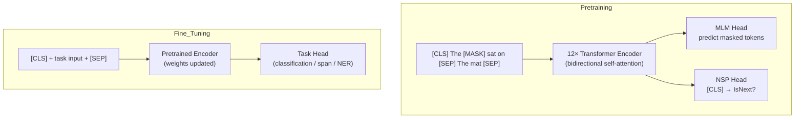

# 🔵 BERT Architecture

> [!abstract] TL;DR
> BERT (Devlin 2018) is an encoder-only Transformer pretrained on unlabeled text using Masked Language Modeling (predict hidden tokens) and Next Sentence Prediction. The bidirectional context from seeing left AND right simultaneously made it SOTA on 11 NLP benchmarks at release. Fine-tuning adds a lightweight task head on top of [CLS] or token representations.

## Intuition — Analogy FIRST

Imagine learning a language by doing **fill-in-the-blank exercises**: "The cat sat on the ___." You see the whole sentence except one word, and you must predict it. Crucially you can look both left AND right — that's bidirectional context. That's Masked Language Modeling.

Now contrast with GPT: it reads left-to-right like a human reading a book for the first time — never peeking ahead. BERT is more like a student re-reading a paragraph with the answer key partially blacked out, using full surrounding context to fill the gaps.

## How It Works



## Key Concepts / Details

### Pretraining Objectives

**Masked Language Modeling (MLM)**
- Randomly mask 15% of WordPiece tokens in the input.
- Of those 15%: replace 80% with [MASK], 10% with a random token, 10% unchanged.
- The mixed replacement strategy prevents the model from only learning [MASK]-specific representations.
- Loss: cross-entropy only over masked positions.
- Bidirectional: each masked token can attend to ALL other tokens (left + right).

**Next Sentence Prediction (NSP)**
- Input: [CLS] + sentence A + [SEP] + sentence B + [SEP].
- 50% of the time sentence B is the actual next sentence (IsNext), 50% a random sentence.
- Predict IsNext/NotNext from [CLS] representation.
- Later work (RoBERTa, XLNet) shows NSP provides minimal benefit; removing it often improves downstream performance.

### Architecture

| Component | BERT-base | BERT-large |
|---|---|---|
| Encoder layers (L) | 12 | 24 |
| Hidden size (H) | 768 | 1024 |
| Attention heads | 12 | 16 |
| Parameters | 110M | 340M |
| FFN inner dim | 3072 | 4096 |

**Input representation** = Token embeddings + Position embeddings (learned, absolute, up to 512) + Segment embeddings (sentence A=0, sentence B=1).

All three are summed element-wise and fed into the first encoder layer.

### Fine-Tuning

| Task Type | How to Fine-Tune |
|---|---|
| Sentence classification | Feed [CLS] embedding → linear + softmax |
| Token classification (NER) | Feed each token embedding → linear + softmax |
| Question answering (SQuAD) | Predict start/end span indices from token embeddings |
| Sentence pair (NLI) | [CLS] of both sentences → linear |

All parameters are updated during fine-tuning (not frozen). Typical learning rate: 2e-5 to 5e-5 with warmup.

### BERT Variants

| Model | Key Change | Params | Relative Performance |
|---|---|---|---|
| BERT-base | original | 110M | baseline |
| RoBERTa | More data, no NSP, dynamic masking, larger batches | 125M | +2–4% on GLUE |
| ALBERT | Parameter sharing + embedding factorization | 12M | ~BERT-base quality |
| DistilBERT | Knowledge distillation from BERT-base | 66M | 97% of BERT, 60% faster |
| ELECTRA | Replaced Token Detection (RTD); generator + discriminator | 110M | More sample-efficient |
| SpanBERT | Span masking + span boundary objective | 110M | Better for QA/coreference |

**RoBERTa key improvements**: trained 10× longer on 10× more data; removed NSP; used dynamic masking (different mask each epoch); trained with larger batches (8k vs 256).

**ELECTRA**: instead of predicting masked tokens, a small generator produces plausible replacements, and the discriminator must detect which tokens are fake. Every token contributes to loss (not just 15%) → much more sample-efficient.

### Code

```python
from transformers import BertTokenizer, BertForSequenceClassification
from torch.optim import AdamW
import torch

# ── Load pretrained BERT for classification ──────────────────────────────────
model     = BertForSequenceClassification.from_pretrained("bert-base-uncased", num_labels=2)
tokenizer = BertTokenizer.from_pretrained("bert-base-uncased")

# ── Tokenise input ────────────────────────────────────────────────────────────
text   = "BERT revolutionised NLP transfer learning."
inputs = tokenizer(text, return_tensors="pt", padding=True, truncation=True, max_length=128)
# inputs: input_ids, attention_mask, token_type_ids

# ── Forward pass ──────────────────────────────────────────────────────────────
labels  = torch.tensor([1])          # positive sentiment
outputs = model(**inputs, labels=labels)
loss    = outputs.loss               # cross-entropy on [CLS]
logits  = outputs.logits             # (1, 2)

# ── Fine-tuning loop sketch ───────────────────────────────────────────────────
optimizer = AdamW(model.parameters(), lr=2e-5)
model.train()
for batch in train_dataloader:
    optimizer.zero_grad()
    out = model(**batch)
    out.loss.backward()
    optimizer.step()

# ── Extract [CLS] embedding (no task head) ───────────────────────────────────
from transformers import BertModel
encoder = BertModel.from_pretrained("bert-base-uncased")
with torch.no_grad():
    hidden = encoder(**inputs).last_hidden_state   # (1, seq_len, 768)
    cls_emb = hidden[:, 0, :]                      # (1, 768)  ← [CLS] token
```

## Real-World Notes

- WordPiece tokenisation splits unknown words into subwords: "unaffordable" → ["un", "##afford", "##able"]. Max input = 512 tokens.
- BERT's absolute position embeddings limit it to 512 tokens. For longer documents use sliding-window chunking or switch to Longformer.
- Domain-specific BERT variants often outperform general BERT: BioBERT (biomedical), FinBERT (finance), ClinicalBERT (clinical notes), LegalBERT.
- For production: start with DistilBERT for latency-sensitive tasks; upgrade to RoBERTa-large only if accuracy gains justify the cost.

## Common Pitfalls

- **Forgetting [CLS] token**: classification tasks must use the [CLS] representation, not an average pool (though average pooling also works and sometimes better).
- **Not tuning learning rate**: BERT is sensitive to LR. Too high (>1e-4) → catastrophic forgetting. Typical range: 1e-5 to 5e-5.
- **Ignoring attention_mask**: padding tokens must be masked; forgetting this causes the model to attend to padding zeros.
- **512 token truncation**: silently truncating long documents loses information. Consider a chunking + pooling strategy for doc classification.
- **NSP segment embeddings**: BERT requires token_type_ids for sentence-pair tasks; single-sentence tasks typically pass all zeros.

## Related Concepts

- [[Attention_Mechanism]] — the self-attention blocks inside each BERT encoder layer
- [[GPT_Architecture]] — decoder-only counterpart; causal vs bidirectional
- [[T5_Encoder_Decoder]] — encoder-decoder; similar encoder to BERT
- [[Transformer_Variants]] — RoBERTa, ELECTRA improvements catalogued

## Review Questions

1. Why does BERT use the 80/10/10 masking strategy rather than always replacing with [MASK]?
2. What does the [CLS] token represent, and how is it used for classification?
3. Why was NSP found to be unhelpful in RoBERTa? What did it replace it with?
4. How does ELECTRA's replaced token detection differ from MLM? Why is it more sample-efficient?
5. BERT-base has 110M parameters. Estimate the count: 12 layers × (attention: 4×768² + FFN: 2×768×3072) + embeddings (30k×768).
6. You need to fine-tune BERT for NER on 5,000 sentences. What head do you add, and how do you handle the [CLS]/[SEP] tokens in the label sequence?

## Sources

- Devlin et al. (2018). "BERT: Pre-training of Deep Bidirectional Transformers for Language Understanding." NAACL 2019.
- Liu et al. (2019). "RoBERTa: A Robustly Optimized BERT Pretraining Approach."
- Lan et al. (2019). "ALBERT: A Lite BERT for Self-supervised Learning of Language Representations."
- Sanh et al. (2019). "DistilBERT, a distilled version of BERT."
- Clark et al. (2020). "ELECTRA: Pre-training Text Encoders as Discriminators Rather Than Generators."
- HuggingFace Transformers documentation: huggingface.co/docs/transformers

#nlp #transformer-architecture #intermediate
