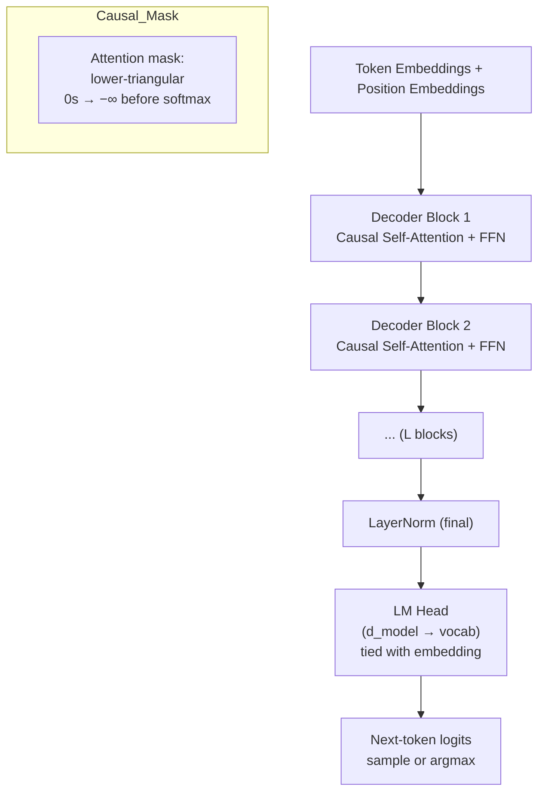

# 🟢 GPT Architecture

> [!abstract] TL;DR
> GPT (Radford 2018) is a decoder-only Transformer trained with causal (left-to-right) language modeling. Tokens only attend to preceding tokens via a lower-triangular mask. GPT-3 (175B params) demonstrated in-context few-shot learning — task performance from examples in the prompt, zero gradient updates. The KV-cache makes autoregressive inference efficient by reusing previously computed key/value pairs.

## Intuition — Analogy FIRST

Imagine an author who writes a novel **one word at a time**, never rereading anything they've written more than a few sentences back in a first draft — that's RNN/LSTM. GPT is different: it can re-read the entire manuscript so far in parallel (via attention), but it **never peeks at future words**. The causal mask enforces this constraint.

At inference time GPT samples the next word, appends it, and repeats — a simple loop that produces coherent long-form text because the attention mechanism can draw on the full preceding context at every step.

## How It Works



## Key Concepts / Details

### Pretraining Objective

$$\mathcal{L} = -\sum_{i} \log P(w_i \mid w_1, \ldots, w_{i-1}; \theta)$$

Every token in the sequence is a supervision signal — 100% token utilisation (vs BERT's 15% masked tokens). This makes causal LM extremely data-efficient per forward pass.

### Architectural Details

| Component | GPT-1 | GPT-2 | GPT-3 | GPT-4 (est.) |
|---|---|---|---|---|
| Layers | 12 | 48 | 96 | ~120 (rumoured) |
| Hidden dim | 768 | 1600 | 12 288 | — |
| Heads | 12 | 25 | 96 | — |
| Parameters | 117M | 1.5B | 175B | ~1T |
| Context length | 512 | 1024 | 2048 | 128k |
| Key capability | fine-tuning | in-context learning | few-shot emergent | multimodal, RLHF |

**Differences from original Transformer decoder**:
- No cross-attention (no encoder to attend to).
- Pre-Layer Norm (LN before attention and FFN, not after) — more stable at large scale.
- GELU activations (smooth approximation of ReLU) instead of ReLU.
- Byte-Pair Encoding (BPE) tokenizer.
- Learned absolute position embeddings.

### Causal Masking in Detail

The attention mask M is a lower-triangular matrix of 1s:

```
Position:  1  2  3  4
  1     [  1  0  0  0 ]   token 1 sees only itself
  2     [  1  1  0  0 ]   token 2 sees 1, 2
  3     [  1  1  1  0 ]   token 3 sees 1, 2, 3
  4     [  1  1  1  1 ]   token 4 sees all
```

Where M=0, add −∞ before softmax → those positions become 0 after softmax.

### KV-Cache (Inference Efficiency)

During autoregressive generation, each new token needs attention over ALL previous tokens. Naively this recomputes K,V for every past position on every step: O(n²) total.

**KV-cache**: store K and V for all past positions. On step t, only compute Q for the new token, then concatenate with cached K,V. Each step is now O(n) instead of O(n²).

Memory cost: 2 × L × H × d_k × n × sizeof(float) per sequence. For LLaMA-7B with n=4096: ~2 GB.

### In-Context Learning (GPT-3)

No gradient updates — task examples are provided directly in the prompt:

```
Translate English to French:
  sea otter → loutre de mer
  cheese → fromage
  peppermint → ?
```

GPT-3 performs the task by pattern-matching in the forward pass. Emergent behaviour: not explicitly trained for this, but arises from scale.

### Parameter Counting

For a GPT model with L layers, hidden dim d, vocabulary size V:

| Component | Parameters |
|---|---|
| Token embedding | V × d |
| Position embedding | context_len × d |
| Per layer: attention | 4 × d² (W_Q, W_K, W_V, W_O) |
| Per layer: FFN | 8 × d² (two linear layers with 4d hidden) |
| Total (approx) | V×d + L×12×d² |

GPT-3: 175B ≈ 50k×12288 + 96×12×12288² ≈ 0.6B + 174.4B ✓

### Code

```python
import torch
import torch.nn as nn
import torch.nn.functional as F

# ── Causal GPT forward pass ───────────────────────────────────────────────────
class CausalSelfAttention(nn.Module):
    def __init__(self, d_model, n_heads, max_len=1024):
        super().__init__()
        self.n_heads = n_heads
        self.d_k     = d_model // n_heads
        self.qkv     = nn.Linear(d_model, 3 * d_model, bias=False)
        self.proj    = nn.Linear(d_model, d_model, bias=False)
        # lower-triangular causal mask (register as buffer — not a parameter)
        mask = torch.tril(torch.ones(max_len, max_len))
        self.register_buffer("mask", mask.view(1, 1, max_len, max_len))

    def forward(self, x):
        B, T, C = x.shape
        Q, K, V = self.qkv(x).split(C, dim=-1)
        # reshape to (B, heads, T, d_k)
        split = lambda t: t.view(B, T, self.n_heads, self.d_k).transpose(1, 2)
        Q, K, V = split(Q), split(K), split(V)

        scores = (Q @ K.transpose(-2, -1)) / (self.d_k ** 0.5)
        scores = scores.masked_fill(self.mask[:, :, :T, :T] == 0, float('-inf'))
        weights = F.softmax(scores, dim=-1)
        out = (weights @ V).transpose(1, 2).contiguous().view(B, T, C)
        return self.proj(out)

# ── HuggingFace GPT-2 generation ─────────────────────────────────────────────
from transformers import GPT2LMHeadModel, GPT2Tokenizer

tokenizer = GPT2Tokenizer.from_pretrained("gpt2")
model     = GPT2LMHeadModel.from_pretrained("gpt2")

input_ids = tokenizer.encode("The Transformer architecture", return_tensors="pt")
with torch.no_grad():
    output = model.generate(
        input_ids,
        max_new_tokens=50,
        temperature=0.8,
        do_sample=True,
        pad_token_id=tokenizer.eos_token_id,
        use_cache=True,        # ← enables KV-cache
    )
print(tokenizer.decode(output[0]))
```

## Real-World Notes

- **Speculative decoding**: a small draft model generates k candidate tokens cheaply; the large verifier checks all k in one parallel forward pass. Speedup of 2–3× with zero quality degradation.
- **Activation memory vs weight memory**: training a 7B model needs ~56 GB for weights (float16) + ~4× for activations/gradients. Inference only needs ~14 GB.
- **Prompt engineering** for GPT-3/4 directly exploits in-context learning — few-shot, chain-of-thought, self-consistency are all inference-time techniques requiring no fine-tuning.
- **RLHF** (Reinforcement Learning from Human Feedback) aligns GPT's distribution toward helpful, harmless responses. Used in InstructGPT → ChatGPT.

## Common Pitfalls

- **Confusing training and inference**: during training, all positions computed in parallel; during inference, generation is sequential (token by token) — the model runs once per new token.
- **Not using KV-cache**: regenerating K,V for past tokens on every step multiplies inference cost by n. Always use `use_cache=True` in HuggingFace.
- **Temperature = 0 is greedy**: deterministic but often repetitive. Use temperature ∈ [0.7, 1.0] + top-p for better generation.
- **Context length overflow**: silently truncated or gives degraded results. Monitor prompt + generation length against model's `max_position_embeddings`.

## Related Concepts

- [[Attention_Mechanism]] — causal self-attention is the core block
- [[BERT_Architecture]] — bidirectional encoder; compare with GPT's causal decoder
- [[T5_Encoder_Decoder]] — both encoder and decoder; cross-attention between them
- [[Transformer_Variants]] — LLaMA/Mistral improvements on top of GPT-style decoder

## Review Questions

1. What is the key architectural difference between BERT and GPT that makes BERT bidirectional and GPT causal?
2. How does the KV-cache reduce the per-step inference cost from O(n²) to O(n)?
3. GPT-3 performs translation without any fine-tuning. What is this called, and why is it remarkable?
4. Calculate approximate parameter count for GPT-2 (L=48, d=1600, V=50k).
5. Why does GPT use Pre-LayerNorm rather than the Post-LayerNorm of the original Transformer?
6. What is speculative decoding and what speedup does it provide?

## Sources

- Radford et al. (2018). "Improving Language Understanding by Generative Pre-Training." OpenAI.
- Radford et al. (2019). "Language Models are Unsupervised Multitask Learners." OpenAI.
- Brown et al. (2020). "Language Models are Few-Shot Learners (GPT-3)." NeurIPS.
- Leviathan et al. (2023). "Fast Inference from Transformers via Speculative Decoding." ICML.
- Andrej Karpathy's minGPT / nanoGPT: github.com/karpathy/nanoGPT

#nlp #transformer-architecture #intermediate
