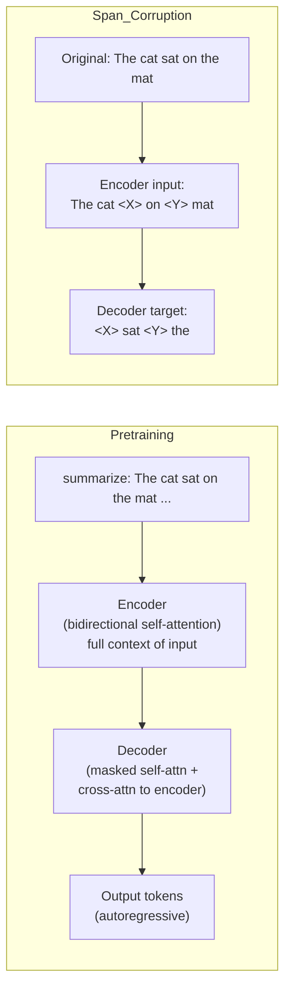

# 🔴 T5 Encoder-Decoder

> [!abstract] TL;DR
> T5 (Raffel 2020) unifies all NLP tasks under one framework: every task is text in → text out. A bidirectional encoder reads the full input; an autoregressive decoder generates the output. Pretraining uses span corruption (mask contiguous spans, predict dropped tokens) rather than individual token masking. FLAN-T5 instruction-tunes T5 on 1800+ tasks and dramatically improves zero/few-shot performance.

## Intuition — Analogy FIRST

BERT is a **reading comprehension specialist** — excellent at understanding, but it cannot write. GPT is a **novelist** — great at generating, but has no dedicated "understanding" component. T5 is a **translator**: it reads the full source text with complete bidirectional attention (encoder), then writes the output word-by-word (decoder), with the decoder attending to the encoder at each step via cross-attention.

The text-to-text unification insight: if you force ALL tasks to emit text, you can train ONE model on ALL tasks with the SAME loss function (cross-entropy over output tokens). No task-specific heads needed.

## How It Works



## Key Concepts / Details

### Text-to-Text Framework

Every task is reformulated with a task-specific text prefix:

| Task | Input | Output |
|---|---|---|
| Translation | "translate English to German: The house is wonderful." | "Das Haus ist wunderschön." |
| Summarisation | "summarize: In a study published in..." | "Researchers found that..." |
| Sentiment | "sst2 sentence: This movie was great!" | "positive" |
| QA | "question: Who wrote Hamlet? context: Shakespeare..." | "Shakespeare" |
| NLI | "mnli hypothesis: A man is sleeping. premise: A man is reading." | "contradiction" |

The **same model, same weights, same loss** handle all tasks.

### Architecture

| Component | Detail |
|---|---|
| Encoder | Stack of bidirectional self-attention + FFN blocks |
| Decoder | Stack of causal self-attention + cross-attention + FFN blocks |
| Position encoding | **Relative position biases** (not absolute); each attention layer has a learnable scalar bias table b(i−j) |
| Activation | ReLU in original T5; SwiGLU in variants |
| Tokenizer | SentencePiece (32k vocab) |

**Relative position biases**: instead of adding position embeddings to token embeddings, T5 adds a learned scalar to each attention score based on the relative offset (i−j). Shared across layers (same bias table per layer). More generalisable than absolute positions for length generalisation.

### Span Corruption Pretraining

Original MLM masks individual tokens. T5 masks **contiguous spans**:

1. Sample spans with average length 3 tokens covering ~15% of input.
2. Replace each span with a single sentinel token: `<extra_id_0>`, `<extra_id_1>`, ...
3. Decoder target = dropped tokens, delimited by sentinels.

Advantages over MLM:
- Shorter decoder target → faster training per example.
- Forces the model to generate multi-token continuations (not just single tokens).
- More computationally efficient: encoder input and decoder target both shorter.

### Model Sizes

| Variant | Parameters |
|---|---|
| T5-small | 60M |
| T5-base | 220M |
| T5-large | 770M |
| T5-XL | 3B |
| T5-XXL | 11B |

Trained on **C4** (Colossal Clean Crawled Corpus): ~750 GB of cleaned Common Crawl web text.

### FLAN-T5 and Instruction Tuning

**FLAN-T5** (Wei et al. 2021; Chung et al. 2022): fine-tune T5 on a collection of 1800+ NLP tasks reformulated as instructions.

Example instruction format:
```
Given the following passage, answer the question.
Passage: [...]
Question: What is the capital of France?
Answer:
```

Results: dramatic zero-shot and few-shot improvements over vanilla T5. FLAN-T5-XL matches GPT-3 (175B) on many benchmarks with 50× fewer parameters.

### Encoder-Decoder vs Encoder-Only vs Decoder-Only

| Model Family | Architecture | Best For | Weakness |
|---|---|---|---|
| T5 / BART | Encoder-Decoder | Seq2seq: translation, summarisation, QA | Slower inference (two passes) |
| BERT / RoBERTa | Encoder-Only | Classification, NER, embedding | Cannot generate text |
| GPT / LLaMA | Decoder-Only | Generation, few-shot, chat | Weaker at structured extraction |

### Other Encoder-Decoder Models

| Model | Key Difference | Best For |
|---|---|---|
| BART (Lewis 2019) | Denoising pretraining (text corruption → reconstruction) | Summarisation, dialogue |
| mBART | Multilingual BART | Multilingual translation |
| mT5 | Multilingual T5 on mC4 (101 languages) | Cross-lingual transfer |
| UL2 (Google 2022) | Mixture of Denoisers (PrefixLM + SpanCorruption + CausalLM) | Versatile: generation + understanding |
| PEGASUS | Gap-sentence generation for summarisation | Summarisation |

### Code

```python
from transformers import T5ForConditionalGeneration, T5Tokenizer
import torch

# ── Load T5 for conditional generation ───────────────────────────────────────
model     = T5ForConditionalGeneration.from_pretrained("t5-base")
tokenizer = T5Tokenizer.from_pretrained("t5-base")

# ── Summarisation ─────────────────────────────────────────────────────────────
text   = ("summarize: The quick brown fox jumps over the lazy dog. "
          "This sentence contains every letter of the English alphabet "
          "and has been used as a typing exercise for decades.")
inputs = tokenizer(text, return_tensors="pt", max_length=512, truncation=True)

with torch.no_grad():
    summary_ids = model.generate(
        inputs["input_ids"],
        max_new_tokens=50,
        num_beams=4,           # beam search
        early_stopping=True,
    )
summary = tokenizer.decode(summary_ids[0], skip_special_tokens=True)
print(summary)

# ── FLAN-T5 zero-shot classification ─────────────────────────────────────────
from transformers import AutoModelForSeq2SeqLM, AutoTokenizer

flan = AutoModelForSeq2SeqLM.from_pretrained("google/flan-t5-base")
tok  = AutoTokenizer.from_pretrained("google/flan-t5-base")

prompt = "Is the following sentence positive or negative? Sentence: I loved this film. Answer:"
ids    = tok(prompt, return_tensors="pt").input_ids
with torch.no_grad():
    out = flan.generate(ids, max_new_tokens=5)
print(tok.decode(out[0], skip_special_tokens=True))   # → "positive"
```

## Real-World Notes

- T5's relative position bias uses a shared bucket scheme: offsets within ±8 get unique buckets; beyond that, positions are log-bucketed. This gives some length extrapolation (up to ~2× train length).
- FLAN-T5 is one of the most practical open models for classification, QA, and summarisation with limited data — often better than fine-tuned BERT for generative tasks.
- For multilingual tasks: mT5 + fine-tuning outperforms translating into English first for most low-resource languages.
- mT5 was pretrained on mC4, which has significant quality variation for low-resource languages — always evaluate on target language before deploying.

## Common Pitfalls

- **Forgetting the task prefix**: T5 is sensitive to prefix format. "summarize:" vs "Summarize:" can change outputs. Use the exact format from the training data or FLAN task collection.
- **Decoder max length**: T5's `generate()` defaults to `max_length=20`. Always override with `max_new_tokens` appropriate for your task.
- **Using T5 for generation without beam search**: greedy decoding for summarisation often produces truncated or repetitive outputs. Use `num_beams=4` minimum.
- **Mixing T5 and BERT workflows**: T5 needs `decoder_input_ids` for teacher-forcing during training (handled automatically by `T5ForConditionalGeneration`), not a classification head on [CLS].

## Related Concepts

- [[Attention_Mechanism]] — self-attention (encoder), causal self-attention + cross-attention (decoder)
- [[BERT_Architecture]] — encoder-only; MLM pretraining; contrast with T5's span corruption
- [[GPT_Architecture]] — decoder-only; compare autoregressive generation
- [[Transformer_Variants]] — UL2's mixture of denoisers, mT5 multilingual

## Review Questions

1. What is the key insight of the text-to-text framework? Why is it advantageous to unify tasks this way?
2. How does span corruption differ from token-level MLM? Why is it more computationally efficient?
3. Explain how cross-attention works in the T5 decoder. What is Q and what are K, V?
4. FLAN-T5-XL matches GPT-3 on many benchmarks. What is the main reason despite having 50× fewer parameters?
5. What are relative position biases? Why are they preferred over absolute position embeddings for length generalisation?
6. You need to fine-tune T5 for a new task: given a contract, extract all dates. How do you format the input and expected output?

## Sources

- Raffel et al. (2020). "Exploring the Limits of Transfer Learning with a Unified Text-to-Text Transformer." JMLR.
- Chung et al. (2022). "Scaling Instruction-Finetuned Language Models (FLAN-T5)." JMLR.
- Lewis et al. (2019). "BART: Denoising Sequence-to-Sequence Pre-training." ACL 2020.
- Tay et al. (2022). "UL2: Unifying Language Learning Paradigms." ICLR 2023.
- HuggingFace T5 documentation: huggingface.co/docs/transformers/model_doc/t5

#nlp #transformer-architecture #intermediate
