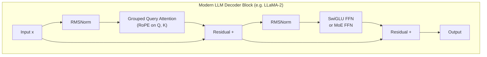

# 🔧 Transformer Variants

> [!abstract] TL;DR
> Modern LLMs (LLaMA, Mistral, PaLM, Gemma) are the original Transformer with targeted replacements: RoPE for relative position, RMSNorm for faster normalisation, SwiGLU for a better FFN activation, Grouped Query Attention (GQA) to shrink the KV cache, and FlashAttention for IO-efficient exact attention. Mixture-of-Experts (MoE) replaces dense FFNs with sparsely-activated expert networks, enabling massive parameter counts with fixed compute.

## Intuition — Analogy FIRST

The original Transformer (2017) was like a first-generation smartphone — functional but inefficient. Each improvement since then is an engineering optimisation:

- **RoPE / ALiBi** → better GPS (relative position that generalises to longer routes than trained)
- **RMSNorm** → faster normalisation (drop the mean computation, keep the scale)
- **SwiGLU** → a smarter throttle (gated activation; more expressive per FLOP)
- **GQA** → shared memory slots (fewer K,V heads; smaller cache footprint)
- **FlashAttention** → faster RAM access pattern (tile computation, stay in SRAM)
- **MoE** → a specialist committee (only 2 of 8 experts active per token; huge model, same compute)

## How It Works



## Key Concepts / Details

### 1. Positional Encodings

| Method | How | Length generalisation | Used in |
|---|---|---|---|
| Sinusoidal (original) | Fixed sin/cos at each position; added to embedding | Poor beyond train length | Transformer (2017) |
| Learned absolute | Embedding table up to max_len | None (hard cutoff) | BERT, GPT-2 |
| **RoPE** | Rotate Q, K by position-dependent angle | Good (extrapolates ~2×) | LLaMA, PaLM, GPT-NeoX |
| **ALiBi** | Subtract m·\|i−j\| from attention score | Excellent | MPT, Falcon |
| None | Let model learn from data | Varies | Some small models |

**RoPE (Rotary Position Embedding)** (Su et al. 2021):
- For each pair of dimensions (2d, 2d+1), rotate the Q and K vectors by angle θ·position.
- The dot product q·k automatically encodes the relative offset (i−j) — independent of absolute positions.
- Multiplication form: Q_pos = R_θ(pos) · Q where R is a block-diagonal rotation matrix.
- Key property: q_i · k_j depends only on i−j, not on i or j individually.

**ALiBi (Attention with Linear Biases)** (Press et al. 2021):
- Add a fixed bias −m·|i−j| to each attention score before softmax.
- m is a head-specific slope (geometric sequence across heads).
- No parameters added; strong length extrapolation.

### 2. Normalisation

| Method | Formula | Params | Speed | Used in |
|---|---|---|---|---|
| Post-LN (original) | LN after attention + residual | γ, β per layer | baseline | Original Transformer |
| Pre-LN | LN before attention | γ, β per layer | similar | GPT-2, T5 |
| **RMSNorm** | x / RMS(x) · γ | γ only (no β) | ~7% faster | LLaMA, T5 |

**RMSNorm** (Zhang & Sennrich 2019):

$$\text{RMSNorm}(x) = \frac{x}{\sqrt{\frac{1}{d}\sum_i x_i^2 + \epsilon}} \cdot \gamma$$

No mean subtraction, no β bias term. Works because re-centering has minimal effect on downstream performance, while re-scaling (γ) is critical.

### 3. Activation Functions

**Original Transformer**: ReLU in FFN: FFN(x) = max(0, xW₁ + b₁)W₂ + b₂.

**GELU** (Hendrycks 2016): smooth, probabilistic ReLU approximation. Used in BERT, GPT-2.

$$\text{GELU}(x) = x \cdot \Phi(x)$$

where Φ is the Gaussian CDF. Smooth derivative near 0 improves gradient flow.

**SwiGLU** (Shazeer 2020): gated linear unit with Swish activation.

$$\text{SwiGLU}(x, W_1, W_2, W_3) = \text{Swish}(xW_1) \odot (xW_2) \cdot W_3$$

where Swish(x) = x · σ(x). Uses THREE weight matrices (vs two for standard FFN) but hidden dim is reduced to ⅔×4d ≈ 2.67d to keep parameter count equal. Consistently outperforms ReLU/GELU in large-scale experiments (PaLM paper).

### 4. Grouped Query Attention (GQA)

Standard MHA: h_Q query heads, h_K = h_Q key heads, h_V = h_Q value heads.  
**GQA**: h_Q query heads, h_K = h_Q/G key heads (G groups), h_V = h_Q/G value heads.

Each group of G query heads shares ONE set of K,V heads.

Special cases:
- G=1: Multi-Query Attention (MQA) — all queries share a single K,V head. Maximum KV-cache savings.
- G=h: Standard MHA.
- G∈(1,h): GQA — balance between quality and memory.

**KV-cache size reduction**: from (2 × L × h × d_k × n) to (2 × L × (h/G) × d_k × n).
LLaMA-2 70B uses GQA with G=8: 8× reduction in KV cache vs MHA.

| Variant | Q heads | K,V heads | KV cache | Quality |
|---|---|---|---|---|
| MHA | h | h | 100% | highest |
| GQA | h | h/G | 1/G | near-MHA |
| MQA | h | 1 | 1/h | slightly lower |

### 5. Efficient Attention

See [[Attention_Mechanism]] for FlashAttention detail. Summary:

**FlashAttention** (Dao 2022): IO-aware tiling; exact; O(n) memory; 2–4× wall-clock speedup.
**Sliding window** (Longformer, Mistral): each token attends to w neighbours; global tokens attend everywhere. O(n·w) vs O(n²).
**MoE FFN**: see below.

### 6. Mixture of Experts (MoE)

Replace each dense FFN with N expert FFNs. A learned **router** sends each token to top-K experts (typically K=2).

$$\text{MoE}(x) = \sum_{k \in \text{top-K}} g_k(x) \cdot \text{Expert}_k(x)$$

where g_k are softmax-normalised router scores over selected experts.

**Key distinction**: parameter count ≠ active parameter count.
- Mixtral 8×7B: 8 experts × 7B params each = 46.7B total parameters.
- Active per token: 2 experts × 7B = 14B params used.
- Inference FLOP ≈ 14B-dense model; quality ≈ 40B-dense model.

**Load balancing**: routers tend to collapse onto a few experts (expert collapse). Solved with an auxiliary load-balancing loss that encourages uniform routing.

### Architectural Comparison

| Component | Original (2017) | GPT-2 | LLaMA-2 | Mistral 7B |
|---|---|---|---|---|
| Position encoding | Sinusoidal | Learned abs. | RoPE | RoPE (sliding window) |
| Normalisation | Post-LN | Pre-LN | Pre-LN + RMSNorm | Pre-LN + RMSNorm |
| Activation | ReLU | GELU | SwiGLU | SwiGLU |
| Attention | MHA | MHA | GQA (70B only) | GQA (8 Q / 2 KV) |
| Context | 512 | 1024 | 4096 | 8192 (32k via sliding window) |
| Efficient attn | — | — | FlashAttention-2 | FlashAttention-2 |

### Code — RoPE Implementation

```python
import torch
import torch.nn as nn

def precompute_rope_freqs(d_k: int, max_len: int, base: float = 10000.0):
    """Precompute cos/sin tables for RoPE."""
    # theta_i = 1 / 10000^(2i/d_k) for i in [0, d_k/2)
    theta = 1.0 / (base ** (torch.arange(0, d_k, 2).float() / d_k))  # (d_k/2,)
    positions = torch.arange(max_len).float()                          # (max_len,)
    freqs = torch.outer(positions, theta)                               # (max_len, d_k/2)
    cos = torch.cos(freqs)   # (max_len, d_k/2)
    sin = torch.sin(freqs)   # (max_len, d_k/2)
    return cos, sin

def apply_rope(x: torch.Tensor, cos: torch.Tensor, sin: torch.Tensor):
    """
    x: (batch, heads, seq, d_k)
    Apply RoPE rotation in-place.
    """
    d_k    = x.shape[-1]
    x1, x2 = x[..., :d_k//2], x[..., d_k//2:]       # split in half
    # rotate: (x1, x2) → (x1·cos − x2·sin, x2·cos + x1·sin)
    cos_  = cos[:x.shape[2]].unsqueeze(0).unsqueeze(0)   # (1,1,seq,d_k/2)
    sin_  = sin[:x.shape[2]].unsqueeze(0).unsqueeze(0)
    return torch.cat([x1 * cos_ - x2 * sin_,
                      x2 * cos_ + x1 * sin_], dim=-1)

# ── RMSNorm ───────────────────────────────────────────────────────────────────
class RMSNorm(nn.Module):
    def __init__(self, d_model: int, eps: float = 1e-6):
        super().__init__()
        self.eps   = eps
        self.gamma = nn.Parameter(torch.ones(d_model))

    def forward(self, x: torch.Tensor) -> torch.Tensor:
        rms = x.pow(2).mean(dim=-1, keepdim=True).add(self.eps).sqrt()
        return (x / rms) * self.gamma

# ── SwiGLU FFN ────────────────────────────────────────────────────────────────
class SwiGLUFFN(nn.Module):
    def __init__(self, d_model: int, expansion: float = 8/3):
        super().__init__()
        hidden = int(d_model * expansion)
        self.W1 = nn.Linear(d_model, hidden, bias=False)  # gate
        self.W2 = nn.Linear(d_model, hidden, bias=False)  # value
        self.W3 = nn.Linear(hidden,  d_model, bias=False) # output

    def forward(self, x: torch.Tensor) -> torch.Tensor:
        return self.W3(torch.nn.functional.silu(self.W1(x)) * self.W2(x))
```

## Real-World Notes

- **RoPE + YaRN / RoPE scaling** extends LLaMA's effective context beyond its training length by scaling the position frequencies. Many 128k+ context models use this.
- **MoE routing instability**: early training is noisy — experts converge slowly. The auxiliary load-balance loss weight needs careful tuning (too high → hurts quality, too low → expert collapse).
- **GQA adoption**: almost every competitive open-weight model released after mid-2023 uses GQA or MQA due to KV-cache pressure in serving.
- **RMSNorm numerical stability**: without the +ε under the sqrt, near-zero vectors explode. Always include ε ≈ 1e-6.

## Common Pitfalls

- **RoPE dimension mismatch**: RoPE is applied per pair of dimensions — d_k must be even. Odd d_k requires padding.
- **GQA head count arithmetic**: if h_Q=32 and G=8, then h_K=4. The key tensor shape is (B, 4, T, d_k) not (B, 32, T, d_k). Incorrect indexing causes silent wrong results.
- **SwiGLU parameter budget**: naive expansion to 4d gives 3 matrices × 4d hidden = 12d² params (vs standard 8d²). Use 8/3 × d hidden to match parameter count.
- **Pre-LN vs Post-LN**: switching from Post-LN to Pre-LN changes gradient magnitude at init — learning rates tuned for Post-LN may need adjustment.

## Related Concepts

- [[Attention_Mechanism]] — FlashAttention, sparse attention, GQA detailed mechanics
- [[BERT_Architecture]] — uses Post-LN + absolute position + GELU (original design)
- [[GPT_Architecture]] — GPT-2 introduced Pre-LN; modern GPT-style models add RoPE/RMSNorm
- [[T5_Encoder_Decoder]] — uses relative position biases and RMSNorm

## Review Questions

1. How does RoPE encode relative position in the attention score? Why is this better than absolute position embeddings for length generalisation?
2. What does RMSNorm drop compared to standard LayerNorm, and why is this acceptable?
3. SwiGLU uses three weight matrices. How is hidden dim chosen to keep parameter count equal to a standard FFN with two matrices?
4. In GQA with h_Q=32 and G=8, how large is the KV cache relative to standard MHA?
5. Mixtral 8×7B has 46.7B total parameters. How many are active per token, and what does this imply for inference cost?
6. Explain the expert collapse problem in MoE and how auxiliary load-balancing loss addresses it.

## Sources

- Su et al. (2021). "RoFormer: Enhanced Transformer with Rotary Position Embedding."
- Press et al. (2021). "Train Short, Test Long: Attention with Linear Biases (ALiBi)."
- Zhang & Sennrich (2019). "Root Mean Square Layer Normalization."
- Shazeer (2020). "GLU Variants Improve Transformer." arXiv.
- Ainslie et al. (2023). "GQA: Training Generalized Multi-Query Transformer Models." EMNLP.
- Dao et al. (2022). "FlashAttention." NeurIPS.
- Jiang et al. (2024). "Mixtral of Experts." arXiv.
- Touvron et al. (2023). "LLaMA 2: Open Foundation and Fine-Tuned Chat Models." arXiv.

#nlp #transformer-architecture #advanced
