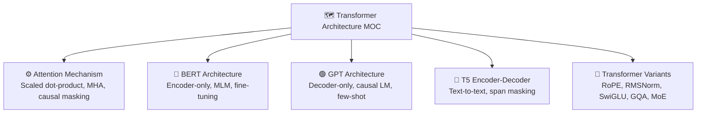

# 🗺️ Transformer Architecture — Section MOC

> [!abstract] TL;DR
> The Transformer (Vaswani 2017, "Attention Is All You Need") eliminated recurrence entirely, replacing it with self-attention. Every token attends to every other token in parallel — enabling massive parallelism and scaling. This section covers the full architecture (scaled dot-product attention, multi-head attention, positional encodings, encoder, decoder), BERT (encoder-only, masked LM pretraining), GPT (decoder-only, causal LM), T5 (encoder-decoder, text-to-text), and architectural improvements (RoPE, FlashAttention, ALiBi, SwiGLU, RMSNorm).

## Why Transformers Changed Everything

Before Transformers, sequence models (RNNs, LSTMs) processed tokens sequentially — each step depended on the previous hidden state. This created two fundamental problems:
- **No parallelism**: you cannot compute step t until step t-1 is done.
- **Long-range forgetting**: gradients vanish/explode over long sequences despite LSTM gating.

The Transformer replaced the recurrence with **self-attention**: every token attends directly to every other token in O(1) steps. This unlocks full parallelism during training and eliminates the vanishing-gradient bottleneck across positions.

## Section Map



## Notes in This Section

| File | Topic | Difficulty |
|---|---|---|
| [[Attention_Mechanism]] | Scaled dot-product, multi-head, efficient variants | Intermediate |
| [[BERT_Architecture]] | Encoder-only pretraining, MLM, NSP, fine-tuning | Intermediate |
| [[GPT_Architecture]] | Decoder-only, causal LM, few-shot, kv-cache | Intermediate |
| [[T5_Encoder_Decoder]] | Text-to-text, span masking, FLAN-T5 | Intermediate |
| [[Transformer_Variants]] | RoPE, ALiBi, RMSNorm, SwiGLU, GQA, MoE | Advanced |

## Reading Order

1. [[Attention_Mechanism]] — the core primitive everything else builds on
2. [[BERT_Architecture]] — encoder-only; best for understanding pretraining
3. [[GPT_Architecture]] — decoder-only; foundation of modern LLMs
4. [[T5_Encoder_Decoder]] — encoder-decoder; text-to-text unification
5. [[Transformer_Variants]] — modern improvements stacked on top

## Key Papers

| Paper | Year | Contribution |
|---|---|---|
| Attention Is All You Need (Vaswani et al.) | 2017 | Original Transformer; self-attention; encoder-decoder |
| BERT (Devlin et al.) | 2018 | Bidirectional pretraining; MLM + NSP |
| Language Models are Unsupervised Multitask Learners (Radford et al.) | 2019 | GPT-2; in-context learning |
| Exploring the Limits of Transfer Learning (Raffel et al.) | 2020 | T5; text-to-text framework; C4 |
| Language Models are Few-Shot Learners (Brown et al.) | 2020 | GPT-3; 175B; few-shot prompting |
| RoFormer (Su et al.) | 2021 | RoPE positional embeddings |
| FlashAttention (Dao et al.) | 2022 | IO-aware exact attention; 2-4× speedup |
| LLaMA (Touvron et al.) | 2023 | Open-weight; RoPE + RMSNorm + SwiGLU |

## Architecture Family Tree

```
Original Transformer (2017)
├── Encoder-only
│   ├── BERT (2018)
│   ├── RoBERTa (2019)
│   ├── ALBERT (2019)
│   ├── ELECTRA (2020)
│   └── DistilBERT (2019)
├── Decoder-only
│   ├── GPT-1/2/3/4
│   ├── LLaMA / LLaMA-2 / LLaMA-3
│   ├── Mistral / Mixtral
│   └── Gemma / PaLM / Falcon
└── Encoder-Decoder
    ├── T5 / FLAN-T5
    ├── BART
    ├── mT5 / mBART
    └── UL2
```

## Related Sections

- [[../02_Text_Preprocessing/_MOC_TextPreprocessing|02 Text Preprocessing]] — tokenization feeds into Transformer input
- [[../04_Language_Models/_MOC_LanguageModels|04 Language Models]] — statistical foundations before neural LMs
- [[../09_Transfer_Learning/_MOC_TransferLearning|09 Transfer Learning]] — fine-tuning BERT/GPT for downstream tasks

## Sources

- Vaswani et al. (2017). "Attention Is All You Need." NeurIPS.
- Devlin et al. (2018). "BERT: Pre-training of Deep Bidirectional Transformers." NAACL 2019.
- Radford et al. (2019). "Language Models are Unsupervised Multitask Learners."
- Raffel et al. (2020). "Exploring the Limits of Transfer Learning with T5." JMLR.
- Illustrated Transformer — Jay Alammar (jalammar.github.io)

#MOC #nlp #transformer-architecture
