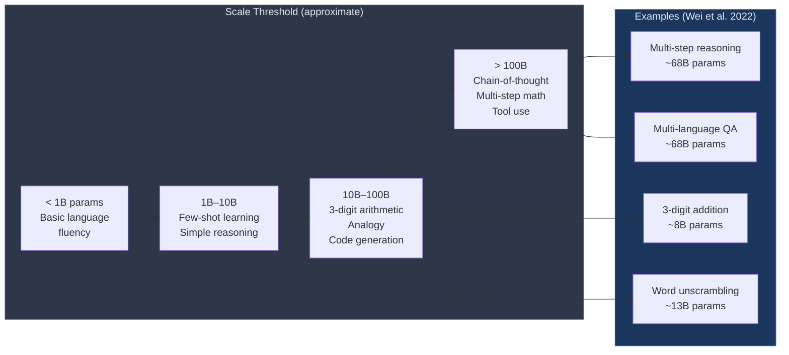

# ⚡ Emergent Capabilities in LLMs

> [!abstract] TL;DR
> Emergent abilities are capabilities absent in small models that appear sharply (discontinuously) as model scale increases. Examples include 3-digit arithmetic, multi-step reasoning, and analogical reasoning. Chain-of-thought prompting is itself an emergent behavior — it fails on small models and suddenly works at ~100B+ parameters. Whether these transitions are truly discontinuous or an artifact of metrics is actively debated.

## Intuition — analogy FIRST
Imagine teaching a child arithmetic by having them memorize examples. Below a certain amount of practice, they can't generalize to new problems at all. Then, past a threshold, something clicks — they grasp the underlying rule and suddenly solve novel problems. LLMs undergo similar phase transitions: below a scale threshold, a capability is near-zero; above it, the capability appears rapidly. The debate is whether this is genuinely non-linear or whether we are measuring with a blunt ruler (pass/fail metrics that hide gradual underlying improvement).

## How It Works



## Key Concepts / Details

### Defining Emergent Abilities
Wei et al. (2022) define emergence as: *"A capability is emergent if it is not present in smaller models but is present in larger models."*

Key properties:
- **Sharpness**: performance jumps from near-random to high accuracy over a small compute range
- **Unpredictability**: cannot be extrapolated from smaller-scale experiments
- **Task diversity**: emergent abilities span arithmetic, reasoning, translation, analogy, etc.

### The Schaeffer (2023) Counter-Argument
Schaeffer et al. argue that emergence is an artifact of **non-linear evaluation metrics**:
- Pass/fail metrics (exact match) hide gradual probability improvements
- Switching to a continuous metric (log-prob of correct answer) often shows smooth improvement
- The "phase transition" may be in the metric, not the model

This is an important nuance: the underlying capability probability may improve smoothly, but task success (which requires all steps to be correct) exhibits a sharp threshold. Both views can be simultaneously correct.

### Chain-of-Thought Prompting (Wei et al., 2022)
**Standard prompting:** Q → A (direct answer)
**CoT prompting:** Q → reasoning steps → A

```
# Zero-shot CoT (Kojima et al., 2022)
Prompt: "Q: Roger has 5 tennis balls. He buys 2 more cans of 3 balls each.
         How many tennis balls does he have now?
         Let's think step by step."

Output: "Roger started with 5 balls. He bought 2 × 3 = 6 more balls.
         5 + 6 = 11. The answer is 11."
```

CoT is itself an emergent ability — it **hurts** small models (adds hallucinated steps) and **helps** large models (>~100B parameters). This is why it was missed in earlier work on smaller models.

### Least-to-Most Prompting
Decompose the problem into subproblems, solve sequentially, feed prior answers into next prompt:
1. "What subproblems do I need to solve this problem?"
2. Solve subproblem 1
3. Solve subproblem 2 given answer to subproblem 1
4. Combine

Particularly effective for compositional tasks where a single CoT still fails.

### Tool Use as Emergent Behavior

**MRKL (Karpas et al., 2022):** Modular Reasoning + Knowledge + Language — route questions to appropriate tool (calculator, search, DB) based on model decision.

**Toolformer (Schick et al., 2023):** Self-supervised training. Model is shown API call syntax; a data augmentation pipeline inserts API calls into text where they reduce loss. Model learns when and how to call tools without hand-labeled examples.

**Code Interpreter Augmentation:** Generate Python → execute → feed output back. Reliable arithmetic and data analysis, mitigates math hallucination.

### LLM as Agent: ReAct (Yao et al., 2022)
Interleave reasoning traces and tool-use actions:
```
Thought: I need to find the population of Tokyo.
Action: Search("Tokyo population 2024")
Observation: 13.96 million (city proper), 37.4 million (metro)
Thought: The question asks for metro area, so 37.4 million.
Answer: 37.4 million
```

ReAct outperforms chain-of-thought alone and action-only baselines on knowledge-intensive tasks (HotpotQA, FEVER) and decision-making tasks (ALFWorld, WebShop).

### Calibration and Hallucination
- Emergent scale brings **overconfidence** — models assign high probability to wrong answers
- **ECE (Expected Calibration Error):** measures mismatch between confidence and accuracy
- Hallucination causes at scale: (1) training data noise, (2) reward hacking in RLHF, (3) model over-generates plausible-sounding text that isn't grounded

```python
# CoT zero-shot prompting demo
import anthropic

client = anthropic.Anthropic()

def cot_solve(question: str) -> str:
    prompt = f"{question}\nLet's think step by step."
    response = client.messages.create(
        model="claude-opus-4-5",
        max_tokens=512,
        messages=[{"role": "user", "content": prompt}]
    )
    return response.content[0].text

# Example
q = "A store sells apples for $0.75 each and oranges for $1.20 each. " \
    "If Maria buys 4 apples and 3 oranges, how much does she pay in total?"
print(cot_solve(q))
```

## Real-World Notes

### GSM8K Benchmark — Prompting Strategy Comparison

| Method | Model Size | Accuracy |
|--------|-----------|----------|
| Standard prompting | PaLM 540B | 17.9% |
| Few-shot CoT | PaLM 540B | 56.9% |
| Zero-shot CoT | GPT-3 175B | 40.7% |
| Self-Consistency (40 paths) | PaLM 540B | 74.4% |
| o3 (RL reasoning) | — | ~98% |

### Why Tool Use Matters
Even 100B+ models make arithmetic errors. A calculator never does. Routing numeric operations to a tool eliminates an entire class of hallucinations.

## Common Pitfalls
- Assuming CoT helps small models — it reliably hurts models below ~8B parameters
- Treating emergent abilities as truly discontinuous — the metric framing matters
- Ignoring calibration — high benchmark accuracy does not mean models are well-calibrated
- Overlooking tool reliability — tool-calling models can call tools incorrectly; output must be validated
- Conflating emergence (scale) with instruction following (fine-tuning) — both unlock capabilities via different mechanisms

## Related Concepts
- [[Scaling_Laws]] — the scale thresholds where emergence occurs
- [[In_Context_Learning]] — the mechanism underlying few-shot and CoT prompting
- [[Reasoning_LLMs]] — advanced reasoning methods that build on CoT
- [[../05_Alignment_and_RLHF/RLHF]] — post-training that shapes emergent capabilities

## Review Questions
1. Define emergent ability in LLMs. What distinguishes it from smooth capability improvement?
2. Explain Schaeffer's critique of emergence. How can both the "smooth" and "sharp" views be simultaneously correct?
3. Why does chain-of-thought prompting hurt small models but help large ones?
4. What is Toolformer, and how does it learn to use tools without labeled data?
5. Describe the ReAct framework. What does it interleave and why is this more powerful than reasoning alone?

## Sources
- Wei, J., et al. (2022). *Emergent Abilities of Large Language Models*. TMLR.
- Schaeffer, R., et al. (2023). *Are Emergent Abilities of Large Language Models a Mirage?* NeurIPS 2023.
- Wei, J., et al. (2022). *Chain-of-Thought Prompting Elicits Reasoning in Large Language Models*. NeurIPS.
- Schick, T., et al. (2023). *Toolformer: Language Models Can Teach Themselves to Use Tools*. arXiv:2302.04761.
- Yao, S., et al. (2022). *ReAct: Synergizing Reasoning and Acting in Language Models*. arXiv:2210.03629.

#nlp #large-language-models #emergent-capabilities #chain-of-thought #advanced
