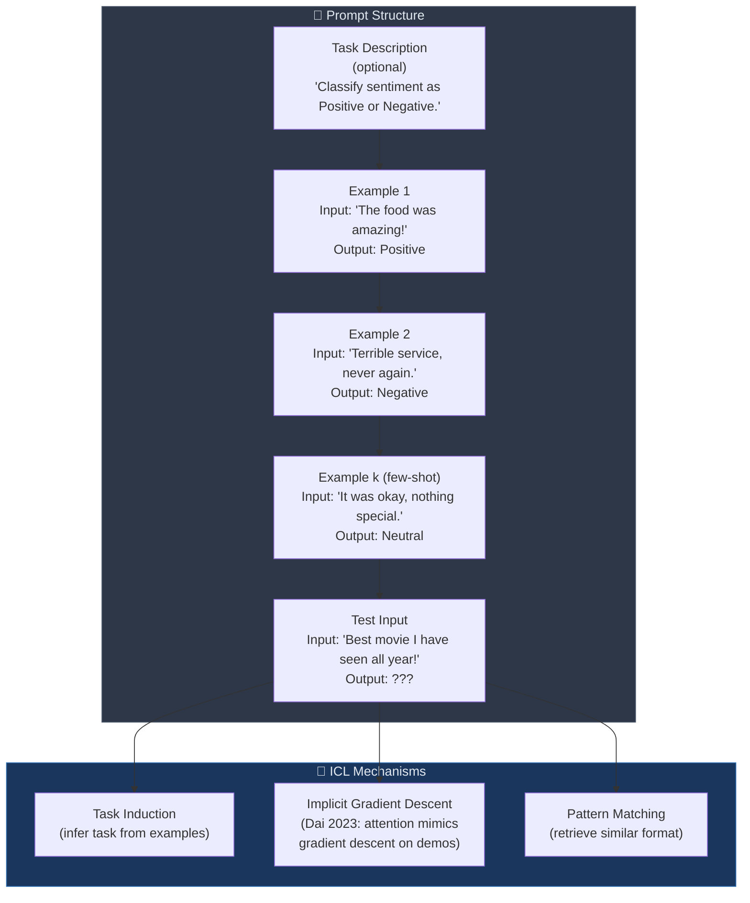

# 📋 In-Context Learning

> [!abstract] TL;DR
> In-context learning (ICL) is the ability of large language models to perform new tasks by conditioning on a few input-output examples in the prompt — without any gradient update. GPT-3 demonstrated this powerfully at 175B parameters. ICL is sensitive to example selection, ordering, and label format. Self-consistency (sample multiple reasoning chains, majority vote) significantly boosts accuracy on reasoning tasks.

## Intuition — analogy FIRST
ICL is like showing a new employee 3 examples of a task and then asking them to do the 4th — no training manual, no formal instruction. A junior employee (small model) might follow the surface pattern mechanically and fail to generalize. A senior expert (large model) extracts the underlying task structure from examples and applies it correctly even to novel inputs. The "learning" happens in the forward pass, not in weight updates.

## How It Works



## Key Concepts / Details

### ICL Variants by Number of Examples

| Variant | Examples in Prompt | Notes |
|---------|-------------------|-------|
| Zero-shot | 0 (task description only) | Relies entirely on pretraining knowledge |
| One-shot | 1 | GPT-3 paper baseline |
| Few-shot | 2–32 | Typical ICL setting |
| Many-shot | 32–2048+ | Enabled by long-context models (Claude, Gemini) |

GPT-3 showed that 175B parameters were needed for reliable few-shot ICL on most tasks. Smaller models (< 10B) showed weak or erratic ICL.

### ICL Mechanism: Implicit Gradient Descent (Dai et al., 2023)
Formal analysis shows that the attention computation over in-context examples is equivalent to a step of gradient descent on the model's forward pass:
- Each (input, label) pair in context acts as a "training example"
- Transformer attention head weights serve as the implicit gradient descent operator
- This explains why ICL scales with model capacity — more heads/layers → more powerful implicit optimizer

This is **not** a coincidence; it is a consequence of the mathematical structure of linear attention.

### Sensitivity of ICL
ICL is surprisingly fragile:
1. **Example selection**: examples similar to the test input (retrieved by kNN in embedding space) outperform random selection by 10-20% on classification
2. **Example ordering**: recency bias — examples near the end of the prompt have disproportionate influence; random shuffling of order can change accuracy by ±10%
3. **Label format**: random labels (e.g., using "foo/bar" instead of "positive/negative") still helps ICL — the format matters more than label semantics for some tasks
4. **Template choice**: different question/answer phrasings yield different accuracy from the same model

### Example Selection: kNN Retrieval
```python
from sentence_transformers import SentenceTransformer
import numpy as np

encoder = SentenceTransformer("all-MiniLM-L6-v2")

def select_examples(test_input: str, example_pool: list, k: int = 4) -> list:
    """Retrieve k most similar examples from pool via cosine similarity."""
    pool_texts = [ex["input"] for ex in example_pool]
    pool_embs = encoder.encode(pool_texts, normalize_embeddings=True)
    test_emb = encoder.encode([test_input], normalize_embeddings=True)
    scores = (pool_embs @ test_emb.T).squeeze()
    top_k = np.argsort(scores)[::-1][:k]
    return [example_pool[i] for i in top_k]

def build_few_shot_prompt(task_desc: str, examples: list, test_input: str) -> str:
    prompt = task_desc + "\n\n"
    for ex in examples:
        prompt += f"Input: {ex['input']}\nOutput: {ex['label']}\n\n"
    prompt += f"Input: {test_input}\nOutput:"
    return prompt
```

### ICL vs Fine-Tuning

| Aspect | ICL | Fine-Tuning |
|--------|-----|-------------|
| Gradient updates | None | Yes |
| Setup cost | Zero (just examples) | Training compute + data labeling |
| Accuracy (few labels) | Competitive | Weaker (overfits) |
| Accuracy (many labels) | Plateaus | Continues to improve |
| Context window limit | Yes (bounded by context length) | No |
| Serving cost | Higher (long prompts) | Lower (no prompt examples) |
| Task switching | Instant (change prompt) | Requires separate model |

### Self-Consistency (Wang et al., 2022)
Observation: for reasoning tasks, sampling multiple diverse CoT chains and taking majority vote over final answers outperforms greedy/beam decoding significantly.

Algorithm:
1. Set temperature T = 0.7–1.0 (to get diverse samples)
2. Sample N reasoning chains (e.g., N = 40)
3. Extract final answer from each chain
4. Return majority vote answer

```python
import anthropic
from collections import Counter

client = anthropic.Anthropic()

def self_consistency(question: str, n_samples: int = 10, temperature: float = 0.8) -> str:
    """Sample multiple CoT chains and return majority answer."""
    prompt = f"{question}\nLet's think step by step."
    answers = []

    for _ in range(n_samples):
        response = client.messages.create(
            model="claude-opus-4-5",
            max_tokens=512,
            temperature=temperature,
            messages=[{"role": "user", "content": prompt}]
        )
        text = response.content[0].text
        # Extract final answer — last number or "The answer is X"
        import re
        match = re.search(r"(?:answer is|=)\s*([\d,]+)", text, re.IGNORECASE)
        if match:
            answers.append(match.group(1).replace(",", ""))

    if not answers:
        return "No answer extracted"
    return Counter(answers).most_common(1)[0][0]
```

Self-consistency improves GSM8K accuracy from 56.9% (greedy CoT) to 74.4% (40-sample SC) on PaLM 540B.

### Many-Shot ICL in Long-Context Models
With 100k–200k token context windows (Claude 3, Gemini 1.5, GPT-4o):
- Hundreds to thousands of examples fit in context
- Many-shot ICL narrows the gap to fine-tuning significantly
- Can include complex, multi-step demonstrations that would be prohibitive in few-shot

## Real-World Notes

### Zero-Shot vs Few-Shot vs Fine-Tuned vs RAG + Few-Shot

| Method | Setup Cost | Label Data | Typical Accuracy | Best For |
|--------|-----------|------------|-----------------|----------|
| Zero-shot | None | None | Baseline | Prototyping, no data |
| Few-shot ICL (k=4) | Minutes | 4–32 examples | +5–15% vs zero-shot | Quick adaptation |
| Fine-tuned | Hours–days | 100–10k+ | Best in class | Production, well-defined tasks |
| RAG + few-shot | Hours (indexing) | KB + few examples | Very high on knowledge tasks | QA, factual tasks |

## Common Pitfalls
- Ordering examples randomly without considering recency bias — last examples have the most influence
- Using too few examples when budget allows more — k=4 is often suboptimal; k=8–16 usually better if context allows
- Not validating label format sensitivity — always try 2-3 different template phrasings
- Expecting small models (<7B) to benefit from CoT examples — they often degrade with chain-of-thought
- Using greedy decoding for reasoning tasks — self-consistency with sampling almost always outperforms

## Related Concepts
- [[Emergent_Capabilities]] — ICL is itself emergent above ~50-100B parameters
- [[Reasoning_LLMs]] — CoT and self-consistency as extensions of ICL for reasoning
- [[../05_Alignment_and_RLHF/Instruction_Tuning]] — instruction tuning makes zero-shot ICL much more reliable

## Review Questions
1. What is the gradient descent interpretation of ICL? Why does this imply ICL scales with model capacity?
2. Explain why random labels (e.g., "foo"/"bar" instead of "positive"/"negative") still help ICL performance.
3. Describe the self-consistency algorithm. Why does sampling diversity matter?
4. When would you choose fine-tuning over ICL? What is the key trade-off?
5. How does many-shot ICL in long-context models change the ICL vs fine-tuning comparison?

## Sources
- Brown, T., et al. (2020). *Language Models are Few-Shot Learners* (GPT-3). NeurIPS.
- Dai, D., et al. (2023). *Why Can GPT Learn In-Context? Language Models Implicitly Perform Gradient Descent*. ACL Findings.
- Wang, X., et al. (2022). *Self-Consistency Improves Chain of Thought Reasoning in Language Models*. arXiv:2203.11171.
- Min, S., et al. (2022). *Rethinking the Role of Demonstrations: What Makes ICL Work?* EMNLP.
- Rubin, O., et al. (2022). *Learning To Retrieve Prompts for In-Context Learning*. NAACL.

#nlp #large-language-models #in-context-learning #few-shot #self-consistency #intermediate
