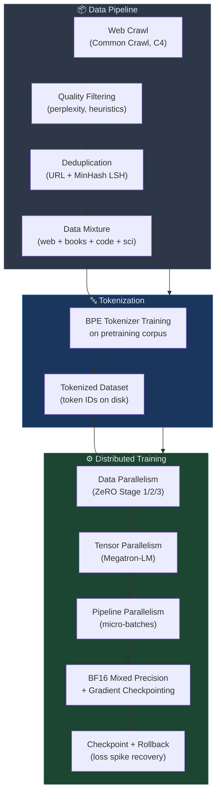

# 🏗️ Pretraining Large Language Models

> [!abstract] TL;DR
> LLM pretraining is a three-stage pipeline: curate and clean a massive text corpus, train a BPE tokenizer on it, then run autoregressive next-token prediction at scale using distributed training across thousands of GPUs. Every design choice — data mixture, deduplication strategy, parallelism scheme, precision format — has measurable impact on final model quality.

## Intuition — analogy FIRST
Pretraining an LLM is like building a universal expert by having them read the entire internet, all published books, and all available code — then quizzing them only on "what word comes next?" The quality of what they read (data curation), how well they remember without redundancy (deduplication), and how efficiently you can teach thousands of students in parallel (distributed training) all determine how expert they become.

## How It Works



## Key Concepts / Details

### Pretraining Data Sources
| Dataset | Source | Size | Notes |
|---------|--------|------|-------|
| Common Crawl | Web snapshots | ~400B tokens/snapshot | Requires heavy filtering |
| C4 | Filtered Common Crawl | 750B tokens | Used in T5, PaLM |
| The Pile | 22 domains (books, code, sci) | 825B tokens | EleutherAI |
| ROOTS | 46 languages | 341B tokens | Used for BLOOM |
| Dolma | Web + code + scientific | 3T tokens | Allen AI, open |
| FineWeb | Filtered Common Crawl | 15T tokens | HuggingFace |

**Quality filtering pipeline:**
1. Language detection (fastText) — keep target language(s)
2. Heuristic filters — remove lines with too many symbols, low alpha ratio, short documents
3. Perplexity filtering — KenLM trained on high-quality text; remove high-perplexity docs
4. Safety filtering — remove CSAM, PII, toxic content

### Deduplication
Duplicates inflate effective data size and hurt generalization. Two levels:
- **Document-level URL dedup** — exact URL match across crawl snapshots
- **Near-dedup via MinHash LSH** — locality-sensitive hashing on shingles; removes ~30-40% of web data; critical for scaling

### Data Mixture
Mixing multiple sources matters. Example proportions (LLaMA-2 approximate):
```
Web:       ~60%   (filtered Common Crawl)
Books:     ~10%   (Project Gutenberg + Books3)
Code:      ~8%    (GitHub)
Wikipedia: ~5%
Scientific:~5%    (ArXiv, PubMed)
Other:     ~12%
```
Code inclusion improves reasoning even in non-code tasks.

### Tokenizer Training
BPE (Byte-Pair Encoding) trained on a representative sample of the pretraining corpus:
- Vocabulary size: 32k–128k (LLaMA-3 uses 128k)
- Byte-level BPE handles all Unicode without UNK tokens
- Tokenizer quality affects efficiency (tokens/word) and downstream performance

### Distributed Training

**Three axes of parallelism:**

| Type | What splits | Library | When needed |
|------|-------------|---------|-------------|
| Data Parallelism (DP) | Batch across GPUs | DDP / ZeRO | Always |
| Tensor Parallelism (TP) | Layer weight matrices | Megatron-LM | Model > 7B |
| Pipeline Parallelism (PP) | Layers across GPU groups | Megatron-LM | Model > 30B |

**ZeRO (Zero Redundancy Optimizer):**
- Stage 1: Partition optimizer states
- Stage 2: + Partition gradients
- Stage 3: + Partition parameters (most memory-efficient; higher communication cost)

**Mixed Precision:**
- BF16 (Brain Float 16): 8 exponent bits → handles large gradients without overflow; preferred over FP16 for stability
- Master weights kept in FP32 for optimizer step precision

**Gradient Checkpointing:**
- During forward pass: do NOT cache all activations — recompute them during backward
- Trades ~33% extra compute for O(sqrt(L)) memory instead of O(L) in activations

### Training Stability
```
Loss spike → skip batch (gradient norm threshold) → if persists → rollback checkpoint
```
- Cosine LR schedule with linear warmup (e.g., 2000 steps warmup)
- Weight decay ~0.1; AdamW β₁=0.9, β₂=0.95
- Gradient clipping at norm 1.0

### Context Length Extension
- Pretrain at 2048 or 4096 tokens (cheaper)
- Extend to 32k–128k+ with RoPE scaling variants:
  - **YaRN** (Yet Another RoPE extensioN): frequency interpolation + extrapolation
  - **LongRoPE**: non-uniform position rescaling

```python
# Skeleton: minimal HuggingFace + Accelerate pretraining loop
from transformers import AutoModelForCausalLM, AutoTokenizer
from accelerate import Accelerator
import torch

accelerator = Accelerator(mixed_precision="bf16")

model = AutoModelForCausalLM.from_pretrained("meta-llama/Llama-2-7b-hf")
tokenizer = AutoTokenizer.from_pretrained("meta-llama/Llama-2-7b-hf")
optimizer = torch.optim.AdamW(model.parameters(), lr=3e-4, weight_decay=0.1)

model, optimizer = accelerator.prepare(model, optimizer)

for batch in dataloader:
    input_ids = batch["input_ids"]
    labels = input_ids.clone()

    with accelerator.accumulate(model):
        outputs = model(input_ids=input_ids, labels=labels)
        loss = outputs.loss
        accelerator.backward(loss)
        accelerator.clip_grad_norm_(model.parameters(), 1.0)
        optimizer.step()
        optimizer.zero_grad()
```

## Real-World Notes — Model Comparison

| Model | Params | Tokens | Context | Open? |
|-------|--------|--------|---------|-------|
| LLaMA-2 | 7–70B | 2T | 4096 | Weights |
| LLaMA-3 | 8–70B | 15T | 8192 | Weights |
| Mistral 7B | 7B | ~1T | 32k | Weights |
| Falcon 40B | 40B | 1T | 2048 | Weights |
| Gemma 2 | 2–27B | 2–13T | 8192 | Weights |
| Qwen2 | 7–72B | 7T | 131072 | Weights |
| GPT-4 | ~1T MoE? | ~13T? | 128k | Closed |
| Claude 3 | Unknown | Unknown | 200k | Closed |

## Common Pitfalls
- Skipping deduplication — dramatically inflates apparent dataset size; model memorizes duplicates
- Training in FP16 instead of BF16 — loss spikes from overflow in later training
- Ignoring tokenizer mismatch — using a tokenizer trained on different data degrades efficiency
- Over-fitting to quality filters — too aggressive filtering removes valuable diversity
- Pipeline parallelism bubble overhead — idle GPU cycles at pipeline boundaries; mitigate with micro-batches

## Related Concepts
- [[Scaling_Laws]] — how data quantity and model size interact optimally
- [[Emergent_Capabilities]] — what capabilities arise from pretraining at scale
- [[../05_Alignment_and_RLHF/Instruction_Tuning]] — post-pretraining alignment pipeline

## Review Questions
1. What are the three axes of model parallelism and when is each needed?
2. Why is BF16 preferred over FP16 for LLM pretraining?
3. What does MinHash LSH accomplish in data preprocessing, and why does it matter at scale?
4. What is gradient checkpointing and what trade-off does it make?
5. Why does LLaMA-3 include code in its pretraining data even though it is a general-purpose model?

## Sources
- Touvron, H., et al. (2023). *LLaMA 2: Open Foundation and Fine-Tuned Chat Models*. arXiv:2307.09288.
- Penedo, G., et al. (2024). *The FineWeb Datasets*. HuggingFace.
- Narayanan, D., et al. (2021). *Efficient Large-Scale Language Model Training on GPU Clusters* (Megatron-LM). SC'21.
- Rajbhandari, S., et al. (2020). *ZeRO: Memory Optimizations Toward Training Trillion Parameter Models*. SC'20.
- Dubey, A., et al. (2024). *The LLaMA 3 Herd of Models*. arXiv:2407.21783.

#nlp #large-language-models #pretraining #distributed-training #intermediate
