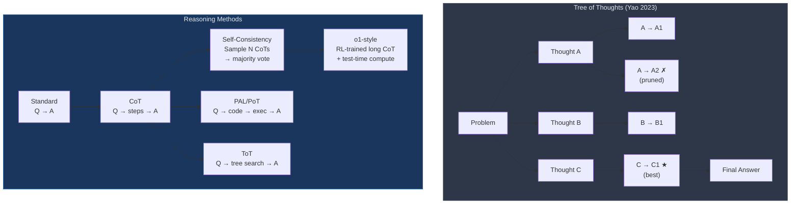

# 🔢 Reasoning in LLMs

> [!abstract] TL;DR
> LLMs are poor at multi-step reasoning by default — they conflate fluent generation with correct deduction. Chain-of-thought (CoT) prompting dramatically improves performance by externalizing intermediate steps. Tree of Thoughts and self-consistency extend CoT with search and voting. Program-aided LMs offload computation to a Python interpreter. o1-style models train long CoT chains with reinforcement learning, achieving near-human performance on competition mathematics.

## Intuition — analogy FIRST
A student who writes out their working on a math exam is more likely to catch errors than one who does it in their head and writes only the final answer. CoT forces the model to "show its work." Tree of Thoughts is like a student who tries multiple approaches on scratch paper and picks the best one. PAL is like a student who writes a formula and uses a calculator rather than doing arithmetic mentally. o1-style is a student who has practiced deliberate reasoning so deeply that slow, careful thinking has become automatic.

## How It Works



## Key Concepts / Details

### Why LLMs Struggle at Reasoning
1. **Greedy autoregressive decoding** commits to each token without backtracking
2. **Working memory bottleneck**: all intermediate computation must pass through the residual stream (effectively O(1) "registers")
3. **Distribution mismatch**: pretraining optimizes next-token prediction on fluent text, not correct logical inference
4. **No explicit symbolic computation**: arithmetic is pattern-matched from training data, not computed

### Chain-of-Thought Prompting (Wei et al., 2022)
Add step-by-step reasoning to few-shot examples. The model learns to mimic the format.

**Few-shot CoT** (requires 3–8 CoT examples in prompt):
```
Q: There are 15 trees in a grove. After a storm, 7 trees fell.
   A company plants 3 new trees each year for 4 years. How many trees now?

A: Let me work through this step by step.
   Starting trees: 15
   After storm: 15 - 7 = 8 trees
   Trees planted: 3 × 4 = 12 trees
   Final count: 8 + 12 = 20 trees. The answer is 20.
```

**Zero-shot CoT** (Kojima et al., 2022): append "Let's think step by step." — works on models > 100B. No examples needed.

**Why CoT works**: externalizes intermediate computation into the token stream, giving the model O(n) "registers" instead of O(1). Each token generation step can attend to previously generated reasoning.

### Program-Aided Language Models (PAL / PoT)
Generate Python code instead of natural language reasoning, then execute it:

```python
# Example: PAL approach
from anthropic import Anthropic

client = Anthropic()

def pal_solve(question: str) -> str:
    prompt = f"""Write Python code to solve the following math problem.
Assign the final answer to a variable called `answer`.

Problem: {question}

```python"""

    response = client.messages.create(
        model="claude-opus-4-5",
        max_tokens=512,
        messages=[{"role": "user", "content": prompt}]
    )

    code = response.content[0].text.split("```")[0]
    code += "\nprint(answer)"

    local_vars = {}
    exec(code, {}, local_vars)
    return str(local_vars.get("answer", "Error"))

result = pal_solve(
    "A recipe calls for 2.5 cups of flour per batch. "
    "If I want to make 7 batches but only have 16 cups, how many more cups do I need?"
)
print(result)  # "1.5"
```

PAL outperforms CoT on numerical reasoning tasks because Python computes arithmetic exactly — no arithmetic hallucination.

### Tree of Thoughts (Yao et al., 2023)
Extend CoT to a tree search: generate multiple candidate next "thoughts," evaluate each, prune weak branches, explore promising ones.

```
Standard CoT: Linear chain, committed at each step
ToT:          BFS or DFS over thought candidates, with self-evaluation at each node
```

**Algorithm (BFS variant):**
1. Generate k thought candidates (temperature > 0)
2. Score each thought: prompt LLM with "Is this thought helpful/correct? Score 1-3"
3. Keep top-b thoughts at each level
4. Repeat until final answer

ToT dramatically improves on tasks requiring planning with dead-ends (e.g., Game of 24, creative writing with constraints). Overhead: k×b×depth LLM calls.

### Process Reward Models (PRM) vs Outcome Reward Models (ORM)
For RLHF on reasoning:

| Type | What is Scored | Advantage | Disadvantage |
|------|----------------|-----------|--------------|
| ORM | Final answer only | Cheap to label | Rewards reward hacking (correct answer, wrong steps) |
| PRM | Each reasoning step | Better signal for math | Expensive to annotate |

Lightman et al. (2023, OpenAI): PRM800K dataset — humans labeled 800k reasoning steps in math solutions. PRM-trained verifiers significantly outperform ORM on MATH benchmark.

### Self-Consistency for Reasoning
See [[In_Context_Learning]] for full detail. Key stats:

| Method | Model | GSM8K |
|--------|-------|-------|
| Standard prompting | PaLM 540B | 17.9% |
| CoT (greedy) | PaLM 540B | 56.9% |
| CoT + SC (40 paths) | PaLM 540B | 74.4% |
| PoT (code execution) | GPT-4 | 91.4% |
| o3 (RL reasoning) | OpenAI o3 | ~98% |

### o1-Style: RL-Trained Long Chain-of-Thought
OpenAI o1 (2024) trains models to produce extended internal reasoning before answering — similar to CoT but:
- Reasoning is produced by **reinforcement learning on correct final answers** (not supervised on human CoT)
- The reasoning chain is often hidden from the user (internal scratch pad)
- **Test-time compute scaling**: more tokens of reasoning → better answers. This is a new scaling axis beyond training compute.
- DeepSeek-R1 (open-weight) achieves similar performance via RL with group relative policy optimization (GRPO)

Key insight: **reasoning at inference time** is now a first-class scaling dimension. You can trade inference FLOPs for accuracy.

## Real-World Notes

### Benchmark Performance Summary

| Method | GSM8K | MATH (competition) | AIME 2024 |
|--------|-------|-------------------|-----------|
| Standard GPT-4 | 92.0% | 52.9% | ~10% |
| GPT-4 + CoT | 92.0% | 52.9% | ~15% |
| GPT-4 + PoT | 94.2% | 69.7% | ~20% |
| o1-preview | 96.4% | 85.5% | 56.7% |
| o3 | ~98% | ~91% | ~88% |
| DeepSeek-R1 | 97.3% | 92.3% | ~79% |

### Code Generation as Reasoning
Code generation is a form of structured reasoning — each line depends logically on prior lines. Execution provides ground-truth feedback. Models trained heavily on code (Codex, DeepSeek-Coder, LLaMA-3) show improved math reasoning, supporting the view that code pre-training generalizes to reasoning.

## Common Pitfalls
- Applying ToT to simple tasks — massive overhead for little gain; CoT is sufficient for most tasks under 5 steps
- Using PAL without sandboxing — executing LLM-generated code is a security risk; always use subprocess with timeout and restricted imports
- Treating o1-style as just "more CoT" — it is a fundamentally different training paradigm (RL), not a prompting technique
- Ignoring the cost of self-consistency — 40 API calls per query; budget accordingly
- Expecting PRM to work without step-level labels — PRM requires expensive human annotation of reasoning steps

## Related Concepts
- [[In_Context_Learning]] — self-consistency and CoT as prompting strategies
- [[Emergent_Capabilities]] — CoT is an emergent ability requiring large model scale
- [[../05_Alignment_and_RLHF/RLHF]] — RL training paradigm underlying o1-style models
- [[../06_Efficient_LLMs/Speculative_Decoding]] — accelerating inference for long CoT chains

## Review Questions
1. Why does externalizing reasoning into the token stream help LLMs? Frame your answer in terms of computation per step.
2. What is the key difference between CoT and Tree of Thoughts? When does ToT provide the most benefit?
3. Explain why PAL/PoT achieves higher accuracy on numeric tasks than CoT alone.
4. What is a Process Reward Model, and why does it outperform Outcome Reward Models for math reasoning?
5. How does o1-style reasoning differ from few-shot CoT prompting at the training level?

## Sources
- Wei, J., et al. (2022). *Chain-of-Thought Prompting Elicits Reasoning in Large Language Models*. NeurIPS.
- Yao, S., et al. (2023). *Tree of Thoughts: Deliberate Problem Solving with Large Language Models*. NeurIPS.
- Gao, L., et al. (2023). *PAL: Program-Aided Language Models*. ICML.
- Lightman, H., et al. (2023). *Let's Verify Step by Step* (PRM800K). arXiv:2305.20050.
- OpenAI. (2024). *Learning to Reason with LLMs* (o1 system card). openai.com.
- Guo, D., et al. (2025). *DeepSeek-R1: Incentivizing Reasoning Capability in LLMs via RL*. arXiv:2501.12948.

#nlp #large-language-models #reasoning #chain-of-thought #tree-of-thoughts #o1 #advanced
