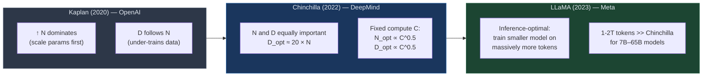

# 📈 Scaling Laws for LLMs

> [!abstract] TL;DR
> Scaling laws are empirical power-law relationships between model performance (loss) and three resources: parameters N, dataset size D, and compute C≈6ND. Kaplan et al. (2020) established the first laws; Hoffmann et al. (2022, Chinchilla) corrected them, showing optimal training requires D≈20N tokens per parameter. LLaMA deliberately over-trains small models for inference efficiency, breaking from Chinchilla's compute-optimal prescription.

## Intuition — analogy FIRST
Think of baking bread. You can improve the loaf by using more flour (parameters N), a better recipe developed from more batches (data D), or a hotter oven for longer (compute C). Kaplan said "mostly use more flour." Chinchilla said "flour and recipe improvements are equally important — you were under-baking your recipe." LLaMA said "I want cheap bread at serving time, so I'll bake slowly with a modest amount of flour but a massive recipe library."

## How It Works



## Key Concepts / Details

### Kaplan Scaling Laws (OpenAI, 2020)
Power-law fits across 7 orders of magnitude of compute:

| Resource | Formula | Exponent |
|----------|---------|----------|
| Parameters N | L ∝ N^{−0.076} | −0.076 |
| Dataset tokens D | L ∝ D^{−0.095} | −0.095 |
| Compute C | L ∝ C^{−0.050} | −0.050 |

Key approximation: **C ≈ 6ND** (forward + backward passes, each token, each parameter).

Kaplan's prescription: given fixed compute, scale N aggressively and hold D relatively constant. This led to GPT-3 (175B params, 300B tokens) — in hindsight, severely undertrained per token.

### Chinchilla Scaling Laws (Hoffmann et al., 2022 — DeepMind)
Ran ~400 training runs with varied N and D at fixed C. Key finding: **N and D should scale equally**.

Optimal allocation formulas:
```
N_opt = k₁ · C^0.5
D_opt = k₂ · C^0.5
```
Empirical result: **D_opt ≈ 20 × N** (20 tokens per parameter).

| Model | Params | Tokens | Verdict |
|-------|--------|--------|---------|
| Gopher (DeepMind) | 280B | 300B | Massively undertrained |
| Chinchilla (DeepMind) | 70B | 1.4T | Compute-optimal |
| GPT-3 (OpenAI) | 175B | 300B | Undertrained |
| LLaMA-2 (Meta) | 70B | 2T | Over-trained (inference-optimal) |

Chinchilla 70B outperforms Gopher 280B despite 4× fewer parameters — purely from training it longer.

### Inference-Optimal vs Compute-Optimal
Chinchilla optimizes for **training cost** (minimize total FLOPs to reach a target loss). But in practice, a trained model is queried billions of times. The real objective is:

> Minimize total cost = training cost + N × inference_queries × inference_cost_per_param

LLaMA's insight: train a smaller model on far more tokens (over Chinchilla optimal). The model reaches the same loss as a larger compute-optimal model but is cheaper to serve. LLaMA-1 7B was trained on 1T tokens (Chinchilla optimal for 7B ≈ 140B tokens).

### Data Quality vs Quantity
Scaling laws assume IID data. In practice:
- **Deduplication** dramatically improves effective data quality — duplicate data yields diminishing returns
- **Multi-epoch penalty**: repeating data after exhausting unique tokens hurts more than scaling predicts
- **Data quality filtering** (perplexity, heuristics) can shift the effective scaling curve upward

```python
import numpy as np
import matplotlib.pyplot as plt

# Chinchilla scaling: L(N, D) = E + A/N^α + B/D^β
# Approximate values from Hoffmann et al. 2022
E = 1.69   # irreducible loss (entropy of natural language)
A = 406.4
B = 410.7
alpha = 0.34
beta = 0.28

N_vals = np.logspace(8, 12, 200)   # 100M to 1T parameters
C_fixed = 1e23                      # fixed compute budget (FLOPs)

# Compute-optimal: N_opt = C^0.5 / sqrt(6 * 20)  (approx)
# For each N, D = C / (6 * N)
D_vals = C_fixed / (6 * N_vals)
L_vals = E + A / N_vals**alpha + B / D_vals**beta

plt.figure(figsize=(8, 5))
plt.semilogx(N_vals, L_vals, color='steelblue', lw=2)
plt.xlabel("Model Parameters N")
plt.ylabel("Loss L")
plt.title(f"Chinchilla Loss vs N at Fixed Compute C = {C_fixed:.0e} FLOPs")
plt.axvline(N_vals[np.argmin(L_vals)], color='tomato', ls='--',
            label=f"Optimal N ≈ {N_vals[np.argmin(L_vals)]:.2e}")
plt.legend()
plt.tight_layout()
plt.savefig("chinchilla_scaling.png", dpi=150)
```

## Real-World Notes
- GPT-4 training compute is estimated at ~10²⁵ FLOPs; Chinchilla optimal N at that budget ≈ 100-300B params
- LLaMA-3 8B was trained on 15T tokens — over 100× Chinchilla optimal for that size
- Scaling laws hold across modalities (vision, code, multimodal) with different constants
- "Emergent abilities" complicate scaling: some capabilities don't follow smooth power laws

## Common Pitfalls
- Confusing **compute-optimal** (minimize FLOPs to loss) with **inference-optimal** (minimize serving cost)
- Assuming Chinchilla ratios apply at all scales — empirical constants shift at very large compute
- Ignoring data quality: scaling laws assume high-quality, deduplicated data
- Treating scaling exponents as universal — they vary by domain and architecture

## Related Concepts
- [[Pretraining_LLMs]] — how scaling law insights shape data pipelines and training runs
- [[Emergent_Capabilities]] — what happens to capabilities as you move up the scaling curve
- [[../06_Efficient_LLMs/Quantization]] — reducing inference cost of large models

## Review Questions
1. What is the compute-optimal D/N ratio per Chinchilla, and why did Kaplan get it wrong?
2. If you have a fixed compute budget of C = 10²³ FLOPs, what is the Chinchilla-optimal N and D?
3. Why does LLaMA deliberately violate Chinchilla optimal, and what cost does it trade off?
4. What is the multi-epoch training penalty and why does it matter for data-scarce domains?
5. Define "inference-optimal" training and explain when it is preferable to compute-optimal.

## Sources
- Kaplan, J., et al. (2020). *Scaling Laws for Neural Language Models*. arXiv:2001.08361.
- Hoffmann, J., et al. (2022). *Training Compute-Optimal Large Language Models* (Chinchilla). arXiv:2203.15556.
- Touvron, H., et al. (2023). *LLaMA: Open and Efficient Foundation Language Models*. arXiv:2302.13971.
- Muennighoff, N., et al. (2023). *Scaling Data-Constrained Language Models*. arXiv:2305.16264.

#nlp #large-language-models #scaling-laws #chinchilla #intermediate
