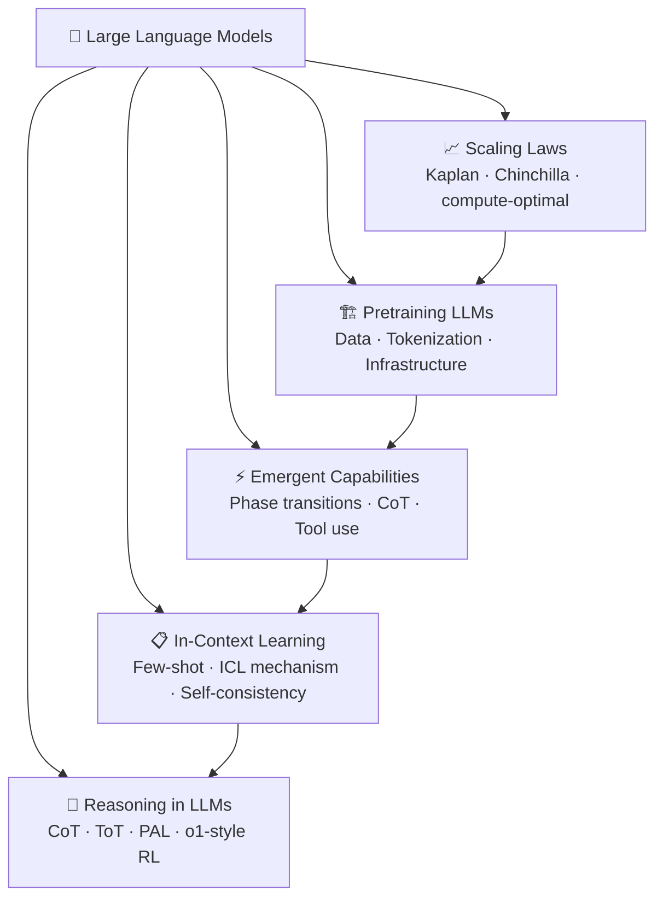

# 🗺️ Large Language Models — Section MOC

> [!abstract] TL;DR
> Large Language Models are pretrained Transformer decoders at scale (billions to trillions of parameters). Scaling laws govern how performance improves with compute, data, and parameters. Emergent capabilities appear discontinuously at scale. In-context learning enables few-shot task performance without gradient updates. Chain-of-thought prompting unlocks multi-step reasoning. This section covers scaling laws, pretraining recipes, emergent capabilities, reasoning, and the major LLM families.

## Section Map

## Notes in This Section

| File | Topic | Difficulty |
|------|-------|------------|
| [[Scaling_Laws]] | Kaplan vs Chinchilla scaling laws, compute-optimal training, inference-optimal models | Intermediate |
| [[Pretraining_LLMs]] | Data curation, tokenization, distributed training, open-source model families | Intermediate |
| [[Emergent_Capabilities]] | Phase transitions, CoT, tool use, LLM as agent | Advanced |
| [[In_Context_Learning]] | ICL mechanism, few-shot prompting, self-consistency, example selection | Intermediate |
| [[Reasoning_LLMs]] | Chain-of-thought, Tree of Thoughts, PAL, o1-style RL, benchmarks | Advanced |

## Key Themes

### Scale Changes Everything
LLMs are quantitatively different from smaller language models — not just bigger. Scaling laws reveal predictable power-law improvements across compute, parameters, and data. But scale also unlocks qualitatively new behaviors (emergent capabilities) that cannot be predicted by extrapolation from small models alone.

### Pretraining Is the Foundation
The quality of a pretrained LLM depends critically on data curation, deduplication, tokenization, and training infrastructure. Most downstream capabilities are baked in during pretraining. Post-training (RLHF, instruction tuning) shapes behavior but rarely instills new knowledge.

### In-Context Learning Is a New Paradigm
Before LLMs, adapting a model to a new task required fine-tuning with labeled data. LLMs enable zero-shot and few-shot adaptation purely through the input prompt — no gradient updates. This fundamentally changed how practitioners interact with models.

### Reasoning Requires Deliberate Prompting
Raw LLMs are poor at multi-step reasoning. Chain-of-thought prompting, Tree of Thoughts, program-aided reasoning, and RL-trained reasoning models (o1, DeepSeek-R1) dramatically close the gap — but the right strategy depends on task type and available compute.

## Prerequisites
- [[../02_Transformers_and_Attention/_MOC_Transformers]] — Transformer architecture
- [[../03_Pretraining_and_Transfer_Learning/_MOC_Pretraining]] — Pretraining paradigm

## What Comes Next
- [[../05_Alignment_and_RLHF/_MOC_Alignment]] — RLHF, instruction tuning, safety
- [[../06_Efficient_LLMs/_MOC_Efficient_LLMs]] — Quantization, distillation, MoE

## Sources
- Kaplan et al. (2020). *Scaling Laws for Neural Language Models*. OpenAI.
- Hoffmann et al. (2022). *Training Compute-Optimal Large Language Models*. DeepMind.
- Wei et al. (2022). *Emergent Abilities of Large Language Models*. Google Brain.
- Brown et al. (2020). *Language Models are Few-Shot Learners* (GPT-3). OpenAI.
- Touvron et al. (2023). *LLaMA: Open and Efficient Foundation Language Models*. Meta.

#MOC #nlp #large-language-models
