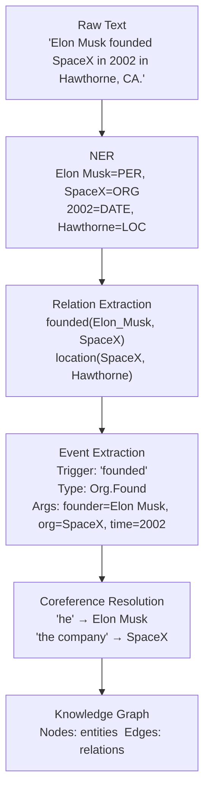

# 🔍 Information Extraction

> [!abstract] TL;DR
> Information Extraction (IE) converts unstructured text into structured representations: entities, relations, events, and coreference clusters. The full IE pipeline feeds knowledge graphs, search engines, and decision systems. Modern approaches range from supervised BERT classifiers (TACRED, ACE 2005) to LLM zero-shot JSON extraction. The five core IE sub-tasks are NER, Relation Extraction, Event Extraction, Coreference Resolution, and Open IE.

---

## Intuition — analogy FIRST

Imagine a police detective reading a crime report and filling out a structured form: **Who** (entities), **did what** (events/relations), **to whom** (more entities), **where and when** (arguments). IE automates this form-filling — reading raw text and outputting rows in a database. The "form" can be a predefined schema (closed IE) or discovered on the fly (Open IE).

---

## How It Works



---

## Key Concepts / Details

### 1. Relation Extraction (RE)

**Task**: given a pair of entities in a sentence, classify the relation type (or "no relation").

- **TACRED** — 41 relation types (e.g., `per:employee_of`, `org:founded_by`); ~68k examples.
- **DocRED** — document-level RE; entity pairs may be mentioned in different sentences.
- **R-BERT** — marks entity spans with special tokens `[E1]...[/E1]` and `[E2]...[/E2]` in the input; uses `[CLS]` + entity start tokens as features for relation classification.
- **ATLOP (ICLR 2021)** — document-level RE; adaptive thresholding (per-entity threshold) + localized context pooling for cross-sentence reasoning.
- **Few-shot RE**: MAVEN-FEW, TACREV; prototypical networks + contrastive learning.

```
Input:  "[E1]Elon Musk[/E1] founded [E2]SpaceX[/E2] in 2002."
Output: per:organizations_founded
```

### 2. Event Extraction (EE)

**Task**: identify event triggers (words that evoke an event) and extract event arguments (who, what, where, when).

- **ACE 2005 Ontology** — 8 coarse types, 33 fine-grained event types (e.g., `Conflict.Attack`, `Movement.Transport`, `Life.Die`).
- **Event trigger detection** — which token/span triggers the event (classification over candidate spans).
- **Argument extraction** — for each role in the event (Agent, Patient, Place, Time), find the span filling that role.
- **OneIE (ACE 2005 SOTA)** — joint end-to-end extraction with global features for consistency.
- **DEGREE / GenIE** — generative approaches; T5 generates structured event descriptions.

### 3. Coreference Resolution

**Task**: cluster all mentions in a document that refer to the same real-world entity.

```
"[Elon Musk]₁ founded SpaceX in 2002. [He]₁ later became CEO. [The company]₂ went on to..."
```

- **e2e-coref (Lee et al., 2017)** — end-to-end span scoring + clustering with antecedent scoring.
- **SpanBERT-Coref** — uses SpanBERT span representations; strong on OntoNotes benchmark.
- Critical for downstream IE: without coref, the relation "he works at SpaceX" loses the entity identity.
- Evaluated with **MUC, B³, CEAFₑ metrics** (averaged as CoNLL F1).

### 4. Open Information Extraction (OpenIE)

**Task**: extract (subject, relation, object) triples without a predefined ontology.

```
Text:   "Marie Curie discovered polonium in 1898."
Triple: (Marie Curie, discovered, polonium)
Triple: (Marie Curie, discovered in, 1898)
```

- **AllenNLP OpenIE** (based on LSTM-CRF) — fast, practical.
- **Stanford OpenIE** — dependency-parse-based extraction.
- **ReVerb, OLLIE** — classical OpenIE systems.
- Produces noisy but broad coverage; useful for knowledge graph seeding.

### 5. LLM-Based IE

Modern LLMs enable zero-shot and few-shot structured extraction with remarkable flexibility:

```python
# Zero-shot extraction with JSON schema enforcement
prompt = """Extract named entities and relations from the text below.
Return JSON: {"entities": [{"text": ..., "type": ...}], "relations": [{"subject": ..., "predicate": ..., "object": ...}]}
Text: "{text}" """
```

- **Instructor / Outlines / Pydantic AI** — enforce structured JSON output via constrained decoding.
- **GPT-4 zero-shot** — competitive with fine-tuned models on TACRED, especially for rare relation types.
- **RLHF for IE** — reinforcement learning rewards for schema adherence and factual coverage.

### 6. Document-Level IE Challenges
- Entity pairs may be mentioned sentences apart → need long-context modeling.
- Relations may be implicit (not stated directly).
- Complex event chains (cause–effect sequences) require discourse understanding.
- ATLOP and GAIN address cross-sentence evidence aggregation.

---

## Real-World Notes

- **Schema design is 80% of the work** in production IE systems — poorly defined relation types lead to annotation disagreement and model confusion.
- **Nested entities** (common in biomedical text) require span-based models, not BIO tagging.
- **Pipeline vs. joint models** — pipeline (NER → RE) is easier to debug and swap components; joint models have higher ceiling but are harder to train and diagnose.
- **LLM for low-resource domains** — for domains with few labeled examples, GPT-4 zero-shot can bootstrap training data via annotation-then-verify.
- **Evaluation** — always use entity-level F1 for NER and relation-level F1 for RE; never token accuracy.

---

## Code Demo

```python
# ── spaCy Named Entity Recognition + Relation Extraction pipeline ─────────
import spacy

nlp = spacy.load("en_core_web_trf")
doc = nlp("Elon Musk founded SpaceX in Hawthorne, California in 2002.")
print("Entities:")
for ent in doc.ents:
    print(f"  {ent.text:20s} {ent.label_}")

# ── HuggingFace Relation Extraction (BERT-based) ──────────────────────────
from transformers import pipeline

re_pipeline = pipeline("text-classification",
                        model="Jean-Baptiste/roberta-large-ner-english")
# (For a true RE model, use a TACRED-fine-tuned checkpoint)

# ── LLM-Based Structured Extraction with Instructor ───────────────────────
import instructor
from openai import OpenAI
from pydantic import BaseModel
from typing import List

class Entity(BaseModel):
    text: str
    entity_type: str

class Relation(BaseModel):
    subject: str
    predicate: str
    object: str

class ExtractionResult(BaseModel):
    entities: List[Entity]
    relations: List[Relation]

client = instructor.from_openai(OpenAI())

text = "Tim Cook became CEO of Apple in 2011, succeeding Steve Jobs."
result = client.chat.completions.create(
    model="gpt-4o",
    response_model=ExtractionResult,
    messages=[{"role": "user",
               "content": f"Extract entities and relations from: '{text}'"}]
)
for ent in result.entities:
    print(f"  Entity: {ent.text} ({ent.entity_type})")
for rel in result.relations:
    print(f"  Relation: ({rel.subject}, {rel.predicate}, {rel.object})")

# ── AllenNLP OpenIE ───────────────────────────────────────────────────────
from allennlp.predictors.predictor import Predictor
predictor = Predictor.from_path(
    "https://storage.googleapis.com/allennlp-public-models/openie-model.2020.03.26.tar.gz")
output = predictor.predict(sentence="Marie Curie discovered polonium in 1898.")
for extraction in output["verbs"]:
    print(extraction["description"])
```

---

## IE Approach Comparison

| Approach | Schema | Flexibility | Precision | Recall | Notes |
|---|---|---|---|---|---|
| Closed IE (R-BERT, ATLOP) | Predefined | Low | High | High | Best for known relation types |
| OpenIE (AllenNLP, Stanford) | None (free) | Very High | Medium | Medium | Noisy; good for KG seeding |
| LLM zero-shot (GPT-4) | Prompt-defined | High | Medium-High | Medium | No training; adapts to schema |
| LLM + Instructor (structured) | Pydantic model | High | High | Medium-High | Guaranteed JSON output |

---

## Common Pitfalls

- **Conflating NER and RE** — NER finds entity spans; RE classifies the relation between them; they are separate models even when jointly trained.
- **Symmetric vs. asymmetric relations** — "works at(A, B)" is not the same as "works at(B, A)"; model must not assume symmetry unless the schema requires it.
- **Treating OpenIE output as clean data** — OpenIE triples are noisy; always apply confidence filtering and canonicalization before adding to a KG.
- **Ignoring coreference in document-level IE** — without resolving "he" → "Elon Musk", relations across sentences are missed or wrong.
- **Binary RE on cross-sentence pairs** — sentence-level models miss document-level evidence; use ATLOP or similar for doc-level RE.
- **Schema leakage in LLM prompts** — including too many example relations in the prompt causes the model to force-fit those types onto unrelated text.

---

## Related Concepts

- [[Named_Entity_Recognition]] — first stage in the IE pipeline; provides entity spans
- [[Question_Answering]] — IE outputs (KG) power KB-QA systems
- [[Summarization_Translation]] — IE-extracted facts can seed structured summaries
- [[../03_Language_Models/BERT_and_Variants]] — backbone for TACRED models, SpanBERT-Coref

---

## Review Questions

1. What is the difference between closed IE and Open IE? When would you choose each?
2. Describe the R-BERT architecture for relation extraction — what are the special tokens and what features does it use?
3. Why is coreference resolution important for document-level IE, and what metrics are used to evaluate it?
4. How does ATLOP handle document-level relation extraction differently from sentence-level approaches?
5. Explain how Instructor / Outlines guarantees structured JSON output from an LLM.
6. What are the main failure modes of OpenIE, and how would you filter the output before storing it in a knowledge graph?

---

## Sources

- Lample et al. (2016). *Neural Architectures for Named Entity Recognition*. NAACL.
- Lee et al. (2017). *End-to-end Neural Coreference Resolution*. EMNLP.
- Wu et al. (2019). *Enriching Pre-trained Language Model with Entity Information for RE (R-BERT)*. AAAI.
- Zhou et al. (2021). *Document-Level Relation Extraction with ATLOP*. AAAI.
- Lin et al. (2020). *OneIE: A Joint Neural Model for Information Extraction with Global Features*. ACL.
- Fader et al. (2011). *Identifying Relations for Open Information Extraction (ReVerb)*. EMNLP.

---

#nlp #nlp-tasks #advanced
