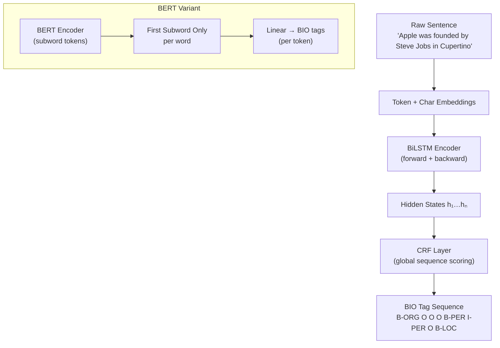

# 🏷️ Named Entity Recognition

> [!abstract] TL;DR
> NER labels each token in a sentence with an entity type (PER, ORG, LOC, DATE, MISC) or **O** (outside). It is the foundational token-level classification task in NLP. Classical CRFs model global sequence structure; BiLSTM-CRF (Lample 2016) became the neural standard; BERT per-token classification now dominates; span-based and generative approaches handle nested entities.

---

## Intuition — analogy FIRST

Imagine reading a newspaper article and highlighting every name (yellow), every organization (blue), and every location (green). NER automates exactly that annotation — token by token. Unlike document classification (one label per text), NER must make a local decision for each word while respecting the global sequence constraint that a person entity cannot start mid-word and end on a different line.

---

## How It Works



---

## Key Concepts / Details

### BIO Tagging Scheme
| Tag | Meaning | Example |
|---|---|---|
| `B-PER` | Beginning of a Person entity | "**Steve**" in "Steve Jobs" |
| `I-PER` | Inside a Person entity | "**Jobs**" in "Steve Jobs" |
| `B-ORG` | Beginning of an Organization | "**Apple**" |
| `O` | Outside any entity | "was", "founded", "by" |

**BIOES** extends this: **E** (End) and **S** (Single-token entity) allow the CRF to model entity boundaries more precisely.

### Classical CRF
- Features: word shape, prefix/suffix, POS tag, capitalization, neighboring words.
- **CRF** scores entire tag sequences (not just per-token): `P(y|x) ∝ exp(Σ score(yᵢ, yᵢ₋₁, xᵢ))`.
- Decodes with the **Viterbi algorithm** (dynamic programming over tag lattice).
- Captures constraints: `I-PER` cannot follow `B-ORG`.

### BiLSTM-CRF (Lample et al., 2016)
1. **Character-level LSTM** embeds each word from its characters → handles OOV and morphology.
2. **Bidirectional LSTM** encodes context from both directions.
3. **CRF decoder** on top of BiLSTM hidden states — adds global sequence modeling.
- Still competitive on CoNLL-2003 (~90 F1).

### BERT for NER
- Tokenize with WordPiece → subword tokens.
- BERT produces one hidden vector per subword.
- **Use only the first subword** of each original word for classification (others ignored or averaged).
- Add a linear layer `W ∈ ℝ^{num_tags × 768}` per token.
- Fine-tune end-to-end. Achieves ~92–93 F1 on CoNLL-2003.

### Span-Based NER
- Instead of per-token tagging, enumerate candidate spans `(i, j)` and classify each as an entity type or "none".
- Handles **nested entities** (e.g., "[New [York] City]" where both "York" and "New York City" are entities).
- Models: SpERT, DYGIE++.

### Generative NER
- Prompt an LLM: `"Extract all named entities from: '{text}'. Format: entity: type"`.
- GPT-4 achieves competitive zero-shot F1 on standard benchmarks.
- **Instructor / Outlines** for structured output guarantees.

### Downstream Tasks
- **Relation Extraction** — given entity pairs, classify the relationship (PER → ORG "works at").
- **Event Extraction** — entities as arguments of events.
- **Joint Entity + Relation Extraction** — DYGIE++ solves both simultaneously.
- **Coreference** — link entity mentions across a document.

---

## Real-World Notes

- Domain shift is severe: a model trained on news NER (CoNLL-2003) drops ~10–15 F1 on biomedical or Twitter text.
- For **clinical NER** (medications, dosages, conditions), use domain-pretrained models: BioBERT, ClinicalBERT.
- Twitter NER (WNUT-17) requires handling hashtags, @-mentions, and non-standard spelling.
- **Entity-level F1** is the standard metric — a partial span match counts as zero; only exact boundary + type matches count.
- Label imbalance: `O` tokens dominate (~80–90%); focus evaluation on entity-level, not token accuracy.

---

## Code Demo

```python
# ── HuggingFace token-classification (NER) ────────────────────────────────
from transformers import pipeline, AutoTokenizer, AutoModelForTokenClassification
from transformers import TrainingArguments, Trainer, DataCollatorForTokenClassification
from datasets import load_dataset
import numpy as np
import evaluate

# 1) Off-the-shelf NER pipeline
ner = pipeline("ner", model="dbmdz/bert-large-cased-finetuned-conll03-english",
               aggregation_strategy="simple")
text = "Apple was founded by Steve Jobs in Cupertino in 1976."
entities = ner(text)
for ent in entities:
    print(f"{ent['word']:20s} → {ent['entity_group']}  (score={ent['score']:.2f})")

# 2) Fine-tuning on CoNLL-2003
dataset = load_dataset("conll2003")
label_list = dataset["train"].features["ner_tags"].feature.names

tokenizer = AutoTokenizer.from_pretrained("bert-base-cased")

def tokenize_and_align(batch):
    tok = tokenizer(batch["tokens"], truncation=True, is_split_into_words=True)
    labels = []
    for i, label in enumerate(batch["ner_tags"]):
        word_ids = tok.word_ids(batch_index=i)
        aligned = []
        prev = None
        for wid in word_ids:
            if wid is None:
                aligned.append(-100)           # special tokens → ignore
            elif wid != prev:
                aligned.append(label[wid])     # first subword → keep label
            else:
                aligned.append(-100)           # subsequent subwords → ignore
            prev = wid
        labels.append(aligned)
    tok["labels"] = labels
    return tok

tokenized = dataset.map(tokenize_and_align, batched=True)
model = AutoModelForTokenClassification.from_pretrained(
    "bert-base-cased", num_labels=len(label_list))

seqeval = evaluate.load("seqeval")

def compute_metrics(p):
    preds, labels = p
    preds = np.argmax(preds, axis=2)
    true_labels = [[label_list[l] for l in label if l != -100]
                   for label in labels]
    true_preds  = [[label_list[p] for p, l in zip(pred, label) if l != -100]
                   for pred, label in zip(preds, labels)]
    results = seqeval.compute(predictions=true_preds, references=true_labels)
    return {"f1": results["overall_f1"], "precision": results["overall_precision"]}

collator = DataCollatorForTokenClassification(tokenizer)
args = TrainingArguments("./ner_bert", num_train_epochs=3,
                         per_device_train_batch_size=16, evaluation_strategy="epoch")
trainer = Trainer(model=model, args=args, train_dataset=tokenized["train"],
                  eval_dataset=tokenized["validation"],
                  data_collator=collator, compute_metrics=compute_metrics)
trainer.train()
```

---

## Benchmark Comparison (CoNLL-2003 English NER — entity F1)

| Model | F1 | Notes |
|---|---|---|
| CRF + hand features | ~88.0 | Classical; fast; interpretable |
| BiLSTM-CRF (Lample 2016) | ~90.9 | Neural; char-level; no pretraining |
| ELMo + BiLSTM-CRF | ~92.2 | Contextual embeddings |
| BERT-base fine-tuned | ~92.4 | Subword tokenization; first subword only |
| BERT-large fine-tuned | ~93.0 | Near human performance |
| SpERT (span-based) | ~93.9 | Handles nested; more complex |

---

## Common Pitfalls

- **Using all subwords for classification** — must use only the first subword of each original word to match the word-level labels.
- **Evaluating at token level** — use **entity-level F1** (seqeval library); token-level accuracy is inflated by `O` tags.
- **Forgetting BIO constraints** — `I-PER` cannot follow `B-ORG`; CRF handles this, but linear softmax does not.
- **Ignoring domain shift** — always test on in-domain data before deploying a news-trained model to new text.
- **Nested entities ignored** — standard BIO cannot represent nested entities; use span-based models for biomedical text.

---

## Related Concepts

- [[Information_Extraction]] — NER is the first stage in the full IE pipeline
- [[Text_Classification]] — same BERT backbone, different head (per-token vs per-document)
- [[Question_Answering]] — span extraction is structurally similar to NER
- [[../03_Language_Models/BERT_and_Variants]] — first subword alignment is a BERT-specific implementation detail

---

## Review Questions

1. Why is entity-level F1 (not token-level accuracy) the standard NER metric?
2. Explain why `I-PER` cannot legally follow `B-ORG` in BIO tagging, and how CRF enforces this.
3. What problem does character-level encoding solve in BiLSTM-CRF?
4. When fine-tuning BERT for NER, why do we use only the first subword of each word?
5. How does span-based NER differ from BIO sequence labeling, and when is it preferable?
6. You observe an F1 drop from 92% on CoNLL-2003 to 74% on clinical notes. What strategies would you try?

---

## Sources

- Lample et al. (2016). *Neural Architectures for Named Entity Recognition*. NAACL.
- Devlin et al. (2019). *BERT: Pre-training of Deep Bidirectional Transformers*. NAACL.
- Straková et al. (2019). *Neural Architectures for Nested NER through Linearization*. ACL.
- Sang & De Meulder (2003). *Introduction to the CoNLL-2003 Shared Task*. CoNLL.
- HuggingFace Docs — Token Classification: https://huggingface.co/docs/transformers/tasks/token_classification

---

#nlp #nlp-tasks #intermediate
