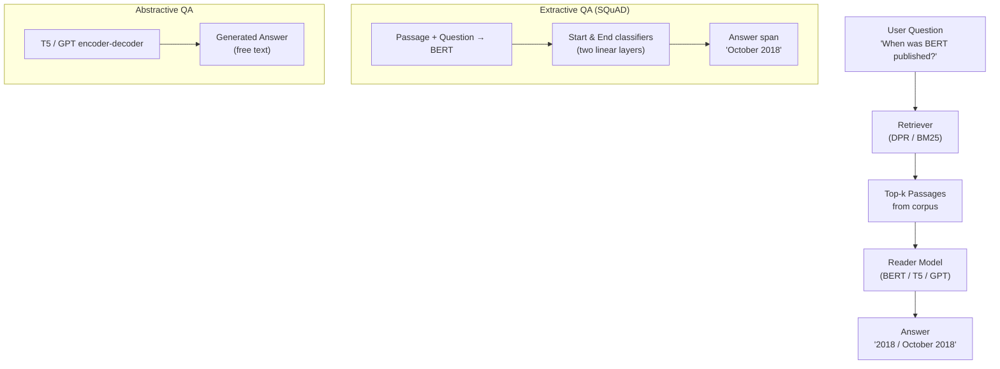

# ❓ Question Answering

> [!abstract] TL;DR
> QA systems find or generate answers to natural-language questions. The three main paradigms are: **extractive QA** (find a span in a given passage; SQuAD + BERT), **abstractive QA** (generate a free-text answer; T5/GPT), and **open-domain QA** (retrieve relevant passages first, then read; DPR + RAG). Evaluation uses Exact Match and token F1 for extractive; ROUGE/human eval for abstractive.

---

## Intuition — analogy FIRST

Think of three students given an exam question:
1. **Extractive student** — only highlights a sentence from the textbook and copies it verbatim.
2. **Abstractive student** — reads multiple sources and writes their own answer in fresh words.
3. **Open-domain student** — first goes to the library to find the right book, then reads and answers.

Modern QA systems mirror these three strategies, and RAG (Retrieval-Augmented Generation) combines retrieval and generation.

---

## How It Works



---

## Key Concepts / Details

### Task Variants

| Variant | Input | Output | Example Dataset |
|---|---|---|---|
| Extractive QA | passage + question | (start, end) span | SQuAD 1.1 / 2.0 |
| Abstractive QA | question (+ context) | generated text | CoQA, NarrativeQA |
| Open-domain QA | question only | answer (retrieval + read) | NaturalQuestions, TriviaQA |
| Multiple-choice QA | question + options | chosen option | RACE, HellaSwag |
| KB-QA / KGQA | question | SPARQL / KB entity | WebQuestions, SimpleQuestions |

### Extractive QA — BERT Head
Given encoded tokens `h₁, …, hₙ` from BERT:
- `P(start=i) = softmax(Wₛ · hᵢ)`
- `P(end=j) = softmax(Wₑ · hⱼ)`, constrained to `j ≥ i`
- Answer span = `text[argmax start : argmax end + 1]`

**SQuAD 2.0** adds unanswerable questions — model must also predict "no answer" when the passage does not contain the answer (threshold on `P(start=0) × P(end=0)`).

### Evaluation Metrics
- **Exact Match (EM)** — 1 if prediction equals any gold answer exactly (after normalization).
- **Token F1** — token-level precision × recall between prediction and gold; partial credit for overlapping words.
- Human EM on SQuAD 1.1 ≈ 82%; BERT-large achieves ~91 F1.

### Open-Domain QA Pipeline

**DrQA (Chen et al., 2017)**  
1. TF-IDF retrieval over Wikipedia → top-k documents  
2. BERT reader extracts answer span from retrieved passages

**DPR (Dense Passage Retrieval)**  
1. Dual-encoder: question encoder + passage encoder (both BERT-based)  
2. Train with in-batch negatives: correct passage gets high dot-product similarity  
3. Index all passages with FAISS for approximate nearest-neighbor lookup  
4. Outperforms TF-IDF on NaturalQuestions by ~10 EM points

**RAG (Retrieval-Augmented Generation)**  
- Combines DPR retrieval with a seq2seq generator (BART/T5)  
- Generator conditions on top-k retrieved passages  
- Marginalizes over passages during training  
- Current production-standard for open-domain QA

### Multi-Hop QA
- **HotpotQA**: answer requires reasoning over ≥ 2 documents  
- Models must identify "supporting facts" across documents  
- Graph-based reasoning (entity graph, path ranking)

### Commonsense QA
- **HellaSwag**, **PIQA**, **ARC**: multiple-choice; correct option requires world knowledge not in the passage  
- Evaluated via LLM few-shot or zero-shot prompting

---

## Real-World Notes

- **Context window matters**: BERT handles 512 tokens; long documents need sliding-window chunking or longformer models.
- **Hallucination risk in abstractive QA**: LLMs may generate plausible but wrong answers; always include citations or source grounding.
- **Unanswerable questions**: SQuAD 2.0 shows models are over-confident; always include a "no answer" threshold in production.
- **Latency trade-off**: extractive QA (span prediction) is faster than generative QA; open-domain adds retrieval overhead.
- **DPR vs. BM25**: BM25 (keyword-based) often still competitive on entity-heavy queries; use hybrid retrieval in production.

---

## Code Demo

```python
# ── Extractive QA and Open-Domain QA ─────────────────────────────────────
from transformers import pipeline

# 1) Extractive QA (passage provided)
qa = pipeline("question-answering", model="deepset/roberta-base-squad2")
result = qa(
    question="Who invented the transformer architecture?",
    context="The transformer architecture was introduced by Vaswani et al. in 2017 "
            "at Google Brain in their paper 'Attention Is All You Need'."
)
print(f"Answer: {result['answer']}  (score={result['score']:.3f})")
# → Answer: Vaswani et al.

# 2) Open-Domain QA with RAG-style retrieval (simplified)
from transformers import RagTokenizer, RagRetriever, RagSequenceForGeneration

tokenizer = RagTokenizer.from_pretrained("facebook/rag-sequence-nq")
retriever = RagRetriever.from_pretrained("facebook/rag-sequence-nq",
                                         index_name="compressed", use_dummy_dataset=True)
model = RagSequenceForGeneration.from_pretrained("facebook/rag-sequence-nq",
                                                  retriever=retriever)
inputs = tokenizer("What is the capital of France?", return_tensors="pt")
generated = model.generate(**inputs)
print(tokenizer.batch_decode(generated, skip_special_tokens=True))
# → ['paris']

# 3) Evaluating extractive QA with EM and F1
import re, string
from collections import Counter

def normalize(text):
    text = text.lower()
    text = re.sub(r'\b(a|an|the)\b', ' ', text)
    text = ''.join(ch for ch in text if ch not in string.punctuation)
    return ' '.join(text.split())

def token_f1(pred, gold):
    pc, gc = Counter(normalize(pred).split()), Counter(normalize(gold).split())
    common = sum((pc & gc).values())
    if common == 0: return 0.0
    precision = common / sum(pc.values())
    recall    = common / sum(gc.values())
    return 2 * precision * recall / (precision + recall)

print(token_f1("Vaswani et al. in 2017", "Vaswani et al."))  # → 0.8
```

---

## Model / Approach Comparison

| Approach | Dataset | EM | F1 | Notes |
|---|---|---|---|---|
| TF-IDF + BiDAF | SQuAD 1.1 | 68.0 | 77.3 | Pre-BERT baseline |
| BERT-large | SQuAD 1.1 | 84.1 | 91.0 | Fine-tuned; near human |
| BERT-large | SQuAD 2.0 | 78.7 | 81.9 | Includes unanswerable |
| DPR + BERT reader | NaturalQuestions | 41.5 EM | — | Open-domain |
| RAG (BART) | NaturalQuestions | 44.5 EM | — | Generative; no span |
| GPT-4 (0-shot) | TriviaQA | ~85 EM | — | No retrieval; uses parametric memory |

---

## Common Pitfalls

- **Returning None for unanswerable questions** — without a confidence threshold, models always return a span; add SQuAD 2.0 training or post-hoc calibration.
- **Evaluating with case-sensitive exact match** — always normalize (lowercase, remove articles and punctuation) before EM calculation.
- **Ignoring retrieval quality** — in open-domain QA, if the retriever misses the answer passage, the reader cannot recover; measure Recall@k for the retriever separately.
- **Sliding window without overlap** — important context at chunk boundaries can be missed; use 128-token stride overlap.
- **Multi-hop reasoning with single-hop models** — straightforward span extraction fails when the answer requires chaining two facts.

---

## Related Concepts

- [[Summarization_Translation]] — seq2seq generation shares architecture with abstractive QA
- [[Information_Extraction]] — entity extraction feeds into KB-QA pipelines
- [[Named_Entity_Recognition]] — entities as answer candidates in IE-based QA
- [[../04_Transformers/Encoder_Decoder_Architecture]] — backbone for RAG and abstractive QA

---

## Review Questions

1. What are the two linear layers BERT adds for extractive QA, and what do they predict?
2. How does SQuAD 2.0 differ from SQuAD 1.1, and what architectural change is required?
3. Explain the difference between TF-IDF retrieval and DPR for open-domain QA. What are the trade-offs?
4. Why does Exact Match underestimate true model performance? How does Token F1 address this?
5. What is RAG, and how does it differ from a pure retrieval-based or pure generative approach?
6. What makes multi-hop QA harder than single-passage QA?

---

## Sources

- Rajpurkar et al. (2016). *SQuAD: 100,000+ Questions for Machine Comprehension of Text*. EMNLP.
- Rajpurkar et al. (2018). *Know What You Don't Know: SQuAD 2.0*. ACL.
- Chen et al. (2017). *Reading Wikipedia to Answer Open-Domain Questions (DrQA)*. ACL.
- Karpukhin et al. (2020). *Dense Passage Retrieval for Open-Domain QA*. EMNLP.
- Lewis et al. (2020). *Retrieval-Augmented Generation for Knowledge-Intensive NLP Tasks*. NeurIPS.

---

#nlp #nlp-tasks #intermediate
