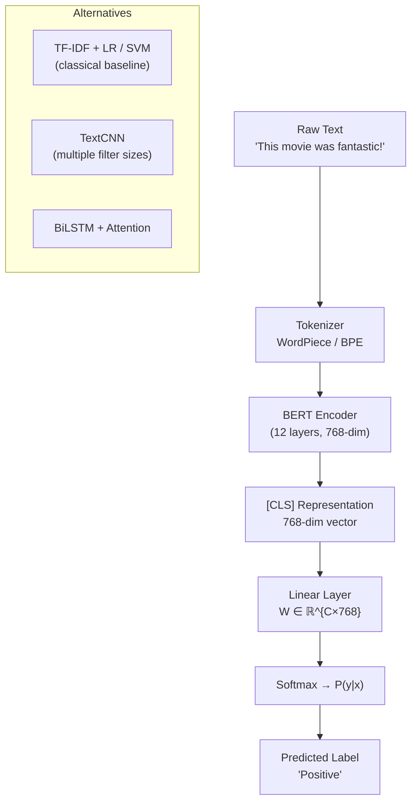

# 📊 Text Classification

> [!abstract] TL;DR
> Text classification assigns a discrete label to an entire document or sentence. It is the "Hello World" of NLP — sentiment analysis, spam detection, topic labeling, and intent classification all reduce to the same formulation: **f(text) → y ∈ {0, …, C−1}**. TF-IDF + logistic regression is still a competitive baseline; BERT fine-tuning is the modern standard; LLM prompting handles zero/few-shot scenarios.

---

## Intuition — analogy FIRST

Think of a librarian who must shelve every book in exactly one section (Mystery, Science, History…). They skim the cover, title, and a few pages, then make a decision. Text classification is the same: the model reads the whole text once, builds a single compressed representation (the `[CLS]` token in BERT), and maps it to a category. The "shelf" is the label space.

---

## How It Works



**Training objective**: cross-entropy loss  
`L = -Σ yᵢ log(p̂ᵢ)` over C classes.

For **multi-label** classification (a document can have multiple labels): replace softmax with sigmoid per class and use binary cross-entropy (BCE).

---

## Key Concepts / Details

### Classical Approach
- **TF-IDF + Logistic Regression / SVM** — sparse bag-of-words features; surprisingly strong on topic classification and short texts; fast to train and inspect.

### TextCNN (Kim 2014)
- Convolutional filters of sizes [2, 3, 4] slide over the embedding matrix.
- Max-over-time pooling extracts the most prominent feature per filter.
- Concatenated → dropout → softmax. Fast inference, ~92% SST-2.

### BERT Fine-tuning
1. Prepend `[CLS]` token; encode full text.
2. Take the `[CLS]` representation from the last hidden layer.
3. Add a linear classifier `W ∈ ℝ^{C×768}`.
4. Fine-tune all parameters with cross-entropy; 2–4 epochs, lr ≈ 2e-5.

### Important Task Variants
| Variant | Description | Example Dataset |
|---|---|---|
| Binary sentiment | positive / negative | SST-2, IMDB |
| Multi-class topic | C ≥ 3 categories | AGNews (4 topics) |
| Natural Language Inference (NLI) | entailment / neutral / contradiction | MultiNLI, SNLI |
| Stance detection | support / deny / query | RumourEval |
| Intent classification | user intent in chatbot | ATIS, CLINC150 |
| Multi-label | multiple labels per doc | Reuters-21578 |

### Evaluation Metrics
- **Accuracy** — fraction correct; misleading on imbalanced data.
- **Macro F1** — unweighted average F1 across classes; treats all classes equally.
- **Weighted F1** — average weighted by class support.
- **MCC (Matthews Correlation Coefficient)** — reliable single metric for binary imbalanced; ranges [−1, +1].

### Zero-Shot & Few-Shot
- **Zero-shot with LLMs**: `Classify this review as Positive or Negative: "{text}"`.
- **Few-shot ICL**: provide 1–5 labeled examples in the prompt before the query.
- **Zero-shot NLI pipeline**: model each label as a hypothesis; classify as entailment vs. not.

---

## Real-World Notes

- For short texts (tweets, reviews ≤ 128 tokens), TextCNN is often 95%+ of BERT performance at 10× speed.
- Domain shift is the biggest practical challenge — a model trained on movie reviews degrades on medical notes.
- Label noise matters more than model choice; clean labels with a small dataset beat noisy labels with a large one.
- Consider **confidence calibration** (temperature scaling) before deploying; raw softmax probabilities are over-confident.

---

## Code Demo

```python
# ── HuggingFace zero-shot & fine-tuning demo ──────────────────────────────
from transformers import pipeline, AutoTokenizer, AutoModelForSequenceClassification
import torch

# 1) Zero-shot classification (no fine-tuning needed)
clf = pipeline("zero-shot-classification", model="facebook/bart-large-mnli")
result = clf(
    "I really enjoyed the film — brilliant acting.",
    candidate_labels=["positive", "negative", "neutral"]
)
print(result["labels"][0])  # → "positive"

# 2) Fine-tuning with Trainer (SST-2 binary sentiment)
from datasets import load_dataset
from transformers import TrainingArguments, Trainer
import evaluate

dataset = load_dataset("glue", "sst2")
tokenizer = AutoTokenizer.from_pretrained("bert-base-uncased")

def tokenize(batch):
    return tokenizer(batch["sentence"], truncation=True, padding="max_length", max_length=128)

tokenized = dataset.map(tokenize, batched=True)
model = AutoModelForSequenceClassification.from_pretrained("bert-base-uncased", num_labels=2)

metric = evaluate.load("glue", "sst2")
def compute_metrics(eval_pred):
    logits, labels = eval_pred
    preds = logits.argmax(-1)
    return metric.compute(predictions=preds, references=labels)

args = TrainingArguments(output_dir="./sst2_bert", num_train_epochs=3,
                         per_device_train_batch_size=32, evaluation_strategy="epoch")
trainer = Trainer(model=model, args=args, train_dataset=tokenized["train"],
                  eval_dataset=tokenized["validation"], compute_metrics=compute_metrics)
trainer.train()
```

---

## Benchmark Comparison (SST-2 Binary Sentiment)

| Model | Accuracy | Training Time | Notes |
|---|---|---|---|
| TF-IDF + LR | ~89% | Seconds | Strong baseline, interpretable |
| TextCNN | ~91% | Minutes | Fast, small memory footprint |
| BERT-base fine-tuned | ~93% | ~20 min (GPU) | Standard modern approach |
| RoBERTa-large | ~96% | ~1 hr (GPU) | Near-human performance |
| GPT-4 few-shot (5-shot) | ~95% | Per-call latency | No training; expensive at scale |

---

## Common Pitfalls

- **Leaking labels into features** — e.g., including metadata that encodes the label (author name → known political leaning).
- **Ignoring class imbalance** — optimizing accuracy on 95/5 data is trivial; always report F1 or MCC.
- **Tokenization mismatch** — using a BERT tokenizer for a model trained with a GPT-2 tokenizer.
- **Truncating important context** — for long documents, the beginning may not contain the relevant signal; use sliding window or hierarchical models.
- **Multi-label with softmax** — softmax forces probabilities to sum to 1; use sigmoid + BCE for multi-label.

---

## Related Concepts

- [[Named_Entity_Recognition]] — token-level classification, same BERT backbone different head
- [[Question_Answering]] — NLI (entailment) is used as a classification backbone for many QA tasks
- [[../03_Language_Models/BERT_and_Variants]] — backbone for all modern classifiers
- [[../02_Text_Preprocessing/Tokenization_BPE]] — tokenization affects maximum sequence length

---

## Review Questions

1. Why does `[CLS]` representation work for classification? What does BERT learn to encode in it?
2. When should you choose TextCNN over BERT fine-tuning?
3. What is the difference between macro F1 and weighted F1? When does each matter?
4. Explain how zero-shot NLI classification works without any labeled examples for the target task.
5. Why is MCC preferred over accuracy for binary imbalanced datasets?
6. How does multi-label classification differ architecturally from multi-class classification?

---

## Sources

- Kim, Y. (2014). *Convolutional Neural Networks for Sentence Classification*. EMNLP.
- Devlin et al. (2019). *BERT: Pre-training of Deep Bidirectional Transformers*. NAACL.
- Wang et al. (2018). *GLUE: A Multi-Task Benchmark and Analysis Platform for NLU*. ICLR.
- HuggingFace Docs — Text Classification: https://huggingface.co/docs/transformers/tasks/sequence_classification

---

#nlp #nlp-tasks #beginner
