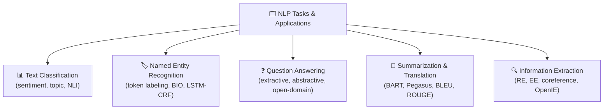

# 🗂️ NLP Tasks & Applications — Section MOC

> [!abstract] TL;DR
> NLP covers a rich set of tasks: classifying documents, labeling individual tokens, answering questions from passages, summarizing long texts, translating between languages, and extracting structured information. This section covers the five core NLP task families, their formulations, evaluation metrics, key architectures, and datasets. Every task here can be approached via fine-tuning a pretrained Transformer or prompting an LLM.

---

## Section Map

---

## Notes in This Section

| File | Topic | Difficulty |
|---|---|---|
| [[Text_Classification]] | Assign a label to a document or sentence; sentiment, topic, NLI, spam | Beginner |
| [[Named_Entity_Recognition]] | Label each token with entity type; BIO scheme, LSTM-CRF, BERT-NER | Intermediate |
| [[Question_Answering]] | Extract or generate answers from passages; SQuAD, DPR, RAG | Intermediate |
| [[Summarization_Translation]] | Abstractive/extractive summarization; neural MT; ROUGE, BLEU, COMET | Intermediate |
| [[Information_Extraction]] | RE, event extraction, coreference, OpenIE, LLM-based IE | Advanced |

---

## Task Taxonomy

### Sequence-Level Tasks (whole input → label or text)
- **Text Classification** — one label per document
- **Summarization** — document → shorter document
- **Machine Translation** — document in language A → document in language B

### Token-Level Tasks (label per token)
- **Named Entity Recognition** — each token gets an entity tag
- **Part-of-Speech Tagging** — each token gets a POS tag
- **Chunking** — token spans grouped into phrases

### Span-Level Tasks (identify spans + attributes)
- **Extractive QA** — find answer span in passage
- **Coreference Resolution** — cluster mention spans
- **Relation Extraction** — classify relation between entity spans

### Generative Tasks (produce free-form output)
- **Abstractive QA** — generate an answer
- **Open-Domain QA** — retrieve + read + generate
- **Open IE** — extract (subject, relation, object) triples

---

## Unified Evaluation Cheat Sheet

| Task | Primary Metric | Secondary Metric |
|---|---|---|
| Classification | Accuracy / F1 | MCC |
| NER | Entity-level F1 | Precision / Recall |
| Extractive QA | Exact Match (EM) | Token F1 |
| Summarization | ROUGE-1/2/L | BERTScore, COMET |
| Translation | BLEU | chrF, COMET |
| Relation Extraction | Micro F1 | AUC |
| Information Extraction | Precision / Recall / F1 | Schema coverage |

---

## Cross-Cutting Themes

- **Pretrained Transformers** — BERT, RoBERTa, DeBERTa, T5, BART, GPT-4 underpin all tasks
- **Fine-tuning vs. Prompting** — smaller models fine-tuned per task; LLMs prompted or instruction-tuned
- **Evaluation gap** — automatic metrics (ROUGE, BLEU) imperfectly correlate with human judgments
- **Hallucination** — abstractive tasks (summarization, QA) risk generating unfaithful content
- **Low-resource challenges** — domain shift, language scarcity, label scarcity

---

## Prerequisites

- [[../02_Text_Preprocessing/Tokenization_BPE]] — tokenization affects all tasks
- [[../03_Language_Models/BERT_and_Variants]] — backbone for most supervised tasks
- [[../04_Transformers/Attention_Mechanism]] — architectural foundation

---

## Related Sections

- `06_Sequence_to_Sequence` — encoder-decoder architectures behind summarization & MT
- `07_Information_Retrieval` — retrieval backbone for open-domain QA
- `08_Knowledge_Graphs` — downstream use of IE outputs

---

#MOC #nlp #nlp-tasks
