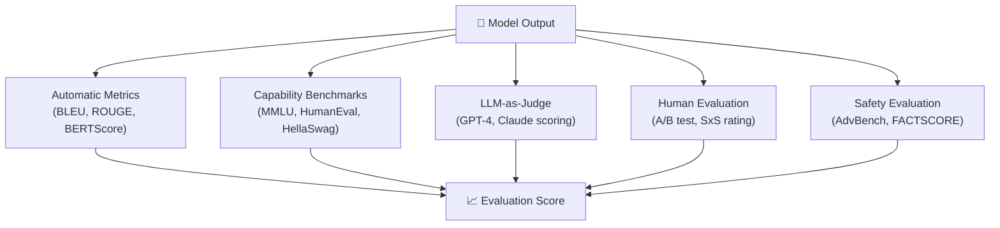

# 📊 Evaluation in NLP

> [!abstract] TL;DR
> NLP evaluation spans automatic metrics (BLEU, ROUGE, BERTScore), capability benchmarks (MMLU, HumanEval), preference-based evaluation (LLM-as-judge, Chatbot Arena ELO), and human annotation. No single metric suffices — production systems triangulate across reference-based, reference-free, and human evaluations. Safety evaluation requires specialized benchmarks (AdvBench, HarmBench) and hallucination metrics (FACTSCORE).

---

## Intuition — analogy FIRST

Evaluating an LLM is like grading a student essay: a spell-checker (BLEU) catches surface errors but misses a brilliant argument phrased unusually. A semantic rubric (BERTScore) catches meaning but not style. An expert examiner (LLM-as-judge) is closest to human judgment but introduces the examiner's own biases. Real evaluation uses all three, weighted by the task.

---

## How It Works



---

## Key Concepts / Details

### Reference-Based Automatic Metrics

**BLEU** (Papineni 2002) — standard for machine translation:
```
BLEU = BP × exp(Σ wₙ log pₙ)
```
- pₙ = modified n-gram precision (clipped against reference counts)
- BP = brevity penalty (penalizes short outputs)
- Typically report BLEU-4 (n=1..4, uniform weights)
- Range: [0, 100] or [0, 1]
- Weaknesses: doesn't capture semantics; saturated on high-resource MT; poor correlation with human judgment for open-ended tasks

**ROUGE** (Lin 2004) — standard for summarization:
- **ROUGE-1**: unigram recall between hypothesis and reference
- **ROUGE-2**: bigram recall
- **ROUGE-L**: Longest Common Subsequence (LCS) based F1; captures sentence-level structure
- Range: [0, 1]; reported as F1 = harmonic mean of precision/recall
- Weakness: misses paraphrases; length-sensitive

**METEOR** (Banerjee 2005):
- Harmonic mean of unigram precision and recall with F-measure (recall weighted higher)
- Handles stemming, synonyms (WordNet), and paraphrase tables
- Better correlation with human judgment than BLEU for MT

**BERTScore** (Zhang 2019):
- Compute token-level BERT embeddings for hypothesis and reference
- Match each hypothesis token to its most similar reference token (greedy matching)
- Precision P = avg max cosine sim over hypothesis tokens; Recall R = avg max over reference tokens; F1 = harmonic mean
- Correlates significantly better with human judgment than BLEU/ROUGE
- Sensitive to the choice of BERT model; rescale baseline for interpretability

### Perplexity

Intrinsic metric: `PPL = exp(-1/N Σ log p(xᵢ | x<ᵢ))`
- Lower = better language model
- Not task-specific; not directly comparable across tokenizers
- Useful for comparing variants of the same model family

---

### Capability Benchmarks

| Benchmark | Task | Metric |
|-----------|------|--------|
| MMLU (Hendrycks 2021) | 57-subject multiple choice | Accuracy |
| HumanEval (Chen 2021) | Python code generation | pass@k |
| TruthfulQA (Lin 2022) | Factual accuracy under adversarial Qs | % truthful |
| HellaSwag (Zellers 2019) | Commonsense sentence completion | Accuracy |
| ARC-Challenge | Grade-school science MCQ | Accuracy |
| GSM8K | Grade-school math word problems | Accuracy |
| BigBench-Hard | Diverse hard reasoning tasks | Normalized score |
| AlpacaEval | Win rate vs. text-davinci-003 | % wins |

**pass@k** for code: sample k completions per problem; the problem is solved if at least one passes all unit tests:
```
pass@k = 1 − C(n−c, k) / C(n, k)
```
where n = total samples, c = number passing.

---

### LLM-as-Judge

Use a capable model (GPT-4, Claude) to score or rank model outputs.

**MT-Bench** (Zheng 2023): 80 multi-turn questions across 8 categories; GPT-4 scores responses 1–10.

**Chatbot Arena ELO** (LMSYS): crowdsourced head-to-head battles; human votes; ELO rating aggregated over millions of comparisons.

**Biases to watch for**:
- **Verbosity bias**: longer responses rated higher regardless of quality
- **Position bias**: first response in a pair rated higher
- **Self-enhancement bias**: GPT-4 rates GPT-4 outputs higher
- **Mitigation**: swap positions and average; use multiple judges; calibrate against human labels

---

### Human Evaluation

**A/B testing**: randomized controlled trial — users see model A or B, implicit quality signal from engagement/task completion.

**Side-by-Side (SxS)**: annotators rate two responses simultaneously; avoids memory effects. Collect preference + severity.

**Inter-Annotator Agreement**:
- **Cohen's κ** (two raters): κ = (p_o − p_e) / (1 − p_e); κ > 0.6 = substantial agreement
- **Krippendorff's α**: generalizes to multiple raters and ordinal scales

---

### Safety Evaluation

| Benchmark | Target |
|-----------|--------|
| AdvBench (Zou 2023) | Harmful instruction following rate |
| HarmBench (Mazeika 2024) | Standardized red-teaming benchmark |
| ToxiGen | Implicit hate speech detection |
| WinoBias | Gender bias in coreference resolution |

**Constitutional AI metrics**: measure refusal rate on harmful prompts vs. compliance rate on benign prompts (safety-utility trade-off).

---

### Hallucination Evaluation

**FACTSCORE** (Min 2023):
1. Break the generated biography into atomic facts
2. For each atomic fact, retrieve Wikipedia evidence
3. Measure precision = fraction of facts supported by evidence
- Entity-level factual precision; best for knowledge-intensive generation

**FaithDial** (Dziri 2022): evaluates faithfulness to a provided knowledge source in dialogue.

---

## When to Use Which Metric

| Scenario | Primary Metric | Secondary |
|----------|---------------|----------|
| Machine translation | BLEU-4 | METEOR, BERTScore |
| Summarization | ROUGE-L | BERTScore, human |
| Open-ended generation | LLM-as-judge | Human SxS |
| Code generation | pass@k | Exact match |
| Factual QA | FACTSCORE | Exact match |
| Chatbot quality | Chatbot Arena ELO | MT-Bench |
| RAG pipeline | RAGAS faithfulness | Context precision |
| Safety | AdvBench refusal rate | Human red-teaming |

---

## Real-World Notes

- BLEU and ROUGE are still the industry standard for MT and summarization respectively despite their weaknesses — they are reproducible and cheap
- BERTScore is strongly recommended as a companion metric for any reference-based evaluation
- For production LLM products, Chatbot Arena ELO is the most trusted ranking due to scale and diversity
- LLM-as-judge with GPT-4 correlates at 0.8+ with human expert judgment on MT-Bench; still complement with human spot-checks
- MMLU scores near saturation for frontier models (~90%+); newer harder benchmarks (GPQA, ARC-AGI) are gaining traction

---

## Code Demo — HuggingFace evaluate Library

```python
import evaluate
from datasets import load_dataset

# Load metrics
bleu  = evaluate.load("bleu")
rouge = evaluate.load("rouge")
bertscore = evaluate.load("bertscore")

predictions = ["The cat sat on the mat", "Paris is the capital of France"]
references  = ["The cat is sitting on the mat", "France's capital is Paris"]

# BLEU
b = bleu.compute(predictions=predictions, references=[[r] for r in references])
print(f"BLEU-4: {b['bleu']:.3f}")

# ROUGE
r = rouge.compute(predictions=predictions, references=references)
print(f"ROUGE-L: {r['rougeL']:.3f}")

# BERTScore
bs = bertscore.compute(
    predictions=predictions,
    references=references,
    lang="en",
    model_type="distilbert-base-uncased",
)
print(f"BERTScore F1: {sum(bs['f1'])/len(bs['f1']):.3f}")
```

---

## Related Concepts

- [[Instruction_Tuning]] — evaluation guides SFT data quality decisions
- [[RLHF_and_Constitutional_AI]] — reward model is a learned evaluation function
- [[RAG_Deep_Dive]] — RAGAS evaluation framework for RAG pipelines
- [[_MOC_Finetuning_Alignment]] — section overview

---

## Review Questions

1. Why does BLEU use modified n-gram precision rather than standard precision?
2. What does ROUGE-L measure, and how does it differ from ROUGE-2?
3. Explain how BERTScore computes precision: what does each step compute?
4. What is pass@k, and why is it preferred over exact-match accuracy for code evaluation?
5. Name three biases in LLM-as-judge evaluation and one mitigation for each.
6. What does FACTSCORE measure, and how does it differ from ROUGE for factual generation evaluation?

---

## Sources

- Papineni et al. (2002). *BLEU: a Method for Automatic Evaluation of Machine Translation*. ACL 2002.
- Lin (2004). *ROUGE: A Package for Automatic Evaluation of Summaries*. ACL Workshop 2004.
- Zhang et al. (2019). *BERTScore: Evaluating Text Generation with BERT*. ICLR 2020.
- Hendrycks et al. (2021). *Measuring Massive Multitask Language Understanding* (MMLU). ICLR 2021.
- Min et al. (2023). *FActScoring: Fine-grained Atomic Evaluation of Factual Precision in Long Form Text Generation*. EMNLP 2023.
- Zheng et al. (2023). *Judging LLM-as-a-Judge with MT-Bench and Chatbot Arena*. NeurIPS 2023.

#nlp #finetuning-alignment #intermediate #evaluation #BLEU #ROUGE #BERTScore #LLM-as-judge #MMLU
