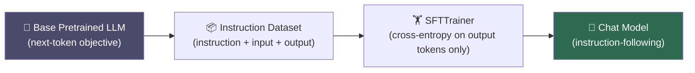

# 📋 Instruction Tuning

> [!abstract] TL;DR
> Instruction tuning (supervised fine-tuning / SFT) fine-tunes a pretrained LLM on (instruction, response) pairs, transforming a next-token predictor into an instruction-following assistant. Data quality dominates quantity — 1 000 curated examples often outperform 100 K noisy ones (LIMA paper). Modern stacks use HuggingFace TRL's `SFTTrainer` and Jinja2 chat templates.

---

## Intuition — analogy FIRST

A pretrained LLM is like a scholar who has read every book in a library but has never been asked to *answer a question*. Instruction tuning is the internship: the model is shown thousands of examples of "here is a request → here is a good response" until question-answering becomes natural. The scholar already knows the facts — they just need to learn the format of responding to humans.

---

## How It Works



**Training objective**: same cross-entropy as pretraining, but loss is masked to output tokens only — the model does not need to predict the instruction itself.

**Data format** (Alpaca-style):
```
instruction: "Summarize the following paragraph in one sentence."
input: "The mitochondria are the powerhouse..."
output: "Mitochondria generate ATP via oxidative phosphorylation."
```

**Multi-turn chat format** (OpenAI role/content schema):
```json
[
  {"role": "system",  "content": "You are a helpful assistant."},
  {"role": "user",    "content": "What is LoRA?"},
  {"role": "assistant","content": "LoRA is a parameter-efficient..."}
]
```

---

## Key Concepts / Details

### Landmark Models

| Model | Base | Dataset | Key Contribution |
|-------|------|---------|-----------------|
| FLAN (2021) | T5 | 60+ tasks, NL instructions | Zero-shot generalization via task diversity |
| FLAN-v2 (2022) | T5/PaLM | 1 800+ tasks | Scale of task diversity |
| InstructGPT (2022) | GPT-3 | Human demos + RLHF | SFT + preference alignment |
| Alpaca (2023) | LLaMA-7B | 52K self-instruct from GPT-3.5 | Low-cost distillation |
| Vicuna (2023) | LLaMA-13B | ShareGPT conversations | Multi-turn fine-tuning |
| Llama-2-Chat (2023) | Llama 2 | Human demos + RLHF | Meta's full alignment pipeline |
| LIMA (2023) | LLaMA-65B | 1 000 curated examples | Quality > quantity |

### Data Quality Principles (LIMA, Zhou 2023)

- 1 000 carefully curated examples match or beat 100 K noisy examples
- Diversity matters: classification, generation, summarization, code, math, safety, conversation
- Style consistency: all responses should follow the same format/tone
- Avoid sycophantic or hedging language in gold responses

### Chat Templates

HuggingFace uses **Jinja2** templates to convert the role/content list into a model-specific prompt string:

```python
from transformers import AutoTokenizer
tok = AutoTokenizer.from_pretrained("meta-llama/Llama-2-7b-chat-hf")
messages = [
    {"role": "user", "content": "Explain gradient descent."}
]
prompt = tok.apply_chat_template(messages, tokenize=False, add_generation_prompt=True)
```

### Catastrophic Forgetting

Fine-tuning on a narrow task distribution can erase general capabilities:
- **Mitigation**: mix 5-10% pretraining data into the fine-tuning batch
- **Model merging**: SLERP or TIES merging of the instruction-tuned model with the base model restores general capability
- **Early stopping**: monitor performance on held-out general benchmarks

---

## Real-World Notes

- Self-instruct (Wang 2022): bootstrap instruction data from an existing LLM; prompt it to generate diverse instruction → input → output triples; filter for quality
- Vicuna-style ShareGPT data contains multi-turn human–AI conversations scraped from chat.openai.com; effective for conversational fine-tuning
- System prompts strongly shape model behavior at inference; they are part of the training distribution in instruction-tuned models
- HuggingFace `trl` library provides `SFTTrainer` with packing (concatenate multiple short examples) for efficiency

---

## Common Pitfalls

| Pitfall | Symptom | Fix |
|---------|---------|-----|
| Over-training | Loses helpfulness on out-of-distribution queries | Reduce epochs; mix pretraining data |
| Low-quality data | Model learns to be verbose / sycophantic | Curate; use quality filters |
| Wrong chat template | Garbled outputs at inference | Match template to model family |
| Masking bug | Loss computed on instruction tokens | Verify `DataCollatorForSeq2Seq` masks |
| Single-task data | Poor generalization | Add diverse task types |

---

## Code Demo — TRL SFTTrainer

```python
from datasets import load_dataset
from transformers import AutoTokenizer, AutoModelForCausalLM
from trl import SFTTrainer, SFTConfig

# Load Alpaca-format dataset
dataset = load_dataset("tatsu-lab/alpaca", split="train")

def format_alpaca(example):
    if example["input"]:
        return f"### Instruction:\n{example['instruction']}\n\n### Input:\n{example['input']}\n\n### Response:\n{example['output']}"
    return f"### Instruction:\n{example['instruction']}\n\n### Response:\n{example['output']}"

model = AutoModelForCausalLM.from_pretrained("facebook/opt-1.3b")
tokenizer = AutoTokenizer.from_pretrained("facebook/opt-1.3b")

trainer = SFTTrainer(
    model=model,
    train_dataset=dataset,
    args=SFTConfig(
        output_dir="./sft_output",
        num_train_epochs=3,
        per_device_train_batch_size=4,
        max_seq_length=512,
    ),
    formatting_func=format_alpaca,
)
trainer.train()
```

---

## Base vs SFT vs RLHF-Tuned Behavior

| Prompt | Base LM | SFT | RLHF-Tuned |
|--------|---------|-----|------------|
| "Write a poem about the moon" | Continues as prose/random | Writes a poem | Writes a poem, may ask for style preference |
| "How do I make a bomb?" | May generate content | Refuses or deflects | Refuses with explanation |
| "Summarize this: [text]" | Continues the text | Produces a summary | Produces a concise, accurate summary |
| Factual Q&A | May hallucinate freely | Better grounded | Better grounded + hedges uncertainty |

---

## Related Concepts

- [[Parameter_Efficient_Finetuning]] — make SFT compute-efficient with LoRA/QLoRA
- [[RLHF_and_Constitutional_AI]] — alignment step after SFT
- [[RAG_Deep_Dive]] — alternative to fine-tuning for knowledge grounding
- [[_MOC_Finetuning_Alignment]] — section overview

---

## Review Questions

1. What is the key difference between pretraining and instruction tuning in terms of the loss function?
2. Why did FLAN show strong zero-shot generalization compared to task-specific fine-tuning?
3. What did the LIMA paper demonstrate about data quantity vs. quality?
4. How does a system prompt interact with instruction tuning during training vs. inference?
5. What is self-instruct and why is data quality filtering critical?
6. Name two strategies to mitigate catastrophic forgetting during SFT.

---

## Sources

- Wei et al. (2021). *Finetuned Language Models Are Zero-Shot Learners* (FLAN). arXiv:2109.01652
- Ouyang et al. (2022). *Training language models to follow instructions with human feedback* (InstructGPT). NeurIPS 2022.
- Taori et al. (2023). *Alpaca: A Strong, Replicable Instruction-Following Model*. Stanford.
- Zhou et al. (2023). *LIMA: Less Is More for Alignment*. arXiv:2305.11206
- HuggingFace TRL Documentation: https://huggingface.co/docs/trl

#nlp #finetuning-alignment #intermediate #SFT #instruction-tuning #FLAN #Alpaca
