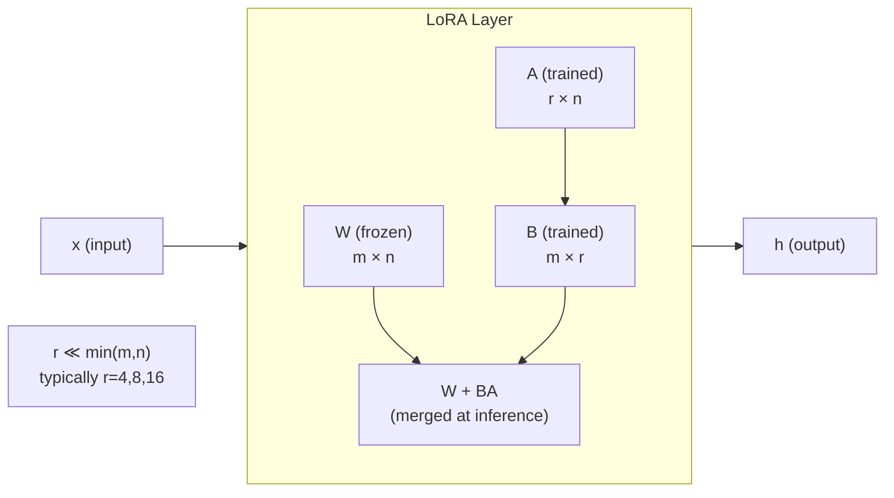

# ⚙️ Parameter-Efficient Finetuning

> [!abstract] TL;DR
> Full fine-tuning updates all model weights — prohibitively expensive for large models (Adam requires ~3× model size in GPU memory). PEFT methods update only a tiny fraction of parameters while matching full fine-tuning performance. LoRA (Low-Rank Adaptation) is the dominant method: it learns a low-rank decomposition ΔW = BA for each weight matrix, adding no inference latency. QLoRA extends LoRA to 4-bit quantized models, enabling 65B-parameter fine-tuning on a single consumer GPU.

---

## Intuition — analogy FIRST

Fine-tuning a 70B LLM is like renovating a skyscraper — you do not replace the entire steel frame; you renovate specific floors. PEFT adds small "renovation modules" (adapters, low-rank matrices, learnable tokens) while leaving the structural steel (pretrained weights) frozen. The building stays standing, construction costs plummet, and the renovated floors behave exactly as needed.

---

## How It Works



**LoRA math**: for weight matrix W ∈ ℝᵐˣⁿ, the update is:
```
h = Wx + BAx    (during training, B initialized to zero)
h = (W + BA)x   (merged at inference — zero latency overhead)
```
where B ∈ ℝᵐˣʳ, A ∈ ℝʳˣⁿ, and rank r ≪ min(m, n).

---

## Key Concepts / Details

### PEFT Method Taxonomy

**Adapter Layers** (Houlsby 2019)
- Insert a small 2-layer MLP bottleneck (down-project → non-linearity → up-project) between attention and FFN sub-layers
- Only adapter weights updated; original weights frozen
- Adds +1–3% parameters; adds inference latency (sequential bottleneck)

**Prefix Tuning** (Li & Liang 2021)
- Prepend learnable "virtual tokens" to the K and V matrices at every transformer layer
- Model attends to the soft prefix as additional context
- ~0.1–1% parameters; no architectural change; effective at large scales

**Prompt Tuning** (Lester 2021)
- Prepend learnable tokens only at the input embedding layer (not every layer)
- ~0.01–0.1% parameters
- Performance catches up to full fine-tuning only at very large model sizes (>10B)

**LoRA** (Hu 2021) — dominant method
- Learn ΔW = BA for target weight matrices (Q, K, V, FFN projections)
- Typically apply to Q and V of every attention layer
- r = 4, 8, or 16 is sufficient for most tasks
- α/r scaling: ΔW scaled by α/r (set α = 2r as a default)
- Weights merged at inference: W_merged = W + (α/r)·BA — zero latency

**QLoRA** (Dettmers 2023)
- Quantize the base model to **4-bit NF4** (Normal Float 4) format
- Store quantization constants in double quantization (8-bit → 4-bit)
- Train LoRA adapters in BF16 (full precision for the gradient path)
- **Paged optimizers**: offload Adam states to CPU RAM when GPU memory is tight
- Enables fine-tuning LLaMA-65B on a single 48 GB GPU (vs. 780 GB for full FT)

**DoRA** (Liu 2024)
- Decompose weight matrix into magnitude and direction components
- Apply LoRA to the direction component only
- Generally outperforms LoRA at the same rank

**IA³** (Liu 2022)
- Scales keys, values, and feedforward activations with learned vectors
- Even fewer parameters than LoRA; injected as element-wise multiplication
- Effective for few-shot adaptation without training instability

---

## PEFT Comparison Table

| Method | Trainable Params | VRAM vs. Full FT | Inference Latency | Performance |
|--------|-----------------|-------------------|-------------------|-------------|
| Full Fine-Tuning | 100% | 1× (baseline) | 0 | Ceiling |
| Adapters | 1–3% | ~0.5× | +10–30 ms/layer | ~Full FT |
| Prefix Tuning | 0.1–1% | ~0.4× | Slight (longer KV) | Good |
| Prompt Tuning | 0.01–0.1% | ~0.3× | Negligible | Good at scale |
| LoRA | 0.1–1% | ~0.4× | 0 (after merge) | ~Full FT |
| QLoRA | 0.1–1% | ~0.15× | 0 (after dequant) | ~LoRA |

---

## Real-World Notes

- Apply LoRA to: `q_proj`, `v_proj` at minimum; adding `k_proj`, `o_proj`, `gate_proj`, `up_proj`, `down_proj` improves results with moderate cost increase
- Higher rank r → more capacity but more overfitting risk on small datasets; r=16 is a good starting point
- QLoRA with `bnb_4bit_compute_dtype=torch.bfloat16` is the practical standard for consumer GPU fine-tuning
- After training, merge and unload: `model = model.merge_and_unload()` produces a standard HuggingFace model with no PEFT overhead
- Multiple LoRA adapters can be merged via TIES or DARE merging for multi-task models

---

## Common Pitfalls

| Pitfall | Symptom | Fix |
|---------|---------|-----|
| Rank too low | Underfitting, poor task performance | Increase r (try 32 or 64) |
| Wrong target modules | No improvement | Check model architecture; target all attention projections |
| NF4 instability | NaN losses | Use `bnb_4bit_use_double_quant=True`; set BF16 compute dtype |
| Forgetting to merge | Slow inference in production | Call `merge_and_unload()` before deployment |
| α/r mismatch | Training instability | Keep α = 2r as default |

---

## Code Demo — QLoRA Fine-Tuning

```python
import torch
from transformers import AutoTokenizer, AutoModelForCausalLM, BitsAndBytesConfig
from peft import LoraConfig, get_peft_model, prepare_model_for_kbit_training
from trl import SFTTrainer, SFTConfig

# 4-bit quantization config
bnb_config = BitsAndBytesConfig(
    load_in_4bit=True,
    bnb_4bit_quant_type="nf4",
    bnb_4bit_compute_dtype=torch.bfloat16,
    bnb_4bit_use_double_quant=True,
)

model = AutoModelForCausalLM.from_pretrained(
    "meta-llama/Llama-2-7b-hf",
    quantization_config=bnb_config,
    device_map="auto",
)
model = prepare_model_for_kbit_training(model)

# LoRA configuration
lora_config = LoraConfig(
    r=16,
    lora_alpha=32,
    target_modules=["q_proj", "v_proj", "k_proj", "o_proj"],
    lora_dropout=0.05,
    bias="none",
    task_type="CAUSAL_LM",
)
model = get_peft_model(model, lora_config)
model.print_trainable_parameters()
# Output: trainable params: 4,194,304 || all params: 6,742,609,920 || trainable%: 0.0622

tokenizer = AutoTokenizer.from_pretrained("meta-llama/Llama-2-7b-hf")

trainer = SFTTrainer(
    model=model,
    train_dataset=dataset,
    args=SFTConfig(output_dir="./qlora_output", num_train_epochs=2),
)
trainer.train()

# Merge and save
merged = model.merge_and_unload()
merged.save_pretrained("./qlora_merged")
```

---

## Related Concepts

- [[Instruction_Tuning]] — the SFT stage where PEFT is typically applied
- [[RLHF_and_Constitutional_AI]] — PEFT also used in reward model training
- [[_MOC_Finetuning_Alignment]] — section overview

---

## Review Questions

1. Why does Adam optimizer require ~3× GPU memory relative to model size?
2. What is the mathematical form of a LoRA update, and why does it add zero inference latency?
3. Compare Prefix Tuning and Prompt Tuning: where do learned parameters live?
4. What are the three QLoRA innovations that enable 4-bit fine-tuning?
5. When would you prefer Adapters over LoRA despite the inference latency?
6. What does `prepare_model_for_kbit_training` do, and why is it necessary?

---

## Sources

- Houlsby et al. (2019). *Parameter-Efficient Transfer Learning for NLP*. ICML 2019.
- Li & Liang (2021). *Prefix-Tuning: Optimizing Continuous Prompts for Generation*. ACL 2021.
- Hu et al. (2021). *LoRA: Low-Rank Adaptation of Large Language Models*. ICLR 2022.
- Dettmers et al. (2023). *QLoRA: Efficient Finetuning of Quantized LLMs*. NeurIPS 2023.
- HuggingFace PEFT Documentation: https://huggingface.co/docs/peft

#nlp #finetuning-alignment #intermediate #LoRA #QLoRA #PEFT #adapters
