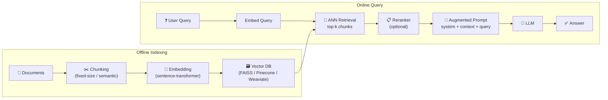

# 🔍 RAG Deep Dive

> [!abstract] TL;DR
> Retrieval-Augmented Generation (RAG) grounds LLM outputs in retrieved external documents, addressing factual hallucinations, knowledge cutoffs, and private data access. Naive RAG (chunk → embed → retrieve → generate) is a solid baseline. Advanced RAG adds query rewriting, HyDE, reranking, and hybrid search. GraphRAG builds a knowledge graph over documents for complex multi-hop questions.

---

## Intuition — analogy FIRST

A standard LLM is like a professor answering from memory — brilliant but limited by what they studied years ago. RAG gives the professor an open-book exam: before answering, they search the library, pull the relevant pages, and incorporate those sources. The professor's reasoning (the LLM) remains the same; the knowledge base (the retrieval index) is now separate, updatable, and verifiable.

---

## How It Works



---

## Key Concepts / Details

### Indexing Pipeline

**Chunking strategies**:
- Fixed-size: 256–512 tokens with 20% overlap — simple, predictable
- Semantic: split on sentence/paragraph boundaries — better coherence
- Parent-document retrieval: index small chunks but retrieve the parent paragraph for context

**Embedding models** (choose based on task):

| Model | Dims | Use Case |
|-------|------|----------|
| all-MiniLM-L6-v2 | 384 | Fast, general-purpose |
| E5-large-v2 | 1024 | High-accuracy English |
| BGE-M3 | 1024 | Multilingual |
| text-embedding-3-large | 3072 | OpenAI API, best quality |
| Cohere Embed v3 | 1024 | Multilingual + compression |

**Vector databases**:
- FAISS (Meta): in-memory, no persistence; ideal for prototyping
- ChromaDB: local persistence, simple Python API
- Pinecone: managed cloud, production-grade
- Weaviate / Qdrant: open-source, production; support hybrid search

### Retrieval Methods

**Dense retrieval** (bi-encoder): embed query and document independently; compute cosine/dot similarity. Fast ANN search via HNSW or IVF-PQ.

**Sparse retrieval** (BM25): keyword-based TF-IDF variant; strong on exact keyword matches, product names, codes.

**Hybrid retrieval**: combine dense and sparse scores via **Reciprocal Rank Fusion (RRF)**:
```
RRF_score(d) = Σ_r  1 / (k + rank_r(d))    k=60 is standard
```

### Advanced RAG Techniques

**Query Rewriting**: generate N reformulations of the query; retrieve for each; merge results. Catches varied vocabulary.

**HyDE** (Hypothetical Document Embeddings, Gao 2022):
1. LLM generates a hypothetical ideal answer to the query
2. Embed that hypothetical answer (not the original query)
3. Retrieve real documents similar to the hypothetical answer
Effective when queries are short and documents are long.

**Contextual Compression** (LangChain): after retrieving a chunk, use an LLM to extract only the sentence(s) relevant to the query — reduces noise in the context window.

**Cross-Encoder Reranking**: after initial dense retrieval of top-50, run a cross-encoder model (processes query + document jointly) to re-score and return top-5. Models: BGE-reranker-large, Cohere Rerank, ColBERT.

**Multi-hop / Iterative RAG**: generate intermediate reasoning steps; retrieve for each step. Necessary for questions requiring chained facts.

**Query Routing**: classify the query type; route to different indexes (SQL database, vector store, knowledge graph).

### GraphRAG (Microsoft, 2024)

1. Extract entities and relationships from all documents → knowledge graph
2. Run community detection (Leiden algorithm) on the graph
3. Generate community summaries at multiple granularities
4. At query time: retrieve relevant community summaries + local entities
5. LLM synthesizes across community summaries

**Advantage**: handles global questions ("What are the main themes across all documents?") that naive RAG misses — RAG retrieves local chunks; GraphRAG has a global index.

---

## RAG vs Fine-Tuning Decision

| Situation | Use RAG | Use Fine-Tuning |
|-----------|---------|----------------|
| Private / frequently updated data | ✅ | ❌ (data staleness) |
| Factual grounding + citations | ✅ | ❌ |
| Style / format / persona | ❌ | ✅ |
| Narrow domain with fixed vocabulary | ❌ | ✅ |
| Limited GPU budget | ✅ | ❌ (QLoRA helps) |
| Low latency requirements | ❌ (retrieval adds latency) | ✅ |

---

## Evaluation — RAGAS Framework

| Metric | Measures | How |
|--------|---------|-----|
| Faithfulness | Is the answer grounded in retrieved context? | LLM checks each claim against context |
| Answer Relevancy | Does the answer address the query? | Embed answer; measure similarity to query |
| Context Precision | Are retrieved chunks relevant? | Fraction of chunks used in the answer |
| Context Recall | Are all relevant facts retrieved? | LLM checks if ground-truth facts are in context |

---

## Real-World Notes

- Chunk size 512 tokens with 128-token overlap is a strong default; tune empirically
- Metadata filtering (e.g., filter by date, source, author) before ANN search dramatically improves precision in production
- LlamaIndex and LangChain both provide high-level RAG abstractions; LlamaIndex is more index-focused
- Late interaction models (ColBERT): store per-token embeddings; slower but higher accuracy than bi-encoders
- Re-ranking with a cross-encoder is the single highest-ROI improvement over naive RAG

---

## Common Pitfalls

| Pitfall | Description | Fix |
|---------|-------------|-----|
| Chunk too large | LLM ignores middle-of-context chunks | Reduce chunk size; use contextual compression |
| No overlap | Facts split across chunk boundaries | Add 10–20% overlap |
| Dense-only retrieval | Misses exact keyword matches (IDs, names) | Add BM25; use hybrid + RRF |
| Missing reranker | Low-precision context fed to LLM | Add cross-encoder reranking |
| Context stuffing | Too many chunks exceed context window | Cap at 4–6 chunks; compress |

---

## Code Demo — LangChain RAG Pipeline

```python
from langchain.document_loaders import DirectoryLoader
from langchain.text_splitter import RecursiveCharacterTextSplitter
from langchain_community.vectorstores import FAISS
from langchain_community.embeddings import HuggingFaceEmbeddings
from langchain.chains import RetrievalQA
from langchain_community.llms import HuggingFacePipeline

# 1. Load and chunk documents
loader = DirectoryLoader("./docs", glob="**/*.txt")
docs = loader.load()
splitter = RecursiveCharacterTextSplitter(chunk_size=512, chunk_overlap=64)
chunks = splitter.split_documents(docs)

# 2. Embed and index
embeddings = HuggingFaceEmbeddings(model_name="BAAI/bge-small-en-v1.5")
vectorstore = FAISS.from_documents(chunks, embeddings)

# 3. Retrieval + generation
retriever = vectorstore.as_retriever(
    search_type="mmr",       # Maximum Marginal Relevance for diversity
    search_kwargs={"k": 6, "fetch_k": 30}
)
qa = RetrievalQA.from_chain_type(
    llm=HuggingFacePipeline.from_model_id("google/flan-t5-base"),
    chain_type="stuff",
    retriever=retriever,
    return_source_documents=True,
)

result = qa.invoke({"query": "What is the capital of France?"})
print(result["result"])
print([d.metadata["source"] for d in result["source_documents"]])
```

---

## Related Concepts

- [[Instruction_Tuning]] — fine-tuning alternative to RAG for knowledge
- [[Evaluation_NLP]] — RAGAS metrics for RAG evaluation
- [[_MOC_Finetuning_Alignment]] — section overview

---

## Review Questions

1. What are the three problems that RAG addresses compared to a standalone LLM?
2. Explain Reciprocal Rank Fusion: why is it preferred over simple score averaging?
3. How does HyDE reverse the typical retrieval direction, and when is it most useful?
4. Compare bi-encoder retrieval and cross-encoder reranking in terms of speed vs. accuracy.
5. What makes GraphRAG better than naive RAG for global document understanding questions?
6. For a chatbot over a company's internal knowledge base updated weekly, argue for or against RAG over fine-tuning.

---

## Sources

- Lewis et al. (2020). *Retrieval-Augmented Generation for Knowledge-Intensive NLP Tasks*. NeurIPS 2020.
- Gao et al. (2022). *Precise Zero-Shot Dense Retrieval without Relevance Labels* (HyDE). ACL 2023.
- Edge et al. (2024). *From Local to Global: A Graph RAG Approach to Query-Focused Summarization* (Microsoft). arXiv:2404.16130
- Es et al. (2023). *RAGAS: Automated Evaluation of Retrieval Augmented Generation*. arXiv:2309.15217
- LangChain Documentation: https://python.langchain.com/docs/use_cases/question_answering

#nlp #finetuning-alignment #intermediate #RAG #retrieval #vector-search #GraphRAG
