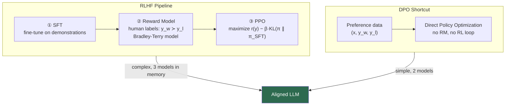

# 🎯 RLHF and Constitutional AI

> [!abstract] TL;DR
> RLHF (Reinforcement Learning from Human Feedback) aligns LLMs to human preferences via a 3-stage pipeline: SFT → reward model training → PPO fine-tuning with a KL penalty. Constitutional AI (Anthropic) replaces human preference labeling with an AI critique loop. Direct Preference Optimization (DPO) bypasses RL entirely by directly optimizing the implicit reward policy — simpler, more stable, and competitive with PPO.

---

## Intuition — analogy FIRST

Imagine training a junior consultant. SFT is the onboarding: they read sample deliverables. The reward model is the feedback system: partners rate pairs of deliverables ("which is better?"). PPO is the coaching loop: the consultant keeps revising drafts to maximize partner ratings, but a contract prevents them from veering so far they forget how to write professionally (the KL penalty). DPO skips the explicit feedback system — it derives what the consultant *must* have preferred from the final accepted vs. rejected drafts and trains directly on that signal.

---

## How It Works



---

## Key Concepts / Details

### Stage 1 — Supervised Fine-Tuning (SFT)

Fine-tune the base model on human-written demonstrations of high-quality responses (see [[Instruction_Tuning]]). This gives the initial policy π_SFT.

### Stage 2 — Reward Model Training

**Data collection**: for each prompt x, sample two completions (y₁, y₂); human annotators label which is preferred.

**Bradley-Terry preference model**:
```
P(y₁ ≻ y₂ | x) = σ(r(x, y₁) − r(x, y₂))
```

**Reward model loss** (maximize log-likelihood of observed preferences):
```
L_RM = −E[(x,yw,yl)] [ log σ(r(x,yw) − r(x,yl)) ]
```

The reward model is typically the SFT model with its final LM head replaced by a scalar regression head.

### Stage 3 — PPO Fine-Tuning

**Objective**: maximize reward while staying close to the SFT policy:
```
max_π  E[r(x, y)] − β · D_KL(π(y|x) ∥ π_SFT(y|x))
```

- β controls the KL penalty strength (typical range: 0.01–0.1)
- Without KL penalty → **reward hacking**: policy exploits RM blind spots (e.g., outputs gibberish that the RM rates highly)
- PPO clip objective: prevents large policy updates per step

**Memory cost**: PPO requires 4 models simultaneously — policy, SFT reference, reward model, value function.

### Constitutional AI (Anthropic, 2022)

Replace expensive human preference labeling with an AI-driven critique loop:

1. **Generate**: model produces a potentially harmful response
2. **Critique**: model critiques the response against a *constitution* (a list of principles, e.g., "avoid content harmful to children")
3. **Revise**: model revises the response per the critique
4. **Iterate**: repeat critique-revise up to N times
5. **AI Feedback (RLAIF)**: use Claude to label pairs instead of humans

This removes the human bottleneck and scales preference data generation.

### Direct Preference Optimization (DPO, Rafailov 2023)

DPO shows that the RLHF objective has a closed-form optimal policy — no RL needed.

**DPO loss**:
```
L_DPO = −E[(x,yw,yl)] [ log σ(
    β · log π_θ(yw|x)/π_ref(yw|x)
  − β · log π_θ(yl|x)/π_ref(yl|x)
)]
```

Interpretation: increase the log-likelihood of preferred response y_w relative to the reference policy, decrease log-likelihood of rejected response y_l — simultaneously and in proportion to how surprising they are under the reference model.

**Advantages over PPO**: no separate reward model, no PPO hyperparameters, only 2 models in memory, training is stable.

### DPO Variants

| Method | Innovation |
|--------|-----------|
| DPO | Original; uses SFT model as reference |
| SimPO (Meng 2024) | Reference-free; uses average log-prob as implicit reward |
| KTO (Ethayarajh 2024) | Uses binary signal (thumbs up/down) instead of pairs |
| IPO | Fixes DPO overfitting to deterministic policies |

---

## RLHF-PPO vs DPO vs CAI Comparison

| Dimension | RLHF-PPO | DPO | Constitutional AI |
|-----------|-----------|-----|------------------|
| Data needed | Human preference pairs | Human preference pairs | Constitution + AI labels |
| Models in memory | 4 | 2 | 2 |
| Training stability | Low (RL variance) | High | High |
| Reward hacking risk | High | None (no explicit RM) | Low |
| Human labor | High | High (for pairs) | Low |
| Performance (SOTA) | Strong | Competitive | Strong |

---

## Real-World Notes

- InstructGPT (OpenAI, 2022): first large-scale RLHF deployment; humans preferred InstructGPT-1.3B over GPT-3-175B in blind evaluations
- Llama-2-Chat uses RLHF with ghost attention for multi-turn coherence
- DPO has largely replaced PPO in academic fine-tuning due to simplicity; industry still uses PPO at scale (e.g., OpenAI, Google)
- Reward hacking examples: models learn to output very long responses (verbosity bias) or over-qualify everything ("As an AI...")
- Safe RLHF: separate reward models for helpfulness and harmlessness; optimize Pareto frontier

---

## Common Pitfalls

| Pitfall | Description | Fix |
|---------|-------------|-----|
| Reward hacking | Model finds RM blind spots | Add KL penalty; periodic RM updates |
| Mode collapse | Policy distribution narrows | Increase β; diversity sampling |
| Preference data poisoning | Inconsistent human labels | Strict annotation guidelines; inter-annotator agreement checks |
| DPO overfitting | Policy assigns near-zero probability to y_l | Use IPO or add SFT regularization loss |
| Forgetting SFT quality | RLHF degrades factuality | Mix SFT data; low learning rate |

---

## Code Demo — TRL DPO Trainer

```python
from datasets import load_dataset
from transformers import AutoTokenizer, AutoModelForCausalLM
from trl import DPOTrainer, DPOConfig

# Dataset format: {"prompt": ..., "chosen": ..., "rejected": ...}
dataset = load_dataset("Anthropic/hh-rlhf", split="train[:5000]")

model = AutoModelForCausalLM.from_pretrained("facebook/opt-1.3b")
model_ref = AutoModelForCausalLM.from_pretrained("facebook/opt-1.3b")  # frozen reference
tokenizer = AutoTokenizer.from_pretrained("facebook/opt-1.3b")
tokenizer.pad_token = tokenizer.eos_token

trainer = DPOTrainer(
    model=model,
    ref_model=model_ref,
    args=DPOConfig(
        output_dir="./dpo_output",
        num_train_epochs=1,
        beta=0.1,                    # KL regularization strength
        per_device_train_batch_size=2,
        learning_rate=5e-5,
    ),
    train_dataset=dataset,
    tokenizer=tokenizer,
)
trainer.train()
```

---

## Related Concepts

- [[Instruction_Tuning]] — SFT stage that precedes RLHF
- [[Parameter_Efficient_Finetuning]] — LoRA/QLoRA used in RM and policy training
- [[Evaluation_NLP]] — measuring alignment quality
- [[_MOC_Finetuning_Alignment]] — section overview

---

## Review Questions

1. What does the KL penalty term in the PPO objective prevent, and what is reward hacking?
2. Derive the Bradley-Terry model: what probability does it assign to y₁ being preferred over y₂?
3. Why does DPO not require a separate reward model training stage?
4. In the DPO loss, what happens to the log-probabilities of y_w and y_l relative to the reference policy?
5. How does Constitutional AI replace human preference labeling?
6. Name two advantages and two disadvantages of DPO vs. RLHF-PPO.

---

## Sources

- Christiano et al. (2017). *Deep Reinforcement Learning from Human Preferences*. NeurIPS 2017.
- Ouyang et al. (2022). *Training language models to follow instructions with human feedback*. NeurIPS 2022.
- Bai et al. (2022). *Constitutional AI: Harmlessness from AI Feedback*. Anthropic. arXiv:2212.08073
- Rafailov et al. (2023). *Direct Preference Optimization: Your Language Model is Secretly a Reward Model*. NeurIPS 2023.
- HuggingFace TRL: https://huggingface.co/docs/trl/dpo_trainer

#nlp #finetuning-alignment #advanced #RLHF #DPO #PPO #constitutional-AI #alignment
