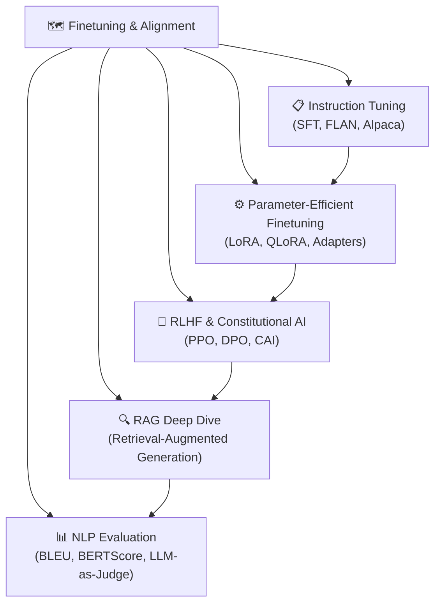

# 🗺️ MOC — Finetuning and Alignment

> [!abstract] TL;DR
> Pretrained LLMs are powerful but follow a next-token prediction objective — not instructions. Fine-tuning and alignment techniques adapt these models for useful, safe, instruction-following behavior. PEFT methods (LoRA, QLoRA) enable efficient adaptation with minimal compute. RLHF trains a reward model from human preferences and uses PPO to optimize the LLM. Constitutional AI and DPO are RLHF alternatives. RAG augments the model with retrieved knowledge. This section covers the full modern LLM adaptation stack.

---

## Section Map



---

## Notes in This Section

| File | Topic | Difficulty |
|------|-------|------------|
| [[Instruction_Tuning]] | SFT, FLAN, InstructGPT, Alpaca, chat templates | Intermediate |
| [[Parameter_Efficient_Finetuning]] | Adapters, Prefix Tuning, LoRA, QLoRA, DoRA | Intermediate |
| [[RLHF_and_Constitutional_AI]] | RLHF pipeline, PPO, DPO, Constitutional AI | Advanced |
| [[RAG_Deep_Dive]] | Naive RAG, advanced RAG, GraphRAG, reranking | Intermediate |
| [[Evaluation_NLP]] | BLEU, ROUGE, BERTScore, LLM-as-judge, human eval | Intermediate |

---

## Conceptual Arc

```
Base Pretrained LLM
        │
        ▼
[1] Instruction Tuning (SFT)
    → model learns to follow (instruction → response) format
        │
        ▼
[2] RLHF / DPO / Constitutional AI
    → model learns human preferences (helpful, harmless, honest)
        │
        ├──► [2b] PEFT methods reduce compute cost at every stage
        │
        ▼
[3] RAG at inference time
    → ground model in retrieved external knowledge
        │
        ▼
[4] Evaluation
    → measure quality, factuality, safety, usefulness
```

---

## Key Papers Timeline

| Year | Paper | Contribution |
|------|-------|-------------|
| 2017 | Christiano et al. | RLHF for LLMs |
| 2019 | Houlsby et al. | Adapter layers |
| 2020 | Lewis et al. | RAG |
| 2021 | Wei et al. | FLAN instruction tuning |
| 2021 | Li & Liang | Prefix Tuning |
| 2022 | Ouyang et al. | InstructGPT |
| 2023 | Hu et al. | LoRA |
| 2023 | Dettmers et al. | QLoRA |
| 2023 | Rafailov et al. | DPO |
| 2023 | Zhou et al. | LIMA (quality > quantity) |

---

## Prerequisites

- [[../03_Transformers_and_Attention/Transformer_Architecture|Transformer Architecture]]
- [[../04_Pretrained_Models/BERT_and_Encoder_Models|BERT & Encoders]]
- [[../04_Pretrained_Models/GPT_and_Decoder_Models|GPT & Decoders]]

## Where This Leads

- [[../07_Advanced_Topics/LLM_Agents|LLM Agents]]
- [[../07_Advanced_Topics/Multimodal_NLP|Multimodal NLP]]

---

#MOC #nlp #finetuning-alignment
