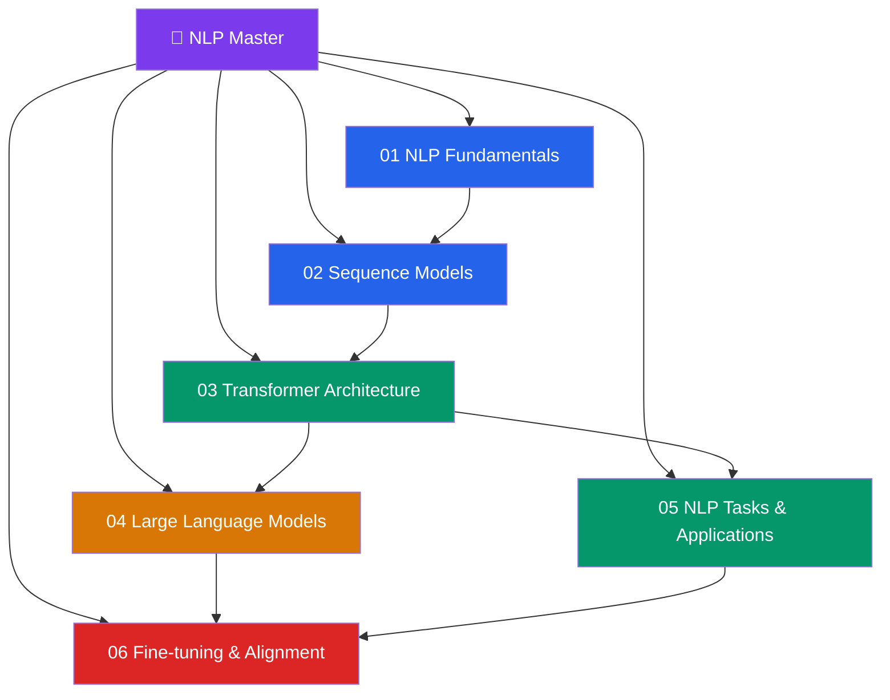

# 💬 NLP — Master Map of Content

> [!abstract] About This Vault
> A deep-dive Natural Language Processing reference: **37 notes across 6 sections**, covering the complete modern NLP stack from tokenization and classical text representations through RNN/LSTM sequence models, the full Transformer architecture, large language models and scaling laws, NLP tasks and evaluation, and fine-tuning/alignment techniques (LoRA, RLHF, RAG). Every note pairs intuition-first analogies with precise mathematics, architecture diagrams, PyTorch/HuggingFace code, benchmark comparisons, and review questions. This vault is the deep companion to the [[_MOC_NLP|AI/ML vault NLP section]] — where that section surveys the landscape, this vault provides full derivations, training details, and implementation depth. Designed for NLP engineers, LLM practitioners, and researchers building language systems.

## Vault Architecture

## Sections at a Glance

| # | Section | Notes | Entry Point | Difficulty |
|---|---------|-------|-------------|------------|
| 01 | NLP Fundamentals | 5 | [[_MOC_NLP_Fundamentals]] | Beginner |
| 02 | Sequence Models | 5 | [[_MOC_Sequence_Models]] | Beginner → Intermediate |
| 03 | Transformer Architecture | 5 | [[_MOC_Transformers]] | Intermediate |
| 04 | Large Language Models | 5 | [[_MOC_LLMs]] | Advanced |
| 05 | NLP Tasks & Applications | 5 | [[_MOC_NLP_Tasks]] | Intermediate |
| 06 | Fine-tuning & Alignment | 5 | [[_MOC_Finetuning_Alignment]] | Advanced |

---

## Learning Paths

### Path 1 — NLP Engineer (End-to-End)
**Fundamentals → Transformers → Tasks → Fine-tuning**

[[_MOC_NLP_Fundamentals]] → [[Tokenization]] → [[Word_Embeddings]] → [[_MOC_Sequence_Models]] → [[LSTM_GRU]] → [[_MOC_Transformers]] → [[Attention_Mechanism]] → [[BERT_Architecture]] → [[GPT_Architecture]] → [[_MOC_NLP_Tasks]] → [[Text_Classification]] → [[_MOC_Finetuning_Alignment]] → [[Parameter_Efficient_Finetuning]]

### Path 2 — LLM Researcher
**Transformers → LLMs → Alignment**

[[_MOC_Transformers]] → [[Attention_Mechanism]] → [[GPT_Architecture]] → [[_MOC_LLMs]] → [[Scaling_Laws]] → [[Pretraining_LLMs]] → [[Instruction_Tuning]] → [[_MOC_Finetuning_Alignment]] → [[RLHF_and_Constitutional_AI]] → [[Parameter_Efficient_Finetuning]]

### Path 3 — Applied NLP / Production
**Tasks → Fine-tuning → RAG**

[[_MOC_NLP_Tasks]] → [[Text_Classification]] → [[Named_Entity_Recognition]] → [[Question_Answering]] → [[Summarization_Translation]] → [[_MOC_Finetuning_Alignment]] → [[Parameter_Efficient_Finetuning]] → [[RAG_Deep_Dive]] → [[Evaluation_NLP]]

### Path 4 — Foundation Model Background
**Fundamentals → Sequence → Transformers**

[[Tokenization]] → [[Language_Model_Basics]] → [[_MOC_Sequence_Models]] → [[Attention_Mechanism_Seq]] → [[_MOC_Transformers]] → [[Attention_Mechanism]] → [[BERT_Architecture]] → [[GPT_Architecture]] → [[Transformer_Variants]]

---

## AI/ML Vault Cross-Links

This vault is the deep companion to the AI/ML vault's NLP section:
- **[[_MOC_NLP]]** (AI/ML vault, Section 03) — survey-level coverage; this vault provides full derivations and implementation depth
- **[[_MOC_Deep_Learning]]** (AI/ML vault, Section 02) — backpropagation, optimization, embeddings fundamentals
- **[[_MOC_Generative_AI]]** (AI/ML vault, Section 05) — LLMs, RLHF, and text generation at scale
- **[[_MOC_CV_Master]]** — vision-language models in CV Section 06 overlap with NLP Section 06
- **[[_MOC_Audio_Speech_Master]]** — ASR and TTS rely heavily on Transformer architectures from Section 03

---

## Section MOC Index

- [[_MOC_NLP_Fundamentals]] — Text representation pipeline: tokenization (BPE, WordPiece, SentencePiece), text preprocessing, n-gram language models, TF-IDF, and dense word embeddings (Word2Vec skip-gram/CBOW, GloVe, FastText).
- [[_MOC_Sequence_Models]] — Recurrent architectures: vanilla RNN (vanishing gradient), LSTM (forget/input/output gates), GRU (simplified gating), seq2seq encoder-decoder, teacher forcing, and the attention mechanism that paved the way for Transformers.
- [[_MOC_Transformers]] — The Transformer architecture from first principles: scaled dot-product attention, multi-head attention, positional encoding, encoder (BERT), decoder (GPT), encoder-decoder (T5), and Transformer variants (RoPE, ALiBi, FlashAttention).
- [[_MOC_LLMs]] — Large language models: scaling laws (Chinchilla), pretraining objectives and data, emergent capabilities, in-context learning, chain-of-thought reasoning, GPT-3/4 and Claude model families, and the compute/data scaling frontier.
- [[_MOC_NLP_Tasks]] — The NLP task landscape: text classification, NER (sequence labeling with CRF/BIO), question answering (extractive and generative), summarization (abstractive and extractive), machine translation, and information extraction.
- [[_MOC_Finetuning_Alignment]] — Adapting pretrained LLMs: supervised fine-tuning, PEFT methods (LoRA, QLoRA, adapter layers, prefix tuning), RLHF (reward model, PPO), Constitutional AI (CAI/RLAIF), retrieval-augmented generation (RAG), and evaluation (BLEU, ROUGE, BERTScore, human eval, LLM-as-judge).

#MOC #NLP #MasterMOC
