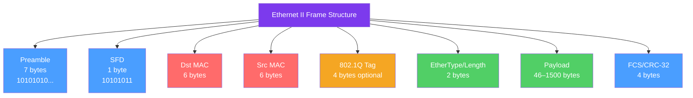

# 🔗 Data Link Layer

> [!abstract] TL;DR
> The Data Link Layer (OSI Layer 2) handles **node-to-node delivery on a single network segment**, framing bits into structured Ethernet frames, assigning 48-bit MAC addresses, detecting errors via CRC-32, and managing medium access via CSMA/CD. Switches operate at L2, forwarding frames based on MAC tables. VLANs partition a physical switch into multiple logical segments, and Spanning Tree Protocol (STP/RSTP) prevents broadcast storms caused by loops.

## Intuition — analogy FIRST

Think of the Data Link layer as the local postal service within a single city block. Layer 3 (IP) gives you a global address like "123 Main Street, New York" — but on your local block, everyone knows each other by their house number (MAC address). The Data Link layer is responsible for delivering mail from one house to another on that same block, without involving the global postal network. A switch is like a very efficient mail sorter who memorizes which house number lives at which door — so it only rings the right doorbell instead of knocking on every door (as a hub would).

---

## How It Works



## Key Concepts / Details

### Ethernet II Frame Layout

The standard Ethernet II frame format (IEEE 802.3):

| Field | Size | Purpose |
|-------|------|---------|
| **Preamble** | 7 bytes | Clock synchronization — alternating 1s and 0s |
| **SFD (Start Frame Delimiter)** | 1 byte (10101011) | Signals frame start |
| **Destination MAC** | 6 bytes | Target hardware address |
| **Source MAC** | 6 bytes | Sender hardware address |
| **802.1Q Tag** (optional) | 4 bytes | VLAN tagging (TPID 0x8100 + PCP + DEI + 12-bit VID) |
| **EtherType / Length** | 2 bytes | Protocol indicator (≥0x0600) or payload length |
| **Payload** | 46–1500 bytes | IP packet (or other L3 data) |
| **FCS / CRC-32** | 4 bytes | Frame error detection |

**Common EtherType values:**
- `0x0800` — IPv4
- `0x0806` — ARP
- `0x86DD` — IPv6
- `0x8100` — 802.1Q VLAN tagged frame

### MAC Addressing

MAC (Media Access Control) addresses are **48-bit globally unique hardware identifiers**:

```
Format: XX:XX:XX:XX:XX:XX (colon-hex notation)
Example: 00:1A:2B:3C:4D:5E

Breakdown:
  OUI (Organizationally Unique Identifier): first 3 bytes (00:1A:2B) — identifies manufacturer
  Device ID: last 3 bytes (3C:4D:5E) — unique within that manufacturer

Special addresses:
  ff:ff:ff:ff:ff:ff = Layer 2 broadcast (all devices on segment)
  01:00:5e:xx:xx:xx = IPv4 multicast range
  Least-significant bit of first byte = 0 → unicast, 1 → multicast
  Second-least-significant bit of first byte = 0 → globally administered, 1 → locally administered
```

### CSMA/CD (Carrier Sense Multiple Access / Collision Detection)

Used in half-duplex Ethernet to manage shared medium access:

1. **Carrier Sense** — Listen before transmitting; if the medium is busy, wait.
2. **Multiple Access** — Multiple nodes share the same medium.
3. **Collision Detection** — If two nodes transmit simultaneously, both detect the collision.
4. **Jam signal** — Both nodes send a 32-bit jam to ensure all nodes detect the collision.
5. **Binary Exponential Backoff** — Each node waits a random multiple of the slot time (51.2 µs for 10 Mbps), doubling the maximum wait range on each successive collision (up to 16 attempts).

> [!note] CSMA/CD is largely historical. Full-duplex switched Ethernet (every port gets its own collision domain) eliminates collisions entirely. CSMA/CA is used by Wi-Fi (avoidance, not detection).

### Hubs vs Switches

| Feature | Hub (L1) | Switch (L2) |
|---------|---------|------------|
| Forwards based on | Nothing — floods all ports | MAC address (CAM table) |
| Collision domain | All ports share one | Each port is its own |
| Broadcast domain | All ports share one | All ports share one (per VLAN) |
| Intelligence | None | Learns MAC→port mappings |
| Duplex | Half-duplex | Full-duplex per port |

**CAM table (Content Addressable Memory):** A switch learns MAC addresses by inspecting the source MAC of incoming frames and recording the port→MAC mapping. On a miss (unknown destination), it floods the frame to all ports in that VLAN. Entries age out (typically 300 seconds).

### VLANs and 802.1Q Tagging

VLANs (Virtual LANs) partition a single physical switch into multiple isolated L2 segments:

```
802.1Q Tag Structure (4 bytes inserted after Src MAC):
  TPID: 0x8100   (2 bytes — identifies as VLAN-tagged)
  TCI: (2 bytes)
    PCP: 3 bits  — Priority Code Point (0-7, for QoS)
    DEI: 1 bit   — Drop Eligible Indicator
    VID: 12 bits — VLAN ID (0–4095, 4096 possible VLANs)
```

- **Access port** — Belongs to a single VLAN; strips/adds tag transparently.
- **Trunk port** — Carries multiple VLANs; frames are tagged with the VLAN ID.
- **Native VLAN** — Untagged traffic on a trunk port belongs to the native VLAN (default VLAN 1).

### Spanning Tree Protocol (STP/RSTP)

Switches connected in a loop create broadcast storms — broadcasts circulate endlessly. STP (IEEE 802.1D) and its faster successor RSTP (802.1w) prevent this:

1. **Root Bridge Election** — Switch with lowest Bridge ID (priority + MAC) becomes root.
2. **Root Port** — Each non-root switch picks one port closest to the root.
3. **Designated Port** — One port per segment forwards towards root.
4. **Blocked Ports** — All other ports are put in blocking state to break the loop.

RSTP converges in < 1 second vs STP's 30–50 seconds, making it the modern default.

## Real-World Notes

- **ARP (Address Resolution Protocol)** operates at the boundary of L2 and L3 — it uses L2 broadcast to discover the MAC address corresponding to an L3 IP address. See [[ARP_ICMP]] for details.
- **VLAN hopping** — A security attack exploiting the native VLAN or double-tagging to send frames to a different VLAN. Mitigation: never use VLAN 1 as the native VLAN, enable port security.
- **Portfast + BPDU Guard** — Cisco features that skip STP states on access ports (fast convergence) and shut down a port if it receives a BPDU (prevents rogue switches from disrupting STP).
- **Link Aggregation (802.3ad/LACP)** — Bonds multiple physical links into one logical link for increased bandwidth and redundancy.

## Common Pitfalls

- Forgetting that switches flood frames to unknown unicast destinations — a half-empty CAM table causes unnecessary flooding.
- VLAN mismatches between trunk ports (mismatched allowed VLAN lists) cause traffic to silently vanish.
- STP topology changes (TCN) cause the CAM table to age out faster, causing temporary flooding bursts.
- Using VLAN 1 as both the native VLAN and for management traffic — a security and operational anti-pattern.

## Related Concepts

- [[OSI_Reference_Model]] — Full OSI context and encapsulation
- [[Physical_Layer]] — L1 signaling that carries L2 frames
- [[Network_Layer]] — L3 IP that rides inside L2 Ethernet frames
- [[ARP_ICMP]] — ARP bridges L2 (MAC) and L3 (IP)

## Review Questions

1. Draw the complete Ethernet II frame structure with field sizes. What is the purpose of the FCS field, and what algorithm computes it?
2. Explain how a switch learns MAC addresses and what it does when it receives a frame destined for an unknown MAC. Why can this be a security concern?
3. A network has three switches connected in a triangle (loop). Trace through the STP root bridge election and port state assignment. Which ports end up blocked?

## Sources

- IEEE 802.3 Ethernet Standard
- IEEE 802.1Q VLAN Tagging Standard
- Tanenbaum, Andrew S., *Computer Networks*, 5th ed., Ch. 4 — The Medium Access Control Sublayer

#networking #osi-fundamentals #beginner
