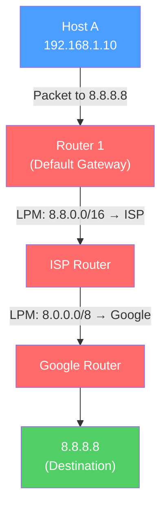

# 🛣️ Network Layer

> [!abstract] TL;DR
> The Network Layer (OSI Layer 3) provides **logical addressing and routing** — moving packets across multiple networks from source to destination. The Internet Protocol (IP) is the dominant L3 protocol, providing globally unique addresses, best-effort packet delivery, fragmentation, and TTL-based loop prevention. IPv4 uses 32-bit addresses with CIDR subnetting; IPv6 uses 128-bit addresses and eliminates router fragmentation. Routers operate at L3, making forwarding decisions based on the longest-prefix match in their routing tables.

## Intuition — analogy FIRST

If the Data Link layer is your local city postal service (delivering within a neighborhood using street addresses), the Network layer is the global postal system. The IP address is like your full mailing address including country, state, city, and zip code — it uniquely identifies you anywhere in the world. Routers are like regional sorting centers: a package doesn't need a direct route from New York to Tokyo — it hops through sorting centers (routers), each one knowing only which next hub to send it to based on the destination postal code (IP prefix), until it arrives.

NAT (Network Address Translation) is like a corporate mail room that uses one public address for the building but manages thousands of individual recipients inside.

---

## How It Works



## Key Concepts / Details

### IPv4 Header Structure

```
 0                   1                   2                   3
 0 1 2 3 4 5 6 7 8 9 0 1 2 3 4 5 6 7 8 9 0 1 2 3 4 5 6 7 8 9 0 1
+-+-+-+-+-+-+-+-+-+-+-+-+-+-+-+-+-+-+-+-+-+-+-+-+-+-+-+-+-+-+-+-+
|Version|  IHL  |Type of Service|          Total Length         |
+-+-+-+-+-+-+-+-+-+-+-+-+-+-+-+-+-+-+-+-+-+-+-+-+-+-+-+-+-+-+-+-+
|         Identification        |Flags|      Fragment Offset    |
+-+-+-+-+-+-+-+-+-+-+-+-+-+-+-+-+-+-+-+-+-+-+-+-+-+-+-+-+-+-+-+-+
|  Time to Live |    Protocol   |         Header Checksum       |
+-+-+-+-+-+-+-+-+-+-+-+-+-+-+-+-+-+-+-+-+-+-+-+-+-+-+-+-+-+-+-+-+
|                       Source Address                          |
+-+-+-+-+-+-+-+-+-+-+-+-+-+-+-+-+-+-+-+-+-+-+-+-+-+-+-+-+-+-+-+-+
|                    Destination Address                        |
+-+-+-+-+-+-+-+-+-+-+-+-+-+-+-+-+-+-+-+-+-+-+-+-+-+-+-+-+-+-+-+-+
```

| Field | Size | Purpose |
|-------|------|---------|
| **Version** | 4 bits | IP version (4 = IPv4) |
| **IHL** | 4 bits | Header length in 32-bit words (min 5 = 20 bytes) |
| **ToS/DSCP** | 8 bits | Quality of service / traffic class |
| **Total Length** | 16 bits | Total packet size including header (max 65,535 bytes) |
| **Identification** | 16 bits | Fragment reassembly identifier |
| **Flags** | 3 bits | DF (Don't Fragment), MF (More Fragments) |
| **Fragment Offset** | 13 bits | Position of this fragment in original packet |
| **TTL** | 8 bits | Hop count (decremented by each router; packet dropped at 0) |
| **Protocol** | 8 bits | Upper-layer protocol (6=TCP, 17=UDP, 1=ICMP) |
| **Header Checksum** | 16 bits | Error detection of header only |
| **Source/Destination** | 32 bits each | IP addresses |

### IPv4 Addressing and CIDR

See [[IP_Addressing_CIDR]] for full details. Key points:

- **IPv4** — 32-bit addresses, ~4.3 billion total. Written in dotted-decimal (192.168.1.10).
- **CIDR** — Classless Inter-Domain Routing; prefix notation (192.168.1.0/24 = 256 addresses).
- **Private ranges** (RFC 1918): `10.0.0.0/8`, `172.16.0.0/12`, `192.168.0.0/16`.
- **Subnet mask** — 255.255.255.0 (/24) means first 24 bits = network, last 8 bits = host.

### IPv6

IPv6 addresses the IPv4 exhaustion problem with 128-bit addresses (3.4 × 10³⁸ addresses):

```
Full format:    2001:0db8:85a3:0000:0000:8a2e:0370:7334
Abbreviated:    2001:db8:85a3::8a2e:370:7334
  Rules:
  - Leading zeros in each group can be omitted
  - One contiguous run of all-zero groups can be replaced with ::
```

| IPv6 Address Type | Prefix | Purpose |
|------------------|--------|---------|
| Global Unicast | 2000::/3 | Public internet routable |
| Link-Local | fe80::/10 | Auto-configured, local segment only |
| Loopback | ::1/128 | Localhost |
| Multicast | ff00::/8 | One-to-many |

**Key IPv6 improvements over IPv4:**
- No router fragmentation (sources use PMTUD)
- No broadcast — replaced by multicast
- ICMPv6 NDP replaces ARP for neighbor discovery
- Mandatory IPSec support
- Simplified header (no checksum, no fragmentation fields)

### Fragmentation and the DF Bit

When a packet is larger than the MTU of a link:
- **Without DF bit** — the router fragments the packet into smaller pieces; each fragment has the same Identification and different Fragment Offsets; the destination reassembles.
- **With DF (Don't Fragment) bit set** — the router drops the packet and sends an ICMP "Fragmentation Needed" message back. This enables **Path MTU Discovery (PMTUD)** — the sender discovers the smallest MTU along the path and sizes its packets accordingly.

> [!warning] PMTUD failure: if ICMP is rate-limited or blocked by a firewall, the sender never learns the MTU is too small. The result is a "black hole" — packets are silently dropped and connections hang. This is a common cause of "works for small files, hangs on large transfers."

### NAT (Network Address Translation)

NAT allows many private IPs to share a single public IP:

```
Private: 192.168.1.10:54321 → Public: 203.0.113.1:40001 → Destination: 93.184.216.34:80
         [NAT table entry: 40001 ↔ 192.168.1.10:54321]
```

**PAT (Port Address Translation)** — The most common form; uses unique port numbers to track per-session mappings. Also called NAPT or "IP masquerade."

**Limitations:** NAT breaks end-to-end connectivity, complicates protocols that embed IP addresses in payload (FTP, SIP), and is a fundamental reason IPv6 was designed (eliminates the need for NAT).

### Longest-Prefix Match Routing

Routers use the longest matching prefix (most specific route) to forward packets:

```
Routing Table:
  10.0.0.0/8    → via 192.168.1.1
  10.1.0.0/16   → via 192.168.2.1
  10.1.1.0/24   → via 192.168.3.1
  0.0.0.0/0     → via 192.168.100.1  (default route)

Destination 10.1.1.5:
  Matches /8, /16, AND /24 → use /24 (most specific) → via 192.168.3.1
```

## Real-World Notes

- **TTL values** — Windows defaults to 128, Linux to 64, routers to 255. `traceroute` exploits TTL expiry to discover hops (sends packets with TTL=1, 2, 3... and maps the ICMP Time Exceeded replies).
- **IP spoofing** — Attacker crafts packets with a forged source IP. Defenses: BCP38/uRPF (ingress filtering — drop packets whose source IP isn't reachable through the ingress interface).
- **DSCP (Differentiated Services Code Point)** — 6-bit field in the ToS byte used for Quality of Service (QoS); marks packets for priority handling (voice traffic gets EF/Expedited Forwarding, bulk gets CS1).

## Common Pitfalls

- Forgetting that IP is **best-effort** — no delivery guarantee, ordering, or error recovery (that's TCP's job at L4).
- Miscalculating subnets: the network address (all host bits 0) and broadcast address (all host bits 1) are not usable hosts.
- Setting DF without PMTUD support — results in black holes on links with smaller MTUs (e.g., VPN tunnels reduce effective MTU by ~50 bytes).
- IPv6 adoption pitfall: dual-stack misconfiguration where a host prefers IPv6 but the IPv6 path is broken — applications time out before falling back to IPv4.

## Related Concepts

- [[OSI_Reference_Model]] — Seven-layer context
- [[Data_Link_Layer]] — L2 frames that carry IP packets
- [[Transport_Layer]] — L4 TCP/UDP that rides inside IP packets
- [[IP_Addressing_CIDR]] — Full subnetting and CIDR treatment
- [[Routing_Protocols]] — How routers learn and exchange routes
- [[ARP_ICMP]] — L2/L3 bridge protocols

## Review Questions

1. Describe the IPv4 TTL field. How does `traceroute` use TTL to discover the network path to a destination?
2. A host with DF bit set sends a 1500-byte packet over a VPN tunnel with an MTU of 1450 bytes. What happens? How does Path MTU Discovery prevent this from silently breaking connections?
3. Explain NAT/PAT. Why does NAT break end-to-end connectivity, and why does IPv6 eliminate the need for NAT?

## Sources

- RFC 791 — Internet Protocol (IPv4)
- RFC 8200 — Internet Protocol Version 6 (IPv6)
- Tanenbaum, Andrew S., *Computer Networks*, 5th ed., Ch. 5 — The Network Layer

#networking #osi-fundamentals #intermediate
