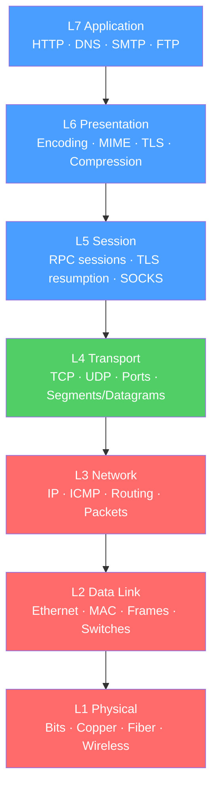

# 🌐 OSI Reference Model

> [!abstract] TL;DR
> The OSI (Open Systems Interconnection) model divides network communication into **7 ordered layers**, each serving the one above and being served by the one below. It is the shared vocabulary engineers use to isolate failures — "which layer is this problem at?" — and to reason about protocol design. The TCP/IP model collapses OSI layers 5–7 into a single Application layer, but both models remain in active use.

## Intuition — analogy FIRST

Think of sending a physical letter through an international postal system. Your intent (the message) must pass through many stages: you write it in a language (encoding), put it in an envelope (framing), address it (network addressing), drop it at a post office (transport/routing), and couriers carry it across borders (physical delivery). At each stage, a layer adds its own "envelope" on the way out and strips it on the way in. Neither you nor the recipient cares how the intermediate stages work — each layer hides its implementation from the others.

The OSI model formalizes this: each layer has a specific job, communicates with peer layers across the network, and hands its result (with a wrapper added) down to the layer below. This clean separation is why you can swap out Ethernet for Wi-Fi without rewriting TCP.

---

## How It Works



## Key Concepts / Details

### The Seven Layers

| Layer | Name | PDU Name | Key Protocols | Primary Job |
|-------|------|----------|---------------|-------------|
| 7 | Application | Data | HTTP, DNS, SMTP, FTP, SSH | User-facing services |
| 6 | Presentation | Data | TLS/SSL, MIME, ASCII, JPEG | Encoding, encryption, compression |
| 5 | Session | Data | RPC, NetBIOS, SOCKS, TLS sessions | Session management, checkpointing |
| 4 | Transport | Segment (TCP) / Datagram (UDP) | TCP, UDP, SCTP | End-to-end delivery, reliability, ports |
| 3 | Network | Packet | IP, ICMP, OSPF, BGP | Logical addressing, routing |
| 2 | Data Link | Frame | Ethernet, Wi-Fi, ARP | Physical addressing (MAC), local delivery |
| 1 | Physical | Bits | DSL, Ethernet PHY, 802.11 radio | Bit transmission over a medium |

### Encapsulation Chain

Each layer **prepends a header** (L2 also appends a trailer) as data travels down the sending stack, and **strips headers** as it travels up the receiving stack:

```
Sender                                  Receiver
------                                  --------
[Data]                  Application     [Data]
[L4 hdr][Data]          Transport       [L4 hdr][Data]
[L3 hdr][L4 hdr][Data]  Network         [L3 hdr][L4 hdr][Data]
[L2 hdr][L3...][L2 trl] Data Link       [L2 hdr][L3...][L2 trl]
bits over medium -----> Physical -----> bits over medium
```

### TCP/IP vs OSI Model Mapping

The TCP/IP model (the one actually implemented on the internet) collapses the upper three OSI layers:

| TCP/IP Layer | OSI Equivalent | Example Protocols |
|--------------|---------------|-------------------|
| Application | L5 + L6 + L7 | HTTP, DNS, SMTP, TLS |
| Transport | L4 | TCP, UDP |
| Internet | L3 | IP, ICMP |
| Link | L1 + L2 | Ethernet, Wi-Fi |

> [!tip] The key nuance: TLS spans OSI L5 (session) and L6 (presentation), but sits below HTTP (L7). In practice, "it's above TCP and below HTTP" is the useful mental model.

### MTU, MSS, and Header Overhead

Every header added by each layer consumes payload space:

- **MTU (Maximum Transmission Unit)** — the largest IP packet a link can carry; typically **1500 bytes** on Ethernet.
- **IP header** — 20 bytes minimum (no options).
- **TCP header** — 20 bytes minimum (no options).
- **MSS (Maximum Segment Size)** = MTU − IP header − TCP header = 1500 − 20 − 20 = **1460 bytes**.
- **Jumbo frames** — MTU of 9000 bytes; used in data center environments to reduce per-packet overhead.

### Layer-by-Layer Troubleshooting

OSI gives you a systematic debugging methodology:

```
Problem reported → "which layer is failing?"

L1: Can you ping across the cable? (physical)
L2: Are MAC addresses resolving correctly? (ARP/switch)
L3: Can you reach the IP? (routing, ICMP unreachable)
L4: Can you reach the port? (firewall, service listening)
L7: Is the application returning correct data?
```

## Real-World Notes

- **OSI is a reference model, TCP/IP is the implementation.** No production protocol perfectly maps 1:1 onto OSI — it is a thinking tool, not a specification.
- **L2 switches forward on MAC addresses** and never see IP. L3 routers see IP and never see MAC. This is why a switch in the wrong VLAN is an L2 problem, not L3.
- **SSL/TLS spans L5–L6** in OSI taxonomy but is typically described as "below HTTP" in practice. Both descriptions are correct in different contexts.
- **QUIC** (HTTP/3's transport) blurs L4 and L7 — it implements reliability, congestion control, and TLS in a single UDP-based protocol. The OSI map becomes approximate here.

## Common Pitfalls

- Treating OSI as a rigid protocol spec rather than a conceptual model — real protocols blur layer boundaries.
- Forgetting that the L2 Data Link layer uses MAC addresses while L3 uses IP addresses — confusing the two is the source of many "why can't I ping?" mysteries.
- Missing that each header adds overhead, so MTU mismatches with the DF bit set cause silent packet drops.
- Conflating "OSI 7 layers" with "TCP/IP 4 layers" when explaining how the internet actually works.

## Related Concepts

- [[Physical_Layer]] — L1 signal encoding, media types, bandwidth vs throughput
- [[Data_Link_Layer]] — L2 Ethernet framing, MAC addressing, switches and VLANs
- [[Network_Layer]] — L3 IP addressing, routing, fragmentation
- [[Transport_Layer]] — L4 TCP/UDP, ports, 4-tuple socket pairs
- [[_MOC_OSI_Fundamentals]] — Section MOC

## Review Questions

1. A user reports they cannot reach a website. Walk through an OSI-layer-by-layer troubleshooting approach, naming one diagnostic tool or check per layer.
2. Calculate the MSS for a standard Ethernet link. Why does the DF bit turning on without PMTUD enabled cause silent black holes?
3. TLS is often described as spanning OSI layers 5 and 6. Explain what it does at each of those layers, and why it doesn't fit cleanly into layer 7.

## Sources

- Forouzan, Behrouz A., *Data Communications and Networking*, 5th ed., Ch. 2 — Network Models
- Tanenbaum, Andrew S., *Computer Networks*, 5th ed., Ch. 1 — Introduction
- RFC 1122 — Requirements for Internet Hosts — Communication Layers

#networking #osi-fundamentals #beginner
