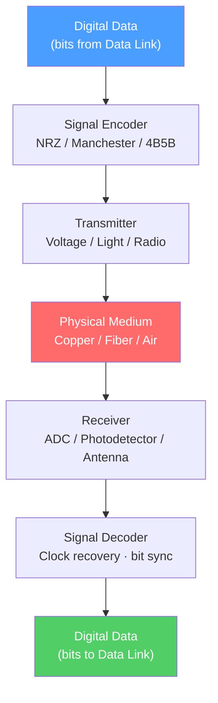

# ⚡ Physical Layer

> [!abstract] TL;DR
> The Physical Layer (OSI Layer 1) is responsible for transmitting raw **bits** over a physical medium — copper wire, optical fiber, or radio waves. It defines signal encoding schemes, media types, connector standards, and the relationship between bandwidth, throughput, and goodput. It is entirely concerned with *how* to get a 0 or a 1 from one point to another, with no awareness of what those bits mean.

## Intuition — analogy FIRST

Imagine shouting across a room versus using a megaphone, a telephone line, or a fiber-optic cable. Each medium can carry your "message" (bits), but each has different range, capacity, and noise characteristics. The Physical Layer is the physical act of speaking and hearing — it doesn't understand the language (protocol), it just moves sound (signals) from one place to another.

Signal encoding is like choosing between Morse code dots/dashes (NRZ) or a more redundant code that's easier to decode through static (4B5B). Different media (copper, fiber, radio) are like different channels with different noise floors and bandwidths.

---

## How It Works



## Key Concepts / Details

### Signal Encoding Schemes

Signal encoding converts binary bits into physical signals for transmission:

| Encoding | How It Works | Used In | Advantage |
|----------|-------------|---------|-----------|
| **NRZ (Non-Return-to-Zero)** | High voltage = 1, low = 0; stays at level | USB, simple serial | Simple, full bandwidth |
| **NRZI** | Transition on 1, no change on 0 | USB (low-speed) | Self-clocking on 1s |
| **Manchester** | Mid-bit transition: ↑ = 1, ↓ = 0 | 10BASE-T Ethernet | Built-in clock, DC-balanced |
| **4B5B** | Encodes 4 data bits into 5 transmission bits | 100BASE-TX | Eliminates long runs of 0s |
| **PAM4** | 4 voltage levels per symbol (encodes 2 bits) | 400G Ethernet, PCIe 4.0 | Doubles data rate over NRZ |

### Physical Media Types

#### Copper (Electrical)

- **UTP (Unshielded Twisted Pair)** — Cat5e (1 Gbps/100m), Cat6 (10 Gbps/55m), Cat6A (10 Gbps/100m). Twisting reduces electromagnetic interference (EMI) between pairs.
- **Coaxial** — Single conductor with shielded outer; used for cable TV, older Ethernet (10BASE2/5).
- **Fiber categories by use:** Short-reach patch cables vs long-haul backbone.

#### Optical Fiber

| Type | Core Diameter | Mode | Distance | Use Case |
|------|--------------|------|----------|----------|
| **SMF (Single-Mode Fiber)** | ~9 µm | Single light path | Up to 100 km+ | Carrier WAN, data center interconnect |
| **MMF (Multi-Mode Fiber)** | 50/62.5 µm | Multiple light paths | Up to 550m | In-building, short data center runs |
| **OM3/OM4/OM5** | 50 µm MMF grades | Multi-mode | 100m–400m at 100G | Data center |

Fiber is immune to EMI, provides much higher bandwidth than copper, but requires precision connectors (LC, SC, MPO) and is fragile.

#### Wireless (Radio Frequency)

- **2.4 GHz** — Better range/penetration, lower bandwidth, more interference.
- **5 GHz** — Higher bandwidth, shorter range.
- **6 GHz** — Wi-Fi 6E/7; widest channels, least interference, shortest range.
- **mmWave (28/39 GHz)** — 5G FR2; multi-Gbps throughput, line-of-sight only.

### Bandwidth vs Throughput vs Goodput

These three terms are frequently confused:

| Metric | Definition | Example |
|--------|-----------|---------|
| **Bandwidth** | Maximum theoretical capacity of the link | 1 Gbps Ethernet NIC |
| **Throughput** | Actual data transfer rate (after overhead, retransmissions) | 940 Mbps observed with iperf |
| **Goodput** | Application-level useful data received (after protocol overhead) | 920 Mbps of actual file data |

The gap between bandwidth and goodput grows with: protocol headers (TCP/IP/Ethernet each add their own overhead), retransmissions due to errors, and link utilization/congestion.

### Key Physical Layer Standards

```
Ethernet Standards:
10BASE-T   → 10 Mbps  over Cat3 UTP, 100m
100BASE-TX → 100 Mbps over Cat5 UTP, 100m
1000BASE-T → 1 Gbps   over Cat5e UTP, 100m, 4-pair full-duplex
10GBASE-T  → 10 Gbps  over Cat6A UTP, 100m
25/40/100GBASE-SR → Multimode fiber, data center
100GBASE-LR4 → Single-mode fiber, 10 km
```

### Collision Domains and Broadcast Domains

- **Collision domain** — Segment where two nodes transmitting simultaneously cause a collision. Each port on a switch is its own collision domain. Hubs share one collision domain.
- **Broadcast domain** — Segment that receives all broadcast frames. Switches share one broadcast domain per VLAN; routers separate broadcast domains.

## Real-World Notes

- **Link autonegotiation** — Ethernet endpoints negotiate speed (10/100/1000 Mbps) and duplex (half/full) via Fast Link Pulses (FLPs). A mismatch (one end forced full-duplex, other auto-negotiates to half) causes a duplex mismatch — high errors and collisions despite the link appearing up.
- **dB and signal strength** — Loss in fiber is measured in dB; a typical SMF link budget for 10 km is ~3.5 dB. Exceeding the loss budget causes bit errors and CRC failures.
- **PoE (Power over Ethernet)** — 802.3af/at/bt allows switches to deliver up to 90W over UTP to power IP phones, cameras, and Wi-Fi APs — all at L1.

## Common Pitfalls

- Confusing bandwidth (link capacity) with throughput (actual measured rate) — these differ by 5–20% even on a healthy link.
- Ignoring duplex mismatches — a half/full duplex mismatch causes late collisions and poor throughput, often misdiagnosed as a hardware failure.
- Mixing SMF and MMF transceivers — the fiber types are incompatible; connecting them causes no signal or severe power loss.
- Overlooking the fiber bend radius limit — sharp bends in SMF cause signal loss (microbending).

## Related Concepts

- [[OSI_Reference_Model]] — The full seven-layer model context
- [[Data_Link_Layer]] — L2 Ethernet framing that rides on top of L1
- [[WiFi_Standards_802_11]] — Wireless physical layer specifics for 802.11

## Review Questions

1. A 1 Gbps Ethernet link is transferring a file. The measured throughput is 750 Mbps. List three possible causes for the gap between 1 Gbps and 750 Mbps.
2. Explain the difference between single-mode and multi-mode fiber. Why is SMF used for WAN links and MMF for data center patching?
3. Two switches are connected with a cable. One port is forced to full-duplex at 100 Mbps; the other is set to auto-negotiate. What happens, and what symptom will you observe?

## Sources

- Forouzan, Behrouz A., *Data Communications and Networking*, 5th ed., Ch. 3 — Data and Signals
- IEEE 802.3 Ethernet Standard — Clause 28 (Auto-Negotiation)
- Stallings, William, *Data and Computer Communications*, 10th ed., Ch. 4 — Transmission Media

#networking #osi-fundamentals #beginner
