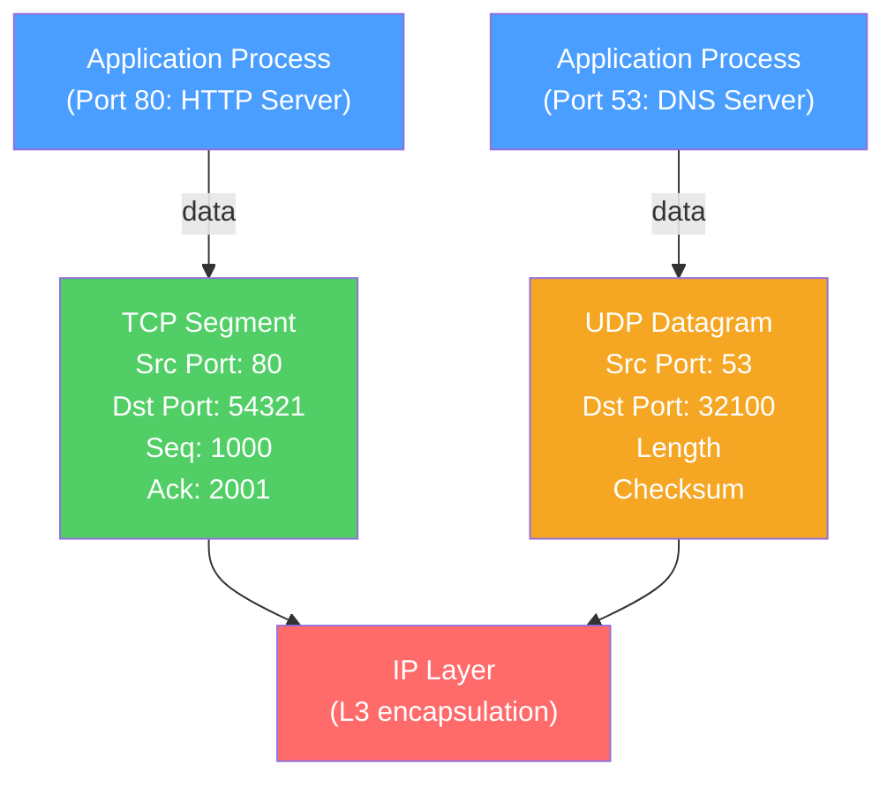

# 🚚 Transport Layer

> [!abstract] TL;DR
> The Transport Layer (OSI Layer 4) provides **end-to-end communication** between processes on different hosts, using port numbers to multiplex multiple services over a single IP address. TCP provides reliable, ordered, connection-oriented delivery with flow control and congestion control. UDP provides fast, connectionless, unreliable delivery for latency-sensitive applications. The 4-tuple (src IP, src port, dst IP, dst port) uniquely identifies every connection.

## Intuition — analogy FIRST

Imagine the Network Layer (IP) as a delivery truck that can get packages to the right building (IP address), but has no way to know which apartment to deliver to inside. The Transport Layer adds **apartment numbers** (port numbers) so the right application gets the right data.

TCP is like certified mail with return receipts — the delivery is guaranteed, acknowledged, and ordered, but there's paperwork overhead. UDP is like dropping a flyer in a public mailbox — fast and cheap, but no guarantee it arrives or arrives in order. Your choice of protocol depends on whether you need guaranteed delivery (TCP for web browsing) or need the lowest latency (UDP for gaming, video calls).

---

## How It Works



## Key Concepts / Details

### Port Numbers

Ports allow a single IP address to run multiple services simultaneously:

| Range | Name | Usage |
|-------|------|-------|
| 0–1023 | Well-known / System | HTTP (80), HTTPS (443), SSH (22), DNS (53), SMTP (25) |
| 1024–49151 | Registered | Application servers, registered with IANA |
| 49152–65535 | Ephemeral / Dynamic | Client-side, OS-assigned per connection |

**The 4-tuple uniquely identifies a connection:**
```
(Source IP : Source Port, Destination IP : Destination Port)
e.g. (192.168.1.10:54321, 93.184.216.34:80)
```

### TCP Segment Header

```
 0                   1                   2                   3
 0 1 2 3 4 5 6 7 8 9 0 1 2 3 4 5 6 7 8 9 0 1 2 3 4 5 6 7 8 9 0 1
+-+-+-+-+-+-+-+-+-+-+-+-+-+-+-+-+-+-+-+-+-+-+-+-+-+-+-+-+-+-+-+-+
|          Source Port          |       Destination Port        |
+-+-+-+-+-+-+-+-+-+-+-+-+-+-+-+-+-+-+-+-+-+-+-+-+-+-+-+-+-+-+-+-+
|                        Sequence Number                        |
+-+-+-+-+-+-+-+-+-+-+-+-+-+-+-+-+-+-+-+-+-+-+-+-+-+-+-+-+-+-+-+-+
|                    Acknowledgment Number                      |
+-+-+-+-+-+-+-+-+-+-+-+-+-+-+-+-+-+-+-+-+-+-+-+-+-+-+-+-+-+-+-+-+
|  Data |           |U|A|P|R|S|F|                               |
| Offset| Reserved  |R|C|S|S|Y|I|            Window             |
|       |           |G|K|H|T|N|N|                               |
+-+-+-+-+-+-+-+-+-+-+-+-+-+-+-+-+-+-+-+-+-+-+-+-+-+-+-+-+-+-+-+-+
|           Checksum            |         Urgent Pointer        |
+-+-+-+-+-+-+-+-+-+-+-+-+-+-+-+-+-+-+-+-+-+-+-+-+-+-+-+-+-+-+-+-+
```

Key TCP flags:
- **SYN** — Synchronize sequence numbers (connection setup)
- **ACK** — Acknowledge received data
- **FIN** — Finish (graceful close)
- **RST** — Reset (abrupt close)
- **PSH** — Push data to application immediately

### TCP Three-Way Handshake

```
Client                          Server
  |                               |
  |------- SYN (seq=x) ---------->|  Client initiates
  |                               |
  |<-- SYN-ACK (seq=y, ack=x+1)--|  Server accepts
  |                               |
  |------- ACK (ack=y+1) -------->|  Client confirms
  |                               |
  |<===== Data Exchange =========|
```

### TCP Four-Way Close

```
Client                          Server
  |                               |
  |--- FIN (seq=m) -------------->|  Client done sending
  |<-- ACK (ack=m+1) ------------|  Server acknowledges
  |                               |  (Server may still send data)
  |<-- FIN (seq=n) --------------|  Server done sending
  |--- ACK (ack=n+1) ----------->|  Client acknowledges
  |                               |
  |   [TIME_WAIT: 2×MSL] --------|
```

**TIME_WAIT** — The client waits 2×MSL (Maximum Segment Lifetime, typically 60s = 120s total) after sending the final ACK. This ensures:
1. The final ACK reaches the server (if lost, server retransmits FIN and client re-ACKs).
2. Any delayed segments from the old connection die before the port is reused.

> [!warning] TIME_WAIT port exhaustion: at high connection rates (e.g., short-lived HTTP/1.0 connections), TIME_WAIT sockets can exhaust the ephemeral port range (~28,000 ports). Solutions: `tcp_tw_reuse`, `SO_REUSEADDR`, HTTP keep-alive, or connection pooling.

### UDP Header (8 bytes)

```
+-+-+-+-+-+-+-+-+-+-+-+-+-+-+-+-+-+-+-+-+-+-+-+-+-+-+-+-+-+-+-+-+
|          Source Port          |       Destination Port        |
+-+-+-+-+-+-+-+-+-+-+-+-+-+-+-+-+-+-+-+-+-+-+-+-+-+-+-+-+-+-+-+-+
|            Length             |           Checksum            |
+-+-+-+-+-+-+-+-+-+-+-+-+-+-+-+-+-+-+-+-+-+-+-+-+-+-+-+-+-+-+-+-+
```

UDP provides: port multiplexing, optional checksum (mandatory in IPv6). No connection setup, no ACKs, no ordering, no retransmission.

### TCP vs UDP Comparison

| Feature | TCP | UDP |
|---------|-----|-----|
| Connection | Connection-oriented (3-way handshake) | Connectionless |
| Reliability | Guaranteed delivery (retransmission) | Best-effort (no retransmission) |
| Ordering | Ordered delivery | No ordering guarantee |
| Flow Control | Yes (sliding window, rwnd) | No |
| Congestion Control | Yes (AIMD, CUBIC, BBR) | No (application's responsibility) |
| Overhead | 20+ byte header, RTT latency | 8-byte header, no setup latency |
| Use Cases | HTTP/S, SSH, SMTP, database | DNS, DHCP, video streaming, gaming, QUIC |

### Flow Control (TCP Sliding Window)

TCP's **receive window (rwnd)** prevents the sender from overwhelming the receiver:
- Receiver advertises `rwnd` (available buffer space) in every ACK.
- Sender cannot have more than `min(cwnd, rwnd)` bytes in flight.
- When `rwnd = 0`, the sender stops and probes with 1-byte segments.

### Common Well-Known Ports

| Port | Protocol | Service |
|------|----------|---------|
| 20/21 | TCP | FTP (data/control) |
| 22 | TCP | SSH |
| 23 | TCP | Telnet |
| 25 | TCP | SMTP |
| 53 | TCP/UDP | DNS |
| 67/68 | UDP | DHCP (server/client) |
| 80 | TCP | HTTP |
| 110 | TCP | POP3 |
| 143 | TCP | IMAP |
| 443 | TCP | HTTPS |
| 465/587 | TCP | SMTP over TLS |
| 3306 | TCP | MySQL |
| 5432 | TCP | PostgreSQL |

## Real-World Notes

- **Nagle's Algorithm** — TCP buffers small writes and coalesces them into larger segments to reduce overhead. Disable with `TCP_NODELAY` for latency-sensitive applications (real-time trading, gaming).
- **Delayed ACK** — TCP waits ~40ms before sending a standalone ACK, hoping to piggyback it on a data segment. Combined with Nagle, this can cause a 40ms stall. Disable Nagle on the sender, or disable delayed ACK on the receiver.
- **QUIC** — HTTP/3's transport (RFC 9000) implements reliability, ordering, and TLS entirely within UDP datagrams, providing TCP-like guarantees with per-stream HoL blocking elimination.

## Common Pitfalls

- Using TCP where UDP would suffice (e.g., DNS, syslog) — the handshake and ACK overhead is unnecessary.
- Ignoring TIME_WAIT at high connection rates — short-lived connections exhaust ephemeral ports.
- Setting `SO_LINGER` with timeout=0 to avoid TIME_WAIT — sends RST instead of FIN, which can corrupt in-flight data.
- Forgetting that UDP checksum is optional in IPv4 — disabled checksums mean silent data corruption goes undetected.

## Related Concepts

- [[OSI_Reference_Model]] — Seven-layer context
- [[Network_Layer]] — IP packets that carry TCP/UDP segments
- [[TCP_Protocol]] — Deep dive on TCP reliability and congestion control
- [[UDP_Protocol]] — UDP use cases, multicast, and applications

## Review Questions

1. Explain the TCP three-way handshake and four-way close. Why does TIME_WAIT exist, and what problem can it cause in high-throughput services?
2. A game server uses UDP. Explain two reasons UDP is preferred over TCP for real-time gaming, and describe how the application might compensate for lost packets.
3. What is the effective send window in TCP, and which two mechanisms does it depend on? How does a zero receive window affect the sender?

## Sources

- RFC 793 — Transmission Control Protocol (TCP)
- RFC 768 — User Datagram Protocol (UDP)
- Stevens, W. Richard, *TCP/IP Illustrated, Volume 1*, Ch. 12–18

#networking #osi-fundamentals #intermediate
