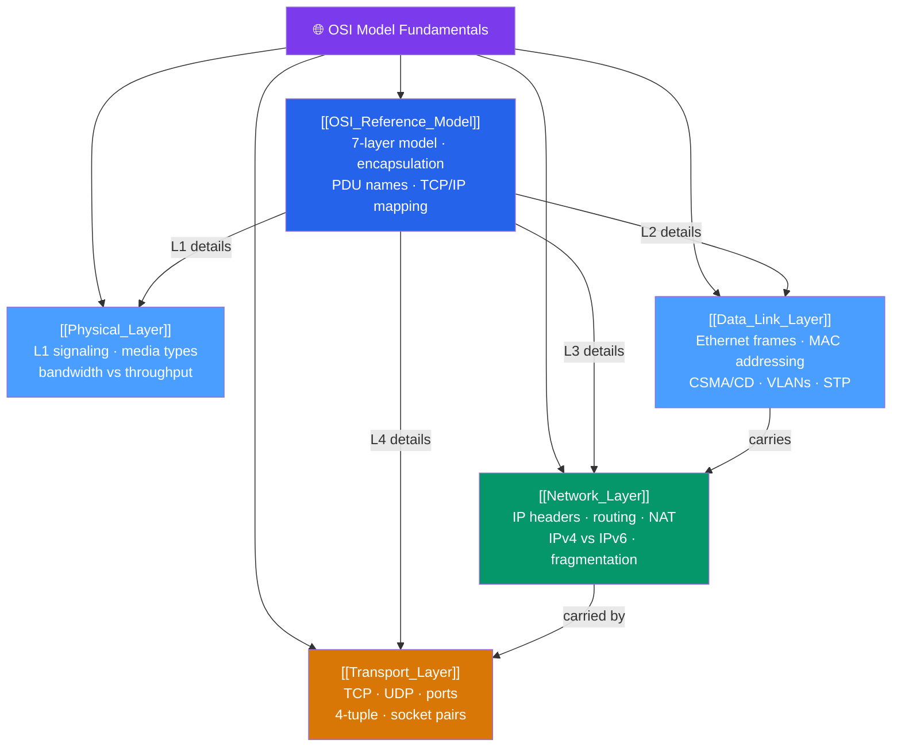

# 🗺️ OSI Model Fundamentals — Map of Content

> [!abstract] What This Section Covers
> The seven-layer OSI model is the shared vocabulary of networking — the first question in any outage is "which layer is this failing at?" This section builds your mental model layer by layer: physical signaling and media types (L1), Ethernet framing, MAC addressing, and switching (L2), IP routing and fragmentation (L3), and TCP/UDP transport (L4). It covers the full encapsulation chain (data → segment → packet → frame → bits), PDU names, MTU/MSS relationships, and how to use the layered model as a systematic troubleshooting method. A firm grasp of OSI is the prerequisite for everything else in this vault.

## Concept Map

## Learning Path

1. [[OSI_Reference_Model]] — The seven-layer model, how TCP/IP maps onto it, encapsulation chain, and PDU names.
2. [[Physical_Layer]] — Signal encoding, media types (copper/fiber/wireless), bandwidth vs throughput vs goodput.
3. [[Data_Link_Layer]] — Ethernet II frame layout, MAC addressing, CSMA/CD, switches vs hubs, VLANs, STP.
4. [[Network_Layer]] — IPv4/IPv6 headers, CIDR, fragmentation, NAT, routing basics.
5. [[Transport_Layer]] — TCP segment structure, UDP datagram, ports, 4-tuple socket pairs.

## All Notes at a Glance

| Note | Difficulty | What You'll Learn |
|------|------------|-------------------|
| [[OSI_Reference_Model]] | Beginner | The 7-layer OSI model, TCP/IP mapping, encapsulation and PDU names, layer-by-layer troubleshooting |
| [[Physical_Layer]] | Beginner | Signal encoding (NRZ, Manchester, 4B5B), copper/fiber/wireless media, bandwidth vs throughput vs goodput |
| [[Data_Link_Layer]] | Beginner → Intermediate | Ethernet II frame, 48-bit MAC addressing, CSMA/CD, hubs vs switches, VLANs and 802.1Q, STP/RSTP |
| [[Network_Layer]] | Intermediate | IPv4 header fields, IPv6 addressing, CIDR, subnet math, NAT/PAT, DF bit and fragmentation |
| [[Transport_Layer]] | Intermediate | TCP 3-way handshake, segment structure, UDP header, ports, 4-tuple socket pair, TIME_WAIT |

## Key Questions This Section Answers

- What is the difference between the OSI model and the TCP/IP model, and why do both still matter?
- What is encapsulation, and what PDU name does each layer use?
- How does signal encoding work, and what is the difference between bandwidth and throughput?
- How does an Ethernet frame differ from an IP packet, and what does a switch do with each?
- How does CIDR subnetting work, and what are IPv4 vs IPv6's key differences?
- What is the 4-tuple that identifies a TCP connection, and what happens during TIME_WAIT?

## Related Sections

- [[_MOC_Networking_Master|↑ Networking Master MOC]]
- [[_MOC_TCPIP_Protocols|→ TCP/IP Protocols]]
- [[_MOC_Network_Security|→ Network Security]]

#MOC #Networking #OSI
