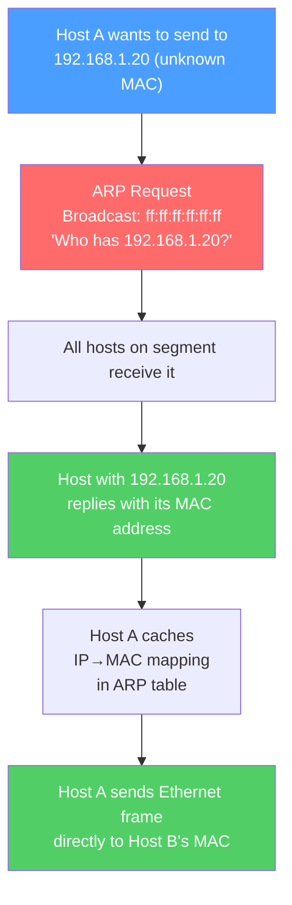

# 🔍 ARP and ICMP

> [!abstract] TL;DR
> **ARP (Address Resolution Protocol)** bridges Layer 2 (MAC addresses) and Layer 3 (IP addresses), resolving "What is the MAC address for IP X?" through broadcast request and unicast reply. **ICMP (Internet Control Message Protocol)** is the network's diagnostic and error-reporting layer — it powers ping (echo request/reply), traceroute (TTL expiry), and Path MTU Discovery (fragmentation needed). ICMPv6 extends ICMP to also handle neighbor discovery (replacing ARP) in IPv6 networks.

## Intuition — analogy FIRST

**ARP** is like asking your building's lobby — "Does anyone know room 4B?" You shout the question to everyone in the hallway (broadcast). The person in room 4B shouts back with their apartment number (MAC address), and you write it on a sticky note (ARP cache) so you don't have to ask again.

**ICMP** is like the postal system's notification service. When a package can't be delivered (destination unreachable), the post office sends you a card explaining why. When you send a probe letter to measure delivery time (ping), the recipient sends back a confirmation with a timestamp. Traceroute works like sending letters with a "self-destruct after N post offices" instruction — each post office that destroys the letter must send back a notification, revealing itself.

---

## How It Works



## Key Concepts / Details

### ARP (Address Resolution Protocol)

**ARP packet structure:**

```
Field                   Size    Value
Hardware Type           2B      0x0001 (Ethernet)
Protocol Type           2B      0x0800 (IPv4)
Hardware Address Len    1B      6 (MAC = 6 bytes)
Protocol Address Len    1B      4 (IPv4 = 4 bytes)
Operation               2B      1=Request, 2=Reply
Sender Hardware Addr    6B      Sender's MAC
Sender Protocol Addr    4B      Sender's IP
Target Hardware Addr    6B      0:0:0:0:0:0 in request; target MAC in reply
Target Protocol Addr    4B      Requested IP
```

**ARP process:**

1. **ARP Request** — Broadcast (dst MAC = ff:ff:ff:ff:ff:ff): "Who has 10.0.0.5? Tell 10.0.0.1."
2. **ARP Reply** — Unicast back to requester: "10.0.0.5 is at AA:BB:CC:DD:EE:FF."
3. **ARP Cache** — Both sender and receiver cache the MAC→IP mapping. Typical timeout: 20 minutes (Linux), 10 minutes (Windows).

**Gratuitous ARP** — A host ARPs for its own IP address:
- Announces its MAC to all neighbors on startup (cache refresh).
- Used in failover: the new active node sends gratuitous ARP so switches update their CAM tables.
- Used to detect IP conflicts (if someone replies, there's a duplicate IP).

**ARP Poisoning (ARP Spoofing)** — An attacker sends fake ARP replies claiming their MAC corresponds to the gateway's IP. All hosts update their ARP cache and send traffic to the attacker (Man-in-the-Middle). Defense: Dynamic ARP Inspection (DAI) on switches validates ARP against DHCP snooping table.

### IPv6 Neighbor Discovery Protocol (NDP)

IPv6 replaces ARP with **NDP (Neighbor Discovery Protocol)** using ICMPv6:

| Function | IPv4 | IPv6 |
|---------|------|------|
| Layer 2 address resolution | ARP broadcast | ICMPv6 Neighbor Solicitation (multicast) |
| Duplicate address detection | Gratuitous ARP | ICMPv6 DAD (Duplicate Address Detection) |
| Router discovery | DHCP router option | ICMPv6 Router Advertisement (RA) |
| DHCP | DHCPv4 | DHCPv6 or SLAAC (stateless) |

NDP uses link-scope multicast (ff02::1 = all nodes, ff02::2 = all routers) instead of broadcast, reducing unnecessary interruptions.

### ICMP (Internet Control Message Protocol)

ICMP is encapsulated directly in IP (protocol number 1 for ICMPv4, 58 for ICMPv6). It is **not** a transport protocol — it carries control messages about IP delivery.

**Key ICMP message types:**

| Type | Code | Name | Meaning |
|------|------|------|---------|
| 0 | 0 | Echo Reply | Response to ping |
| 3 | 0 | Destination Unreachable — Network | No route to destination network |
| 3 | 1 | Destination Unreachable — Host | Host unreachable |
| 3 | 3 | Destination Unreachable — Port | Port not listening (UDP) |
| 3 | 4 | Fragmentation Needed | Packet too large, DF bit set |
| 8 | 0 | Echo Request | Ping request |
| 11 | 0 | Time Exceeded — TTL | TTL reached zero in transit |
| 11 | 1 | Time Exceeded — Reassembly | Fragment reassembly timeout |
| 12 | 0 | Parameter Problem | Bad IP header |

### Ping (ICMP Echo Request/Reply)

```bash
# Basic ping
ping 8.8.8.8

# Output:
64 bytes from 8.8.8.8: icmp_seq=1 ttl=118 time=12.3 ms
64 bytes from 8.8.8.8: icmp_seq=2 ttl=118 time=11.9 ms

# ttl=118: Google's TTL starts at 128, passed through 10 routers (128-10=118)
# time: Round-trip time (RTT) in milliseconds
```

Ping sends ICMP Type 8 (Echo Request) and expects ICMP Type 0 (Echo Reply). It proves:
- L3 reachability (IP routing works to the destination)
- The destination is up and responding
- Basic RTT measurement

Ping does **not** prove: application availability, port reachability, or route symmetry.

### Traceroute / Tracert

Traceroute exploits the **TTL field** to discover hops along a path:

```
Probe 1: TTL=1 → First router decrements to 0 → Sends ICMP Time Exceeded → Reveals router 1's IP
Probe 2: TTL=2 → Second router decrements to 0 → Reveals router 2's IP
Probe N: TTL=N → Packet reaches destination → ICMP Port Unreachable (Linux: UDP probes)
                                              or ICMP Echo Reply (Windows: ICMP probes)
```

```bash
# Linux traceroute output:
traceroute 8.8.8.8
 1  192.168.1.1   1.2 ms    (home router)
 2  10.50.0.1     8.4 ms    (ISP gateway)
 3  72.14.194.1   10.1 ms   (Google edge)
 4  8.8.8.8       12.3 ms   (destination)

# * * * means: router doesn't send ICMP Time Exceeded (rate-limited or blocked)
```

### Path MTU Discovery (PMTUD)

PMTUD finds the smallest MTU along a path to avoid fragmentation:

1. Sender sends packets with **DF (Don't Fragment) bit set**.
2. If a router encounters a link with smaller MTU, it sends **ICMP Type 3, Code 4 (Fragmentation Needed)** back with the next-hop MTU.
3. Sender reduces its packet size and retries.
4. Converges to the path MTU.

**PMTUD failure ("black hole"):** If firewalls block ICMP Type 3, Code 4, the sender never learns the MTU is too small. Connection silently hangs for large transfers. Fix: `tcp_mtu_probing` (Linux) or PLPMTUD (RFC 4821 for UDP).

## Real-World Notes

- **ARP table inspection:** `arp -n` (Linux) or `arp -a` (Windows) shows the cached IP→MAC mappings. Useful for diagnosing duplicate IPs or MITM.
- **ICMP rate limiting:** Linux kernels rate-limit ICMP responses by default (`net.ipv4.icmp_ratelimit`). High-rate pings show packet loss even on a healthy link.
- **Firewall ICMP policy:** Blocking all ICMP breaks PMTUD, disables traceroute, and eliminates "connection refused" messages. Best practice: allow ICMP Type 3 (unreachable), Type 4 (source quench), and Type 11 (time exceeded) even on strict firewalls.

## Common Pitfalls

- Assuming "ping works = application works" — ping tests L3, not L4 or L7. A web server can be unreachable on port 443 while accepting pings on the same IP.
- Not updating ARP cache after a failover — if gratuitous ARP is blocked or the ARP cache hasn't expired, traffic continues going to the old MAC.
- Blocking ICMP Type 3 Code 4 on firewalls — breaks PMTUD and causes mysterious large-file transfer hangs.
- ARP storms — a misconfigured device generating ARP requests for every IP in a large subnet can saturate network bandwidth.

## Related Concepts

- [[Data_Link_Layer]] — ARP operates at the L2/L3 boundary
- [[Network_Layer]] — ICMP is an IP-level protocol
- [[IP_Addressing_CIDR]] — IP addresses that ARP and ICMP operate on
- [[Network_Attacks]] — ARP poisoning and ICMP-based attacks

## Review Questions

1. A host sends an ARP request for 192.168.1.50. Walk through the complete ARP exchange: what is the destination MAC in the request, who receives it, and what does the response look like?
2. Explain how traceroute discovers each hop using ICMP TTL. Why do some hops show `* * *` (three asterisks)?
3. A user reports that a file transfer to a remote server works for small files but hangs indefinitely for files > 1 MB. You suspect a PMTUD black hole. Explain what is happening and how you would diagnose and fix it.

## Sources

- RFC 826 — An Ethernet Address Resolution Protocol
- RFC 792 — Internet Control Message Protocol (ICMP)
- RFC 4861 — Neighbor Discovery for IP version 6 (IPv6) — NDP
- Stevens, W. Richard, *TCP/IP Illustrated, Volume 1*, Ch. 4–7

#networking #tcpip-protocols #beginner
