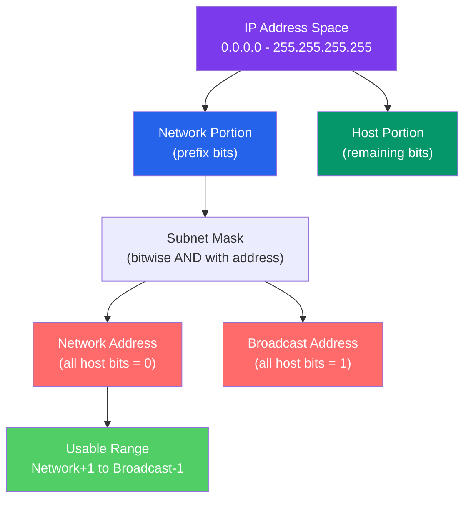

# 🗺️ IP Addressing and CIDR

> [!abstract] TL;DR
> IP addressing assigns globally unique logical identifiers to network interfaces. **IPv4** uses 32-bit addresses in dotted-decimal notation; **CIDR** (Classless Inter-Domain Routing) replaced the old class system with flexible prefix lengths (e.g., /24), enabling efficient subnet allocation. **IPv6** uses 128-bit addresses to solve IPv4 exhaustion. Subnet arithmetic — ANDing address with mask to find the network, computing host range, understanding VLSM — is a fundamental skill for network engineers, cloud architects, and anyone configuring VPCs.

## Intuition — analogy FIRST

IP addresses work like postal codes. A postal code like 94105 identifies a specific neighborhood (network) and a specific building (host) within that area. The "prefix length" (/24, /16) is like how many digits of the postal code identify the region — a /8 prefix is like specifying just a country code (huge region, millions of buildings), while a /30 prefix is like specifying a specific block (4 addresses, 2 usable hosts).

CIDR lets network administrators carve up address space the same way you'd divide a large office building into floors and rooms — no fixed room sizes, just efficient allocation based on actual need.

---

## How It Works



## Key Concepts / Details

### IPv4 Addressing

IPv4 addresses are **32-bit** values written in **dotted-decimal notation**:

```
192.168.1.100
  ↓
11000000.10101000.00000001.01100100 (binary)
```

**CIDR Notation:** `192.168.1.0/24`
- `/24` means the first 24 bits are the network prefix
- Last 8 bits are the host portion (256 addresses)

### Subnet Math Step-by-Step

For `192.168.1.100/24`:

```
Address:     192.168.  1.100   = 11000000.10101000.00000001.01100100
Mask (/24):  255.255.255.  0   = 11111111.11111111.11111111.00000000
                                  └──── network ────┘└─ host ─┘

Network:     192.168.  1.  0   = 11000000.10101000.00000001.00000000
Broadcast:   192.168.  1.255   = 11000000.10101000.00000001.11111111
First host:  192.168.  1.  1
Last host:   192.168.  1.254
Usable hosts: 2^(32-24) - 2 = 254
```

### Common Prefix Lengths Reference Table

| CIDR | Subnet Mask | # Addresses | Usable Hosts | Use Case |
|------|-------------|-------------|--------------|----------|
| /8 | 255.0.0.0 | 16,777,216 | 16,777,214 | Class A (historical) |
| /16 | 255.255.0.0 | 65,536 | 65,534 | Class B (historical) |
| /24 | 255.255.255.0 | 256 | 254 | Most common LAN subnet |
| /25 | 255.255.255.128 | 128 | 126 | Split /24 into 2 |
| /26 | 255.255.255.192 | 64 | 62 | Small department |
| /27 | 255.255.255.224 | 32 | 30 | DMZ/small subnet |
| /28 | 255.255.255.240 | 16 | 14 | Small group |
| /29 | 255.255.255.248 | 8 | 6 | Minimal subnet |
| /30 | 255.255.255.252 | 4 | 2 | Point-to-point links |
| /31 | 255.255.255.254 | 2 | 2 | P2P (RFC 3021, no network/broadcast) |
| /32 | 255.255.255.255 | 1 | 1 | Host route, loopback |

### RFC 1918 Private Address Ranges

These are **not routed on the public internet** — used for private networks and VPCs:

| Range | CIDR | Total Addresses | Typical Use |
|-------|------|-----------------|-------------|
| 10.0.0.0 – 10.255.255.255 | 10.0.0.0/8 | 16,777,216 | Large enterprise, cloud VPCs |
| 172.16.0.0 – 172.31.255.255 | 172.16.0.0/12 | 1,048,576 | Docker default, medium enterprise |
| 192.168.0.0 – 192.168.255.255 | 192.168.0.0/16 | 65,536 | Home networks, small office |

Other special ranges:
- `127.0.0.0/8` — Loopback (127.0.0.1 is localhost)
- `169.254.0.0/16` — Link-local (APIPA — assigned when DHCP fails)
- `0.0.0.0/0` — Default route (matches everything)

### VLSM (Variable-Length Subnet Masking)

VLSM allows subnets of different sizes from the same address block — allocating only what's needed:

```
Given: 192.168.10.0/24 (256 addresses)

Need: 
  - 1 subnet for 100 hosts → /25 (126 hosts): 192.168.10.0/25
  - 1 subnet for 50 hosts  → /26 (62 hosts):  192.168.10.128/26
  - 1 subnet for 25 hosts  → /27 (30 hosts):  192.168.10.192/27
  - 1 P2P link             → /30 (2 hosts):   192.168.10.224/30
  
  Total used: 128 + 64 + 32 + 4 = 228/256 addresses — no waste
```

### IPv6 Addressing

IPv6 addresses are **128-bit** (8 groups of 4 hex digits):

```
Full:     2001:0db8:85a3:0000:0000:8a2e:0370:7334
Short:    2001:db8:85a3::8a2e:370:7334
Rules:
  1. Drop leading zeros in each group: 0db8 → db8, 0000 → 0
  2. Replace one consecutive run of all-zero groups with :: (only once)
```

**IPv6 Address Types:**

| Type | Prefix | Example | Purpose |
|------|--------|---------|---------|
| Global Unicast | 2000::/3 | 2001:db8::1 | Public internet (like public IPv4) |
| Link-Local | fe80::/10 | fe80::1 | Auto-configured, same link only |
| Loopback | ::1/128 | ::1 | Localhost (like 127.0.0.1) |
| Unique Local | fc00::/7 | fd00::1 | Private (like RFC 1918) |
| Multicast | ff00::/8 | ff02::1 | One-to-many groups |

**IPv6 subnets:** The standard allocation is a /64 for each LAN — 64 host bits, using EUI-64 (derived from MAC address) or DHCPv6 for host assignment.

### Dual-Stack and Transition Mechanisms

During IPv4→IPv6 transition:
- **Dual-stack** — Host runs both IPv4 and IPv6 simultaneously; prefers IPv6 (RFC 6724 address selection).
- **6in4 tunneling** — IPv6 packets encapsulated in IPv4 packets (protocol 41).
- **Teredo** — IPv6 over UDP/IPv4 NAT traversal for hosts behind NAT.
- **NAT64/DNS64** — Translates IPv6-only clients accessing IPv4 services.

## Real-World Notes

- **Cloud VPC addressing** — AWS VPC requires a private IPv4 CIDR block (/16 to /28). Planning non-overlapping CIDRs before provisioning is critical — VPC peering and Transit Gateway connections fail silently if CIDRs overlap.
- **Supernetting (route aggregation)** — BGP routers summarize multiple /24 prefixes into a single /16 advertisement, reducing routing table size. The aggregate must cover all specific prefixes.
- **DHCP exhaustion** — A /24 with 254 hosts runs out quickly in large offices; /23 or /22 subnets (510/1022 usable hosts) are common for large LANs.

## Common Pitfalls

- Forgetting to subtract 2 from 2^(host bits) for the unusable network and broadcast addresses.
- Overlapping subnets in multi-site VPN or cloud peering — causes routing ambiguity and traffic black holes.
- Using /31 or /30 incorrectly: /31 (RFC 3021) is valid for point-to-point links with no network/broadcast; /30 wastes 2 addresses per link but is more widely supported.
- Confusing IPv6 scope: link-local (fe80::/10) addresses are only reachable on the same segment — routing them fails.

## Related Concepts

- [[Network_Layer]] — OSI L3 context for IP
- [[Routing_Protocols]] — How routers exchange prefix information
- [[ARP_ICMP]] — ARP resolves IP to MAC; ICMPv6 NDP does the same for IPv6
- [[Cloud_Networking_AWS_Azure]] — VPC CIDR design for cloud

## Review Questions

1. Given the network 10.10.0.0/21, calculate: the subnet mask, the total number of addresses, the usable host range, and the broadcast address.
2. Design a VLSM addressing plan for an office with: 200 hosts in the engineering VLAN, 60 hosts in the HR VLAN, 30 hosts in the guest VLAN, and 2 point-to-point WAN links. Start from 192.168.50.0/24.
3. Explain how IPv6 link-local addresses are auto-configured (EUI-64), and why they cannot be routed across networks.

## Sources

- RFC 4632 — Classless Inter-Domain Routing (CIDR): The Internet Address Assignment and Aggregation Plan
- RFC 4291 — IP Version 6 Addressing Architecture
- RFC 1918 — Address Allocation for Private Internets

#networking #tcpip-protocols #intermediate
