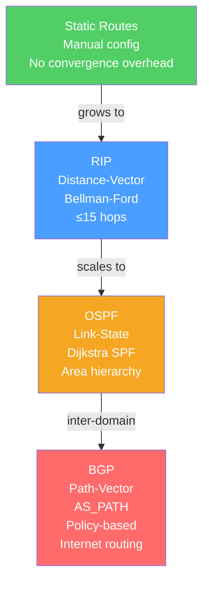

# 🛤️ Routing Protocols

> [!abstract] TL;DR
> Routing protocols enable routers to automatically discover and share information about network paths, building the routing tables that drive longest-prefix-match forwarding. **RIP** uses distance-vector (Bellman-Ford, hop count), **OSPF** uses link-state (Dijkstra SPF, areas, cost = 10⁸/bandwidth), and **BGP** uses path-vector (AS_PATH attributes, policy-based, the internet's inter-domain protocol). Each solves a different scale problem: RIP for tiny networks, OSPF for enterprise, BGP for the global internet.

## Intuition — analogy FIRST

Think of three navigation strategies:

**RIP** is like asking your neighbor for directions and them saying "3 turns left." You don't know the road quality or distances — just hop count. After 15 hops, you refuse to go further (maximum hop count = 15).

**OSPF** is like every router having a complete road map of the city. Each router broadcasts its direct link conditions (speed, cost) so all routers build an identical map, then run Dijkstra's algorithm independently to find the shortest path. When a road closes, the map updates and all routers reroute simultaneously.

**BGP** is like international border crossings — each country (AS = Autonomous System) announces which destinations it can reach, through which countries. Routing decisions are policy-driven: prefer routes through allied countries over cheaper routes through adversaries. BGP is intentionally not optimal — it is controllable.

---

## How It Works



## Key Concepts / Details

### Static vs Dynamic Routing

| Feature | Static | Dynamic |
|---------|--------|---------|
| Configuration | Manual per router | Protocol learns routes automatically |
| Convergence | Instant (human) | Seconds to minutes |
| Overhead | None | CPU/memory/bandwidth for protocol |
| Scalability | Poor (100+ routers = impractical) | Excellent |
| Use Case | Default route, small networks, P2P links | Enterprise, ISP, internet |

**Static default route:** `ip route 0.0.0.0 0.0.0.0 192.168.1.1` — send all unknown-destination traffic to the gateway.

### RIP (Routing Information Protocol)

**Type:** Distance-vector | **Algorithm:** Bellman-Ford | **Metric:** Hop count

- Each router advertises its full routing table to neighbors every **30 seconds**.
- **Maximum hop count: 15** — a destination with 16 hops is considered unreachable. This limits RIP to small networks.
- **Count-to-infinity problem:** After a link failure, two routers may increment a route's hop count indefinitely ("A thinks B can reach X, B thinks A can reach X...").
- **Fixes:** Split horizon (don't advertise a route back the direction it came from), split horizon with poison reverse (advertise with infinite metric = 16), triggered updates.

RIPv2 adds: subnet masks (CIDR), authentication, multicast updates (224.0.0.9 vs broadcast).

### OSPF (Open Shortest Path First)

**Type:** Link-state | **Algorithm:** Dijkstra SPF | **Metric:** Cost (10⁸ / bandwidth)

**How OSPF works:**

1. **Hello packets** — Routers discover neighbors via Hello messages; negotiate DR/BDR election on multi-access networks.
2. **LSA (Link State Advertisement)** — Each router floods its LSA (directly connected links, costs, neighbors) to all routers in the area.
3. **LSDB (Link State Database)** — All routers in an area have an identical LSDB (map of the topology).
4. **SPF calculation** — Each router independently runs Dijkstra to compute shortest paths to all destinations.
5. **Routing table** — Built from the SPF tree; routes installed with `O` tag.

**OSPF Areas:**

```
Area 0 (Backbone)
     |
Area 1 ── ABR ── Area 0 ── ABR ── Area 2
                              |
                            ASBR (redistributes external routes)
```

| Router Role | Description |
|-------------|-------------|
| **Internal Router** | All interfaces in one area |
| **ABR (Area Border Router)** | Connects two+ areas; summarizes inter-area routes |
| **ASBR (AS Boundary Router)** | Redistributes routes from external sources (BGP, static) |
| **DR/BDR (Designated Router)** | Elected on multi-access segments to reduce LSA flooding |

**OSPF Cost:** `Cost = 10^8 / interface_bandwidth_bps`
- 100 Mbps link → cost 1
- 10 Mbps link → cost 10
- 1 Mbps link → cost 100

Lower cost = preferred path.

### BGP (Border Gateway Protocol)

**Type:** Path-vector | **Protocol:** TCP port 179 | **Scope:** Inter-AS (internet) routing

BGP is the routing protocol that holds the internet together — every packet that crosses AS boundaries is routed by BGP.

**BGP Session Types:**

| Type | Between | Behavior |
|------|---------|---------|
| **eBGP** (external) | Different ASes | Next-hop changes; AS_PATH prepended |
| **iBGP** (internal) | Same AS | Next-hop preserved; needs full mesh or route reflectors |

**BGP Best-Path Selection (in order):**

1. Highest **WEIGHT** (Cisco proprietary, local to router)
2. Highest **LOCAL_PREF** (prefer routes through preferred exit point)
3. Locally originated routes
4. Shortest **AS_PATH** (fewest AS hops)
5. Lowest **ORIGIN** (IGP < EGP < Incomplete)
6. Lowest **MED** (Multi-Exit Discriminator — hint to neighbor for entry point)
7. **eBGP over iBGP** paths
8. Lowest **IGP metric** to next-hop
9. Lowest **Router ID** (tiebreaker)

**BGP path manipulation (traffic engineering):**
- **AS_PATH prepending** — Add your own AS number multiple times to make a path appear longer → less preferred by others.
- **LOCAL_PREF** — Set higher on preferred inbound exit paths.
- **Community attributes** — Tag routes for policy decisions at remote ASes.

**BGP security:**
- BGP trusts whatever peers announce — it has no built-in validation.
- **Route hijacking** (e.g., Pakistan Telecom 2008 — YouTube blackholed globally) exploits this.
- **RPKI (Resource Public Key Infrastructure)** — Cryptographically validates that an AS is authorized to announce a prefix via **ROA (Route Origin Authorization)** and **ROV (Route Origin Validation)** on ingress.
- **Prefix filtering** — Explicit allow-lists of expected prefixes from each peer; last line of defense.

### EIGRP (Enhanced Interior Gateway Routing Protocol)

Cisco-proprietary hybrid protocol (distance-vector + link-state elements):
- Uses **DUAL (Diffusing Update Algorithm)** for fast convergence without count-to-infinity.
- Metric based on bandwidth and delay (composite formula).
- Stores backup "feasible successor" routes for immediate failover.

### Administrative Distance

When a router learns a route from multiple sources, it uses **Administrative Distance (AD)** to choose:

| Source | AD |
|--------|-----|
| Connected | 0 |
| Static | 1 |
| EIGRP summary | 5 |
| eBGP | 20 |
| EIGRP internal | 90 |
| OSPF | 110 |
| RIP | 120 |
| iBGP | 200 |

Lower AD = more trusted.

## Real-World Notes

- **BGP convergence time** — BGP can take 90–300+ seconds to converge after a failure, depending on hold timers and the number of prefixes. BFD (Bidirectional Forwarding Detection) provides sub-second failure detection.
- **OSPF in cloud** — AWS and Azure use their own internal routing systems (not OSPF), but export routes via BGP at VPN/Direct Connect attachment points.
- **Route reflectors** — iBGP requires a full mesh between all internal BGP speakers (N×(N−1)/2 sessions). Route Reflectors allow a hierarchical topology where spokes only peer with RRs.

## Common Pitfalls

- Forgetting OSPF area 0 requirement — all non-backbone areas must connect to area 0 (directly or via virtual links).
- BGP path manipulation without understanding the full best-path algorithm — changing MED only affects the neighbor's router, not the whole internet.
- Running OSPF or iBGP without authentication — rogue routers can inject false routes; always enable MD5 or HMAC-SHA authentication.
- RIP count-to-infinity without split horizon configured — convergence loops after a link failure.

## Related Concepts

- [[IP_Addressing_CIDR]] — Routing operates on IP prefixes
- [[Network_Layer]] — L3 routing table decisions
- [[Software_Defined_Networking]] — SDN centralizes the control plane that routing protocols distribute
- [[Cloud_Networking_AWS_Azure]] — BGP is used at VPN/Direct Connect attachment points

## Review Questions

1. Explain why RIP has a maximum hop count of 15. What is the count-to-infinity problem, and how does split horizon with poison reverse address it?
2. Describe OSPF's DR/BDR election on a multi-access Ethernet segment. Why is a DR needed, and how does it reduce LSA flooding overhead?
3. A company receives two BGP routes to the same prefix — one with AS_PATH of [65100, 65200] and one with AS_PATH of [65300]. Which does BGP prefer by default? What attribute can override this choice, and who sets it?

## Sources

- RFC 2328 — OSPF Version 2
- RFC 4271 — A Border Gateway Protocol 4 (BGP-4)
- RFC 2453 — RIP Version 2
- Doyle, Jeff & Jennifer Carroll, *Routing TCP/IP*, Volume I & II

#networking #tcpip-protocols #advanced
