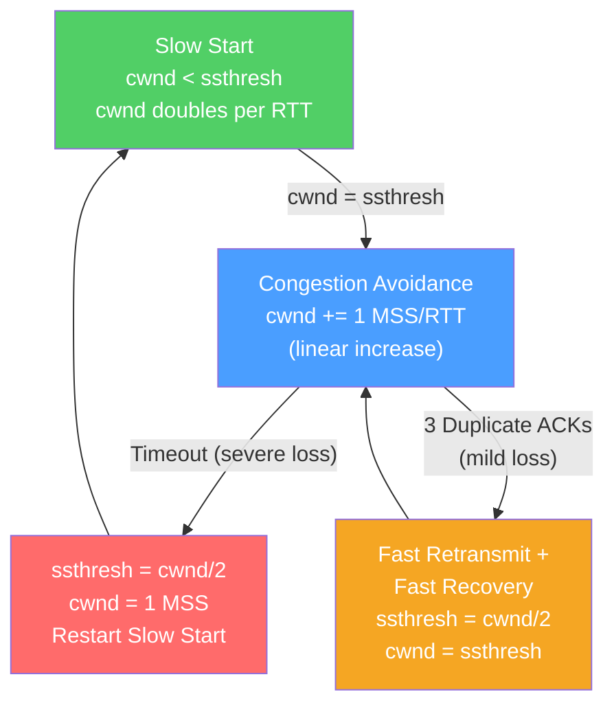

# 🔁 TCP Protocol

> [!abstract] TL;DR
> TCP (Transmission Control Protocol) is the internet's reliability layer — it provides **ordered, reliable, byte-stream delivery** between two processes using connection setup (three-way handshake), sequence/ACK numbers, retransmission, flow control (sliding window), and congestion control (AIMD algorithm with CUBIC or BBR variants). TCP's congestion control is a self-regulating feedback loop that probes for bandwidth and backs off on loss, achieving fair sharing across competing flows without central coordination.

## Intuition — analogy FIRST

Imagine TCP as a phone call between two people with a strict protocol: you call, they answer, you confirm you can hear them — then you can talk. If either party says something the other doesn't hear (packet loss), they repeat it. You speak at a rate the other person can process (flow control), and if the phone network is congested, you automatically slow down (congestion control). Neither of you needs to know how the phone network routes calls — you just know your conversation will be complete and in order.

The congestion control mechanism is like adjusting your speaking pace: start slowly (slow start), ramp up steadily (congestion avoidance), and immediately halve your rate if you hear the line is degraded (multiplicative decrease on loss).

---

## How It Works



## Key Concepts / Details

### Three-Way Handshake

```
Client                    Server
  |                          |
  |-- SYN (seq=ISN_c) ------>|   Client picks random ISN
  |<- SYN-ACK (seq=ISN_s,    |   Server picks its own ISN
  |         ack=ISN_c+1) ----|   Acknowledges client's SYN
  |-- ACK (ack=ISN_s+1) ---->|   Client confirms server's SYN
  |                          |
  |<=== Data Exchange ======>|
```

**ISN (Initial Sequence Number)** must be random (not sequential) to prevent sequence-number attacks. Each side tracks independently — TCP is full-duplex.

### Sequence and Acknowledgment Numbers

- **Sequence number** — Byte offset of the first data byte in this segment.
- **ACK number** — Next expected byte from the sender ("I've received everything up to byte N, send me byte N+1").
- TCP uses **cumulative ACKs** — one ACK acknowledges all data up to that point.

### Sliding Window and Flow Control

The **receive window (rwnd)** prevents the sender from overflowing the receiver's buffer:

```
Sender can send: min(cwnd, rwnd) bytes before requiring an ACK

|<------ Sent & ACKed ------>|<-- In-flight -->|<-- Can send -->|
|---------------------------|-----------------|----------------|
0                           SND.UNA          SND.NXT        SND.WND
```

- `rwnd` is advertised by the receiver in every ACK (16-bit field → max 65,535 bytes without window scaling).
- **Window Scaling (RFC 7323)** — TCP option extending rwnd to 30 bits (1 GB max), essential for high-bandwidth long-delay links.

### Congestion Control State Machine (AIMD)

The Additive Increase Multiplicative Decrease (AIMD) algorithm:

| State | Trigger | Behavior |
|-------|---------|---------|
| **Slow Start** | New connection or timeout | cwnd doubles per RTT (exponential): cwnd += MSS per ACK |
| **Congestion Avoidance** | cwnd ≥ ssthresh | cwnd += MSS²/cwnd per ACK (1 MSS/RTT linear increase) |
| **Fast Retransmit** | 3 duplicate ACKs received | Retransmit missing segment immediately (don't wait for timeout) |
| **Fast Recovery** | After fast retransmit | ssthresh = cwnd/2; cwnd = ssthresh; stay in congestion avoidance |
| **Timeout** | Retransmit timer expires | ssthresh = cwnd/2; cwnd = 1 MSS; restart slow start |

**AIMD fairness:** Multiple TCP flows competing for the same bottleneck converge to equal shares through the AIMD dynamic without central coordination.

### CUBIC vs BBR

Modern Linux defaults to CUBIC; BBR is used by Google and increasingly others:

| Feature | CUBIC | BBR |
|---------|-------|-----|
| Congestion signal | Packet loss | Estimated bottleneck bandwidth + RTprop |
| Growth function | W(t) = C(t−K)³ + W_max (cubic) | Paces at BtlBw; cwnd = BtlBw × RTprop |
| On loss | Multiplicative decrease (×0.7) | No reduction (loss ≠ congestion signal) |
| Long-fat networks | Underutilizes (backs off on loss) | Converges to ~BDP — fully utilizes link |
| Latency | Can buffer-bloat on fast links | Targets minimum RTT; reduces bufferbloat |
| Default on | Linux (default since 2.6.19) | YouTube/Google since 2016; Linux opt-in |

**Bandwidth-Delay Product (BDP):**
```
BDP = Bandwidth × RTT
e.g., 1 Gbps × 100ms = 100 Mb = 12.5 MB of in-flight data needed

CUBIC may never reach BDP on high-speed long-haul links because it backs off on occasional loss
BBR estimates BDP directly and fills the pipe regardless of loss events
```

### Key TCP Options and Features

| Option | Purpose |
|--------|---------|
| **MSS (Maximum Segment Size)** | Negotiated at handshake; typically 1460B (Ethernet) |
| **Window Scale** | Extends 16-bit window to 30-bit |
| **SACK (Selective ACK)** | ACK specific ranges, not just cumulative — enables retransmit of only lost segments |
| **Timestamps** | RTT measurement and PAWS (Protection Against Wrapped Sequences) |
| **TCP Fast Open (TFO)** | Send data in SYN — saves 1 RTT on repeat connections |

### Nagle's Algorithm and Delayed ACK Interaction

- **Nagle's Algorithm** — Buffer small writes until either the buffer reaches MSS or all outstanding data is ACKed. Reduces small-packet flood (the "tinygram problem").
- **Delayed ACK** — Receiver waits up to 40ms to send a standalone ACK, hoping to piggyback on outgoing data.
- **Interaction problem:** With Nagle on sender + delayed ACK on receiver, a small request-response (e.g., interactive SSH) stalls for 40ms on every exchange.
- **Fix:** Disable Nagle with `TCP_NODELAY` on latency-sensitive sockets.

## Real-World Notes

- **TCP throughput formula (Mathis):** `Throughput ≈ MSS / (RTT × √p)` where p = loss probability. Doubling RTT or quadrupling loss halves throughput.
- **TIME_WAIT exhaustion** — At high connection rates, TIME_WAIT (2×MSL ≈ 120s) sockets can exhaust the ~28,000 ephemeral port range. Solutions: `tcp_tw_reuse` (Linux sysctl), connection pooling, HTTP/2 multiplexing.
- **SYN flood defense** — `tcp_syncookies` encodes connection state into the SYN-ACK sequence number, so no backlog entry is needed until the ACK arrives. Eliminates SYN flood resource exhaustion.

## Common Pitfalls

- Assuming TCP is "free" reliability — every retransmission costs at least 1 RTT of latency.
- Ignoring buffer bloat: CUBIC fills router buffers, increasing RTT by 10–100× on congested links. Use BBR or CAKE-based AQM to fix.
- Forgetting that `SO_LINGER` with l_linger=0 causes RST instead of graceful FIN — aborts in-flight data.
- Not tuning TCP socket buffer sizes (`SO_RCVBUF`, `SO_SNDBUF`) on high-BDP paths — the default 128KB buffer limits throughput to ~10 Mbps on a 100ms RTT link.

## Related Concepts

- [[UDP_Protocol]] — The connectionless alternative to TCP
- [[Transport_Layer]] — OSI L4 context for both TCP and UDP
- [[Network_Attacks]] — SYN flood, TCP reset injection attacks
- [[TLS_SSL]] — Runs on top of TCP; TLS 1.3 reduces the handshake overhead

## Review Questions

1. Trace the TCP congestion control state machine from a new connection through slow start, congestion avoidance, packet loss detection via 3 duplicate ACKs, and fast recovery. What is cwnd at each transition?
2. A 10 Gbps link has an RTT of 200ms. Calculate the BDP. What TCP window size is required to fully utilize the link? What TCP option enables this?
3. Explain why Nagle's algorithm combined with delayed ACK can cause 40ms latency spikes in interactive applications, and how to fix it.

## Sources

- RFC 793 — Transmission Control Protocol
- RFC 5681 — TCP Congestion Control
- RFC 8312 — CUBIC for Fast Long-Distance Networks
- Stevens, W. Richard, *TCP/IP Illustrated, Volume 1*, Ch. 12–24

#networking #tcpip-protocols #intermediate
