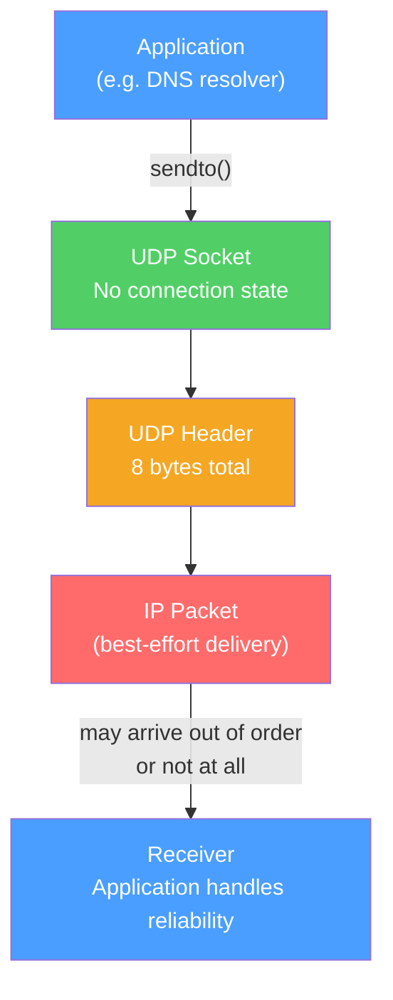

# 📦 UDP Protocol

> [!abstract] TL;DR
> UDP (User Datagram Protocol) is an **8-byte, connectionless transport protocol** that provides port multiplexing and optional checksum with zero handshake overhead. It trades TCP's reliability for minimum latency: no connection setup, no retransmission, no ordering, no congestion control. DNS, DHCP, gaming, video streaming, VoIP, and QUIC all use UDP because either speed matters more than guaranteed delivery, or the application implements its own reliability at the correct granularity.

## Intuition — analogy FIRST

UDP is like dropping a postcard in a mailbox. You write the address, drop it in, and walk away. No return receipt, no guarantee it arrives, and if two postcards arrive out of order, nobody re-sorts them for you. This is perfect for situations where speed matters more than certainty — like shouting the latest stock price across a trading floor. If the first shout doesn't reach everyone, a more recent quote arrives moments later anyway, and retransmitting stale data would be worse than getting none.

Contrast with TCP (certified mail): the overhead of acknowledgments and retransmissions adds meaningful latency when you need sub-millisecond responsiveness or when losing an occasional packet is acceptable.

---

## How It Works



## Key Concepts / Details

### UDP Header Structure

The entire UDP header is just 8 bytes:

```
 0                   1                   2                   3
 0 1 2 3 4 5 6 7 8 9 0 1 2 3 4 5 6 7 8 9 0 1 2 3 4 5 6 7 8 9 0 1
+-+-+-+-+-+-+-+-+-+-+-+-+-+-+-+-+-+-+-+-+-+-+-+-+-+-+-+-+-+-+-+-+
|          Source Port          |       Destination Port        |
+-+-+-+-+-+-+-+-+-+-+-+-+-+-+-+-+-+-+-+-+-+-+-+-+-+-+-+-+-+-+-+-+
|             Length            |           Checksum            |
+-+-+-+-+-+-+-+-+-+-+-+-+-+-+-+-+-+-+-+-+-+-+-+-+-+-+-+-+-+-+-+-+
|                     Data (variable)                           |
+-+-+-+-+-+-+-+-+-+-+-+-+-+-+-+-+-+-+-+-+-+-+-+-+-+-+-+-+-+-+-+-+
```

| Field | Size | Purpose |
|-------|------|---------|
| Source Port | 16 bits | Optional sender port (0 if unused) |
| Destination Port | 16 bits | Required receiver port |
| Length | 16 bits | UDP header + data in bytes (min 8) |
| Checksum | 16 bits | Error detection (optional in IPv4, mandatory in IPv6) |

**Maximum UDP payload:** 65,507 bytes (65,535 − 20 IP header − 8 UDP header). In practice, UDP datagrams > MTU (1500B) get IP-fragmented, which is avoided — most UDP applications keep payloads under 1472 bytes (1500 − 20 − 8).

### UDP vs TCP: When to Use Each

| Criterion | Use UDP | Use TCP |
|-----------|---------|---------|
| Latency requirement | Sub-millisecond / real-time | Seconds acceptable |
| Packet loss tolerance | Yes (or app handles it) | No — every byte must arrive |
| Data ordering | Unimportant | Must be ordered |
| Connection overhead matters | Yes | No |
| Application controls reliability | Yes (gaming, video) | No |
| Multicast/broadcast needed | Yes | No (unicast only) |

### Applications That Use UDP

| Application | Why UDP |
|-------------|---------|
| **DNS** | Single-request/response; retrying is fast; latency dominates |
| **DHCP** | Broadcast-based; pre-connection (no IP yet) |
| **VoIP / Video conferencing** | Late packets are useless; jitter > loss |
| **Online gaming** | Position updates are frequent; old ones are stale |
| **NTP** | Clock sync; single packet; sub-ms latency required |
| **TFTP** | Simple file transfer over UDP with app-level ACKs |
| **SNMP** | Monitoring; packet loss is acceptable |
| **QUIC (HTTP/3)** | UDP encapsulation with app-level reliability per-stream |

### IP Multicast

UDP supports **multicast** — one sender, multiple receivers, without the sender knowing who they are:

```
Unicast:   1 sender → 1 receiver (TCP or UDP)
Broadcast: 1 sender → all hosts on subnet (UDP only)
Multicast: 1 sender → subscribed receivers (UDP only)
```

**IPv4 multicast address range:** `224.0.0.0/4` (Class D)

| Range | Purpose |
|-------|---------|
| 224.0.0.0–224.0.0.255 | Local network control (OSPF, PIM, IGMP) |
| 224.0.1.0–238.255.255.255 | Globally scoped multicast |
| 239.0.0.0/8 | Administratively scoped (private) |

**IGMP (Internet Group Management Protocol):**
- Hosts send `IGMP Membership Report` to join a multicast group.
- Routers send `IGMP Queries` to learn which groups are active on each subnet.
- PIM-SM (Protocol Independent Multicast — Sparse Mode) routes multicast traffic between routers.

### QUIC: UDP as a Foundation

QUIC (RFC 9000, HTTP/3's transport) uses UDP but reimplements reliability, congestion control, and TLS above the UDP layer:

```
HTTP/3 → QUIC → UDP → IP

QUIC provides:
  ✓ Per-stream reliability (loss on stream 1 doesn't block stream 2)
  ✓ 0-RTT connection resumption (TLS 1.3 0-RTT embedded)
  ✓ Connection migration (survives IP address changes)
  ✓ Built-in encryption (no plaintext QUIC exists)
  ✓ Multiplexed streams without head-of-line blocking
```

QUIC chose UDP over TCP because:
1. UDP is available on all networks (TCP-modifying middleboxes are common; UDP passes through).
2. UDP can be updated via software without OS changes (TCP changes require kernel updates).
3. UDP allows QUIC to control its own congestion algorithm.

## Real-World Notes

- **UDP amplification attacks** — Small UDP query to an open service (DNS, NTP, memcached) triggers a large response sent to a spoofed source IP. Amplification factor can be 10–50×. Defense: BCP38 (ingress filtering), rate limiting, response-rate limiting (RRL) in DNS servers.
- **UDP socket buffer tuning** — `SO_RCVBUF` must be large enough to buffer bursts; dropped packets at the socket level are invisible (no TCP-style retransmission). Check `/proc/net/udp` for receive buffer drops on Linux.
- **Jitter buffers** — VoIP/video clients use jitter buffers to absorb out-of-order/delayed UDP packets before playback. Buffer too small → dropouts; too large → latency.

## Common Pitfalls

- Disabling UDP checksum in IPv4 — silent data corruption goes undetected (no CRC-like guarantee).
- Sending large UDP payloads that cause IP fragmentation — loss of any fragment loses the whole datagram; application retransmits the entire thing instead of just the lost fragment.
- Assuming QUIC is "just UDP" — it has full congestion control, reliability, and encryption. Treating it like raw UDP leads to incorrect mental models.
- Not accounting for NAT timeouts — UDP "connections" through NAT expire after 30–300 seconds of inactivity. UDP keepalives (small periodic probes) are needed for long-lived UDP flows through NAT.

## Related Concepts

- [[TCP_Protocol]] — The reliable alternative with congestion control
- [[Transport_Layer]] — OSI L4 context for both TCP and UDP
- [[DNS_Protocol]] — DNS uses UDP for most queries
- [[DHCP_Protocol]] — DHCP uses UDP broadcast

## Review Questions

1. DNS uses UDP for most queries but falls back to TCP for responses > 512 bytes (or > 4096 with EDNS0). Explain why this design makes sense given UDP and TCP trade-offs.
2. Explain UDP amplification attacks. Why is UDP particularly vulnerable to source-IP spoofing compared to TCP?
3. QUIC runs over UDP but provides reliable, ordered delivery. Why did QUIC's designers choose UDP as the base rather than building on TCP?

## Sources

- RFC 768 — User Datagram Protocol
- RFC 9000 — QUIC: A UDP-Based Multiplexed and Secure Transport
- RFC 1112 — Host Extensions for IP Multicasting (IGMP)

#networking #tcpip-protocols #beginner
