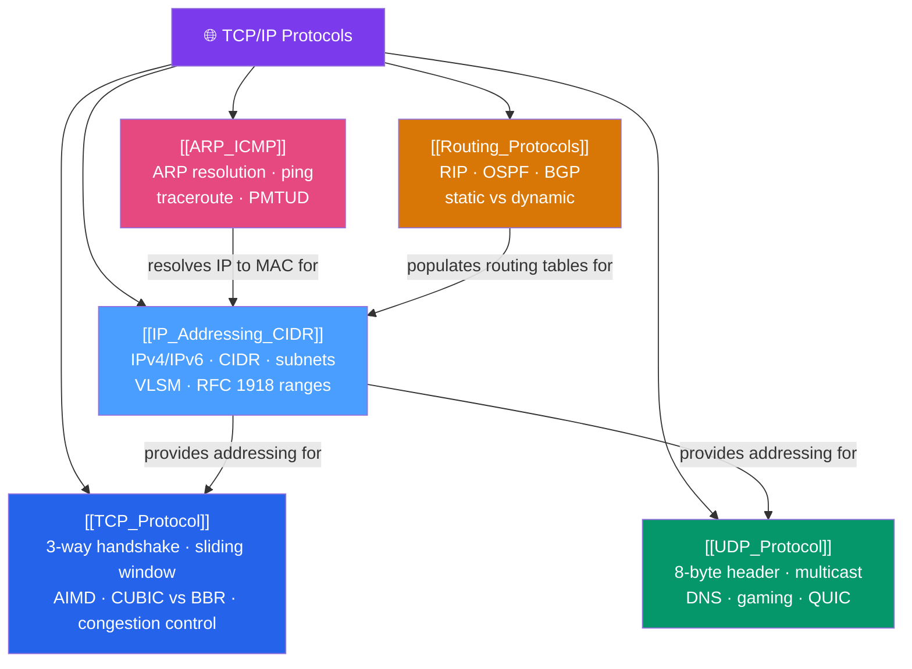

# 🗺️ TCP/IP Protocols — Map of Content

> [!abstract] What This Section Covers
> The TCP/IP protocol suite is the load-bearing core of the internet. This section covers the full stack: **IP addressing and CIDR subnetting** (IPv4/IPv6 address space, subnet math, VLSM, RFC 1918 private ranges), **TCP** (three-way handshake, sliding window, AIMD congestion control, CUBIC vs BBR), **UDP** (8-byte header, multicast, why DNS/gaming/QUIC prefer it), **routing protocols** (static vs RIP vs OSPF vs BGP path selection), and **ARP/ICMP** (address resolution, ping/traceroute, PMTUD). Understanding this section deeply is the prerequisite for network security, SDN, and cloud networking.

## Concept Map

## Learning Path

1. [[IP_Addressing_CIDR]] — Master the address space first: subnetting, CIDR notation, IPv6, private ranges.
2. [[ARP_ICMP]] — Understand how IPs resolve to MACs and how ICMP diagnostics work.
3. [[TCP_Protocol]] — TCP reliability, congestion control, and performance tuning.
4. [[UDP_Protocol]] — When to use UDP and how multicast works.
5. [[Routing_Protocols]] — How routers learn routes and how traffic flows across networks.

## All Notes at a Glance

| Note | Difficulty | What You'll Learn |
|------|------------|-------------------|
| [[TCP_Protocol]] | Intermediate | Three-way handshake, sliding window, AIMD/CUBIC/BBR congestion control, Nagle, TIME_WAIT |
| [[UDP_Protocol]] | Beginner → Intermediate | UDP header structure, use cases, IP multicast, IGMP, UDP vs TCP trade-offs |
| [[IP_Addressing_CIDR]] | Intermediate | IPv4 classes, CIDR subnetting, subnet math, VLSM, IPv6 types, dual-stack, RFC 1918 |
| [[Routing_Protocols]] | Intermediate → Advanced | Static routing, RIP (distance-vector), OSPF (link-state), BGP (path-vector), EIGRP |
| [[ARP_ICMP]] | Beginner → Intermediate | ARP request/reply, ARP table, gratuitous ARP, ICMP types, ping, traceroute, PMTUD |

## Key Questions This Section Answers

- What is CIDR notation, and how do you calculate the network address, broadcast, and usable host range for a subnet?
- How does TCP's three-way handshake work, and why does TIME_WAIT exist?
- What is the difference between slow start, congestion avoidance, fast retransmit, and fast recovery?
- Why does CUBIC underperform on long-fat networks compared to BBR?
- How does OSPF elect a DR/BDR, and what is a link-state advertisement (LSA)?
- What is BGP's best-path selection algorithm, and which attribute takes highest priority?
- How does ARP resolve an IP address to a MAC address, and what is a gratuitous ARP?

## Related Sections

- [[_MOC_Networking_Master|↑ Networking Master MOC]]
- [[_MOC_OSI_Fundamentals|← OSI Model Fundamentals]]
- [[_MOC_Application_Protocols|→ Application Protocols]]
- [[_MOC_Network_Security|→ Network Security]]

#MOC #Networking #TCPIP
