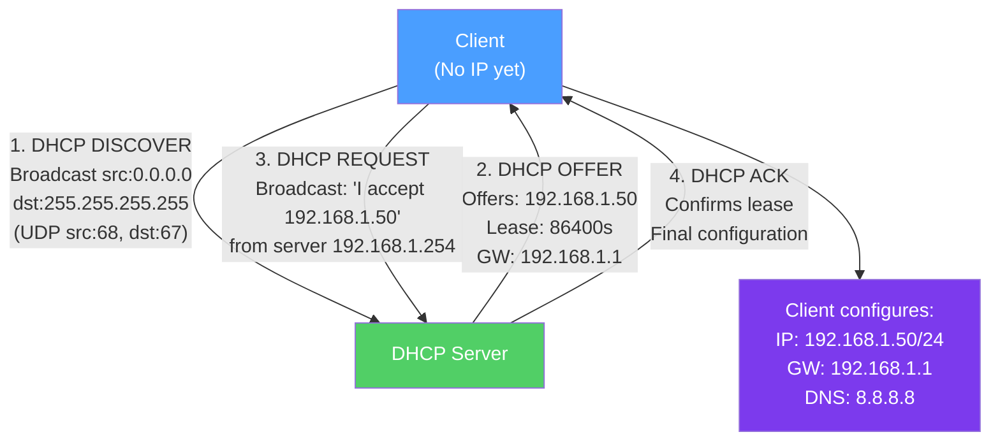

# ⚙️ DHCP Protocol

> [!abstract] TL;DR
> DHCP (Dynamic Host Configuration Protocol) automatically assigns IP addresses, subnet masks, default gateways, DNS servers, and other network configuration to hosts. The **DORA process** (Discover → Offer → Request → Acknowledge) completes over UDP broadcasts (port 67 server, port 68 client) before the client has an IP address. DHCP leases have a finite lifetime with renewal at 50% (T1) and rebind at 87.5% (T2) of the lease time. DHCP relay agents forward broadcasts across router boundaries to a centralized server.

## Intuition — analogy FIRST

Imagine arriving at a hotel where you don't have a room yet. You walk into the lobby and shout "Is anyone running the front desk?" (DHCP Discover broadcast). The front desk clerk shouts back "Room 205 is available!" (DHCP Offer). You say "I'll take room 205!" (DHCP Request — also a broadcast so other desk clerks know). The clerk confirms "Room 205 is yours until checkout at noon" (DHCP Acknowledge with a lease time).

When checkout time approaches (50% of lease), you proactively call the front desk to renew your room. If the call doesn't go through (T1 renewal fails), you try walking up to any clerk at 87.5% (T2 rebind). If that also fails, you check out and repeat the DORA process to get a new room.

---

## How It Works



## Key Concepts / Details

### DORA Process (Discover → Offer → Request → Acknowledge)

**Step 1: DHCP DISCOVER**
- Client has no IP; sends UDP broadcast from `0.0.0.0:68` to `255.255.255.255:67`.
- Contains client MAC address and hostname.
- All DHCP servers on the segment receive this.

**Step 2: DHCP OFFER**
- DHCP server reserves an IP from its pool and sends an OFFER.
- Offer includes: proposed IP, lease time, subnet mask, default gateway, DNS servers.
- Multiple servers on the same segment may each send an offer.

**Step 3: DHCP REQUEST**
- Client selects the first offer received and broadcasts a REQUEST.
- Broadcast (not unicast) so all DHCP servers know which offer was accepted.
- Contains the server identifier (IP of the chosen server).

**Step 4: DHCP ACK (Acknowledge)**
- Server confirms the lease with a final ACK containing full configuration.
- Client configures its interface.
- Server records the lease in its database (IP, MAC, expiry time).

**DHCP NACK (Negative Acknowledge):**
- Server sends NACK if the requested IP is invalid (wrong subnet, already leased).
- Client must restart DORA from the beginning.

### DHCP Lease Lifecycle

```
Lease granted (T=0)
    ↓ T=50% (T1 timer)
Renewal attempt — unicast to original server
    ↓ Success: lease extended; Failure: continue to T2
    ↓ T=87.5% (T2 timer)
Rebind attempt — broadcast to any DHCP server
    ↓ Success: lease extended; Failure: continue to expiry
    ↓ T=100% (lease expiry)
IP address released; restart DORA
```

Typical lease times:
- **Home/office** — 24 hours (86400 seconds)
- **Wi-Fi hotspot** — 1–4 hours (short leases for transient clients)
- **Data center** — 7 days or permanent (static DHCP binding for servers)

### DHCP Options

DHCP carries configuration parameters via **options** (TLV — Type, Length, Value format):

| Option # | Name | Example Value |
|----------|------|---------------|
| 1 | Subnet Mask | 255.255.255.0 |
| 3 | Default Gateway (Router) | 192.168.1.1 |
| 6 | DNS Server(s) | 8.8.8.8, 8.8.4.4 |
| 12 | Hostname | my-laptop |
| 15 | Domain Name | example.com |
| 28 | Broadcast Address | 192.168.1.255 |
| 42 | NTP Server | 192.168.1.10 |
| 43 | Vendor Specific Info | (AP controllers, VoIP boot files) |
| 51 | Lease Time (seconds) | 86400 |
| 54 | DHCP Server Identifier | 192.168.1.254 |
| 119 | Domain Search List | example.com internal.example.com |
| 121 | Classless Static Routes | Additional routes to push to client |
| 252 | WPAD (Proxy Auto Config URL) | http://proxy.example.com/proxy.pac |

### Static DHCP Binding (DHCP Reservation)

Assign a specific IP to a specific MAC address — the host always gets the same IP:

```
# Example: Cisco IOS
ip dhcp pool PRINTER
  host 192.168.1.100 255.255.255.0
  hardware-address 00:1A:2B:3C:4D:5E

# Example: ISC dhcpd (Linux)
host printer-lobby {
  hardware ethernet 00:1A:2B:3C:4D:5E;
  fixed-address 192.168.1.100;
}
```

Static bindings provide predictable IPs for servers/printers without the management overhead of manual static IP configuration on every device.

### DHCP Relay Agent

DHCP uses broadcasts, which routers don't forward by default. A **DHCP relay agent** (IP helper) forwards DHCP broadcasts across router boundaries:

```
[Client subnet]    [Router]         [DHCP Server subnet]
  Client -DISCOVER→ Router
                    Router adds relay agent info:
                      - Forwards unicast OFFER to server
                      - Includes giaddr (gateway IP) so server
                        knows which pool to allocate from
                    ← Server sends unicast OFFER to router
  Client ←OFFER---- Router
```

**Cisco IOS relay configuration:**
```
interface GigabitEthernet0/1
 ip helper-address 10.1.1.10    ! DHCP server IP
```

Multiple `ip helper-address` statements forward to multiple DHCP servers for redundancy.

### DHCP Security Concerns

**DHCP starvation attack** — Attacker sends many DISCOVER requests with spoofed MAC addresses, exhausting the IP pool. Legitimate clients receive NACK (pool exhausted). Defense: port security (limit MACs per port), DHCP snooping.

**Rogue DHCP server** — Attacker runs unauthorized DHCP server, offering malicious gateway/DNS to redirect traffic. Defense: DHCP snooping (switches trust only designated "trusted" ports for DHCP server messages).

**DHCP snooping** (Cisco switch feature):
- Marks access ports as "untrusted" for DHCP server traffic.
- Builds a DHCP snooping binding table (MAC → IP → port).
- Enables DAI (Dynamic ARP Inspection) — validates ARP against the snooping table.

### APIPA (Automatic Private IP Addressing)

When DHCP fails (no server responds), Windows/macOS auto-configure an address in the **169.254.0.0/16** range (link-local):
- Only enables communication on the local segment (no internet).
- Acts as a signal to diagnose: DHCP server unreachable.
- Check for `169.254.x.x` → DHCP problem.

## Real-World Notes

- **DHCPv6** — IPv6 equivalent; used when router advertisements don't provide complete configuration. Can work with SLAAC (stateless) for addresses + DHCPv6 for DNS/domain options.
- **DHCP failover** — ISC DHCP and Windows DHCP Server support failover: two servers share the pool, one primary, one secondary. Split-scope or load-balancing modes available.
- **Cloud DHCP** — In AWS VPC, each subnet's DHCP is handled by the VPC's DHCP service. Options sets control DNS suffix, NTP, etc.

## Common Pitfalls

- Insufficient IP pool size for the expected number of clients (including lease renewals and concurrent transitions).
- Overlapping DHCP scopes on a network segment — two servers offering IPs from the same range causes duplicates.
- Short lease times on stable networks — increases server and network overhead unnecessarily.
- Not configuring DHCP snooping on managed switches — exposes network to rogue DHCP attacks.

## Related Concepts

- [[DNS_Protocol]] — DHCP option 6 provides DNS server addresses
- [[IP_Addressing_CIDR]] — DHCP allocates from a defined IP pool/subnet
- [[UDP_Protocol]] — DHCP uses UDP broadcasts (port 67/68)
- [[ARP_ICMP]] — After DHCP, ARP resolves local MAC addresses

## Review Questions

1. Walk through the complete DHCP DORA process for a client booting on a network. Why are DISCOVER and REQUEST sent as broadcasts rather than unicasts?
2. A laptop on floor 3 can't get an IP address, but laptops on floors 1 and 2 (different subnets) work fine. You have one central DHCP server. What is likely missing, and how do you fix it?
3. Explain the T1 and T2 timers in a DHCP lease. What happens at each timer expiry, and what occurs if both renewal and rebind fail?

## Sources

- RFC 2131 — Dynamic Host Configuration Protocol (DHCP)
- RFC 2132 — DHCP Options and BOOTP Vendor Extensions
- RFC 3527 — Link Selection sub-option for the Relay Agent (Option 82)

#networking #application-protocols #beginner
