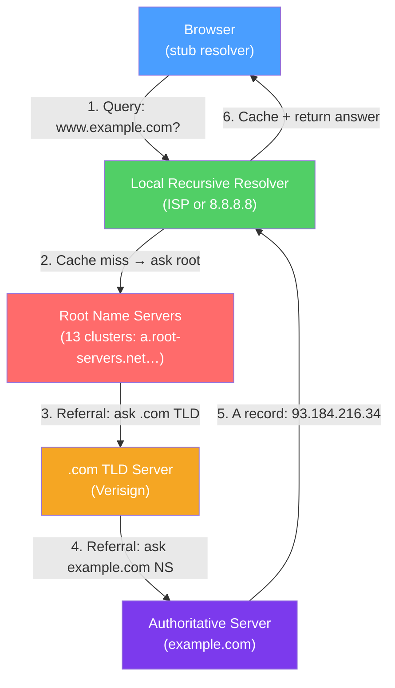

# 🌐 DNS Protocol

> [!abstract] TL;DR
> DNS (Domain Name System) is the internet's distributed directory — it translates human-readable domain names (www.example.com) into IP addresses (93.184.216.34) that routers can forward. The hierarchy runs: stub resolver → recursive resolver → root servers → TLD servers → authoritative servers. DNS uses UDP (port 53) for queries under 512 bytes, TCP for larger responses and zone transfers. DNSSEC adds cryptographic validation; DoH/DoT encrypt queries.

## Intuition — analogy FIRST

DNS is like a distributed phone book with a hierarchical lookup chain. When you ask for "Alice Johnson's number," your local phone book (stub resolver) doesn't have it — so it asks the national directory service (recursive resolver). The national service starts at the top: "Who manages .com numbers?" (root server) → "I don't know, ask Verisign for .com." → "Who manages johnson.com?" (TLD server) → "Ask authoritative-server.example." → Returns Alice's number. You cache the number on your notepad (TTL) so you don't repeat the whole process next time.

---

## How It Works



## Key Concepts / Details

### DNS Hierarchy

```
.  (root — 13 logical root server clusters)
├── .com (TLD — Verisign)
│   ├── example.com (authoritative — Route 53/Cloudflare/etc.)
│   │   ├── www.example.com → A record → 93.184.216.34
│   │   ├── mail.example.com → MX record → mailserver.example.com
│   │   └── _dmarc.example.com → TXT record → DMARC policy
│   └── google.com
├── .org
├── .io
└── (country TLDs: .uk, .de, .jp)
```

**13 root server clusters** — Not 13 individual servers, but 13 logical entities, each operated by a different organization. Anycast means hundreds of physical servers serve each letter (a-m), providing global distribution and DDoS resilience.

### DNS Query Types

| Query Type | Description |
|------------|-------------|
| **Recursive** | Resolver does all the work and returns the final answer |
| **Iterative** | Server returns the best referral it has; resolver follows the chain |

Stub resolvers (in OS/browser) make recursive queries to a recursive resolver. Recursive resolvers make iterative queries to root/TLD/authoritative servers.

### DNS Record Types

| Type | Purpose | Example |
|------|---------|---------|
| **A** | IPv4 address | `www.example.com → 93.184.216.34` |
| **AAAA** | IPv6 address | `www.example.com → 2606:2800:220:1::93c6:d810` |
| **CNAME** | Canonical name alias | `www → example.com` |
| **MX** | Mail exchanger (priority + host) | `10 mail.example.com` |
| **NS** | Name server | `example.com → ns1.example.com` |
| **TXT** | Free-form text | SPF, DKIM, DMARC, site verification |
| **PTR** | Reverse DNS (IP → name) | `34.216.184.93.in-addr.arpa → www.example.com` |
| **SOA** | Start of Authority — zone metadata | Serial, refresh, retry, expire, minimum TTL |
| **SRV** | Service location (protocol + port) | `_sip._tcp.example.com 10 60 5060 sip.example.com` |
| **CAA** | Certificate Authority Authorization | Which CAs can issue for this domain |

**CNAME vs A record:** CNAME aliases one name to another; A record maps directly to an IP. You cannot CNAME a zone apex (e.g., `example.com`) in standard DNS — use ALIAS/ANAME records (vendor-specific) or flatten the CNAME at the zone level.

### TTL and Caching

- **TTL (Time To Live)** — Number of seconds resolvers may cache a record before re-querying the authoritative server.
- Low TTL (60–300s) → faster failover/changes, higher resolver load.
- High TTL (3600–86400s) → slower propagation, lower resolver load.
- **Negative caching** — NXDOMAIN responses (non-existent domain) are also cached (TTL from SOA minimum field, typically 300–3600s).
- **Propagation delay** — DNS changes don't propagate instantly; you must wait for existing TTLs to expire across all resolvers worldwide.

### DNSSEC

DNSSEC adds cryptographic signatures to DNS records to prevent tampering:

```
Chain of Trust:
  Root Zone KSK → signs Root Zone ZSK
  Root Zone ZSK → signs .com DS record
  .com KSK → signs .com ZSK
  .com ZSK → signs example.com DS record
  example.com KSK → signs example.com ZSK
  example.com ZSK → signs RRSIG records for A/MX/TXT etc.
```

| Record | Purpose |
|--------|---------|
| **DNSKEY** | Public key for the zone |
| **RRSIG** | Signature over a resource record set |
| **DS** | Delegation Signer — hash of child zone's KSK, stored in parent |
| **NSEC/NSEC3** | Authenticated denial of existence (proves "this name doesn't exist") |

**DNSSEC limitation:** Protects integrity and authenticity of DNS responses, but does **not** encrypt them — anyone can see your queries in transit.

### DNS over HTTPS (DoH) and DNS over TLS (DoT)

| Protocol | Port | Standard | Encryption | Use Case |
|----------|------|----------|-----------|---------|
| **DNS/UDP** | 53 | Legacy | None | Traditional DNS |
| **DNS/TCP** | 53 | Fallback for large responses | None | Zone transfers, large records |
| **DoT** | 853 | RFC 7858 | TLS | Network-level DNS privacy |
| **DoH** | 443 | RFC 8484 | HTTPS | Browser-level DNS privacy, bypasses DoT blocking |

DoH sends DNS queries as HTTPS POST/GET requests — indistinguishable from regular HTTPS traffic, making it harder to block.

### Split-Horizon DNS

Same domain name returns different answers based on the query source:
- **Internal resolver** → internal IP (`app.example.com → 10.0.1.50`)
- **External resolver** → public IP (`app.example.com → 203.0.113.10`)

Used to direct internal employees to private endpoints while external users reach public load balancers.

## Real-World Notes

- **DNS amplification attacks** — Small DNS query (60B) can generate a large response (3000B DNSSEC-signed answer) → 50× amplification. Defense: rate limiting (RRL), response rate limiting on authoritative servers, BCP38 ingress filtering.
- **DNS prefetching** — Browsers resolve domains in `<link rel="dns-prefetch">` tags before the user clicks, reducing perceived latency.
- **Anycast DNS** — CDNs and DNS providers (Cloudflare 1.1.1.1, Google 8.8.8.8) use anycast — the same IP announced from many PoPs globally so users resolve at the nearest PoP.

## Common Pitfalls

- Not lowering TTL before a DNS migration — if you change A records with a 24h TTL, clients are stuck with the old IP for up to 24 hours after the change.
- Using CNAME at the zone apex — this breaks other records on the zone (SOA, NS). Use ALIAS or Cloudflare proxy records instead.
- Forgetting negative caching — if a record briefly returns NXDOMAIN, resolvers cache the failure for the SOA minimum TTL.
- Trusting DNS responses without DNSSEC validation — DNS cache poisoning (Kaminsky attack) is still possible without DNSSEC.

## Related Concepts

- [[HTTP_HTTPS]] — HTTP relies on DNS to resolve server names before connecting
- [[DHCP_Protocol]] — DHCP option 6 provides the DNS server address
- [[TLS_SSL]] — SNI in TLS uses the domain name that DNS resolved
- [[UDP_Protocol]] — DNS uses UDP for most queries

## Review Questions

1. Trace a full DNS resolution for `api.example.com` starting from a stub resolver with an empty cache, naming each server type queried in order.
2. Explain the difference between a CNAME record and an A record. Why can't you use a CNAME at the zone apex (e.g., for `example.com` itself)?
3. What is DNSSEC, and what security property does it add? Why doesn't DNSSEC provide privacy, and how do DoH and DoT address that gap?

## Sources

- RFC 1034/1035 — Domain Names — Concepts, Facilities, and Implementation
- RFC 4033/4034/4035 — DNSSEC
- RFC 8484 — DNS Queries over HTTPS (DoH)
- RFC 7858 — DNS over TLS (DoT)

#networking #application-protocols #intermediate
