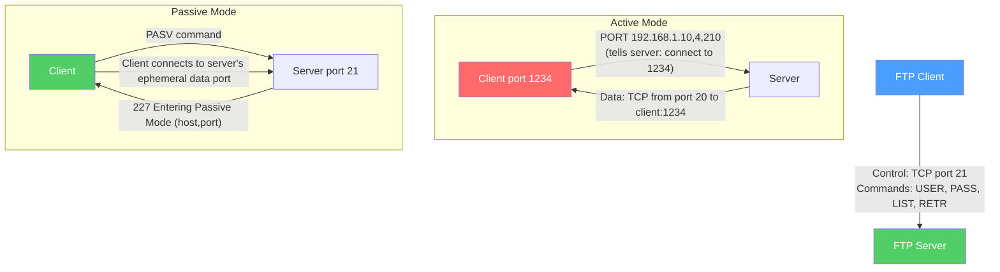

# 📁 FTP and SFTP

> [!abstract] TL;DR
> FTP (File Transfer Protocol) is the original internet file transfer standard — it uses **two TCP connections** (control on port 21, data on port 20 or ephemeral), making it NAT-unfriendly in active mode. **Passive FTP** fixes NAT issues by having the server accept inbound data connections. Modern alternatives: **FTPS** adds TLS to FTP; **SFTP** (SSH File Transfer Protocol) is an entirely separate protocol tunneled over SSH (port 22) — the preferred choice for secure transfers. **SCP** and **rsync** cover other common use cases.

## Intuition — analogy FIRST

Imagine calling a library (FTP's control connection on port 21) to request a book. The librarian confirms your order but then says "I'll have a delivery person knock on your door" (active mode data connection from port 20 to a high port on your side). This causes a problem if you're behind a locked door (NAT/firewall) — the librarian can't reach you.

**Passive mode** flips it: instead of the library knocking on your door, you call a second number the librarian gives you and pick up the book yourself. You initiate both connections — control and data — so NAT works fine.

**SFTP** is more like a secure encrypted tunnel where you hand the librarian a key (SSH key) and all communication — commands and data — flows through a single encrypted channel.

---

## How It Works



## Key Concepts / Details

### FTP Protocol Architecture

FTP separates communication into two channels:

| Channel | Port | Purpose |
|---------|------|---------|
| **Control** | TCP 21 (server listens) | Commands and responses (text-based) |
| **Data** | TCP 20 (active) or ephemeral (passive) | Actual file transfer |

**Control connection commands:**
```ftp
USER alice              → authenticate username
PASS secretpassword     → authenticate password
PWD                     → print working directory
CWD /pub/files          → change working directory
LIST                    → list directory contents
RETR filename.txt       → retrieve (download) file
STOR upload.txt         → store (upload) file
TYPE I                  → binary transfer mode (I = Image)
TYPE A                  → ASCII transfer mode (converts line endings)
QUIT                    → end session
```

**FTP response codes:**
- `220` — Service ready
- `230` — User logged in
- `227` — Entering Passive Mode
- `150` — File status OK, opening data connection
- `226` — Closing data connection, transfer complete
- `550` — File unavailable

### Active vs Passive Mode

**Active Mode (PORT command):**
1. Client tells server: `PORT 192,168,1,10,4,210` (connect to 192.168.1.10 port 1234 = 4×256+210).
2. Server initiates data connection FROM port 20 TO client's high port.
3. **Problem:** Firewalls/NAT block unsolicited inbound connections to the client.

**Passive Mode (PASV command):**
1. Client sends `PASV`.
2. Server responds: `227 Entering Passive Mode (203,0,113,1,195,149)` → connect to 203.0.113.1 port 50069 (195×256+149).
3. Client initiates BOTH connections (control and data) outbound.
4. **Works through NAT** — all connections are client-initiated outbound.

**EPSV (Extended Passive)** — IPv6-compatible passive mode variant.

### FTP Security Problems

Plain FTP transmits everything in cleartext:
- Credentials (username and password) are visible on the wire.
- File contents are unencrypted.
- Subject to man-in-the-middle attacks.

**Do not use plain FTP for production systems.** Use FTPS or SFTP instead.

### FTPS (FTP over TLS)

FTPS (RFC 4217) adds TLS encryption to FTP:

| Mode | Behavior |
|------|---------|
| **Explicit FTPS (FTPES)** | Client connects on port 21, then sends `AUTH TLS` to upgrade to TLS before credentials |
| **Implicit FTPS** | Entire connection (from the start) is TLS, on port 990 |

FTPS still uses two connections (control + data), which requires TLS on both channels and causes complications with some firewalls.

### SFTP (SSH File Transfer Protocol)

SFTP is **not FTP over SSH** — it is an entirely separate binary protocol (RFC draft) that runs as a subsystem within an SSH session:

```
Client → SSH session (port 22) → SFTP subsystem
         └── Single encrypted channel for commands + data
```

**SFTP advantages over FTP:**
- Single encrypted channel (no separate control/data connection)
- Works through NAT/firewalls seamlessly
- Uses SSH public-key authentication (no password in transit)
- Full filesystem semantics (mkdir, rename, chmod, stat)
- Resumable transfers

**Using SFTP:**
```bash
# Interactive SFTP session
sftp user@server.example.com
sftp> get remote_file.txt local_file.txt
sftp> put local_upload.txt /remote/path/
sftp> ls -la
sftp> exit

# One-liner download
sftp user@server:/path/file.txt ./local/

# Batch mode
echo "get /remote/file.txt" | sftp -b - user@server
```

### SCP (Secure Copy Protocol)

SCP uses the SSH channel for simple file copy:

```bash
# Copy local → remote
scp local_file.txt user@server:/remote/path/

# Copy remote → local
scp user@server:/remote/file.txt ./local/

# Recursive copy
scp -r ./local_dir/ user@server:/remote/

# Use specific SSH key
scp -i ~/.ssh/my_key user@server:/path/file.txt ./
```

**SCP limitation:** Non-resumable; for large files, prefer SFTP with `reget` or rsync.

### rsync

rsync transfers only changed blocks (delta transfer), making it efficient for backups and synchronization:

```bash
# Sync local to remote
rsync -avz ./local_dir/ user@server:/remote/dir/

# Sync remote to local
rsync -avz user@server:/remote/dir/ ./local_dir/

# Dry run (show what would be transferred)
rsync -avzn ./local/ user@server:/remote/

# Flags:
# -a = archive (preserves permissions, timestamps, symlinks)
# -v = verbose
# -z = compress during transfer
# -P = show progress + partial file support (resumable)
# --delete = remove files at destination not in source
```

### Protocol Comparison

| Protocol | Port | Encryption | NAT-friendly | Authentication | Use Case |
|----------|------|------------|-------------|----------------|---------|
| FTP | 21/20 | None | Passive only | Password | Legacy systems |
| FTPS (explicit) | 21 | TLS | Passive only | Password/Cert | Legacy with encryption |
| FTPS (implicit) | 990 | TLS | Passive only | Password/Cert | Legacy with encryption |
| SFTP | 22 | SSH | Yes | Password/SSH key | Modern secure transfer |
| SCP | 22 | SSH | Yes | Password/SSH key | Simple file copy |
| rsync over SSH | 22 | SSH | Yes | Password/SSH key | Sync/backup |
| HTTPS | 443 | TLS | Yes | Any | Web-based file transfer |

## Real-World Notes

- **Cloud storage has replaced FTP** for most use cases (S3 presigned URLs, Azure Blob Storage, GCS signed URLs). SFTP remains common for legacy enterprise integrations (EDI, bank file transfers).
- **Managed SFTP services** — AWS Transfer Family, Azure SFTP, Rackspace — provide SFTP endpoints without managing SSH servers.
- **FTP bounce attacks** — A historic attack using FTP's PORT command to scan ports behind a firewall. Mitigated by refusing PORT commands to addresses different from the client IP.

## Common Pitfalls

- Using active mode FTP with NAT — connections from server port 20 are blocked by NAT. Always configure passive mode for internet-facing FTP.
- Confusing SFTP with FTPS — they're completely different protocols despite similar names.
- Not disabling plain FTP when SFTP is available — FTP sends credentials in cleartext.
- Large SFTP transfers timing out due to SSH keepalive settings — configure `ServerAliveInterval` in `~/.ssh/config`.

## Related Concepts

- [[TCP_Protocol]] — FTP/SFTP use TCP for reliable file transfer
- [[TLS_SSL]] — FTPS adds TLS to FTP
- [[SMTP_IMAP_POP3]] — Another classic application protocol pair

## Review Questions

1. Explain FTP's two-connection architecture. Why does active mode fail through NAT, and how does passive mode solve this?
2. Compare FTPS and SFTP: different ports, encryption mechanisms, connection model, and recommended use cases.
3. A backup job copies 10 GB of logs nightly. The first run takes 3 hours. Subsequent runs with `scp` still take 3 hours. What tool should replace scp, and why would it be faster on subsequent runs?

## Sources

- RFC 959 — File Transfer Protocol (FTP)
- RFC 4217 — Securing FTP with TLS (FTPS)
- RFC 4253 — The Secure Shell (SSH) Transport Layer Protocol
- man pages: sftp(1), scp(1), rsync(1)

#networking #application-protocols #beginner
