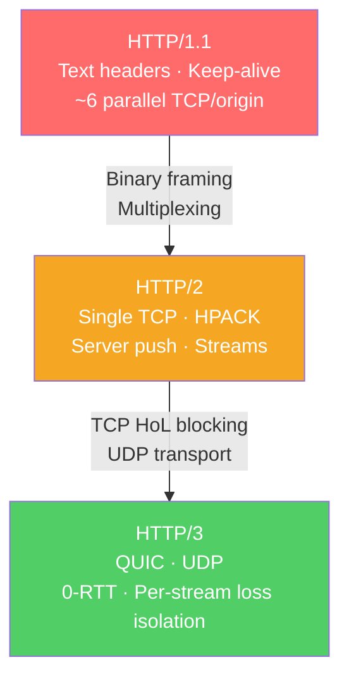

# 🌍 HTTP and HTTPS

> [!abstract] TL;DR
> HTTP (HyperText Transfer Protocol) is the dominant application protocol for the web — it has evolved through three wire formats: **HTTP/1.1** (text headers, keep-alive, head-of-line blocking), **HTTP/2** (binary framing, stream multiplexing over one TCP connection, HPACK compression), and **HTTP/3** (QUIC over UDP, per-stream loss isolation, 0-RTT resumption). HTTPS is HTTP over TLS — TLS 1.3 brings the handshake cost down to 1 RTT. Understanding HTTP is essential for backend development, CDN configuration, and security engineering.

## Intuition — analogy FIRST

HTTP's evolution is a story of removing bottlenecks. **HTTP/1.1** is like a single-lane road: each car (request) must complete its journey before the next one starts (head-of-line blocking). HTTP/1.1 "keep-alive" is like keeping the highway on-ramp open between cars rather than rebuilding it every time — but only one car can use it at a time.

**HTTP/2** turns it into a multi-lane highway: multiple requests travel simultaneously over a single connection (multiplexing). But if one car crashes (TCP packet loss), all lanes are blocked (TCP head-of-line blocking).

**HTTP/3** builds separate tunnels for each car: each request gets its own independent stream in QUIC, so one lost UDP packet only delays one stream, not all of them.

---

## How It Works



## Key Concepts / Details

### HTTP/1.1

Released 1997. Still widely in use for backend-to-backend communication.

**Key features:**
- **Persistent connections (keep-alive)** — TCP connection reused for multiple requests (vs HTTP/1.0 which closed after each).
- **Pipelining** — Send multiple requests without waiting for responses. Broken in practice (proxy compatibility, FIFO response ordering requirement).
- **Text headers** — Human-readable but verbose; average headers 500B–2KB per request.
- **Head-of-line (HoL) blocking** — Responses must arrive in request order; one slow response blocks all subsequent ones.

**Workaround:** Browsers open ~6 parallel TCP connections per origin to parallelize requests. This multiplies handshake overhead and congestion window cost.

**Common HTTP/1.1 request:**
```http
GET /api/users HTTP/1.1
Host: api.example.com
Accept: application/json
Authorization: Bearer eyJhb...
Connection: keep-alive
```

### HTTP/2

Standardized 2015 (RFC 7540). Used by 50%+ of websites.

**Key improvements:**

| Feature | Description |
|---------|-------------|
| **Binary framing** | All communication split into binary frames (DATA, HEADERS, SETTINGS, PUSH_PROMISE) |
| **Multiplexing** | Multiple requests/responses interleaved over a single TCP connection on independent streams |
| **HPACK header compression** | 61-entry static table + dynamic table + Huffman encoding; reduces headers from ~500B to ~50B |
| **Server Push** | Server can proactively send resources (e.g., CSS, JS) without the client asking |
| **Stream prioritization** | Each stream has a weight and dependency tree |

**HTTP/2 Stream:**
```
Client                              Server
  |                                    |
  |--- HEADERS frame (stream=1) ------>|  GET /index.html
  |--- HEADERS frame (stream=3) ------>|  GET /api/data   (concurrent, same TCP)
  |<-- HEADERS frame (stream=3) ------|  HTTP 200
  |<-- DATA frame (stream=3) ---------|  {"users": [...]}
  |<-- HEADERS frame (stream=1) ------|  HTTP 200
  |<-- DATA frame (stream=1) ---------|  <html>...</html>
```

**Remaining limitation:** HTTP/2 over TCP still suffers TCP head-of-line blocking — if one TCP segment is lost, ALL streams stall until it's retransmitted.

### HPACK Header Compression

HTTP/2's header compression system:
- **Static table** — 61 predefined header name/value pairs (e.g., `:method GET` = index 2).
- **Dynamic table** — Per-connection table of recent headers; new headers added as they're seen.
- **Huffman encoding** — Entropy coding to further compress header string values.

Result: `:status 200` is encoded as 1 byte (index 8 in static table). Typical headers compressed from 500B to 50B.

### HTTP/3 and QUIC

HTTP/3 (RFC 9114) uses QUIC (RFC 9000) as its transport instead of TCP:

**QUIC features:**
- **UDP-based** — No TCP handshake; QUIC multiplexes streams without head-of-line blocking.
- **0-RTT resumption** — On reconnect to a known server, client can send application data in the first packet (0 additional RTTs for TLS).
- **Per-stream loss isolation** — Losing a QUIC packet only delays the one stream carrying that data, not all streams.
- **Connection migration** — Connection identified by connection ID, not IP:port tuple. Survives IP address changes (mobile handoffs, NAT rebinding).
- **Built-in TLS 1.3** — QUIC always encrypts; there is no plaintext QUIC.
- **QPACK** — Header compression for HTTP/3 (HPACK adaptation for out-of-order delivery).

**Connection time comparison:**

| Protocol | RTTs to First Byte (new connection) | Notes |
|----------|-----------------------------------|-------|
| HTTP/1.1 over TLS 1.2 | 3.5 RTT | TCP SYN+SYN-ACK, TLS 1.2 (2 RTT), request/response |
| HTTP/2 over TLS 1.3 | 2 RTT | TCP SYN+SYN-ACK, TLS 1.3 (1 RTT), request/response |
| HTTP/3 over QUIC (new) | 1 RTT | QUIC+TLS combined handshake |
| HTTP/3 over QUIC (resumption) | 0 RTT | 0-RTT early data |

### HTTP Caching

HTTP defines several caching mechanisms via headers:

| Header | Direction | Purpose |
|--------|-----------|---------|
| `Cache-Control: max-age=3600` | Response | Cache for 3600 seconds |
| `Cache-Control: no-cache` | Request/Response | Must revalidate with server before using cached copy |
| `Cache-Control: no-store` | Response | Never cache (sensitive data) |
| `Cache-Control: private` | Response | Only browser cache, not CDN |
| `ETag: "abc123"` | Response | Version identifier for conditional requests |
| `If-None-Match: "abc123"` | Request | Return 304 Not Modified if ETag matches |
| `Last-Modified` | Response | Timestamp for conditional requests |
| `If-Modified-Since` | Request | Return 304 if not changed since timestamp |
| `Vary: Accept-Encoding` | Response | Cache separately per Accept-Encoding value |

### HTTPS and TLS

HTTPS = HTTP over a TLS-encrypted connection (port 443 by default). TLS provides:
- **Confidentiality** — Encrypted payload
- **Integrity** — MAC prevents tampering
- **Authentication** — Server certificate proves identity

See [[TLS_SSL]] for full TLS 1.3 handshake details.

**HSTS (HTTP Strict Transport Security):** `Strict-Transport-Security: max-age=31536000; includeSubDomains` — browser remembers to always use HTTPS for this domain for the next year, preventing downgrade attacks.

### Status Codes Quick Reference

| Range | Category | Common Codes |
|-------|---------|-------------|
| 2xx | Success | 200 OK, 201 Created, 204 No Content |
| 3xx | Redirection | 301 Moved Permanently, 302 Found, 304 Not Modified |
| 4xx | Client Error | 400 Bad Request, 401 Unauthorized, 403 Forbidden, 404 Not Found, 429 Too Many Requests |
| 5xx | Server Error | 500 Internal Server Error, 502 Bad Gateway, 503 Service Unavailable, 504 Gateway Timeout |

## Real-World Notes

- **HTTP/2 server push deprecation** — Chrome removed H2 server push support in 2022; it was rarely beneficial and complex. HTTP/103 Early Hints is the modern replacement.
- **Alt-Svc header** — HTTP/2 servers advertise H3 support: `Alt-Svc: h3=":443"; ma=86400`. Browsers switch to QUIC on next connection.
- **gzip vs br (Brotli)** — Brotli (`Content-Encoding: br`) compresses 15–25% better than gzip for text content; widely supported in modern browsers. Use for all static assets.

## Common Pitfalls

- Using HTTP/1.1 for microservice-to-microservice calls — HTTP/2 or gRPC (which uses HTTP/2) eliminates per-request TCP overhead in high-throughput service meshes.
- Not setting `Cache-Control` headers on API responses — default caching behavior varies by CDN and can return stale data.
- Setting `no-cache` when you mean `no-store` — `no-cache` still caches but forces revalidation; `no-store` never caches at all.
- Forgetting HSTS preloading — sites not in browsers' HSTS preload list can be downgraded to HTTP on first visit.

## Related Concepts

- [[DNS_Protocol]] — DNS resolves the domain name before HTTP connects
- [[TLS_SSL]] — TLS wraps HTTP for HTTPS
- [[TCP_Protocol]] — HTTP/1.1 and HTTP/2 run over TCP
- [[UDP_Protocol]] — HTTP/3/QUIC runs over UDP

## Review Questions

1. Explain HTTP/2 stream multiplexing. How does it eliminate application-layer head-of-line blocking from HTTP/1.1, and what remaining HoL blocking problem does HTTP/3 solve?
2. Describe HTTP/3's 0-RTT resumption. What data is sent in the first packet, and what security concern does 0-RTT introduce?
3. A web page loads slowly. The browser makes 30 separate resource requests. Compare the behavior of HTTP/1.1, HTTP/2, and HTTP/3 for this scenario.

## Sources

- RFC 9110/9111 — HTTP Semantics and Caching
- RFC 9113 — HTTP/2
- RFC 9114 — HTTP/3
- RFC 9000 — QUIC: A UDP-Based Multiplexed and Secure Transport

#networking #application-protocols #intermediate
