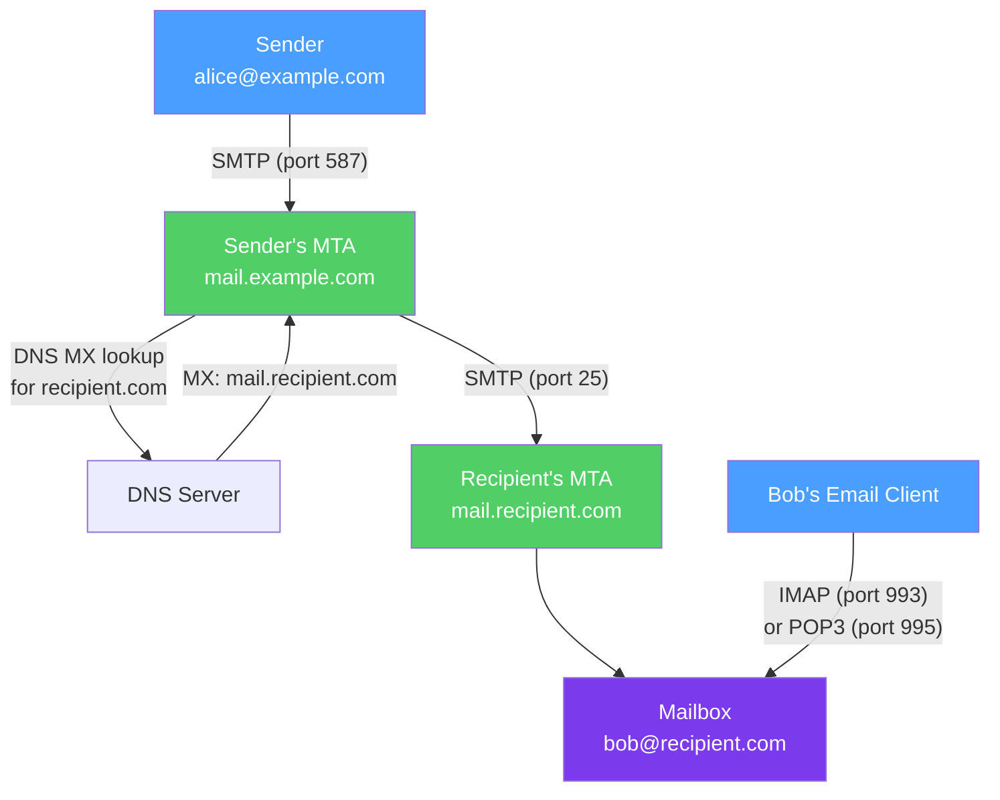

# 📧 SMTP, IMAP, and POP3

> [!abstract] TL;DR
> Email delivery involves three distinct protocols: **SMTP** (Simple Mail Transfer Protocol) for sending and routing mail between servers; **IMAP** (Internet Message Access Protocol) for clients to access mailboxes while keeping mail on the server; and **POP3** (Post Office Protocol 3) for downloading mail to a local client. Email authentication uses the anti-spoofing trio of **SPF** (authorized sender IPs), **DKIM** (cryptographic signature on headers and body), and **DMARC** (policy enforcement and alignment) to combat spam and phishing.

## Intuition — analogy FIRST

Think of email delivery as the physical postal system:

**SMTP** is the postal carrier network — it routes your letter from your local post office (outgoing mail server) across the country to the destination post office (recipient's mail server). Multiple SMTP servers may relay the message.

**IMAP** is like renting a mailbox at a central post office — your letters stay at the post office, but you can read them from any location, on any device. Changes (read/delete/folder) sync everywhere.

**POP3** is like having your mail forwarded to your home — letters are downloaded to your local mailbox and removed from the post office. Only one device gets the mail.

**SPF/DKIM/DMARC** are like tamper-evident seals and authorized-carrier lists — they let receivers verify that the letter truly came from who it claims, and the contents weren't modified.

---

## How It Works



## Key Concepts / Details

### SMTP (Simple Mail Transfer Protocol)

SMTP (RFC 5321) is a **text-based, command/response protocol** over TCP port 25 (server-to-server), port 587 (submission with auth), or port 465 (SMTPS — SMTP over TLS).

**SMTP Conversation:**

```
Client → Server
──────────────────────────────────────────────────────
S: 220 mail.example.com ESMTP
C: EHLO sender.example.com
S: 250-mail.example.com Hello
S: 250-SIZE 52428800
S: 250-STARTTLS
S: 250-AUTH LOGIN PLAIN
S: 250 OK
C: STARTTLS
S: 220 Ready to start TLS
  [TLS handshake]
C: MAIL FROM:<alice@example.com>
S: 250 OK
C: RCPT TO:<bob@recipient.com>
S: 250 OK
C: DATA
S: 354 End data with <CR><LF>.<CR><LF>
C: From: Alice <alice@example.com>
C: To: Bob <bob@recipient.com>
C: Subject: Meeting Tomorrow
C: [empty line — headers/body separator]
C: Hi Bob, let's meet at 3pm.
C: .
S: 250 OK: queued as 12345
C: QUIT
S: 221 Bye
```

**Key SMTP commands:**
- `EHLO` — Extended Hello; announces extended SMTP (ESMTP) capabilities.
- `MAIL FROM` — Envelope sender (may differ from `From:` header — the "envelope" vs "letter" distinction).
- `RCPT TO` — Envelope recipient.
- `DATA` — Begin message content; ends with `.` on a line alone.
- `STARTTLS` — Upgrade connection to TLS.

**MTA vs MDA vs MUA:**
- **MTA (Mail Transfer Agent)** — Routes and relays mail (Postfix, Sendmail, Exim).
- **MDA (Mail Delivery Agent)** — Delivers to the local mailbox (Dovecot, Procmail).
- **MUA (Mail User Agent)** — Email client (Thunderbird, Apple Mail, Gmail web).

### MIME (Multipurpose Internet Mail Extensions)

Plain SMTP only handles 7-bit ASCII. MIME (RFC 2045) extends this:

```
MIME-Version: 1.0
Content-Type: multipart/mixed; boundary="boundary42"

--boundary42
Content-Type: text/plain; charset=UTF-8

Hi Bob, please see the attached file.

--boundary42
Content-Type: application/pdf; name="report.pdf"
Content-Transfer-Encoding: base64

JVBERi0xLjQK...

--boundary42--
```

**Common Content-Types:**
- `text/plain` — Plain text
- `text/html` — HTML email
- `multipart/alternative` — Multiple versions (text + HTML)
- `multipart/mixed` — Attachments
- `application/octet-stream` — Binary attachment

### IMAP vs POP3

| Feature | IMAP (port 143/993) | POP3 (port 110/995) |
|---------|---------------------|---------------------|
| Mail storage | On server (server-side folders) | Downloaded to client |
| Multi-device | Yes — all devices see same mailbox | No — each device downloads independently |
| Offline access | Sync (offline cache on client) | Full local copy |
| Server storage | Required (grows indefinitely) | Minimal (deleted after download) |
| Folder support | Yes — server-side folders | No |
| Use case | Modern email clients, mobile | Legacy, bandwidth-constrained |

**IMAP Features:**
- FLAGS (read, answered, flagged, deleted, draft)
- SEARCH — server-side search without downloading all messages
- IDLE — push notifications for new mail (no polling needed)
- Folder hierarchy — INBOX, Sent, Drafts, custom folders all on server

### Email Authentication: SPF, DKIM, DMARC

Without authentication, anyone can send email claiming to be `boss@yourcompany.com`.

#### SPF (Sender Policy Framework)

SPF is a **DNS TXT record** listing authorized sending IPs for a domain:

```
# DNS TXT record for example.com
v=spf1 ip4:203.0.113.0/24 include:sendgrid.net -all

Tokens:
  v=spf1    → SPF version
  ip4:...   → Authorize this IP range
  include:  → Authorize IPs from another domain's SPF
  -all      → Fail all other senders (hard fail)
  ~all      → Soft fail (mark as spam, don't reject)
```

SPF validates the **envelope sender** (`MAIL FROM`), not the `From:` header users see.

#### DKIM (DomainKeys Identified Mail)

DKIM adds a **cryptographic signature** to outgoing messages:

1. MTA signs selected headers (From, To, Subject, Date) and body hash using RSA private key.
2. Signature added as `DKIM-Signature:` header.
3. Public key published in DNS: `selector._domainkey.example.com TXT "v=DKIM1; k=rsa; p=MIIBIjAN..."`
4. Receiving MTA retrieves public key and verifies signature.

DKIM validates that the message was not tampered with in transit and authenticates the signing domain.

#### DMARC (Domain-based Message Authentication Reporting & Conformance)

DMARC tells receivers what to do when SPF or DKIM fails, and requires **alignment** (envelope/header domains must match):

```
# DNS TXT record for _dmarc.example.com
v=DMARC1; p=reject; rua=mailto:dmarc-reports@example.com; ruf=mailto:forensics@example.com; pct=100

v=DMARC1  → version
p=        → policy: none (report only) / quarantine (spam) / reject (discard)
rua=      → aggregate report destination
ruf=      → forensic report destination
pct=      → percentage of messages to apply policy to (100 = all)
```

DMARC passes if SPF or DKIM passes AND the authenticated domain aligns with the `From:` header domain.

**BIMI (Brand Indicators for Message Identification)** — Extends DMARC with a logo image displayed next to the sender name in Gmail/Yahoo.

## Real-World Notes

- **Email deliverability:** Missing or misconfigured SPF/DKIM/DMARC causes messages to be marked as spam or rejected. Test with `mail-tester.com` or MXToolbox.
- **SMTP relay abuse:** Open relays (SMTP servers that relay for anyone) are exploited by spammers. Always require authentication for outbound relay (`AUTH LOGIN`/`PLAIN` over TLS).
- **Greylisting:** Receiving MTA temporarily rejects (451 Try again later) from unknown senders. Legitimate MTAs retry; most spam bots don't. Adds 5–15 minutes of delivery delay.

## Common Pitfalls

- Setting SPF `+all` (allow all) — defeats the entire purpose of SPF.
- DMARC `p=none` (report only) and never graduating to `quarantine`/`reject` — you get reports but no protection.
- Forgetting DKIM key rotation — long-lived keys (>1 year) increase compromise risk; rotate annually.
- SMTP `From:` vs envelope `MAIL FROM:` confusion — SPF checks the envelope, users see the header; spoofing uses a legitimate envelope sender with a deceptive header `From:`.

## Related Concepts

- [[DNS_Protocol]] — SPF/DKIM/DMARC use DNS TXT records; MX records route mail
- [[TLS_SSL]] — STARTTLS and SMTPS encrypt SMTP; IMAPS/POP3S use TLS
- [[HTTP_HTTPS]] — Modern email clients often use HTTPS APIs (Gmail API, Exchange Web Services)

## Review Questions

1. Trace the SMTP conversation for sending an email from alice@example.com to bob@recipient.com. Include the MX lookup, EHLO, MAIL FROM, RCPT TO, and DATA phases.
2. Explain the difference between SPF and DKIM. Which one proves the message wasn't modified in transit? Which one validates the sending server's authorization?
3. A phishing email arrives claiming to be from boss@company.com. The `From:` header says `boss@company.com` but the envelope sender is `legit-sender@attacker.com`. Would SPF, DKIM, and DMARC catch this? Explain each.

## Sources

- RFC 5321 — Simple Mail Transfer Protocol (SMTP)
- RFC 7208 — Sender Policy Framework (SPF)
- RFC 6376 — DomainKeys Identified Mail (DKIM)
- RFC 7489 — Domain-based Message Authentication, Reporting, and Conformance (DMARC)

#networking #application-protocols #intermediate
