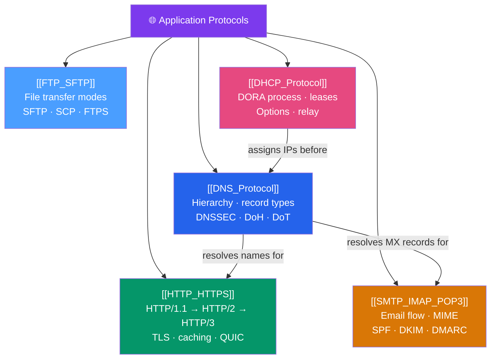

# 🗺️ Application Protocols — Map of Content

> [!abstract] What This Section Covers
> Application protocols are the contracts that networked software actually speaks — the rules governing how a browser fetches a page, how email traverses the internet, how domain names resolve to IPs, and how hosts automatically acquire their configuration. This section covers: **DNS** (hierarchy, record types, DNSSEC, DoH/DoT), **HTTP/HTTPS** (HTTP/1.1 → HTTP/2 → HTTP/3/QUIC, headers, caching), **SMTP/IMAP/POP3** (email flow, authentication, anti-spam), **FTP/SFTP** (file transfer, passive mode, secure alternatives), and **DHCP** (dynamic IP assignment, lease process, options).

## Concept Map

## Learning Path

1. [[DHCP_Protocol]] — How hosts automatically get their IP, gateway, and DNS server before anything else can work.
2. [[DNS_Protocol]] — How names resolve to IPs — the foundation every other protocol depends on.
3. [[HTTP_HTTPS]] — The dominant application protocol, from HTTP/1.1 through HTTP/3.
4. [[SMTP_IMAP_POP3]] — How email is sent, routed, and retrieved.
5. [[FTP_SFTP]] — File transfer protocols and their secure modern replacements.

## All Notes at a Glance

| Note | Difficulty | What You'll Learn |
|------|------------|-------------------|
| [[DNS_Protocol]] | Intermediate | DNS hierarchy, record types (A/AAAA/CNAME/MX/TXT), TTL, DNSSEC, DoH, DoT, split-horizon |
| [[HTTP_HTTPS]] | Intermediate | HTTP/1.1 persistent connections, HTTP/2 multiplexing/HPACK, HTTP/3 QUIC, TLS, caching headers |
| [[SMTP_IMAP_POP3]] | Intermediate | SMTP EHLO conversation, MIME, IMAP vs POP3, SPF/DKIM/DMARC anti-spoofing |
| [[FTP_SFTP]] | Beginner → Intermediate | FTP active vs passive mode, FTPS vs SFTP, SCP, rsync |
| [[DHCP_Protocol]] | Beginner | DORA process, lease types, DHCP options (router/DNS/NTP), relay agents |

## Key Questions This Section Answers

- What is the DNS resolution chain from stub resolver to authoritative server?
- What is the difference between a CNAME and an A record, and when should you use each?
- How does HTTP/2 multiplexing differ from HTTP/1.1 keep-alive, and what problem does it solve?
- Why does HTTP/3 use QUIC over UDP instead of TCP?
- What is the SMTP conversation flow, and what are SPF, DKIM, and DMARC?
- What is the difference between FTP active and passive mode, and why does passive mode work better through NAT?
- What happens during the DHCP DORA process?

## Related Sections

- [[_MOC_Networking_Master|↑ Networking Master MOC]]
- [[_MOC_TCPIP_Protocols|← TCP/IP Protocols]]
- [[_MOC_Network_Security|→ Network Security]]

#MOC #Networking #ApplicationProtocols
