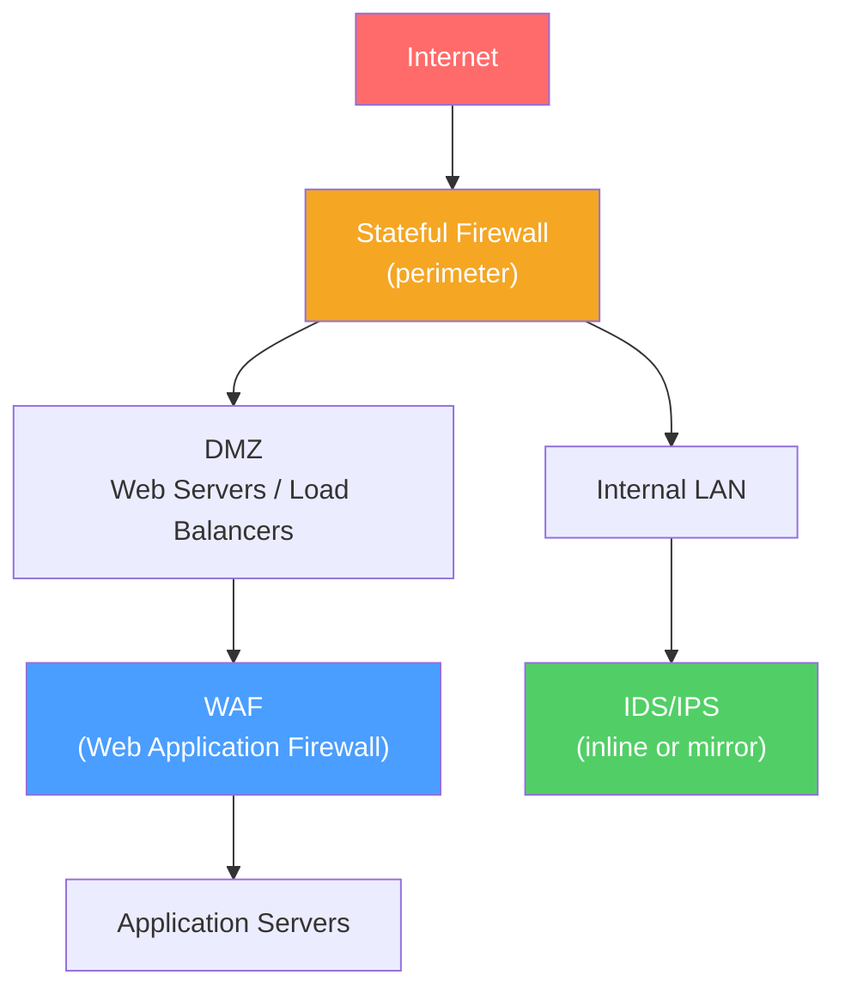

# 🛡️ Firewalls and IDS/IPS

> [!abstract] TL;DR
> Firewalls control which traffic is allowed or denied based on rules. **Stateless firewalls** match on the 5-tuple per packet; **stateful firewalls** track connection state (conntrack) so only the first packet needs a rule, and return traffic is admitted automatically. **Next-generation firewalls (NGFW)** add L7 deep packet inspection, application identity, and TLS inspection. **IDS** (Intrusion Detection System) passively alerts on threats; **IPS** (Intrusion Prevention System) actively blocks them. **WAFs** (Web Application Firewalls) protect at the HTTP layer against OWASP Top 10 attacks.

## Intuition — analogy FIRST

A **stateless firewall** is like a doorman who checks ID cards against a rulebook — every single time you walk in or out, they check your card against the same list. There's no memory of previous visits.

A **stateful firewall** is like a smarter doorman who remembers that you walked in — so when you walk out, they wave you through because they know you're already an approved visitor with an active session. If someone unknown tries to walk in through the exit, it's blocked.

An **NGFW** is like security staff who not only check IDs but also search your bag, verify you're not trying to smuggle prohibited content, and can identify what type of visitor you are (FTP client vs web browser) even if you're wearing a disguise (protocol obfuscation).

A **WAF** is specifically positioned at the application (web) entrance and checks not just who you are, but what you're carrying — detecting SQL injections hidden in submitted forms.

---

## How It Works



## Key Concepts / Details

### Stateless Firewalls (Packet Filters)

Stateless firewalls evaluate each packet **independently** against an ordered list of rules:

```
Rule # | Src IP        | Dst IP       | Proto | Src Port | Dst Port | Action
-------|---------------|--------------|-------|----------|----------|-------
1      | 10.0.0.0/8    | ANY          | TCP   | ANY      | 80       | PERMIT
2      | 10.0.0.0/8    | ANY          | TCP   | ANY      | 443      | PERMIT
3      | 203.0.113.5   | ANY          | ANY   | ANY      | ANY      | DENY
4      | ANY           | ANY          | ANY   | ANY      | ANY      | DENY (implicit)
```

**5-tuple:** Source IP, Destination IP, Protocol (TCP/UDP/ICMP), Source Port, Destination Port.

**Limitation:** Must write explicit rules for both directions. If you allow TCP port 80 outbound, you also need to allow return traffic (TCP ports > 1024 inbound). This is complex and error-prone.

**Use cases:** Cloud security groups, ACLs on router interfaces, initial packet screening.

### Stateful Firewalls (Connection Tracking)

Stateful firewalls maintain a **connection tracking table (conntrack)** recording active sessions:

```
Conntrack Table Entry:
  src=10.0.0.5:54321  dst=93.184.216.34:80  proto=TCP  state=ESTABLISHED
  src=10.0.0.5:54322  dst=8.8.8.8:53        proto=UDP  state=ESTABLISHED
```

**Conntrack states (Linux netfilter):**
- `NEW` — First packet of a new connection (SYN for TCP).
- `ESTABLISHED` — Connection is bidirectional (SYN-ACK seen for TCP).
- `RELATED` — Related to an established connection (FTP data connection, ICMP unreachable).
- `INVALID` — Packet doesn't match any known connection.

**How stateful inspection works:**
1. First packet of a new connection hits the firewall rules (checked against policy).
2. If permitted, an entry is added to the conntrack table.
3. All subsequent packets for this 5-tuple are matched against the conntrack table — no re-checking of rules.
4. Return traffic (ESTABLISHED state) is automatically permitted.

**Advantage over stateless:** Write one rule per direction of policy; return traffic is implicit.

### Next-Generation Firewalls (NGFW)

NGFW adds **Layer 7 inspection** and context-awareness beyond the 5-tuple:

| Feature | Description |
|---------|-------------|
| **Application identification** | Identify apps (Facebook, BitTorrent, Netflix) regardless of port |
| **User identity** | Apply policy based on Active Directory user/group, not just IP |
| **TLS/SSL inspection** | Decrypt TLS traffic, inspect payload, re-encrypt (MITM proxy) |
| **Deep Packet Inspection (DPI)** | Inspect payload content for malware signatures, protocol violations |
| **URL filtering** | Block categories (gambling, adult content) by URL/domain |
| **IPS integration** | Inline threat prevention integrated with firewall |
| **Sand-boxing** | Execute suspicious files in an isolated environment |

**Vendors:** Palo Alto Networks, Fortinet, Check Point, Cisco Firepower.

**TLS inspection note:** NGFW becomes a man-in-the-middle for HTTPS — intercepts the TLS handshake, presents a locally trusted certificate, decrypts for inspection, then re-establishes TLS to the server. Breaks certificate pinning; must be disclosed to users on corporate networks.

### IDS vs IPS

| Feature | IDS (Intrusion Detection System) | IPS (Intrusion Prevention System) |
|---------|----------------------------------|-----------------------------------|
| Placement | **Passive** — monitors a traffic copy (SPAN/mirror port) | **Inline** — traffic passes through it |
| Response | Alerts/logs (does not block) | Blocks, drops, or resets malicious traffic |
| Impact on traffic | None (passively monitors) | Adds latency; single point of failure if it fails |
| Detection methods | Signature-based, anomaly-based, behavioral | Same, plus active blocking |

**Signature-based detection** — Matches traffic against known attack patterns (CVE signatures). Fast but misses zero-days.
**Anomaly-based detection** — Establishes baseline "normal" and alerts on deviations. More false positives but can catch novel attacks.
**Behavioral analysis** — Machine learning models detecting unusual sequences of events.

**Popular systems:** Snort (open source, rules-based), Suricata (multi-threaded Snort alternative), Zeek (network behavioral analysis, log generation).

### WAF (Web Application Firewall)

WAFs protect web applications from L7 attacks that bypass traditional firewalls:

**OWASP Top 10 attacks WAFs detect:**
1. SQL Injection — `'; DROP TABLE users; --`
2. Cross-Site Scripting (XSS) — `<script>alert(1)</script>`
3. Path Traversal — `../../etc/passwd`
4. Local/Remote File Inclusion — `?file=/etc/passwd`
5. Command Injection — `; cat /etc/shadow`
6. SSRF (Server-Side Request Forgery)
7. XML External Entity (XXE)
8. Insecure Deserialization

**ModSecurity (open source WAF):**
```
# Example ModSecurity rule blocking SQL injection
SecRule ARGS "@detectSQLi" \
    "id:942100,phase:2,block,\
    msg:'SQL Injection Attack Detected via libinjection',\
    logdata:'Matched Data: %{TX.0} found within %{MATCHED_VAR_NAME}: %{MATCHED_VAR}'"
```

**OWASP Core Rule Set (CRS):** Pre-built ruleset for ModSecurity covering most common attack patterns.

**Commercial WAFs:** AWS WAF, Cloudflare WAF, Akamai Kona Site Defender, F5 Advanced WAF.

**WAF bypass techniques:** Encoding obfuscation, HTTP parameter pollution, case variation. Production WAFs require continuous tuning.

### Rate Limiting

**Token bucket algorithm:** Each client gets a bucket of tokens. Each request consumes a token. Tokens refill at a fixed rate. When empty, requests are rejected (429 Too Many Requests).

**Leaky bucket algorithm:** Requests enter a queue (bucket) that drains at a constant rate — smooths bursts into a steady flow. Excess overflows (dropped).

```
# nginx rate limiting
limit_req_zone $binary_remote_addr zone=api:10m rate=10r/s;
limit_req zone=api burst=20 nodelay;
```

## Real-World Notes

- **iptables/nftables (Linux):** The kernel's native stateful firewall. nftables is the modern replacement for iptables. `conntrack -L` shows active connections. `iptables -L -n -v` shows rules and packet counters.
- **Cloud security groups** — AWS/Azure/GCP security groups are stateful by default (return traffic automatic). NACLs (Network ACLs) are stateless and must allow both directions.
- **Firewall policy best practices:** Default-deny everything; allowlist specific flows. Log denied traffic. Regularly audit rules for stale allows.

## Common Pitfalls

- Relying on stateless ACLs for internet-facing services — must write bidirectional rules; error-prone.
- WAF false positives blocking legitimate requests — start in detection-only mode, tune, then switch to blocking.
- TLS inspection trust store management — every client must trust the NGFW's intermediate CA certificate.
- Treating IDS/IPS as a magic solution — they require signature updates, baseline tuning, and human response to alerts.

## Related Concepts

- [[TLS_SSL]] — NGFW TLS inspection decrypts TLS traffic
- [[Network_Attacks]] — The attacks firewalls and IDS defend against
- [[Zero_Trust_Networking]] — Zero trust replaces perimeter-only firewall thinking
- [[VPN_and_Tunneling]] — VPN traffic may bypass firewall inspection

## Review Questions

1. Explain the difference between a stateless packet filter and a stateful firewall. Why does a stateful firewall only need one rule for a bidirectional TCP connection?
2. A next-generation firewall is performing TLS inspection. Describe the technical mechanism it uses to inspect encrypted HTTPS traffic. What are the security and privacy implications?
3. Compare IDS and IPS deployment modes. Under what circumstances would you prefer IDS (passive) over IPS (inline)?

## Sources

- Cheswick, W.R. and S.M. Bellovin, *Firewalls and Internet Security*, 2nd ed.
- OWASP ModSecurity Core Rule Set documentation — https://coreruleset.org
- Linux netfilter/iptables documentation

#networking #network-security #intermediate
