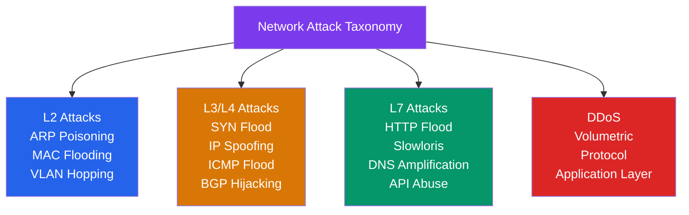

# ⚠️ Network Attacks

> [!abstract] TL;DR
> Network attacks exploit protocol weaknesses at every layer — from forged MAC addresses (L2 ARP poisoning) through IP spoofing (L3 BGP hijacking) to application floods (L7 HTTP Slowloris). DDoS attacks are classified as **volumetric** (bandwidth exhaustion), **protocol** (SYN floods), or **application layer** (HTTP floods). Key defenses: SYN cookies, anycast scrubbing, BCP38 ingress filtering, RPKI for BGP, and DNSSEC for DNS. Understanding attacks is essential for designing defenses.

## Intuition — analogy FIRST

Network attacks are exploitation of misplaced trust:

**ARP poisoning** is like standing in an office and shouting "I'm the IT helpdesk! Give me all your passwords!" — people believe you because the building (network) has no way to verify who is who.

**SYN flood** is like walking up to a restaurant and saying you want to reserve 10,000 tables, then not showing up — the restaurant (server) is holding table slots (TCP backlog entries) waiting for customers who never complete the reservation, blocking real customers.

**BGP hijacking** is like a rogue post office employee announcing "I can deliver mail faster to any country — send it all to me" — and the postal network believes them because BGP has no built-in authentication of who's authorized to route what.

---

## How It Works



## Key Concepts / Details

### DDoS Attack Taxonomy

**Volumetric attacks** — Overwhelm the target's or upstream provider's bandwidth:
- **UDP flood** — High-rate UDP to random ports; target sends ICMP Port Unreachable for each.
- **ICMP flood (ping flood)** — High-rate ICMP Echo Requests consuming bandwidth.
- **DNS/NTP amplification** — Small query (60B) → large response (3000B+ with DNSSEC) → reflected to spoofed victim IP. Amplification factor 50–100×.
- **Memcached amplification** — Sending 15B to memcached returns 750KB (50,000× amplification!); patched by removing default UDP support.

**Protocol attacks** — Exhaust server state (connection tables, CPU) rather than bandwidth:
- **SYN flood** — See below.
- **ACK flood** — Mass ACK packets for non-existent sessions; each must be checked against the connection table.
- **Fragmented packet flood** — IP fragments require reassembly; fragments with misleading offsets crash some stacks.

**Application layer attacks** — Require fewer packets; mimic legitimate behavior:
- **HTTP flood** — High-rate legitimate-looking HTTP requests; hard to distinguish from real traffic.
- **Slowloris** — Opens many connections, sends partial HTTP headers slowly; holds connections open without completing requests, exhausting the web server's connection pool.
- **ReDoS** — Crafted regex input causes catastrophic backtracking in regex engines.

### SYN Flood and SYN Cookies

**SYN flood attack:**
1. Attacker sends millions of TCP SYN packets with spoofed source IPs.
2. Server allocates a TCB (Transmission Control Block) in the SYN backlog for each.
3. Server sends SYN-ACK to spoofed IPs — no ACK ever returns.
4. Backlog fills up (default 128–1024 entries); legitimate SYNs are dropped.

**SYN cookies defense (RFC 4987):**
1. When the backlog is full, instead of allocating a TCB, the server encodes connection state into the **sequence number** of the SYN-ACK.
2. The sequence number = cryptographic hash(src IP, dst IP, src port, dst port, timestamp, secret).
3. No memory allocated per connection in the backlog.
4. When (if) the ACK arrives, the server verifies the ACK number matches the expected formula, then creates the full TCB.
5. Spoofed SYNs never return an ACK, so no state is ever created.

**Trade-off:** SYN cookies disable TCP options (SACK, window scaling) because the options aren't stored anywhere during the "cookie phase." Modern implementations work around this.

### ARP Poisoning (ARP Spoofing)

**Attack:**
1. Attacker broadcasts unsolicited ARP replies: "IP 192.168.1.1 (gateway) is at MAC AA:BB:CC:DD:EE:FF (attacker's MAC)."
2. Victims update their ARP cache.
3. Traffic to the gateway goes to the attacker (MITM).
4. Attacker can intercept, modify, or drop traffic; forward to real gateway for transparency.

**Tools:** Arpspoof, Ettercap, Bettercap.

**Defenses:**
- **Dynamic ARP Inspection (DAI)** — Switch validates ARP packets against the DHCP snooping binding table. Drops ARP packets where IP→MAC mapping doesn't match DHCP-assigned bindings.
- **Static ARP entries** — Manually configure critical hosts (gateway) as static ARP entries (not scalable).
- **Port security** — Limit MAC addresses per port.

### BGP Hijacking

**Attack:** An AS announces prefixes it doesn't own, redirecting traffic.

**Famous examples:**
- **Pakistan Telecom 2008** — Pakistan Telecom announced `208.65.153.0/24` (YouTube's IP range) to block YouTube domestically; propagated globally, black-holing YouTube worldwide for ~2 hours.
- **Rostelecom 2020** — Russian ISP briefly hijacked routes for AWS, Akamai, Cloudflare, others.
- **Hijacking motivation:** Traffic interception, black-holing competitors, cryptocurrency theft (redirecting BGP for crypto exchange IPs).

**Defenses:**
- **RPKI (Resource Public Key Infrastructure):**
  - **ROA (Route Origin Authorization)** — Certificate binding a prefix to an authorized AS number, signed by the RIR (ARIN, RIPE, etc.).
  - **ROV (Route Origin Validation)** — Routers validate received BGP announcements against the RPKI repository. Invalid routes are rejected.
  - **IRR (Internet Routing Registry)** — Manually maintained database of authorized route origins (less secure than RPKI).
- **BGP prefix filtering** — Explicit allow-lists of expected prefixes from each peer.
- **ASPA (AS Provider Authorization)** — Extends RPKI to validate the AS_PATH, not just origin AS.

### DNS Cache Poisoning (Kaminsky Attack)

**Attack:**
1. Attacker makes a DNS query for a random subdomain of the target domain (e.g., `rand1234.example.com`).
2. Attacker simultaneously sends thousands of forged DNS responses (with guessed Transaction IDs) claiming to be the authoritative server for `example.com`.
3. If a forged response arrives before the real one and matches the Transaction ID, the resolver caches the attacker's forged A record for `example.com`.

**Kaminsky (2008) key insight:** By targeting a random subdomain, the attacker triggers a new recursive query that allows poisoning the entire zone's NS records, not just one hostname.

**Defenses:**
- **Source port randomization** (RFC 5452) — Resolver randomizes both Transaction ID (16 bits) and source port (16 bits) → 32 bits of entropy, making brute-force attack impractical.
- **DNSSEC** — Cryptographic signatures on DNS records; forged responses fail signature verification.
- **0x20 encoding** — Randomize case in DNS queries; legitimate responses preserve case, forged responses don't.

### IP Spoofing and BCP38

IP spoofing (forging the source IP) enables reflection/amplification and SYN floods. **BCP38 (Network Ingress Filtering):**

```
# Router drops packets with source IPs not in the expected range
! Cisco IOS example:
interface GigabitEthernet0/1
 ip verify unicast source reachable-via rx   ! uRPF strict mode
```

**uRPF (Unicast Reverse Path Forwarding):** Checks if the source IP of an incoming packet would be reachable through the same interface. If not, the packet is spoofed → drop.

**BCP38 adoption problem:** Requires all ISPs to implement — those that don't allow spoofed traffic originating from their networks. Adoption is voluntary and incomplete.

## Real-World Notes

- **DDoS mitigation services** — Cloudflare, Akamai, AWS Shield Advanced use anycast routing + scrubbing centers. Attack traffic is absorbed at PoPs globally; clean traffic is forwarded to origin.
- **BGP blackhole routing (community 666)** — During a DDoS attack, the victim AS can announce a /32 with BGP community 66666 (or the upstream ISP's blackhole community), causing all upstream routers to discard traffic destined for that IP. Stops the attack but also stops legitimate traffic — surgical solution for sacrificing one IP to protect the rest.
- **Rate limiting vs blocking** — Blocking by IP is easily bypassed (botnet uses many IPs). Rate limiting per behavioral fingerprint (user-agent + TLS fingerprint + ASN) is more effective.

## Common Pitfalls

- Thinking DDoS defense = rate limiting — volumetric DDoS (100 Gbps) saturates the ISP uplink before any server-side rate limiting can help. Need upstream scrubbing.
- Running authoritative DNS without Response Rate Limiting (RRL) — open DNS servers are prime amplification targets.
- No RPKI validation — invalid BGP routes still accepted; your traffic can be hijacked.
- Assuming HTTPS prevents DNS cache poisoning — HTTPS protects the connection but the browser must first resolve the DNS name; if DNS is poisoned, HTTPS connects to the wrong server (but the TLS cert will fail to validate — so HTTPS does provide a last-resort catch).

## Related Concepts

- [[Firewalls_and_IDS]] — Primary defensive layer against many of these attacks
- [[TLS_SSL]] — Certificate validation catches DNS poisoning MITM attempts
- [[ARP_ICMP]] — ARP is the L2 protocol exploited by ARP poisoning
- [[Routing_Protocols]] — BGP is the protocol exploited by BGP hijacking

## Review Questions

1. Explain how SYN cookies defend against a SYN flood attack. What state does the server avoid storing, and how does it verify a legitimate client when the ACK arrives?
2. Pakistan Telecom's 2008 BGP hijack blackholed YouTube globally. Explain the technical mechanism of how a more-specific prefix announcement caused this, and how RPKI/ROV would have prevented it.
3. A DNS amplification attack sends 60-byte queries to open resolvers, generating 3,000-byte responses directed at the victim. Explain the two vulnerabilities being exploited and two defenses that address each.

## Sources

- RFC 4987 — TCP SYN Flooding Attacks and Common Mitigations (SYN Cookies)
- RFC 2827 — Network Ingress Filtering (BCP38)
- RFC 6483 — Validation of Route Origination Using the Resource Certificate PKI (RPKI)
- Vixie, Paul, "DNS Amplification Attacks" — ISC whitepaper

#networking #network-security #advanced
