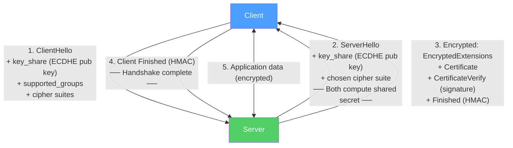

# 🔐 TLS and SSL

> [!abstract] TL;DR
> TLS (Transport Layer Security) is the cryptographic protocol that secures HTTPS, email, and virtually all modern internet communication. **TLS 1.3** (RFC 8446) achieves a **1-RTT handshake** (down from 1.2's 2-RTT) by sending the key share in the first message, removes all non-AEAD ciphers and ephemeral-only key exchange is mandatory, and guarantees **forward secrecy** (compromise of the server's private key doesn't decrypt past sessions). **mTLS** extends this to mutual authentication — both client and server present certificates.

## Intuition — analogy FIRST

TLS is like a secure physical handshake with a lockbox protocol. When you first meet someone (TLS 1.3 ClientHello), you simultaneously show them your lock's specifications and hand over your half of a key (key_share). They respond with their own key half (ServerHello key_share) and immediately seal their credentials in the box encrypted with the combined key. By the time the handshake is done (1 round trip), you're both inside an encrypted room.

TLS 1.2 was like shaking hands first, then agreeing on what kind of lock to use, then exchanging keys — three trips before the room is secure. TLS 1.3 consolidated all of this into a single exchange.

**Forward secrecy** is like burning the key after every conversation — even if someone steals your master key later, they can't decrypt the recorded past conversations because each session used a unique, disposable key.

---

## How It Works



## Key Concepts / Details

### TLS 1.3 vs TLS 1.2 Comparison

| Feature | TLS 1.2 | TLS 1.3 |
|---------|---------|---------|
| Handshake RTTs | 2 RTT | 1 RTT |
| 0-RTT support | No | Yes (with replay risk) |
| Key exchange | RSA static, DHE, ECDHE | ECDHE only (forward secrecy mandatory) |
| Cipher modes | CBC, RC4, RSA, SHA-1 allowed | AEAD only (GCM, ChaCha20-Poly1305) |
| Session renegotiation | Supported | Removed |
| Compression | Supported (CRIME vulnerability) | Removed |
| Forward secrecy | Optional | Mandatory |
| Server sends certs | In plaintext | Encrypted |

**Removed from TLS 1.3:**
- RSA key exchange (not forward secret)
- Static Diffie-Hellman
- CBC block cipher mode
- RC4 stream cipher
- MD5 and SHA-1 hash functions
- Export-grade ciphers
- Compression
- Renegotiation

### TLS 1.3 Handshake in Detail

```
Client                                          Server
──────────────────────────────────────────────────────────────
ClientHello
  - client_random (32 bytes)
  - supported cipher suites: [TLS_AES_256_GCM_SHA384, ...]
  - supported groups: [x25519, secp256r1]
  - key_share: x25519 public key
  - signature algorithms: [ecdsa_secp256r1_sha256, ...]
  ──────────────────────────────────────────────────────────→

                                             ServerHello
                                               - server_random
                                               - chosen cipher: TLS_AES_256_GCM_SHA384
                                               - key_share: x25519 public key
                                             ← ─────────────────
                                             [Both derive handshake secret via HKDF]
                                             ← ──── ENCRYPTED BELOW ──────────────
                                             EncryptedExtensions
                                               - ALPN, SNI confirmation, etc.
                                             Certificate
                                               - DER-encoded X.509 cert + chain
                                             CertificateVerify
                                               - signature over handshake transcript
                                             Finished
                                               - HMAC over handshake transcript
                                             ← ────────────────────────────────────

Client verifies cert chain, CertificateVerify, and Finished
Finished
  - HMAC over complete handshake transcript
  ──────────────────────────────────────────────────────────→
[Both derive application traffic keys via HKDF]

Application Data (encrypted) ↔ Application Data (encrypted)
```

### ECDHE and Forward Secrecy

**ECDHE (Elliptic Curve Diffie-Hellman Ephemeral):**
- Client and server each generate a **fresh (ephemeral) key pair** per session.
- They exchange public keys; neither sends the actual shared secret.
- Both compute the same shared secret via elliptic curve math: `secret = client_priv × server_pub = server_priv × client_pub`.
- After the session, the ephemeral private keys are discarded.

**Forward secrecy:** If an attacker records encrypted traffic today and later steals the server's long-term private key, they **cannot** decrypt the recorded traffic — because the session keys were derived from ephemeral keys that no longer exist.

**Named curves:** x25519 (Curve25519, 128-bit security, fast constant-time), secp256r1 (P-256, NIST curve, 128-bit security).

### AEAD Cipher Suites

TLS 1.3 supports only **AEAD (Authenticated Encryption with Associated Data)** ciphers:

| Cipher Suite | Key Exchange | AEAD Cipher | Hash |
|-------------|-------------|-------------|------|
| TLS_AES_128_GCM_SHA256 | ECDHE | AES-128-GCM | HKDF-SHA256 |
| TLS_AES_256_GCM_SHA384 | ECDHE | AES-256-GCM | HKDF-SHA384 |
| TLS_CHACHA20_POLY1305_SHA256 | ECDHE | ChaCha20-Poly1305 | HKDF-SHA256 |

AEAD provides: encryption + integrity + authentication in one operation. No separate MAC needed.

**AES-GCM** — Hardware-accelerated on modern CPUs (AES-NI instruction set). Preferred in data centers.
**ChaCha20-Poly1305** — Software-efficient; preferred on mobile/IoT devices without AES hardware acceleration.

### Certificate Chain Validation

```
Root CA cert (self-signed, in browser trust store)
    └── Intermediate CA cert (signed by Root CA)
            └── Leaf cert (signed by Intermediate CA)
                  - CN/SAN: api.example.com
                  - Public key
                  - Validity period (NotBefore, NotAfter)
                  - Extended Key Usage: serverAuth
```

**Validation steps:**
1. Build chain from leaf to trusted root.
2. Verify each cert's signature with the parent's public key.
3. Check validity periods (not expired, not yet valid).
4. Check revocation (CRL or OCSP).
5. Verify leaf CN/SAN matches the hostname.
6. Check Extended Key Usage (serverAuth, clientAuth).

**OCSP Stapling** — Server includes an OCSP response (pre-fetched, signed by CA) in the TLS handshake. Client doesn't need to contact CA separately — improves performance and privacy.

**Certificate Transparency (CT)** — All issued certificates must be logged in public CT logs. Allows detection of mis-issued or malicious certificates.

### SNI (Server Name Indication)

TLS extension allowing a server to host multiple domains with separate certificates on the same IP:
- Client sends the hostname in the ClientHello (before the cert is exchanged).
- Server selects the appropriate certificate.
- **Problem:** SNI is sent in cleartext, revealing the target domain to eavesdroppers.
- **ECH (Encrypted Client Hello)** — Encrypts SNI using the server's public key published in DNS (draft standard).

### mTLS (Mutual TLS)

Standard TLS authenticates only the server. mTLS adds client authentication:

```
Standard TLS: Client verifies server cert → encrypted channel
mTLS:         Client verifies server cert, Server verifies client cert → encrypted channel
```

**mTLS use cases:**
- Service-to-service authentication in microservices (Istio, Linkerd inject client certs via SPIFFE/SPIRE).
- API authentication for machine-to-machine communication.
- Zero Trust enforcement — every service must prove its identity.

**SPIFFE (Secure Production Identity Framework for Everyone):**
- Standard for issuing workload identity: `spiffe://cluster.local/ns/default/sa/frontend`
- SPIRE implements SPIFFE — issues short-lived X.509 SVIDs (SPIFFE Verifiable Identity Documents).
- Envoy proxies use SPIRE-issued certs for automatic mTLS between all services.

## Real-World Notes

- **TLS inspection (MITM):** Corporate firewalls decrypt TLS traffic for malware scanning by presenting a locally trusted cert. This breaks certificate pinning and can inspect HTTPS flows. Employees on corporate networks should know their TLS is being decrypted.
- **HSTS Preload** — Domains in the HSTS preload list are hardcoded in browsers to always use HTTPS. Getting on the list requires `max-age ≥ 31536000; includeSubDomains; preload`.
- **Let's Encrypt** — Free, automated, ACME-protocol-based certificate authority. Enabled mass HTTPS adoption (>300M certs issued).

## Common Pitfalls

- Using TLS 1.0/1.1 in production — vulnerable to BEAST and POODLE attacks; deprecated by RFC 8996.
- Not enabling OCSP stapling — every client contact with the CA's OCSP server for revocation checking adds latency and leaks browsing patterns.
- Certificate pinning without a rotation plan — pinning to a specific cert (not CA) breaks when the cert expires, causing app outages.
- Forgetting to renew certificates — Let's Encrypt certs expire in 90 days; automate renewal with `certbot renew` or ACME clients.

## Related Concepts

- [[HTTP_HTTPS]] — HTTPS is HTTP over TLS
- [[Firewalls_and_IDS]] — NGFW TLS inspection
- [[VPN_and_Tunneling]] — WireGuard and IPSec provide security at the network layer (below TLS)
- [[Zero_Trust_Networking]] — mTLS is a cornerstone of zero trust service identity

## Review Questions

1. Explain how the TLS 1.3 handshake achieves 1-RTT. What message does the client send first, and what does the server's first response contain that enables the client to derive session keys?
2. What is forward secrecy, and why does TLS 1.3 guarantee it while TLS 1.2 with RSA key exchange does not?
3. Describe mTLS. How does it differ from standard TLS, and how does SPIFFE/SPIRE enable automatic mTLS between microservices?

## Sources

- RFC 8446 — The Transport Layer Security (TLS) Protocol Version 1.3
- RFC 6960 — Online Certificate Status Protocol (OCSP)
- Rescorla, Eric, *SSL and TLS: Designing and Building Secure Systems*

#networking #network-security #advanced
