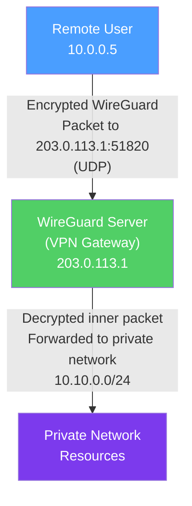

# 🔒 VPN and Tunneling

> [!abstract] TL;DR
> VPNs (Virtual Private Networks) create encrypted tunnels over untrusted networks, connecting remote users or sites as if they were on the same private network. **WireGuard** is the modern standard (~4,000 lines of code, Curve25519/ChaCha20-Poly1305, in-kernel, UDP-only). **IPSec** is the enterprise standard (IKEv2 key exchange, ESP encapsulation, transport vs tunnel mode). **OpenVPN** is the flexible TLS-based alternative (userspace, slower, but firewall-friendly). Tunneling protocols (GRE, L2TP, VXLAN, GENEVE) serve different encapsulation needs.

## Intuition — analogy FIRST

A VPN is like a secure postal tube inside the regular mail system. Your envelope (private IP packet) slides into the tube (VPN tunnel), which is sealed and addressed to the VPN server. The regular postal system (internet) only sees the outer tube — it doesn't know what's inside. At the destination, the outer tube is opened, and the inner letter is delivered to its final address on the private network.

**WireGuard** is a sleek, modern stainless-steel tube — minimal, lightweight, extremely fast, and cryptographically sound.

**IPSec** is the industrial-grade heavy-steel tube used in enterprise and carrier networks — more complex, more configurable, and more compatible with legacy equipment.

**OpenVPN** is a reinforced cardboard tube — flexible (works everywhere TCP or UDP works), but bulkier and slower than the purpose-built alternatives.

---

## How It Works



## Key Concepts / Details

### WireGuard

WireGuard (RFC 8999) is a modern, minimal VPN protocol:

**Design philosophy:** Small, fast, opinionated — no negotiation of cryptographic algorithms (opinionated choices only), no cleartext mode.

**Cryptographic primitives:**
- **Key exchange:** Curve25519 ECDH (Elliptic Curve Diffie-Hellman)
- **Symmetric cipher:** ChaCha20-Poly1305 (AEAD)
- **Hash/PRF:** BLAKE2s, SipHash2-4
- **Handshake base:** Noise protocol framework (1-RTT)

**Key features:**

| Feature | Description |
|---------|-------------|
| **Code size** | ~4,000 lines of C (vs OpenVPN ~100,000, OpenSSL ~500,000) |
| **Transport** | UDP only (configurable port, default 51820) |
| **Interface** | Kernel module (Linux) — wire-speed performance |
| **Identity** | Peers identified by public key, not IP:port |
| **Cryptokey routing** | AllowedIPs per peer — routes to the right peer based on destination IP |
| **Roaming** | Handles IP changes automatically (IP:port tracked, not fixed) |
| **Silence** | No response to unauthenticated packets — stealth |

**WireGuard configuration (server):**
```ini
[Interface]
PrivateKey = <server_private_key>
Address = 10.0.0.1/24
ListenPort = 51820

[Peer]
PublicKey = <client1_public_key>
AllowedIPs = 10.0.0.2/32    # route 10.0.0.2 to this peer

[Peer]
PublicKey = <client2_public_key>
AllowedIPs = 10.0.0.3/32
```

**WireGuard configuration (client):**
```ini
[Interface]
PrivateKey = <client_private_key>
Address = 10.0.0.2/32

[Peer]
PublicKey = <server_public_key>
Endpoint = 203.0.113.1:51820
AllowedIPs = 0.0.0.0/0      # full tunnel — all traffic through VPN
PersistentKeepalive = 25     # keep NAT mappings alive
```

### IPSec

IPSec is a suite of protocols for securing IP communications at the network layer:

**IPSec components:**

| Component | Purpose |
|-----------|---------|
| **AH (Authentication Header)** | Integrity and authentication of IP headers and payload. No encryption. Protocol 51. |
| **ESP (Encapsulating Security Payload)** | Encryption + integrity of payload. Can optionally encrypt. Protocol 50. |
| **IKEv2 (Internet Key Exchange v2)** | Key negotiation and SA establishment (UDP port 500 / 4500 for NAT-T) |
| **SA (Security Association)** | One-directional agreement on crypto parameters; stored in the SAD (SA Database) |
| **SPD (Security Policy Database)** | Defines which traffic requires IPSec |

**IPSec modes:**

| Mode | What's Encrypted | Use Case |
|------|-----------------|---------|
| **Transport mode** | Only the IP payload (L4 and above); original IP header visible | Host-to-host (e.g., Windows to Linux direct) |
| **Tunnel mode** | Entire original IP packet (new outer IP header added) | Site-to-site VPN, remote access |

**Site-to-site IPSec tunnel:**
```
[Site A: 192.168.1.0/24] ←→ [Router A: 203.0.113.1]
         [encrypted IPSec tunnel over internet]
[Router B: 203.0.113.2] ←→ [Site B: 10.0.0.0/24]
```

**IKEv2 exchange phases:**
1. **IKE_SA_INIT** — Exchange proposals (encryption/PRF/DH/auth), establish IKE SA, exchange DH values.
2. **IKE_AUTH** — Authenticate each other (certificates or pre-shared key), establish first Child SA (IPSec SA).
3. **CREATE_CHILD_SA** — Create additional Child SAs or rekey existing ones.

**ESP packet structure (tunnel mode):**
```
[New IP header | ESP header | [Original IP header | TCP | Data] | ESP trailer | ESP auth]
↑ cleartext ↑  ↑ cleartext ↑ ↑──────────────── encrypted ──────────────────↑ ↑ integrity ↑
```

### OpenVPN

OpenVPN is a TLS-based VPN:
- **Transport:** TCP or UDP (UDP preferred for performance)
- **Encryption:** TLS 1.2/1.3 for control channel; OpenSSL ciphers for data channel
- **Interface types:** TUN (Layer 3 — IP routing) or TAP (Layer 2 — Ethernet bridging)
- **Port:** Configurable; 1194 UDP default; 443 TCP for firewall bypass (looks like HTTPS)

**Advantages:** Cross-platform, firewall-friendly, mature, many clients (including open-source).
**Disadvantages:** Userspace (slower than WireGuard/IPSec kernel implementations); complex PKI setup.

### Comparison: WireGuard vs IPSec vs OpenVPN

| Feature | WireGuard | IPSec | OpenVPN |
|---------|-----------|-------|---------|
| Code size | ~4,000 LOC | ~100,000 LOC | ~70,000 LOC |
| Transport | UDP only | UDP/IP raw | TCP or UDP |
| Speed | Fastest | Very fast (kernel) | Moderate (userspace) |
| Configuration | Simple (~10 lines) | Complex | Moderate |
| Roaming | Yes (key-based) | Limited | Limited |
| Crypto agility | No (opinionated) | Yes (negotiated) | Yes (TLS cipher suites) |
| Mobile support | Excellent | Good | Good |
| Enterprise/legacy | Limited | Universal | Good |

### Split Tunneling

Split tunneling controls which traffic goes through the VPN:
- **Full tunnel:** All traffic (`0.0.0.0/0`) → higher security, more load on VPN server.
- **Split tunnel:** Only specific subnets → less VPN server load, internet traffic goes direct.

```
Full tunnel:    ALL traffic → VPN → internet
Split tunnel:   10.0.0.0/8 → VPN (internal resources)
                Everything else → direct internet (YouTube, Gmail, etc.)
```

**Security consideration:** Split tunneling on untrusted networks (coffee shop Wi-Fi) means non-VPN traffic is still exposed to the local network.

### Tunneling Protocols

| Protocol | Layer | Use Case |
|----------|-------|---------|
| **GRE** | L3 in IP | Generic encapsulation; no encryption; used in IPSec tunnels |
| **L2TP/IPSec** | L2 in UDP | Legacy client VPN (mobile, Windows built-in) |
| **VXLAN** | L2 in UDP | Overlay networking in data centers (container networking) |
| **GENEVE** | L2 in UDP | Cloud overlay networking (AWS, hypervisors) |
| **GTP (GPRS Tunneling Protocol)** | L3 in UDP | 4G/5G mobile core — user plane encapsulation |

## Real-World Notes

- **Tailscale** uses WireGuard under the hood with a control plane that handles peer discovery, key distribution, and NAT traversal automatically. Zero-configuration mesh VPN.
- **Always-On VPN** — Mobile device management (MDM) policies can enforce that all traffic always routes through the corporate VPN. Used to ensure DLP policies apply even off-premise.
- **VPN as perimeter replacement** — Traditional VPN gives access to the entire network; Zero Trust replaces this with identity-based access to specific applications (see [[Zero_Trust_Networking]]).

## Common Pitfalls

- Using pre-shared keys (PSK) for IPSec without key rotation — compromised PSK exposes all past and future traffic (no forward secrecy). Use certificate-based IKEv2 instead.
- Not enabling WireGuard `PersistentKeepalive` on clients behind NAT — NAT mappings expire, causing connectivity loss.
- OpenVPN over TCP — TCP-over-TCP when the underlying connection is lossy causes TCP meltdown (nested retransmissions). Use UDP OpenVPN when possible.
- Split tunneling without DNS awareness — DNS queries may bypass the VPN, leaking internal domain lookups to external resolvers.

## Related Concepts

- [[TLS_SSL]] — OpenVPN and FTPS use TLS; WireGuard uses a similar Noise framework
- [[Firewalls_and_IDS]] — Firewalls allow/block VPN protocols; some VPNs disguise as HTTPS
- [[Zero_Trust_Networking]] — Zero Trust argues against network-wide VPN access in favor of per-application access

## Review Questions

1. Explain WireGuard's "cryptokey routing" concept. How does the server know which peer to send a packet to, and how is this different from traditional routing?
2. Compare IPSec transport mode and tunnel mode. When would you use each, and which mode is used for site-to-site VPN?
3. A user connects to the corporate VPN with split tunneling enabled. They then browse to a malicious website and their laptop is compromised. How does split tunneling increase risk compared to full tunneling?

## Sources

- RFC 8999 — WireGuard: Next Generation Kernel Network Tunnel
- RFC 7296 — Internet Key Exchange Protocol Version 2 (IKEv2)
- RFC 4303 — IP Encapsulating Security Payload (ESP)
- Donenfeld, Jason A., "WireGuard: Next Generation Kernel Network Tunnel" — NDSS 2017

#networking #network-security #intermediate
