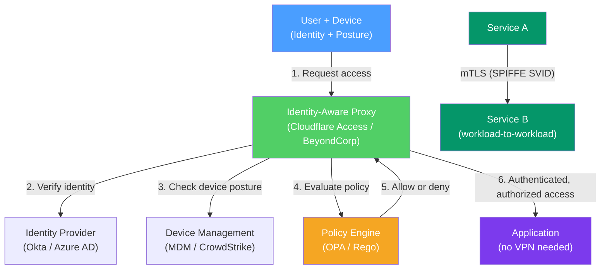

# 🔒 Zero Trust Networking

> [!abstract] TL;DR
> Zero Trust rejects the "trusted internal network" assumption — instead of trusting any request because it originates from inside the firewall, it demands **"never trust, always verify"** on every request, regardless of source. Zero Trust requires verifying identity (user + device) and authorization on every access attempt, enforcing least privilege, and assuming breach. It replaces network-level VPN access with identity-aware proxies and uses mTLS for workload-to-workload security (SPIFFE/SPIRE), with policy engines (OPA) and eBPF (Cilium) for micro-segmentation.

## Intuition — analogy FIRST

Traditional perimeter security is like a medieval castle: strong walls and a moat on the outside, but everyone inside the walls is trusted. Once an attacker gets through the gate (VPN, phishing, compromised insider), they have free run of the castle — lateral movement to any system, any data.

Zero Trust is like a modern office building with badge readers on every single door. Even after you badge in at the front entrance, you need to badge in again at the floor, then at the server room, then at the filing cabinet. Your badge access is checked, your identity verified, and a log is kept — every time, for every door. Being "inside the building" grants you nothing automatically.

The principle: **assume the castle has already been breached; check every door**.

---

## How It Works



## Key Concepts / Details

### Zero Trust Principles (NIST SP 800-207)

1. **Never trust, always verify** — No implicit trust based on network location. Every request must be authenticated and authorized.
2. **Verify explicitly** — Authenticate using all available data points: identity, location, device health, service/workload, data classification, anomalies.
3. **Least privilege access** — Limit user access with just-in-time and just-enough-access (JIT/JEA); time-limited, risk-based adaptive policies.
4. **Assume breach** — Minimize blast radius, segment access, verify end-to-end encryption, use analytics to get visibility, and drive threat detection and defense improvement.
5. **Continuous verification** — Authentication is not a one-time gate; posture is re-checked throughout the session.

### Traditional Perimeter vs Zero Trust

| Dimension | Traditional Perimeter | Zero Trust |
|-----------|----------------------|------------|
| Trust model | Trust anything inside the network | Trust nothing; verify everything |
| Access control | Network-based (IP/VLAN) | Identity-based (user + device + context) |
| VPN | All traffic through corp network | Per-application proxy; no full network access |
| Lateral movement | Easy (inside = trusted) | Prevented by micro-segmentation |
| Remote work | VPN required | Works natively from anywhere |
| Visibility | Perimeter logs only | Every request logged and audited |

### Google BeyondCorp

BeyondCorp is Google's internal Zero Trust implementation (2014), now available as Google BeyondCorp Enterprise:

**Key design decisions:**
1. **No corporate network privilege** — An employee on Google's internal network gets the same access as one on the public internet.
2. **Device inventory** — Every device has a certificate; only managed, compliant devices can access resources.
3. **Access proxy** — All internal applications are accessed through a gating proxy that checks identity + device posture.
4. **Fine-grained ACLs** — Per-application, per-user access controls based on attributes (role, team, location, device trust level).

### Identity-Aware Proxy (IAP)

An identity-aware proxy sits in front of applications:
- Intercepts every request.
- Verifies user identity via OAuth/OIDC with the IdP (Okta, Azure AD, Google).
- Checks device posture (MDM-enrolled? OS patched? EDR installed?).
- Evaluates access policy (is this user allowed to access this app from this device?).
- Forwards approved requests to the application (user never has direct network access to the app).

**Implementations:** Google BeyondCorp Enterprise, Cloudflare Access, Zscaler Private Access (ZPA), Tailscale Funnel.

### Device Trust

Zero Trust requires verifying not just who you are but what device you're using:

| Signal | What It Checks |
|--------|---------------|
| **MDM enrollment** | Device is registered and managed by corporate MDM (Jamf, Intune) |
| **OS version** | Running a supported, patched OS version |
| **Disk encryption** | FileVault/BitLocker enabled |
| **EDR presence** | Endpoint Detection & Response (CrowdStrike, SentinelOne) installed and running |
| **Certificate** | Device holds a valid certificate from corporate PKI |
| **Risk score** | Behavioral anomaly detection (unusual login time, location, access pattern) |

### SPIFFE and SPIRE (Workload Identity)

For **machine-to-machine** (service-to-service) Zero Trust:

**SPIFFE (Secure Production Identity Framework for Everyone):**
- Standard for workload identity.
- **SPIFFE ID** — A URI: `spiffe://trust-domain/path` (e.g., `spiffe://example.com/ns/default/sa/frontend`).
- **SVID (SPIFFE Verifiable Identity Document)** — An X.509 certificate or JWT encoding the SPIFFE ID.

**SPIRE (SPIFFE Runtime Environment):**
- Implements SPIFFE — issues short-lived (~1 hour) X.509 SVIDs to workloads.
- Workloads prove their identity to SPIRE via node attestation (platform-level: AWS instance metadata, Kubernetes service account token).
- SPIRE issues a cert → workload uses it for mTLS.

**Automatic mTLS in Istio using SPIRE:**
```
Pod A (SVID: spiffe://cluster.local/ns/ns-a/sa/frontend)
  ↕ mTLS (Envoy sidecar, certs from SPIRE)
Pod B (SVID: spiffe://cluster.local/ns/ns-b/sa/backend)

Istio PeerAuthentication:
  STRICT mode — requires mTLS for all pod-to-pod communication
  AuthorizationPolicy — only service A can call service B's /api endpoint
```

### OPA (Open Policy Agent)

OPA is a general-purpose, declarative policy engine:
- Policies written in **Rego** (OPA's query language).
- Decouples policy from application code.
- Used in Kubernetes admission control, API authorization, data filtering.

```rego
# Example OPA policy: only allow access during business hours from managed devices
package authz

allow {
    input.user.role == "engineer"
    input.device.managed == true
    now := time.now_ns() / 1000000000
    hour := time.clock(now)[0]
    hour >= 8
    hour <= 18
}
```

### eBPF and Micro-Segmentation (Cilium)

**eBPF (Extended Berkeley Packet Filter)** enables programmable network security at the kernel level:
- eBPF programs run in the kernel without modifying kernel source code.
- Can enforce network policy at the process/socket level, not just at the packet level.

**Cilium** — Kubernetes CNI plugin using eBPF for network policy:
- **L3/L4 policies** — Allow/deny based on IP, port, protocol.
- **L7 policies** — HTTP method/path aware: "Service A can GET /api, but not POST /admin."
- **Micro-segmentation** — Every pod-to-pod communication requires an explicit allow policy.
- **Network observability** — Hubble provides per-flow network visibility.

```yaml
# Cilium NetworkPolicy example
apiVersion: cilium.io/v2
kind: CiliumNetworkPolicy
metadata:
  name: frontend-to-backend
spec:
  endpointSelector:
    matchLabels:
      app: backend
  ingress:
  - fromEndpoints:
    - matchLabels:
        app: frontend
    toPorts:
    - ports:
      - port: "8080"
        protocol: TCP
      rules:
        http:
        - method: GET
          path: /api/.*
```

### SASE vs SSE

**SASE (Secure Access Service Edge)** — Convergence of networking (SD-WAN) and security (CASB, SWG, ZTNA, FWaaS) into a single cloud-delivered service.

**SSE (Security Service Edge)** — Security-only subset of SASE (without SD-WAN): CASB + SWG + ZTNA + FWaaS.

| Vendor | Product | Type |
|--------|---------|------|
| Cloudflare | Zero Trust (Access + Gateway + CASB) | SSE |
| Zscaler | ZIA + ZPA | SSE |
| Palo Alto | Prisma Access | SASE |
| Cisco | Umbrella + SD-WAN | SASE |

## Real-World Notes

- **Zero Trust is a journey, not a product.** Start with MFA + device enrollment, then layer in app-level proxies, then workload identity (SPIFFE), then full micro-segmentation. "Buy this box for Zero Trust" is marketing.
- **Tailscale** — Commercial WireGuard mesh with a Zero Trust access control plane. Simple alternative to full BeyondCorp deployments for smaller organizations.
- **Zero Trust doesn't eliminate the need for monitoring.** It reduces blast radius but doesn't prevent all attacks. Centralized logging, SIEM, and behavioral analytics remain essential.

## Common Pitfalls

- Deploying ZTNA (Zero Trust Network Access) without disabling legacy VPN — users bypass ZTNA with the old VPN. Must fully deprecate.
- Over-broad SPIFFE trust domains — all services in the same trust domain can (by default) be reached by any other. Namespace or service-level policies are still required.
- OPA performance — complex Rego policies evaluated on every request add latency. Benchmark and pre-compile decision trees.
- Assuming device attestation is infallible — a compromised device with a valid MDM certificate still passes device posture checks. Layer with behavioral analytics.

## Related Concepts

- [[TLS_SSL]] — mTLS is the core cryptographic mechanism for workload identity
- [[VPN_and_Tunneling]] — Zero Trust replaces broad network VPN access with per-app access
- [[Firewalls_and_IDS]] — Traditional perimeter firewalls are complemented (not replaced) by Zero Trust
- [[Service_Mesh]] — Service meshes (Istio/Linkerd) enforce workload-to-workload Zero Trust

## Review Questions

1. Explain the core Zero Trust principle of "never trust, always verify." How does this differ from traditional perimeter security, and what threat does it specifically address?
2. Describe SPIFFE/SPIRE. What is an SVID, how does a workload prove its identity to SPIRE, and how does the resulting certificate enable mTLS?
3. A company uses Istio with STRICT mTLS PeerAuthentication and CiliumNetworkPolicy. Walk through what happens when Service A (frontend) tries to call Service B (backend) on the /admin endpoint, given a policy that only allows GET /api.

## Sources

- NIST SP 800-207 — Zero Trust Architecture
- Google, "BeyondCorp: A New Approach to Enterprise Security" — USENIX Login, 2014
- SPIFFE/SPIRE documentation — https://spiffe.io
- Cilium documentation — https://cilium.io

#networking #network-security #advanced
